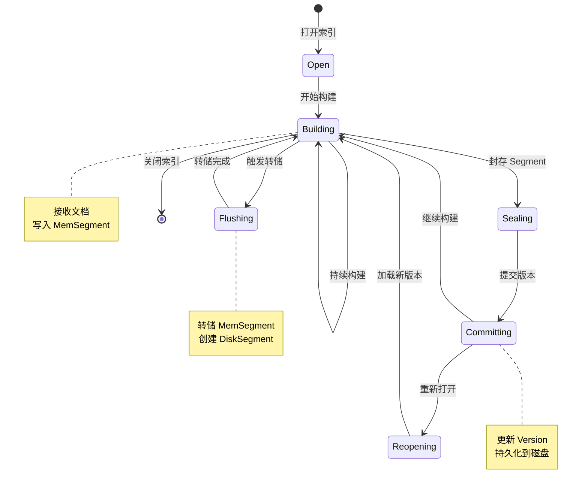

## 前言

最近因为工作需要，我开始深入接触 IndexLib 这个阿里巴巴 Havenask 搜索引擎的核心索引库。IndexLib 是一个高性能、可扩展的 C++ 索引引擎，代码量庞大、设计精良，但文档相对较少。为了更好地理解决其设计理念和实现细节，我决定通过详细阅读源码的方式来学习，并将学习过程中的理解和思考整理成系列文章。


## 1. IndexLib 是什么

IndexLib 是 Havenask 搜索引擎的底层索引库，负责：

- **索引构建**：从原始文档构建倒排索引、正排索引等
- **索引存储**：管理索引文件的存储格式和布局
- **索引查询**：提供高效的索引查询接口
- **增量更新**：支持实时写入和增量更新
- **版本管理**：管理索引版本和增量合并

IndexLib 采用 C++ 实现，追求极致性能，支持千亿级数据实时检索，百万 QPS 查询和百万 TPS 写入。

## 2. 整体架构设计

### 2.1 分层架构

IndexLib 采用清晰的分层架构：

```
┌─────────────────────────────────────┐
      Application Layer              (Havenask, 业务应用)
└─────────────────────────────────────┘
┌─────────────────────────────────────┐
      Framework Layer                (Tablet, Segment, Version)
└─────────────────────────────────────┘
┌─────────────────────────────────────┐
      Index Layer                    (Normal, KKV, KV)
└─────────────────────────────────────┘
┌─────────────────────────────────────┐
      Document Layer                 (Document, Field)
└─────────────────────────────────────┘
┌─────────────────────────────────────┐
      File System Layer              (Directory, File)
└─────────────────────────────────────┘
```

**各层职责**：

- **Framework Layer**：提供 Tablet、Segment、Version 等核心抽象，管理索引生命周期
- **Index Layer**：实现具体的索引类型（Normal、KKV、KV），提供索引构建和查询能力
- **Document Layer**：处理文档的解析、验证、转换
- **File System Layer**：抽象文件系统，支持本地文件系统、分布式文件系统等

### 2.2 核心组件关系


**核心组件**：

1. **ITablet**：索引表的核心接口，管理索引的构建、查询、版本等
2. **TabletData**：管理索引数据，包含多个 Segment
3. **Segment**：索引的基本单元，分为 MemSegment（内存段）和 DiskSegment（磁盘段）
4. **Version**：版本信息，记录索引包含哪些 Segment
5. **TabletReader**：提供索引查询接口
6. **TabletWriter**：提供索引构建接口

## 3. 核心概念详解

### 3.1 Tablet：索引表

**Tablet** 是 IndexLib 中最核心的概念，代表一个完整的索引表。让我们先通过图来理解 Tablet 的整体结构：


从图中可以看到，一个 Tablet 包含：
- **Schema**：索引的 schema 定义，描述字段、索引类型等
- **TabletData**：索引数据，包含多个 Segment
- **Version**：当前版本信息
- **Options**：配置选项

现在让我们看看代码中的定义（`framework/ITablet.h`）：

```cpp
class ITablet : private autil::NoCopyable
{
public:
    // 打开索引：从磁盘加载已有索引或创建新索引
    virtual Status Open(const IndexRoot& indexRoot, 
                       const std::shared_ptr<config::ITabletSchema>& schema,
                       const std::shared_ptr<config::TabletOptions>& options,
                       const VersionCoord& versionCoord) = 0;
    
    // 构建索引：接收文档批次并写入内存段
    virtual Status Build(const std::shared_ptr<document::IDocumentBatch>& batch) = 0;
    
    // 刷新：将内存数据刷新到磁盘
    virtual Status Flush() = 0;
    
    // 封存：封存当前 Segment，准备合并
    virtual Status Seal() = 0;
    
    // 提交版本：创建新版本并持久化
    virtual std::pair<Status, VersionMeta> Commit(const CommitOptions& commitOptions) = 0;
    
    // 获取查询接口
    virtual std::shared_ptr<ITabletReader> GetTabletReader() const = 0;
};
```

**Tablet 的生命周期流程**：


**Tablet 生命周期状态图**：



1. **Open**：打开已有索引或创建新索引，加载 Schema 和配置
2. **Build**：持续构建，接收文档并写入内存段（MemSegment）
3. **Flush**：将内存段刷新到磁盘，创建磁盘段（DiskSegment）
4. **Seal**：封存 Segment，标记为只读，准备合并
5. **Commit**：提交新版本，更新 Version，持久化到磁盘
6. **Reopen**：重新打开，加载新版本，更新 TabletData

### 3.2 Segment：索引段

**Segment** 是索引的基本存储单元，一个 Tablet 包含多个 Segment。让我们先通过图来理解 Segment 的类型和关系：


从图中可以看到，Segment 有两种类型：
- **MemSegment**：内存段，用于实时写入
- **DiskSegment**：磁盘段，用于持久化存储和查询

#### MemSegment：内存段

MemSegment 在内存中构建，支持实时写入。让我们看看关键代码（`framework/MemSegment.h`）：

```cpp
class MemSegment : public Segment
{
public:
    // 构建文档：将文档写入内存段
    virtual Status Build(document::IDocumentBatch* batch) = 0;
    
    // 是否需要转储：判断是否达到转储条件（内存大小、文档数量等）
    virtual bool NeedDump() const = 0;
    
    // 创建转储项：准备转储到磁盘
    virtual std::pair<Status, std::vector<std::shared_ptr<SegmentDumpItem>>> 
        CreateSegmentDumpItems() = 0;
    
    // 封存：标记为只读，不再接收新文档
    virtual void Seal() = 0;
};
```

**MemSegment 的工作流程**：


1. **Build**：接收文档批次，写入内存中的索引结构
2. **NeedDump**：检查是否达到转储条件（内存阈值、文档数量等）
3. **CreateSegmentDumpItems**：创建转储任务，准备将内存数据写入磁盘
4. **Dump**：异步转储到磁盘，创建 DiskSegment
5. **Seal**：封存，标记为只读

**关键特性**：
- **状态**：`ST_BUILDING`（构建中）或 `ST_DUMPING`（转储中）
- **特点**：在内存中构建，支持实时写入，转储是异步的
- **用途**：接收实时写入的文档，提供低延迟写入能力

#### DiskSegment：磁盘段

DiskSegment 存储在磁盘上，用于持久化存储和查询。关键代码（`framework/DiskSegment.h`）：

```cpp
class DiskSegment : public Segment
{
public:
    enum class OpenMode {
        NORMAL,  // 正常模式：立即加载所有索引
        LAZY,    // 懒加载模式：按需加载（用于离线场景）
    };

    // 打开磁盘段：从磁盘加载索引数据
    virtual Status Open(const std::shared_ptr<MemoryQuotaController>& memoryQuotaController,
                       OpenMode mode) = 0;
    
    // 重新打开：当 Schema 变更时，需要重新加载
    virtual Status Reopen(const std::vector<std::shared_ptr<config::ITabletSchema>>& schemas) = 0;
};
```

**DiskSegment 的加载策略**：


- **NORMAL 模式**：立即加载所有索引数据到内存，适合在线查询场景
- **LAZY 模式**：按需加载，只在查询时加载相关索引，适合离线场景，节省内存

**关键特性**：
- **状态**：`ST_BUILT`（已构建）
- **特点**：存储在磁盘上，支持按需加载，可以参与合并
- **用途**：持久化存储，支持查询，可以长期保存

**Segment 的状态转换**：


状态转换的代码逻辑（`framework/Segment.h`）：

```cpp
enum class SegmentStatus { 
    ST_UNSPECIFY,  // 未指定（用于筛选所有状态）
    ST_BUILT,      // 已构建（DiskSegment）
    ST_DUMPING,    // 转储中（MemSegment）
    ST_BUILDING     // 构建中（MemSegment）
};
```

状态转换流程：
1. **ST_BUILDING**：MemSegment 正在构建，接收文档，调用 `Build()`
2. **ST_DUMPING**：MemSegment 正在转储到磁盘，调用 `CreateSegmentDumpItems()`
3. **ST_BUILT**：DiskSegment 已构建完成，可以查询，调用 `Open()`

### 3.3 Version：版本管理

Version 管理索引的版本信息。让我们先通过图理解 Version 的结构：


从图中可以看到，Version 记录：
- **VersionId**：版本号，单调递增
- **Segments**：该版本包含的 Segment 列表
- **Locator**：数据位置信息
- **Timestamp**：时间戳

关键代码（`framework/Version.h`）：

```cpp
class Version : public autil::legacy::Jsonizable
{
private:
    struct SegmentInVersion {
        segmentid_t segmentId = INVALID_SEGMENTID;
        schemaid_t schemaId = DEFAULT_SCHEMAID;  // 每个 Segment 可以有不同的 Schema
    };

public:
    // Segment 管理
    void AddSegment(segmentid_t segmentId, schemaid_t schemaId);
    void RemoveSegment(segmentid_t segmentId);
    
    // 版本信息
    versionid_t GetVersionId() const { return _versionId; }
    void IncVersionId() { ++_versionId; }  // 每次 Commit 时递增
    
    // Locator：数据位置信息
    void SetLocator(const Locator& locator);
    const Locator& GetLocator() const { return _locator; }

private:
    versionid_t _versionId;                    // 版本号，单调递增
    std::set<SegmentInVersion> _segments;      // Segment 列表（有序）
    Locator _locator;                          // 位置信息，用于增量更新
    int64_t _timestamp;                        // 时间戳
    bool _sealed = false;                      // 是否封存
};
```

**Version 的演进过程**：


版本演进示例：
- **V1**：包含 Segment [1, 2]，Locator 记录处理到 timestamp=100
- **V2**：新增 Segment 3，Locator 更新到 timestamp=200
- **V3**：Segment 1 和 2 合并为 Segment 4，Locator 更新到 timestamp=300

**关键设计**：
- **版本号递增**：每次 Commit 时 `VersionId` 自动递增，保证版本顺序
- **Schema 演进**：每个 Segment 记录自己的 `SchemaId`，支持 Schema 变更
- **Locator 更新**：每次 Commit 时更新 Locator，记录最新的数据处理位置

**Version 的作用**：

1. **版本控制**：记录索引的演进历史
2. **增量更新**：通过 Locator 判断数据是否已处理
3. **Schema 演进**：支持 Schema 变更，每个 Segment 记录自己的 SchemaId
4. **回滚支持**：可以回滚到历史版本

### 3.4 TabletData：索引数据管理

`TabletData` 管理 Tablet 的所有数据。让我们先通过图理解其结构：


从图中可以看到，TabletData 包含：
- **Segments**：所有 Segment 的列表（MemSegment + DiskSegment）
- **Version**：当前磁盘版本
- **ResourceMap**：共享资源（内存池、缓存等）

关键代码（`framework/TabletData.h`）：

```cpp
class TabletData : private autil::NoCopyable
{
public:
    // Slice：Segment 的视图，支持按状态筛选
    class Slice {
        // 提供迭代器，可以遍历筛选后的 Segment
    };

    // 创建 Slice：按状态筛选 Segment
    Slice CreateSlice(Segment::SegmentStatus segmentStatus) const;
    
    // 获取指定 Segment
    SegmentPtr GetSegment(segmentid_t segmentId) const;

private:
    Version _onDiskVersion;                               // 磁盘版本
    std::vector<std::shared_ptr<Segment>> _segments;     // Segment 列表
    std::shared_ptr<ResourceMap> _resourceMap;           // 共享资源
};
```

**Slice 机制的使用场景**：


```cpp
// 获取所有已构建的 Segment（用于查询）
auto builtSegments = tabletData->CreateSlice(Segment::SegmentStatus::ST_BUILT);

// 获取所有构建中的 Segment（用于写入）
auto buildingSegments = tabletData->CreateSlice(Segment::SegmentStatus::ST_BUILDING);

// 获取所有 Segment
auto allSegments = tabletData->CreateSlice();
```

**关键设计**：
- **Slice 机制**：提供灵活的 Segment 筛选，避免直接暴露内部实现
- **共享资源**：多个 Segment 共享 ResourceMap，减少资源开销
- **版本管理**：通过 Version 记录哪些 Segment 已持久化

**TabletData 的 Slice 机制**：

TabletData 提供 `CreateSlice` 方法，可以按状态筛选 Segment：

```cpp
// 获取所有构建完成的 Segment
auto builtSegments = tabletData->CreateSlice(Segment::SegmentStatus::ST_BUILT);

// 获取所有 Segment
auto allSegments = tabletData->CreateSlice();
```

### 3.5 Locator：数据位置信息

Locator 是增量更新的核心，记录数据的位置信息。让我们先通过图理解 Locator 的结构：


从图中可以看到，Locator 包含：
- **timestamp**：时间戳，记录数据的时间位置
- **concurrentIdx**：并发索引，处理时间戳相同的情况
- **hashId**：Hash ID，用于分片
- **sourceIdx**：数据源索引，支持多数据源

关键代码（`framework/Locator.h`）：

```cpp
class Locator final
{
public:
    // Locator 比较结果
    enum class LocatorCompareResult {
        LCR_INVALID,        // 无效
        LCR_SLOWER,         // 比这个 locator 慢
        LCR_PARTIAL_FASTER, // 部分 hash id 更快
        LCR_FULLY_FASTER    // 完全比这个 locator 快（包括相等）
    };

    // 文档信息：记录文档在数据源中的位置
    struct DocInfo {
        int64_t timestamp;        // 时间戳
        uint32_t concurrentIdx;   // 并发索引（时间戳相同时的序号）
        uint16_t hashId;          // Hash ID（用于分片）
        uint8_t sourceIdx;        // 数据源索引
    };

    // 比较两个 Locator：判断数据是否已处理
    LocatorCompareResult IsFasterThan(const Locator& other, 
                                      bool ignoreLegacyDiffSrc) const;

private:
    std::vector<base::Progress> _progress;  // 进度信息（每个 hashId 的进度）
};
```

**Locator 的比较逻辑**：


比较示例：
- **Locator A**：timestamp=100, hashId=0
- **Locator B**：timestamp=200, hashId=0
- **结果**：B 比 A 快（`LCR_FULLY_FASTER`），说明 B 包含 A 的所有数据

**Locator 的关键作用**：
1. **增量更新**：通过 `IsFasterThan()` 判断哪些数据已处理，避免重复处理
2. **数据一致性**：保证数据不重复、不丢失，支持多数据源场景
3. **进度追踪**：记录每个 HashId 的处理进度，支持分片处理
4. **并发控制**：通过 `concurrentIdx` 处理时间戳相同的情况

**Locator 的作用**：

1. **增量更新**：判断哪些数据已经处理过
2. **数据一致性**：保证数据不重复、不丢失
3. **多数据源**：支持从多个数据源读取数据

**Locator 比较**：

```cpp
enum class LocatorCompareResult {
    LCR_INVALID,        // 无效
    LCR_SLOWER,         // 更慢
    LCR_PARTIAL_FASTER, // 部分更快
    LCR_FULLY_FASTER    // 完全更快（包含相等）
};
```

### 3.6 TabletReader：查询接口

TabletReader 提供索引查询接口。让我们先通过图理解查询流程：


从图中可以看到查询流程：
1. 解析 JSON 查询
2. 获取 IndexReader
3. 遍历 Segment 查询
4. 合并结果
5. 返回 JSON 结果

关键代码（`framework/TabletReader.h`）：

```cpp
class TabletReader : public ITabletReader
{
public:
    // 打开：初始化 TabletData 和读取资源
    Status Open(const std::shared_ptr<TabletData>& tabletData, 
                const ReadResource& readResource);

    // 搜索：JSON 格式的查询
    Status Search(const std::string& jsonQuery, std::string& result) const override;
    
    // 获取索引 Reader：根据索引类型和名称获取
    std::shared_ptr<index::IIndexReader> GetIndexReader(
        const std::string& indexType,
        const std::string& indexName) const override;

protected:
    using IndexReaderMapKey = std::pair<std::string, std::string>;  // (indexType, indexName)
    
    std::shared_ptr<config::ITabletSchema> _schema;
    std::map<IndexReaderMapKey, std::shared_ptr<index::IIndexReader>> _indexReaderMap;  // 索引 Reader 缓存
};
```

**查询流程详解**：

1. **解析查询**：`Search()` 将 JSON 查询解析为内部查询对象
2. **获取 IndexReader**：根据索引类型和名称从 `_indexReaderMap` 获取或创建
3. **遍历 Segment**：通过 `TabletData->CreateSlice(ST_BUILT)` 获取所有已构建的 Segment
4. **并行查询**：对多个 Segment 的 Indexer 进行查询（如果支持并行）
5. **合并结果**：将各 Segment 的查询结果合并（去重、排序等）
6. **返回结果**：序列化为 JSON 格式返回

**IndexReader 缓存机制**：


- **缓存 Key**：`(indexType, indexName)` 对
- **缓存 Value**：`IIndexReader` 指针
- **优势**：避免重复创建 IndexReader，提高查询性能

**TabletReader 的查询流程**：

1. 解析查询请求
2. 获取对应的 IndexReader
3. 遍历相关 Segment 进行查询
4. 合并查询结果
5. 返回结果

## 4. 索引类型

IndexLib 支持多种索引类型：

### 4.1 Normal Table：标准表

- **特点**：支持倒排索引、正排索引、摘要等
- **用途**：全文检索、复杂查询
- **实现**：`NormalTableFactory`

### 4.2 KKV Table：Key-Key-Value 表

- **特点**：两级 Key，支持按主 Key 和次 Key 查询
- **用途**：用户行为数据、推荐系统
- **实现**：`KKVTableFactory`

### 4.3 KV Table：Key-Value 表

- **特点**：简单的 Key-Value 存储
- **用途**：缓存、简单查询
- **实现**：`KVTableFactory`

## 5. 设计模式与架构特点

### 5.1 工厂模式

IndexLib 使用工厂模式创建不同类型的 Tablet：

```cpp
class ITabletFactory {
    virtual std::unique_ptr<TabletWriter> 
        CreateTabletWriter(const std::shared_ptr<config::ITabletSchema>& schema) = 0;
    
    virtual std::unique_ptr<TabletReader> 
        CreateTabletReader(const std::shared_ptr<config::ITabletSchema>& schema) = 0;
    
    virtual std::unique_ptr<MemSegment> 
        CreateMemSegment(const SegmentMeta& segmentMeta) = 0;
    
    virtual std::unique_ptr<DiskSegment> 
        CreateDiskSegment(const SegmentMeta& segmentMeta,
                         const BuildResource& buildResource) = 0;
};
```

**注册机制**：

```cpp
// 注册 Tablet Factory
REGISTER_TABLET_FACTORY(normal, NormalTableFactory);
REGISTER_TABLET_FACTORY(kkv, KKVTableFactory);
REGISTER_TABLET_FACTORY(kv, KVTableFactory);
```

### 5.2 资源管理

IndexLib 采用 RAII 和智能指针管理资源：

- **内存管理**：使用 `MemoryQuotaController` 控制内存使用
- **文件管理**：使用 `Directory` 抽象文件系统
- **生命周期**：通过智能指针自动管理对象生命周期

### 5.3 异步与并发

- **构建并发**：支持多线程构建
- **查询并发**：支持并发查询多个 Segment
- **异步转储**：MemSegment 转储是异步的

## 6. 性能优化设计

### 6.1 内存优化

- **按需加载**：DiskSegment 支持懒加载，按需加载索引数据
- **内存池**：使用内存池减少内存分配开销
- **内存控制**：通过 `MemoryQuotaController` 控制内存使用上限

### 6.2 查询优化

- **Segment 并行查询**：多个 Segment 可以并行查询
- **索引缓存**：常用索引数据可以缓存在内存中
- **查询剪枝**：通过 Locator 等机制减少不必要的查询

### 6.3 写入优化

- **批量写入**：支持批量写入文档
- **异步转储**：MemSegment 转储不阻塞写入
- **增量更新**：通过 Locator 实现高效的增量更新

## 7. 使用场景

IndexLib 适用于以下场景：

1. **全文检索**：支持倒排索引，适合全文检索场景
2. **实时搜索**：支持实时写入和查询，适合实时搜索场景
3. **大数据量**：支持千亿级数据，适合大规模数据场景
4. **高并发**：支持百万 QPS，适合高并发查询场景

## 8. 小结

IndexLib 是一个设计精良的 C++ 索引库，采用分层架构和清晰的抽象，支持多种索引类型和高性能查询。核心概念包括：

- **Tablet**：索引表，管理索引的完整生命周期
- **Segment**：索引段，分为内存段和磁盘段
- **Version**：版本管理，支持增量更新和 Schema 演进
- **Locator**：位置信息，保证数据一致性
- **TabletReader/Writer**：查询和构建接口

理解这些核心概念是掌握 IndexLib 的基础。在后续文章中，我们将深入介绍各个组件的实现细节和使用方法。

**关键要点**：
- IndexLib 采用分层架构，职责清晰
- Tablet 是核心抽象，管理索引生命周期
- Segment 是基本存储单元，支持内存和磁盘两种形式
- Version 管理索引版本，支持增量更新
- Locator 保证数据一致性，支持增量更新
- 支持多种索引类型，通过工厂模式扩展
