在上一篇文章中，我们深入了解了 Segment 合并策略的实现。本文将继续深入，详细解析内存管理与资源控制的机制，这是理解 IndexLib 如何高效管理内存和资源的关键。

内存管理与资源控制概览：从内存配额到内存回收的完整机制：

```mermaid
flowchart LR
    subgraph Quota["内存配额"]
        Q1[MemoryQuotaController<br/>配额控制器]
        Q2[层级配额管理<br/>Hierarchical Quota]
        Q3[配额分配<br/>Quota Allocation]
        Q1 --> Q2
        Q2 --> Q3
    end
    
    subgraph Calculate["内存计算"]
        C1[TabletMemoryCalculator<br/>内存计算器]
        C2[实时统计<br/>Real-time Statistics]
        C3[分类统计<br/>Categorized Statistics]
        C1 --> C2
        C2 --> C3
    end
    
    subgraph Reclaim["内存回收"]
        R1[IIndexMemoryReclaimer<br/>内存回收器]
        R2[延迟回收<br/>Delayed Reclaim]
        R3[按需回收<br/>On-Demand Reclaim]
        R1 --> R2
        R2 --> R3
    end
    
    subgraph Resource["资源控制"]
        RE1[BuildResourceCalculator<br/>构建资源计算器]
        RE2[资源估算<br/>Resource Estimation]
        RE3[资源预留<br/>Resource Reservation]
        RE1 --> RE2
        RE2 --> RE3
    end
    
    Q3 --> C1
    C3 --> R1
    R3 --> RE1
    
    style Quota fill:#e3f2fd
    style Calculate fill:#fff3e0
    style Reclaim fill:#f3e5f5
    style Resource fill:#e8f5e9
```

## 1. 内存管理概览

### 1.1 内存管理的核心概念

IndexLib 的内存管理包括以下核心概念：

1. **MemoryQuotaController**：内存配额控制器，管理内存配额和分配
2. **TabletMemoryCalculator**：Tablet 内存计算器，计算 Tablet 的内存使用
3. **IIndexMemoryReclaimer**：索引内存回收器，回收不再使用的内存
4. **BuildResourceCalculator**：构建资源计算器，计算构建时的资源使用

让我们先通过图来理解内存管理的整体架构：

内存管理架构：MemoryQuotaController、TabletMemoryCalculator、IIndexMemoryReclaimer 的关系（已在上面类图中展示，此处不再重复）：

### 1.2 内存管理的作用

内存管理在 IndexLib 中起到关键作用，是系统稳定性和性能的基础。让我们通过类图来理解内存管理的整体架构：

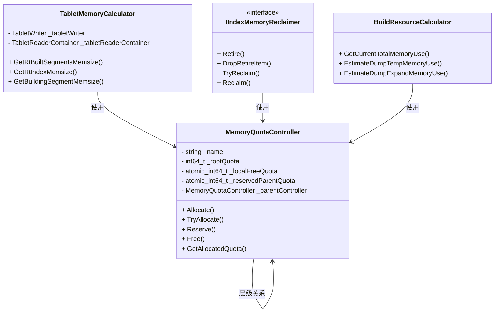

**内存管理的核心作用**：

- **内存配额控制**：通过 MemoryQuotaController 控制内存使用，避免内存溢出
  - **配额管理**：为每个组件分配内存配额，控制内存使用上限
  - **层级管理**：支持层级配额管理，灵活分配配额
  - **配额预留**：通过预留机制保证关键操作的配额
  
- **内存使用统计**：通过 TabletMemoryCalculator 统计内存使用，监控内存状态
  - **实时统计**：实时统计各个组件的内存使用量
  - **分类统计**：按类型统计内存使用（构建、查询、索引等）
  - **监控告警**：根据统计结果监控内存状态，及时告警
  
- **内存回收**：通过 IIndexMemoryReclaimer 回收不再使用的内存，释放内存空间
  - **延迟回收**：延迟回收避免频繁的内存操作
  - **按需回收**：在内存紧张时按需回收，保证系统稳定性
  - **并发安全**：支持并发回收，保证线程安全
  
- **资源优化**：通过 BuildResourceCalculator 优化构建资源使用，提高构建效率
  - **资源估算**：估算构建和转储所需的资源
  - **资源预留**：预留构建和转储所需的资源
  - **资源控制**：控制资源使用，避免资源浪费

## 2. MemoryQuotaController：内存配额控制器

### 2.1 MemoryQuotaController 的结构

`MemoryQuotaController` 是内存配额控制器，定义在 `base/MemoryQuotaController.h` 中：

```cpp
// base/MemoryQuotaController.h
class MemoryQuotaController
{
public:
    // 构造函数：创建根配额控制器
    MemoryQuotaController(std::string name, int64_t totalQuota);
    
    // 构造函数：创建子配额控制器
    MemoryQuotaController(std::string name, 
                         std::shared_ptr<MemoryQuotaController> parentController);
    
    // 分配内存配额
    void Allocate(int64_t quota);
    Status TryAllocate(int64_t quota);  // 尝试分配，不阻塞
    
    // 预留内存配额
    Status Reserve(int64_t quota);
    
    // 释放内存配额
    void Free(int64_t quota);
    
    // 获取内存配额信息
    int64_t GetAllocatedQuota() const;  // 已分配配额
    int64_t GetFreeQuota() const;       // 可用配额
    int64_t GetTotalQuota() const;      // 总配额

private:
    std::string _name;                                    // 控制器名称
    const int64_t _rootQuota;                            // 根配额（根控制器）
    std::atomic<int64_t> _localFreeQuota;                // 本地可用配额
    std::atomic<int64_t> _reservedParentQuota;           // 从父控制器预留的配额
    std::shared_ptr<MemoryQuotaController> _parentController;  // 父控制器
};
```

**MemoryQuotaController 的关键字段**：

MemoryQuotaController 的结构：包含配额信息和父控制器：

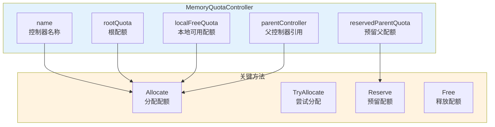

- **rootQuota**：根配额，根控制器的总配额
- **localFreeQuota**：本地可用配额，当前控制器可用的配额
- **reservedParentQuota**：从父控制器预留的配额
- **parentController**：父控制器，支持层级配额管理

### 2.2 内存配额分配

内存配额的分配机制：

内存配额分配：从父控制器到子控制器的配额分配（已在上面详细展示，此处不再重复）：

**内存配额分配流程图**：

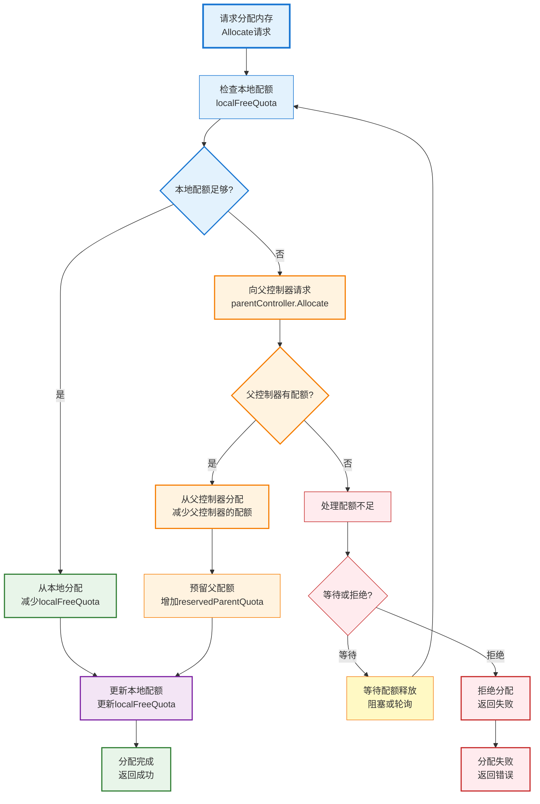

**分配机制详解**：

内存配额的分配是内存管理的核心机制。让我们通过序列图来理解完整的分配流程：

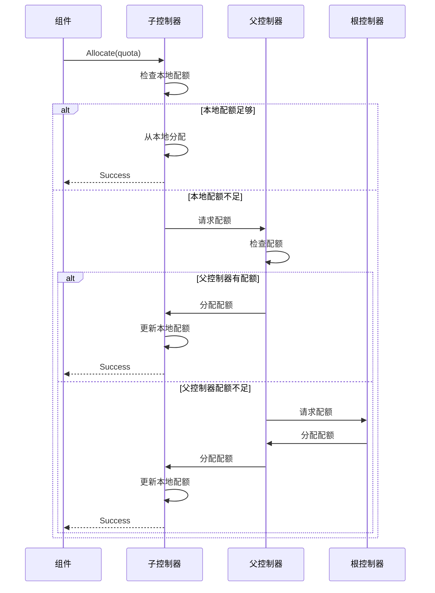

**分配机制详解**：

1. **根控制器分配**：根控制器有固定的总配额
   - **总配额设置**：根控制器在创建时设置总配额
   - **配额分配**：根控制器将配额分配给子控制器
   - **配额监控**：根控制器监控总配额的使用情况
   
2. **子控制器分配**：子控制器从父控制器分配配额
   - **配额请求**：子控制器向父控制器请求配额
   - **配额传递**：父控制器将配额传递给子控制器
   - **配额隔离**：不同子控制器的配额相互隔离
   
3. **配额预留**：通过 Reserve() 预留配额，保证后续分配
   - **预留机制**：预留配额不会被其他操作占用
   - **预留释放**：预留的配额可以释放，返回给父控制器
   - **预留用途**：用于保证关键操作（如转储）的配额
   
4. **配额释放**：通过 Free() 释放配额，返回给父控制器
   - **释放时机**：当内存不再使用时释放配额
   - **释放传递**：释放的配额返回给父控制器
   - **配额回收**：父控制器可以回收子控制器的配额

**分配策略的优势**：

- **灵活性**：支持层级配额管理，灵活分配配额
- **隔离性**：不同组件的配额相互隔离，避免相互影响
- **可控性**：通过配额控制内存使用，避免内存溢出
- **可扩展性**：支持动态创建和销毁配额控制器

### 2.3 层级配额管理

MemoryQuotaController 支持层级配额管理：

层级配额管理：从根控制器到子控制器的层级结构：

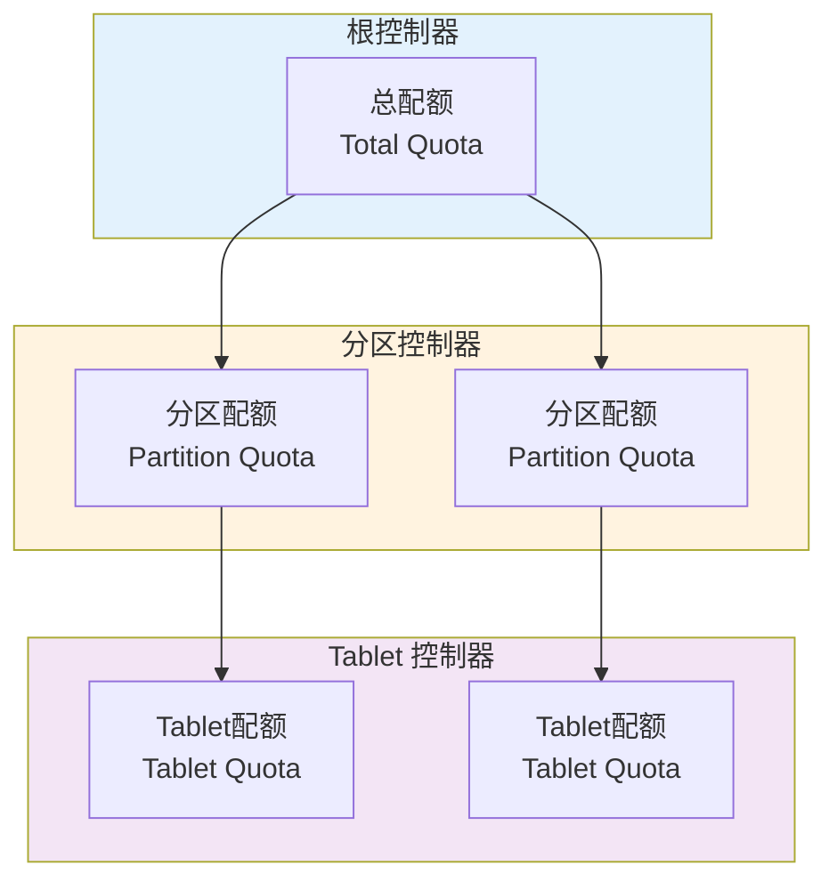

**层级结构**：

层级配额管理是 IndexLib 内存管理的核心设计。让我们通过类图来理解层级结构：

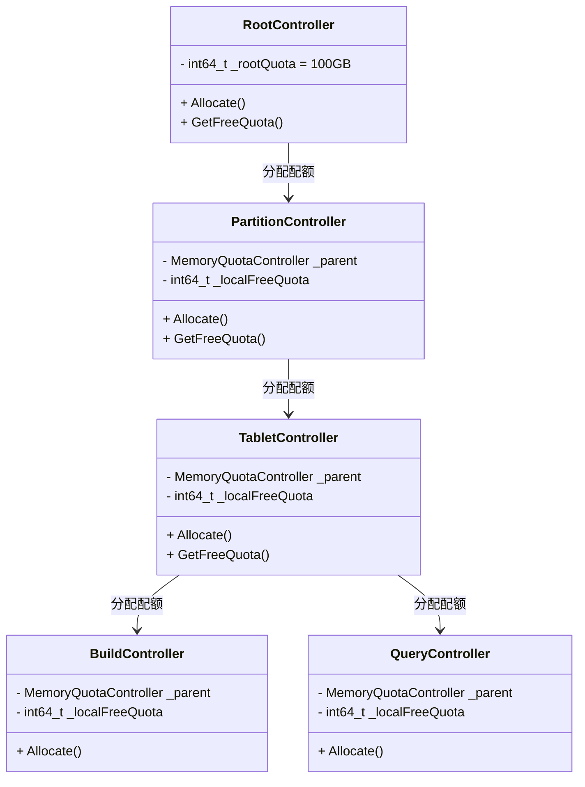

**层级结构详解**：

- **根控制器**：管理总配额，分配给子控制器
  - **总配额**：根控制器管理系统的总内存配额（如 100GB）
  - **配额分配**：将总配额分配给分区控制器或 Tablet 控制器
  - **配额监控**：监控总配额的使用情况，防止超限
  
- **分区控制器**：管理分区的配额，分配给 Tablet 控制器
  - **分区配额**：每个分区有独立的内存配额
  - **配额分配**：将分区配额分配给该分区下的 Tablet 控制器
  - **配额隔离**：不同分区的配额相互隔离
  
- **Tablet 控制器**：管理 Tablet 的配额，分配给各个组件
  - **Tablet 配额**：每个 Tablet 有独立的内存配额
  - **配额分配**：将 Tablet 配额分配给构建、查询等组件
  - **配额平衡**：根据组件的重要性平衡配额分配
  
- **组件控制器**：管理组件的配额，如构建配额、查询配额等
  - **构建配额**：管理构建操作的内存配额
  - **查询配额**：管理查询操作的内存配额
  - **索引配额**：管理索引数据的内存配额

**层级管理的优势**：

- **灵活分配**：支持多层级配额管理，灵活分配配额
- **配额隔离**：不同层级的配额相互隔离，避免相互影响
- **配额共享**：支持配额共享，提高配额利用率
- **配额监控**：可以监控每个层级的配额使用情况

### 2.4 配额分配策略

配额分配的策略：

配额分配策略：按需分配、预留分配等策略：

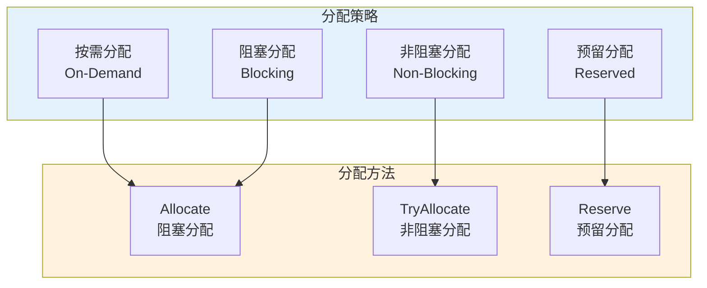

**分配策略**：
- **按需分配**：根据实际需求分配配额，灵活适应不同场景
- **预留分配**：通过 Reserve() 预留配额，保证关键操作的配额
- **阻塞分配**：Allocate() 会阻塞直到有可用配额
- **非阻塞分配**：TryAllocate() 不阻塞，立即返回结果

## 3. TabletMemoryCalculator：Tablet 内存计算器

### 3.1 TabletMemoryCalculator 的结构

`TabletMemoryCalculator` 是 Tablet 内存计算器，定义在 `framework/TabletMemoryCalculator.h` 中：

```cpp
// framework/TabletMemoryCalculator.h
class TabletMemoryCalculator final
{
public:
    TabletMemoryCalculator(const std::shared_ptr<TabletWriter>& tabletWriter,
                           const std::shared_ptr<TabletReaderContainer>& tabletReaderContainer);
    
    // 获取各种内存使用量
    size_t GetRtBuiltSegmentsMemsize() const;      // 实时已构建 Segment 内存
    size_t GetRtIndexMemsize() const;              // 实时索引内存
    size_t GetIncIndexMemsize() const;             // 增量索引内存
    size_t GetBuildingSegmentMemsize() const;      // 构建中 Segment 内存
    size_t GetDumpingSegmentMemsize() const;       // 转储中 Segment 内存
    size_t GetBuildingSegmentDumpExpandMemsize() const;  // 转储扩展内存

private:
    std::shared_ptr<TabletWriter> _tabletWriter;
    std::shared_ptr<TabletReaderContainer> _tabletReaderContainer;
};
```

**TabletMemoryCalculator 的关键方法**：

TabletMemoryCalculator 的方法：计算各种内存使用量：

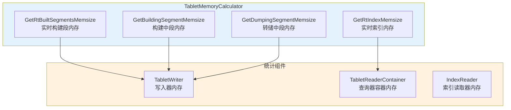

- **GetRtBuiltSegmentsMemsize()**：计算实时已构建 Segment 的内存使用
- **GetRtIndexMemsize()**：计算实时索引的内存使用
- **GetIncIndexMemsize()**：计算增量索引的内存使用
- **GetBuildingSegmentMemsize()**：计算构建中 Segment 的内存使用
- **GetDumpingSegmentMemsize()**：计算转储中 Segment 的内存使用

### 3.2 内存使用统计

内存使用统计的流程：

内存使用统计：从 Tablet 组件到内存使用量的统计流程（已在上面详细展示，此处不再重复）：

**统计流程**：

内存使用统计是监控和调优的基础。让我们通过序列图来理解完整的统计流程：

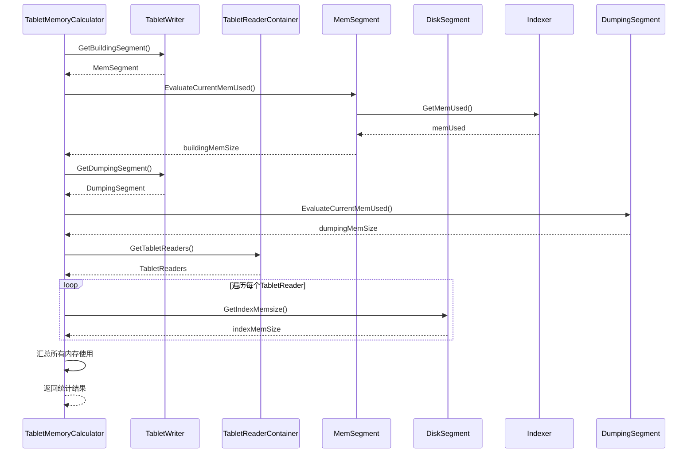

**统计流程详解**：

1. **收集组件信息**：从 TabletWriter 和 TabletReaderContainer 收集组件信息
   - **构建组件**：收集构建中的 MemSegment、转储中的 Segment 等
   - **查询组件**：收集 TabletReader、IndexReader 等查询组件
   - **索引组件**：收集各种 Indexer（倒排、正排、主键等）
   
2. **计算各组件内存**：计算各个组件的内存使用量
   - **Segment 内存**：计算 MemSegment 和 DiskSegment 的内存使用
   - **索引内存**：计算各个 Indexer 的内存使用
   - **缓存内存**：计算缓存的内存使用
   
3. **汇总内存使用**：汇总所有组件的内存使用量
   - **分类汇总**：按类型汇总内存使用（构建、查询、索引等）
   - **总内存使用**：计算总的内存使用量
   - **内存占比**：计算各组件内存占总内存的比例
   
4. **返回统计结果**：返回详细的内存使用统计结果
   - **详细统计**：返回各个组件的详细内存使用量
   - **统计报告**：生成内存使用统计报告
   - **监控数据**：提供监控数据，用于告警和调优

**统计的用途**：

- **内存监控**：实时监控内存使用情况，及时发现内存问题
- **性能调优**：根据统计结果优化内存分配，提高内存利用率
- **资源规划**：根据统计结果规划内存资源，合理分配配额
- **问题诊断**：通过统计结果诊断内存问题，定位内存泄漏

## 4. IIndexMemoryReclaimer：索引内存回收器

### 4.1 IIndexMemoryReclaimer 接口

`IIndexMemoryReclaimer` 是索引内存回收器的接口，定义在 `framework/mem_reclaimer/IIndexMemoryReclaimer.h` 中：

```cpp
// framework/mem_reclaimer/IIndexMemoryReclaimer.h
class IIndexMemoryReclaimer
{
public:
    // 回收内存：将内存加入回收队列
    virtual int64_t Retire(void* addr, std::function<void(void*)> deAllocator) = 0;
    
    // 取消回收：从回收队列中移除
    virtual void DropRetireItem(int64_t itemId) = 0;
    
    // 尝试回收：尝试回收一些内存
    virtual void TryReclaim() = 0;
    
    // 强制回收：强制回收所有可回收的内存
    virtual void Reclaim() = 0;
};
```

**IIndexMemoryReclaimer 的关键方法**：

IIndexMemoryReclaimer 接口：提供内存回收的抽象：

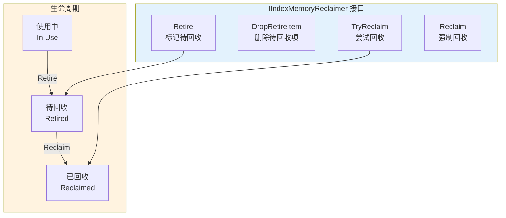

- **Retire()**：将内存加入回收队列，延迟回收
- **DropRetireItem()**：取消回收，从回收队列中移除
- **TryReclaim()**：尝试回收一些内存，不阻塞
- **Reclaim()**：强制回收所有可回收的内存

### 4.2 内存回收机制

内存回收的机制：

内存回收机制：从 Retire 到 Reclaim 的回收流程：

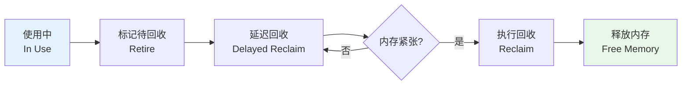

**内存回收流程图**：

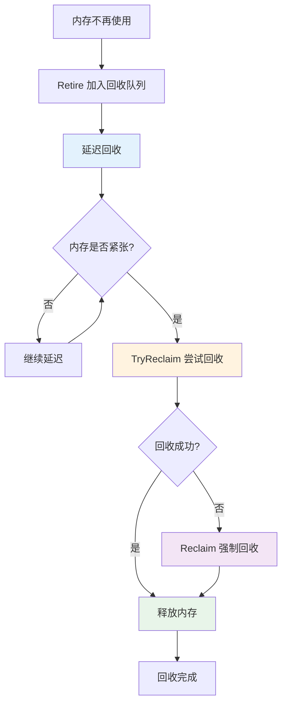

**回收机制详解**：

内存回收是保证系统稳定性的关键机制。让我们通过序列图来理解完整的回收流程：

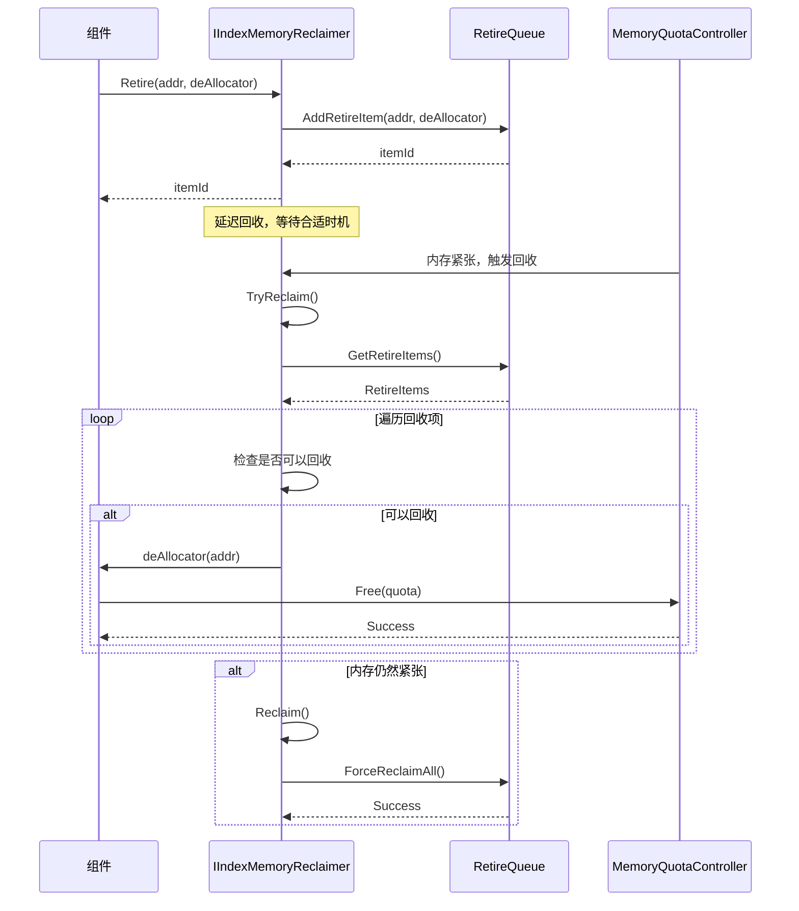

**回收机制详解**：

1. **Retire**：将不再使用的内存加入回收队列，延迟回收
   - **延迟回收**：延迟回收可以避免频繁的内存分配和释放
   - **回收队列**：使用队列管理待回收的内存，支持优先级
   - **回收标识**：为每个回收项分配唯一标识，支持取消回收
   
2. **延迟回收**：延迟回收可以避免频繁的内存分配和释放
   - **性能优化**：延迟回收减少内存操作次数，提高性能
   - **批量回收**：可以批量回收多个内存块，提高回收效率
   - **时机选择**：在合适的时机（如内存紧张时）进行回收
   
3. **TryReclaim**：在合适的时机尝试回收一些内存
   - **非阻塞回收**：TryReclaim 不阻塞，可以快速返回
   - **部分回收**：只回收部分内存，避免影响性能
   - **智能回收**：根据内存使用情况智能决定回收量
   
4. **Reclaim**：在内存紧张时强制回收所有可回收的内存
   - **强制回收**：Reclaim 会强制回收所有可回收的内存
   - **阻塞回收**：Reclaim 可能会阻塞，直到回收完成
   - **紧急回收**：在内存严重不足时使用，保证系统稳定性

**回收策略的优势**：

- **性能优化**：延迟回收减少内存操作次数，提高性能
- **稳定性保证**：在内存紧张时强制回收，保证系统稳定性
- **灵活性**：支持取消回收，适应动态场景
- **并发安全**：支持并发回收，保证线程安全

### 4.3 内存回收策略

内存回收的策略：

内存回收策略：延迟回收、按需回收等策略：

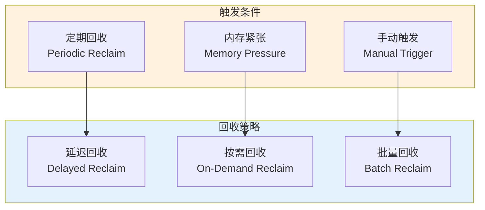

**回收策略**：
- **延迟回收**：通过 Retire() 延迟回收，避免频繁的内存操作
- **按需回收**：在内存紧张时通过 TryReclaim() 按需回收
- **强制回收**：在内存严重不足时通过 Reclaim() 强制回收
- **取消回收**：通过 DropRetireItem() 取消不需要的回收

## 5. BuildResourceCalculator：构建资源计算器

### 5.1 BuildResourceCalculator 的结构

`BuildResourceCalculator` 是构建资源计算器，定义在 `util/memory_control/BuildResourceCalculator.h` 中：

```cpp
// util/memory_control/BuildResourceCalculator.h
class BuildResourceCalculator
{
public:
    // 获取当前总内存使用
    static int64_t GetCurrentTotalMemoryUse(const BuildResourceMetricsPtr& metrics);
    
    // 估算转储临时内存使用
    static int64_t EstimateDumpTempMemoryUse(const BuildResourceMetricsPtr& metrics, 
                                             int dumpThreadCount);
    
    // 估算转储扩展内存使用
    static int64_t EstimateDumpExpandMemoryUse(const BuildResourceMetricsPtr& metrics);
    
    // 估算转储文件大小
    static int64_t EstimateDumpFileSize(const BuildResourceMetricsPtr& metrics);
};
```

**BuildResourceCalculator 的关键方法**：

BuildResourceCalculator 的方法：计算构建资源使用：

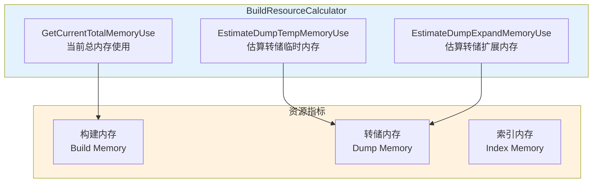

- **GetCurrentTotalMemoryUse()**：获取当前总内存使用
- **EstimateDumpTempMemoryUse()**：估算转储临时内存使用
- **EstimateDumpExpandMemoryUse()**：估算转储扩展内存使用
- **EstimateDumpFileSize()**：估算转储文件大小

### 5.2 构建资源估算

构建资源估算的流程：

构建资源估算：从 BuildResourceMetrics 到资源使用量的估算流程：

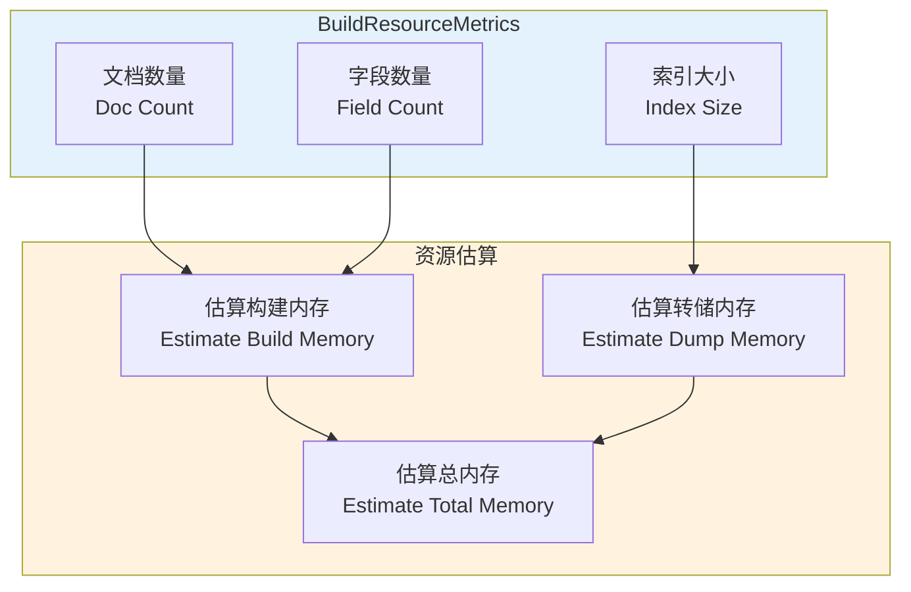

**估算流程**：
1. **收集指标**：从 BuildResourceMetrics 收集构建指标
2. **计算内存使用**：根据指标计算内存使用量
3. **估算转储资源**：估算转储时的临时内存和文件大小
4. **返回估算结果**：返回详细的资源使用估算结果

## 6. 内存分配策略

### 6.1 内存分配策略

内存分配的策略：

内存分配策略：按需分配、预留分配等策略（已在上面详细展示，此处不再重复）：

**分配策略**：
- **按需分配**：根据实际需求分配内存，灵活适应不同场景
- **预留分配**：通过 Reserve() 预留内存，保证关键操作的内存
- **阻塞分配**：Allocate() 会阻塞直到有可用内存
- **非阻塞分配**：TryAllocate() 不阻塞，立即返回结果

### 6.2 内存分配优化

内存分配的优化：

内存分配优化：批量分配、内存池等优化策略：

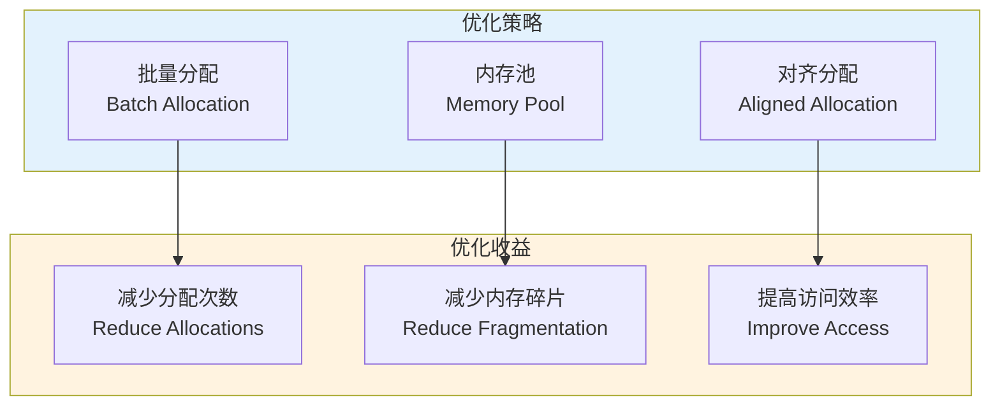

**优化策略**：
- **批量分配**：批量分配内存，减少分配次数
- **内存池**：使用内存池减少内存分配开销
- **对齐分配**：内存对齐分配，提高访问效率
- **预分配**：预分配常用大小的内存，减少分配延迟

## 7. 内存回收机制

### 7.1 内存回收时机

内存回收的时机：

内存回收时机：延迟回收、按需回收等时机：

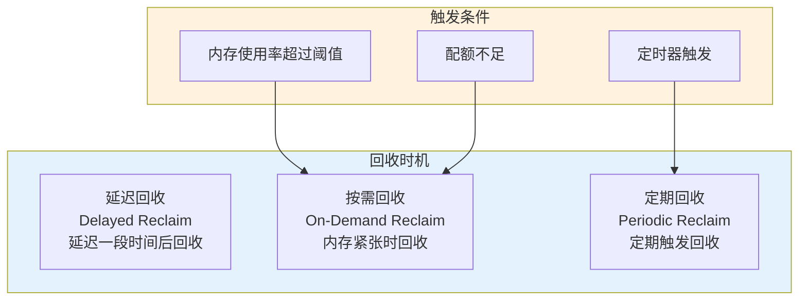

**回收时机**：
- **延迟回收**：通过 Retire() 延迟回收，在合适的时机回收
- **按需回收**：在内存紧张时通过 TryReclaim() 按需回收
- **强制回收**：在内存严重不足时通过 Reclaim() 强制回收
- **定期回收**：定期触发回收，保持内存使用在合理范围

### 7.2 内存回收优化

内存回收的优化：

内存回收优化：批量回收、延迟回收等优化策略（已在上面详细展示，此处不再重复）：

**优化策略**：
- **批量回收**：批量回收内存，减少回收次数
- **延迟回收**：延迟回收可以避免频繁的内存操作
- **智能回收**：根据内存使用情况智能决定回收时机
- **并发回收**：支持并发回收，提高回收效率

## 8. 内存优化策略

### 8.1 内存使用优化

内存使用的优化：

内存使用优化：内存池、缓存控制等优化策略：

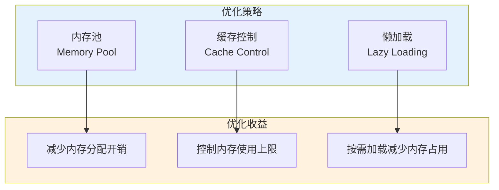

**优化策略**：
- **内存池**：使用内存池减少内存分配开销
- **缓存控制**：控制缓存大小，避免内存溢出
- **内存压缩**：压缩内存数据，减少内存使用
- **懒加载**：按需加载数据，减少内存占用

### 8.2 内存监控与告警

内存监控与告警：

内存监控与告警：实时监控内存使用，及时告警：

```mermaid
flowchart TD
    subgraph Monitor["监控"]
        M1["实时统计<br/>Real-time Statistics"]
        M2["内存使用率<br/>Memory Usage Rate"]
        M3["配额使用率<br/>Quota Usage Rate"]
    end
    
    subgraph Alert["告警"]
        A1["阈值告警<br/>Threshold Alert"]
        A2["异常告警<br/>Anomaly Alert"]
        A3["趋势告警<br/>Trend Alert"]
    end
    
    M1 --> A1
    M2 --> A2
    M3 --> A3
    
    style Monitor fill:#e3f2fd
    style Alert fill:#fff3e0
```

**监控与告警**：
- **实时监控**：实时监控内存使用情况
- **阈值告警**：当内存使用超过阈值时告警
- **统计分析**：统计分析内存使用趋势
- **优化建议**：根据监控数据提供优化建议

## 9. 内存管理的关键设计

### 9.1 层级配额管理

层级配额管理的设计：

层级配额管理：从根控制器到子控制器的层级结构：

```mermaid
flowchart TD
    subgraph Root["根控制器"]
        R1["总配额<br/>Total Quota"]
    end
    
    subgraph Partition["分区控制器"]
        P1["分区配额<br/>Partition Quota"]
        P2["分区配额<br/>Partition Quota"]
    end
    
    subgraph Tablet["Tablet 控制器"]
        T1["Tablet配额<br/>Tablet Quota"]
        T2["Tablet配额<br/>Tablet Quota"]
    end
    
    R1 --> P1
    R1 --> P2
    P1 --> T1
    P2 --> T2
    
    style Root fill:#e3f2fd
    style Partition fill:#fff3e0
    style Tablet fill:#f3e5f5
```

**设计要点**：
- **层级结构**：支持多层级配额管理，灵活分配配额
- **配额继承**：子控制器从父控制器继承配额
- **配额隔离**：不同层级的配额相互隔离，避免相互影响
- **配额共享**：支持配额共享，提高配额利用率

### 9.2 内存回收设计

内存回收的设计：

内存回收设计：延迟回收、按需回收等设计：

```mermaid
flowchart TD
    subgraph Main["主要组件"]
        A["延迟回收<br/>DelayedRecycle"]
        B["按需回收<br/>OnDemandRecycle"]
        C["并发安全<br/>ConcurrentSafe"]
    end
    
    subgraph Sub["子组件"]
        D["资源释放<br/>ResourceRelease"]
        E["内存清理<br/>MemoryCleanup"]
    end
    
    A --> D
    B --> E
    C --> D
    
    style Main fill:#e3f2fd
    style Sub fill:#fff3e0
```

**设计要点**：
- **延迟回收**：延迟回收可以避免频繁的内存操作
- **按需回收**：在内存紧张时按需回收，保证系统稳定性
- **并发安全**：内存回收支持并发，保证线程安全
- **资源释放**：及时释放不再使用的资源，避免内存泄漏

### 9.3 性能优化设计

性能优化的设计：

性能优化设计：内存池、批量操作等优化策略：

```mermaid
flowchart TD
    subgraph Main["主要组件"]
        A["内存池<br/>MemoryPool"]
        B["批量操作<br/>BatchOperation"]
        C["缓存优化<br/>CacheOptimization"]
    end
    
    subgraph Sub["子组件"]
        D["资源控制<br/>ResourceControl"]
        E["性能调优<br/>PerformanceTuning"]
    end
    
    A --> D
    B --> E
    C --> D
    
    style Main fill:#e3f2fd
    style Sub fill:#fff3e0
```

**设计要点**：
- **内存池**：使用内存池减少内存分配开销
- **批量操作**：批量分配和回收内存，减少操作次数
- **缓存优化**：优化缓存策略，提高内存利用率
- **资源控制**：控制资源使用，避免资源浪费

## 10. 性能优化与最佳实践

### 10.1 内存配额优化

**优化策略**：

1. **配额分配优化**：
   - **动态调整**：根据系统负载动态调整配额分配
   - **配额预留**：为关键操作预留配额，保证操作成功
   - **配额共享**：支持配额共享，提高配额利用率
   
2. **层级管理优化**：
   - **层级设计**：合理设计层级结构，平衡灵活性和复杂度
   - **配额隔离**：不同组件的配额相互隔离，避免相互影响
   - **配额监控**：监控每个层级的配额使用情况，及时调整
   
3. **配额策略优化**：
   - **按需分配**：根据实际需求分配配额，避免浪费
   - **预留分配**：为关键操作预留配额，保证操作成功
   - **阻塞策略**：合理使用阻塞和非阻塞分配，平衡性能和稳定性

### 10.2 内存回收优化

**优化策略**：

1. **回收时机优化**：
   - **延迟回收**：延迟回收减少内存操作次数，提高性能
   - **按需回收**：在内存紧张时按需回收，保证系统稳定性
   - **定期回收**：定期触发回收，保持内存使用在合理范围
   
2. **回收策略优化**：
   - **批量回收**：批量回收多个内存块，提高回收效率
   - **智能回收**：根据内存使用情况智能决定回收量
   - **并发回收**：支持并发回收，提高回收效率
   
3. **回收性能优化**：
   - **回收队列优化**：优化回收队列的数据结构，提高操作效率
   - **回收算法优化**：优化回收算法，减少回收开销
   - **回收监控**：监控回收性能，及时调整回收策略

### 10.3 内存使用优化

**优化策略**：

1. **内存分配优化**：
   - **内存池**：使用内存池减少内存分配开销
   - **批量分配**：批量分配内存，减少分配次数
   - **对齐分配**：内存对齐分配，提高访问效率
   
2. **内存使用优化**：
   - **懒加载**：按需加载数据，减少内存占用
   - **内存压缩**：压缩内存数据，减少内存使用
   - **缓存控制**：控制缓存大小，避免内存溢出
   
3. **内存监控优化**：
   - **实时监控**：实时监控内存使用情况，及时发现内存问题
   - **统计分析**：统计分析内存使用趋势，预测内存需求
   - **告警机制**：设置告警阈值，及时告警内存问题

## 11. 小结

内存管理与资源控制是 IndexLib 的核心功能，通过 MemoryQuotaController、TabletMemoryCalculator、IIndexMemoryReclaimer 等组件实现。通过本文的深入解析，我们了解到：

**核心组件**：

- **MemoryQuotaController**：内存配额控制器，管理内存配额和分配，支持层级配额管理
  - **配额管理**：为每个组件分配内存配额，控制内存使用上限
  - **层级管理**：支持层级配额管理，灵活分配配额
  - **配额预留**：通过预留机制保证关键操作的配额
  
- **TabletMemoryCalculator**：Tablet 内存计算器，计算 Tablet 的内存使用，监控内存状态
  - **实时统计**：实时统计各个组件的内存使用量
  - **分类统计**：按类型统计内存使用（构建、查询、索引等）
  - **监控告警**：根据统计结果监控内存状态，及时告警
  
- **IIndexMemoryReclaimer**：索引内存回收器，回收不再使用的内存，释放内存空间
  - **延迟回收**：延迟回收避免频繁的内存操作
  - **按需回收**：在内存紧张时按需回收，保证系统稳定性
  - **并发安全**：支持并发回收，保证线程安全
  
- **BuildResourceCalculator**：构建资源计算器，计算构建时的资源使用，优化构建效率
  - **资源估算**：估算构建和转储所需的资源
  - **资源预留**：预留构建和转储所需的资源
  - **资源控制**：控制资源使用，避免资源浪费

**设计亮点**：

1. **层级配额管理**：支持多层级配额管理，灵活分配配额，配额相互隔离
2. **延迟回收机制**：延迟回收减少内存操作次数，提高性能
3. **按需回收策略**：在内存紧张时按需回收，保证系统稳定性
4. **资源估算机制**：通过资源估算优化资源使用，提高构建效率
5. **内存监控体系**：实时监控内存使用，及时发现和解决内存问题

**性能优化**：

- **内存利用率**：通过配额控制和回收机制，有效提升内存利用率
- **内存分配性能**：内存池和批量分配显著提高分配性能
- **内存回收性能**：延迟回收和批量回收显著提高回收性能
- **系统稳定性**：配额控制和回收机制大幅降低 OOM 风险

理解内存管理与资源控制，是掌握 IndexLib 资源管理机制的关键。在下一篇文章中，我们将深入介绍索引类型的实现细节，包括 NormalTable、KVTable、KKVTable 等不同索引类型的特点、实现原理和使用场景。
