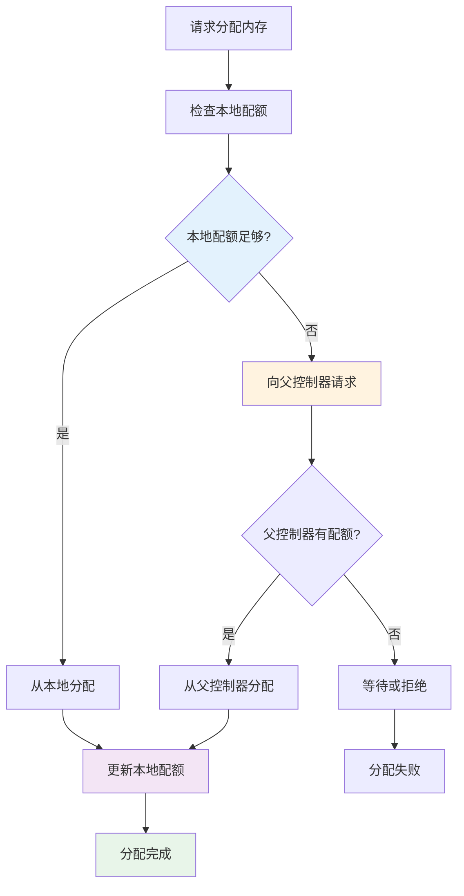
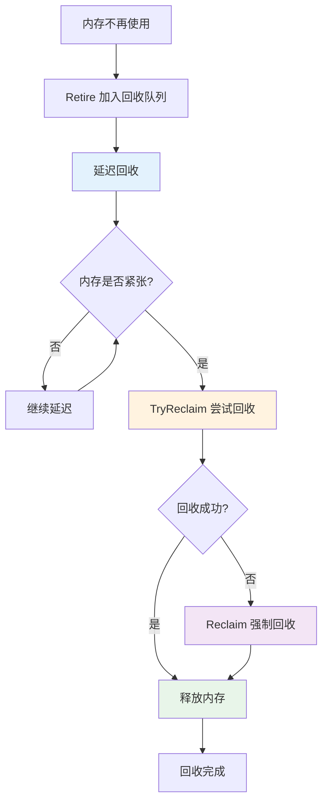

在上一篇文章中，我们深入了解了 Segment 合并策略的实现。本文将继续深入，详细解析内存管理与资源控制的机制，这是理解 IndexLib 如何高效管理内存和资源的关键。


## 1. 内存管理概览

### 1.1 内存管理的核心概念

IndexLib 的内存管理包括以下核心概念：

1. **MemoryQuotaController**：内存配额控制器，管理内存配额和分配
2. **TabletMemoryCalculator**：Tablet 内存计算器，计算 Tablet 的内存使用
3. **IIndexMemoryReclaimer**：索引内存回收器，回收不再使用的内存
4. **BuildResourceCalculator**：构建资源计算器，计算构建时的资源使用

让我们先通过图来理解内存管理的整体架构：


### 1.2 内存管理的作用

内存管理在 IndexLib 中起到关键作用：

- **内存配额控制**：通过 MemoryQuotaController 控制内存使用，避免内存溢出
- **内存使用统计**：通过 TabletMemoryCalculator 统计内存使用，监控内存状态
- **内存回收**：通过 IIndexMemoryReclaimer 回收不再使用的内存，释放内存空间
- **资源优化**：通过 BuildResourceCalculator 优化构建资源使用，提高构建效率

## 2. MemoryQuotaController：内存配额控制器

### 2.1 MemoryQuotaController 的结构

`MemoryQuotaController` 是内存配额控制器，定义在 `base/MemoryQuotaController.h` 中：

```cpp
// base/MemoryQuotaController.h
class MemoryQuotaController
{
public:
    // 构造函数：创建根配额控制器
    MemoryQuotaController(std::string name, int64_t totalQuota);
    
    // 构造函数：创建子配额控制器
    MemoryQuotaController(std::string name, 
                         std::shared_ptr<MemoryQuotaController> parentController);
    
    // 分配内存配额
    void Allocate(int64_t quota);
    Status TryAllocate(int64_t quota);  // 尝试分配，不阻塞
    
    // 预留内存配额
    Status Reserve(int64_t quota);
    
    // 释放内存配额
    void Free(int64_t quota);
    
    // 获取内存配额信息
    int64_t GetAllocatedQuota() const;  // 已分配配额
    int64_t GetFreeQuota() const;       // 可用配额
    int64_t GetTotalQuota() const;      // 总配额

private:
    std::string _name;                                    // 控制器名称
    const int64_t _rootQuota;                            // 根配额（根控制器）
    std::atomic<int64_t> _localFreeQuota;                // 本地可用配额
    std::atomic<int64_t> _reservedParentQuota;           // 从父控制器预留的配额
    std::shared_ptr<MemoryQuotaController> _parentController;  // 父控制器
};
```

**MemoryQuotaController 的关键字段**：


- **rootQuota**：根配额，根控制器的总配额
- **localFreeQuota**：本地可用配额，当前控制器可用的配额
- **reservedParentQuota**：从父控制器预留的配额
- **parentController**：父控制器，支持层级配额管理

### 2.2 内存配额分配

内存配额的分配机制：


**内存配额分配流程图**：



**分配机制**：
1. **根控制器分配**：根控制器有固定的总配额
2. **子控制器分配**：子控制器从父控制器分配配额
3. **配额预留**：通过 Reserve() 预留配额，保证后续分配
4. **配额释放**：通过 Free() 释放配额，返回给父控制器

### 2.3 层级配额管理

MemoryQuotaController 支持层级配额管理：


**层级结构**：
- **根控制器**：管理总配额，分配给子控制器
- **分区控制器**：管理分区的配额，分配给 Tablet 控制器
- **Tablet 控制器**：管理 Tablet 的配额，分配给各个组件
- **组件控制器**：管理组件的配额，如构建配额、查询配额等

### 2.4 配额分配策略

配额分配的策略：


**分配策略**：
- **按需分配**：根据实际需求分配配额，灵活适应不同场景
- **预留分配**：通过 Reserve() 预留配额，保证关键操作的配额
- **阻塞分配**：Allocate() 会阻塞直到有可用配额
- **非阻塞分配**：TryAllocate() 不阻塞，立即返回结果

## 3. TabletMemoryCalculator：Tablet 内存计算器

### 3.1 TabletMemoryCalculator 的结构

`TabletMemoryCalculator` 是 Tablet 内存计算器，定义在 `framework/TabletMemoryCalculator.h` 中：

```cpp
// framework/TabletMemoryCalculator.h
class TabletMemoryCalculator final
{
public:
    TabletMemoryCalculator(const std::shared_ptr<TabletWriter>& tabletWriter,
                           const std::shared_ptr<TabletReaderContainer>& tabletReaderContainer);
    
    // 获取各种内存使用量
    size_t GetRtBuiltSegmentsMemsize() const;      // 实时已构建 Segment 内存
    size_t GetRtIndexMemsize() const;              // 实时索引内存
    size_t GetIncIndexMemsize() const;             // 增量索引内存
    size_t GetBuildingSegmentMemsize() const;      // 构建中 Segment 内存
    size_t GetDumpingSegmentMemsize() const;       // 转储中 Segment 内存
    size_t GetBuildingSegmentDumpExpandMemsize() const;  // 转储扩展内存

private:
    std::shared_ptr<TabletWriter> _tabletWriter;
    std::shared_ptr<TabletReaderContainer> _tabletReaderContainer;
};
```

**TabletMemoryCalculator 的关键方法**：


- **GetRtBuiltSegmentsMemsize()**：计算实时已构建 Segment 的内存使用
- **GetRtIndexMemsize()**：计算实时索引的内存使用
- **GetIncIndexMemsize()**：计算增量索引的内存使用
- **GetBuildingSegmentMemsize()**：计算构建中 Segment 的内存使用
- **GetDumpingSegmentMemsize()**：计算转储中 Segment 的内存使用

### 3.2 内存使用统计

内存使用统计的流程：


**统计流程**：
1. **收集组件信息**：从 TabletWriter 和 TabletReaderContainer 收集组件信息
2. **计算各组件内存**：计算各个组件的内存使用量
3. **汇总内存使用**：汇总所有组件的内存使用量
4. **返回统计结果**：返回详细的内存使用统计结果

## 4. IIndexMemoryReclaimer：索引内存回收器

### 4.1 IIndexMemoryReclaimer 接口

`IIndexMemoryReclaimer` 是索引内存回收器的接口，定义在 `framework/mem_reclaimer/IIndexMemoryReclaimer.h` 中：

```cpp
// framework/mem_reclaimer/IIndexMemoryReclaimer.h
class IIndexMemoryReclaimer
{
public:
    // 回收内存：将内存加入回收队列
    virtual int64_t Retire(void* addr, std::function<void(void*)> deAllocator) = 0;
    
    // 取消回收：从回收队列中移除
    virtual void DropRetireItem(int64_t itemId) = 0;
    
    // 尝试回收：尝试回收一些内存
    virtual void TryReclaim() = 0;
    
    // 强制回收：强制回收所有可回收的内存
    virtual void Reclaim() = 0;
};
```

**IIndexMemoryReclaimer 的关键方法**：


- **Retire()**：将内存加入回收队列，延迟回收
- **DropRetireItem()**：取消回收，从回收队列中移除
- **TryReclaim()**：尝试回收一些内存，不阻塞
- **Reclaim()**：强制回收所有可回收的内存

### 4.2 内存回收机制

内存回收的机制：


**内存回收流程图**：



**回收机制**：
1. **Retire**：将不再使用的内存加入回收队列，延迟回收
2. **延迟回收**：延迟回收可以避免频繁的内存分配和释放
3. **TryReclaim**：在合适的时机尝试回收一些内存
4. **Reclaim**：在内存紧张时强制回收所有可回收的内存

### 4.3 内存回收策略

内存回收的策略：


**回收策略**：
- **延迟回收**：通过 Retire() 延迟回收，避免频繁的内存操作
- **按需回收**：在内存紧张时通过 TryReclaim() 按需回收
- **强制回收**：在内存严重不足时通过 Reclaim() 强制回收
- **取消回收**：通过 DropRetireItem() 取消不需要的回收

## 5. BuildResourceCalculator：构建资源计算器

### 5.1 BuildResourceCalculator 的结构

`BuildResourceCalculator` 是构建资源计算器，定义在 `util/memory_control/BuildResourceCalculator.h` 中：

```cpp
// util/memory_control/BuildResourceCalculator.h
class BuildResourceCalculator
{
public:
    // 获取当前总内存使用
    static int64_t GetCurrentTotalMemoryUse(const BuildResourceMetricsPtr& metrics);
    
    // 估算转储临时内存使用
    static int64_t EstimateDumpTempMemoryUse(const BuildResourceMetricsPtr& metrics, 
                                             int dumpThreadCount);
    
    // 估算转储扩展内存使用
    static int64_t EstimateDumpExpandMemoryUse(const BuildResourceMetricsPtr& metrics);
    
    // 估算转储文件大小
    static int64_t EstimateDumpFileSize(const BuildResourceMetricsPtr& metrics);
};
```

**BuildResourceCalculator 的关键方法**：


- **GetCurrentTotalMemoryUse()**：获取当前总内存使用
- **EstimateDumpTempMemoryUse()**：估算转储临时内存使用
- **EstimateDumpExpandMemoryUse()**：估算转储扩展内存使用
- **EstimateDumpFileSize()**：估算转储文件大小

### 5.2 构建资源估算

构建资源估算的流程：


**估算流程**：
1. **收集指标**：从 BuildResourceMetrics 收集构建指标
2. **计算内存使用**：根据指标计算内存使用量
3. **估算转储资源**：估算转储时的临时内存和文件大小
4. **返回估算结果**：返回详细的资源使用估算结果

## 6. 内存分配策略

### 6.1 内存分配策略

内存分配的策略：


**分配策略**：
- **按需分配**：根据实际需求分配内存，灵活适应不同场景
- **预留分配**：通过 Reserve() 预留内存，保证关键操作的内存
- **阻塞分配**：Allocate() 会阻塞直到有可用内存
- **非阻塞分配**：TryAllocate() 不阻塞，立即返回结果

### 6.2 内存分配优化

内存分配的优化：


**优化策略**：
- **批量分配**：批量分配内存，减少分配次数
- **内存池**：使用内存池减少内存分配开销
- **对齐分配**：内存对齐分配，提高访问效率
- **预分配**：预分配常用大小的内存，减少分配延迟

## 7. 内存回收机制

### 7.1 内存回收时机

内存回收的时机：


**回收时机**：
- **延迟回收**：通过 Retire() 延迟回收，在合适的时机回收
- **按需回收**：在内存紧张时通过 TryReclaim() 按需回收
- **强制回收**：在内存严重不足时通过 Reclaim() 强制回收
- **定期回收**：定期触发回收，保持内存使用在合理范围

### 7.2 内存回收优化

内存回收的优化：


**优化策略**：
- **批量回收**：批量回收内存，减少回收次数
- **延迟回收**：延迟回收可以避免频繁的内存操作
- **智能回收**：根据内存使用情况智能决定回收时机
- **并发回收**：支持并发回收，提高回收效率

## 8. 内存优化策略

### 8.1 内存使用优化

内存使用的优化：


**优化策略**：
- **内存池**：使用内存池减少内存分配开销
- **缓存控制**：控制缓存大小，避免内存溢出
- **内存压缩**：压缩内存数据，减少内存使用
- **懒加载**：按需加载数据，减少内存占用

### 8.2 内存监控与告警

内存监控与告警：


**监控与告警**：
- **实时监控**：实时监控内存使用情况
- **阈值告警**：当内存使用超过阈值时告警
- **统计分析**：统计分析内存使用趋势
- **优化建议**：根据监控数据提供优化建议

## 9. 内存管理的关键设计

### 9.1 层级配额管理

层级配额管理的设计：


**设计要点**：
- **层级结构**：支持多层级配额管理，灵活分配配额
- **配额继承**：子控制器从父控制器继承配额
- **配额隔离**：不同层级的配额相互隔离，避免相互影响
- **配额共享**：支持配额共享，提高配额利用率

### 9.2 内存回收设计

内存回收的设计：


**设计要点**：
- **延迟回收**：延迟回收可以避免频繁的内存操作
- **按需回收**：在内存紧张时按需回收，保证系统稳定性
- **并发安全**：内存回收支持并发，保证线程安全
- **资源释放**：及时释放不再使用的资源，避免内存泄漏

### 9.3 性能优化设计

性能优化的设计：


**设计要点**：
- **内存池**：使用内存池减少内存分配开销
- **批量操作**：批量分配和回收内存，减少操作次数
- **缓存优化**：优化缓存策略，提高内存利用率
- **资源控制**：控制资源使用，避免资源浪费

## 10. 小结

内存管理与资源控制是 IndexLib 的核心功能，通过 MemoryQuotaController、TabletMemoryCalculator、IIndexMemoryReclaimer 等组件实现。通过本文的深入解析，我们了解到：

**关键要点**：
- **MemoryQuotaController**：内存配额控制器，管理内存配额和分配，支持层级配额管理
- **TabletMemoryCalculator**：Tablet 内存计算器，计算 Tablet 的内存使用，监控内存状态
- **IIndexMemoryReclaimer**：索引内存回收器，回收不再使用的内存，释放内存空间
- **BuildResourceCalculator**：构建资源计算器，计算构建时的资源使用，优化构建效率
- **内存分配策略**：按需分配、预留分配等策略，灵活适应不同场景
- **内存回收机制**：延迟回收、按需回收等机制，保证系统稳定性
- **内存优化策略**：内存池、缓存控制等优化策略，提高内存利用率

理解内存管理与资源控制，是掌握 IndexLib 资源管理机制的关键。在下一篇文章中，我们将深入介绍索引类型的实现细节。
