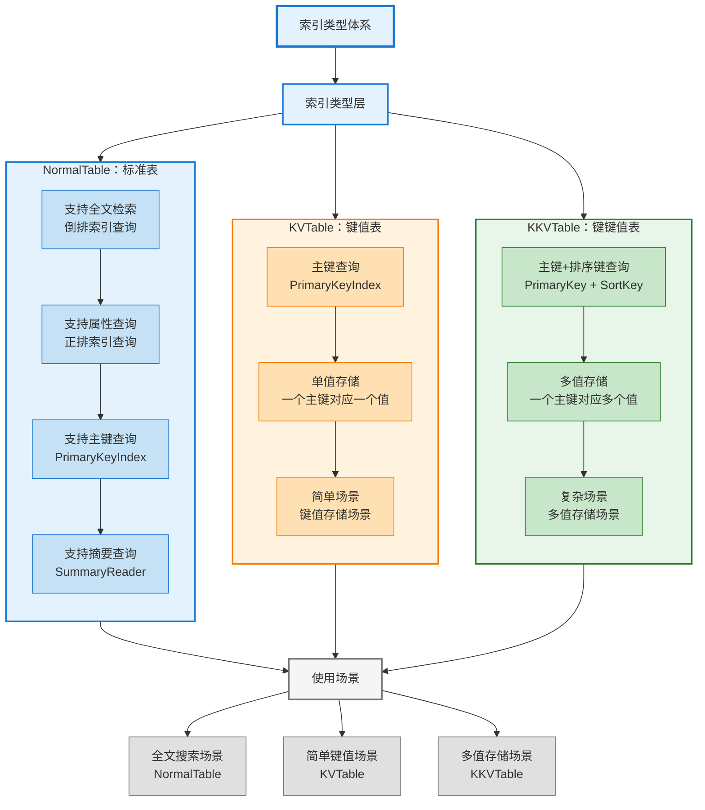
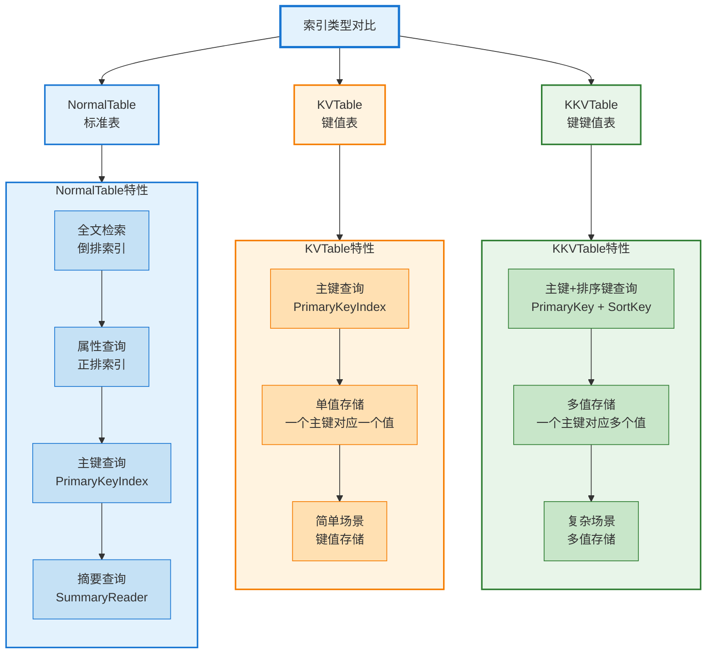
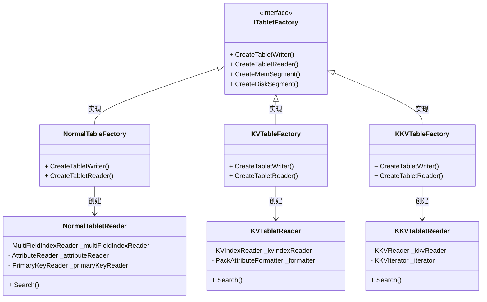
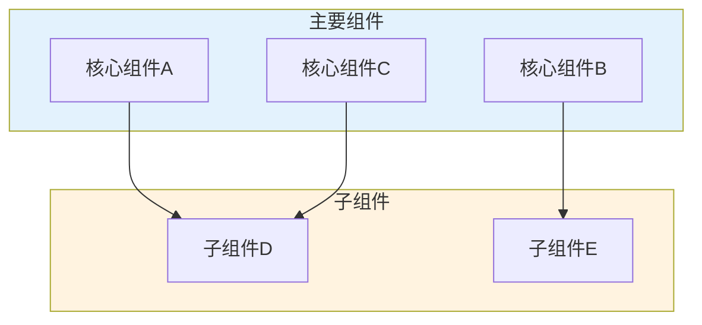
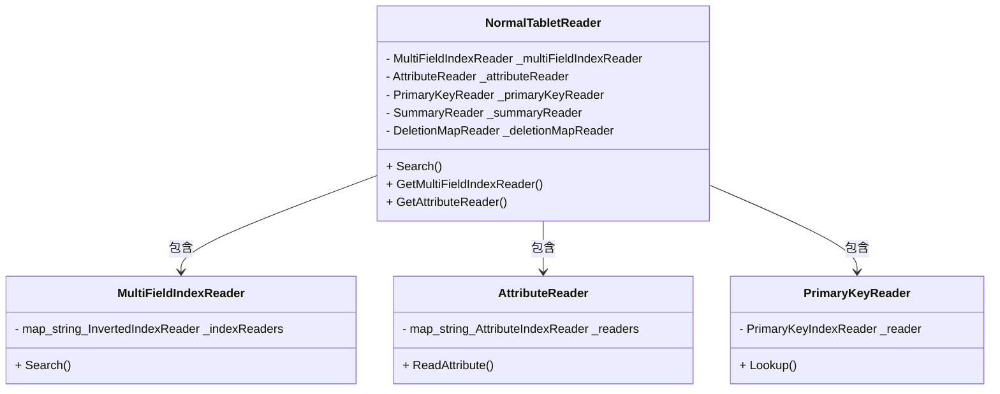
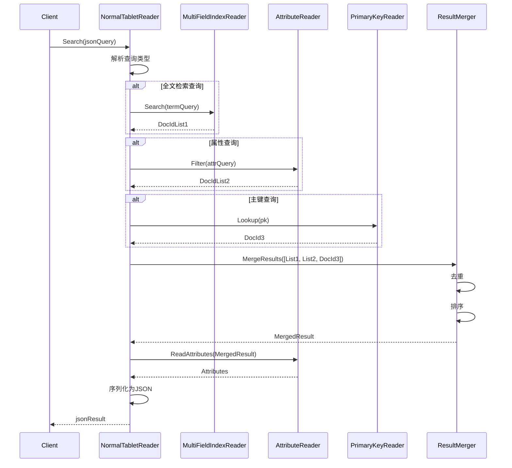

在上一篇文章中，我们深入了解了内存管理与资源控制的机制。本文将继续深入，详细解析索引类型的实现，这是理解 IndexLib 如何支持不同类型索引的关键。

索引类型概览：Normal、KV、KKV 三种索引类型的特点和应用场景：



## 1. 索引类型概览

### 1.1 支持的索引类型

IndexLib 支持三种主要的索引类型：

1. **NormalTable**：标准表，支持全文检索、倒排索引、正排索引等
2. **KVTable**：键值表，支持主键查询，适用于简单的键值存储场景
3. **KKVTable**：键键值表，支持主键+排序键查询，适用于多值存储场景

让我们先通过图来理解三种索引类型的区别：

索引类型对比：Normal、KV、KKV 的数据模型和查询方式：



### 1.2 索引类型的选择

不同索引类型适用于不同的场景。让我们通过类图来理解三种索引类型的架构关系：



**索引类型的选择**：

不同索引类型适用于不同的场景，选择合适的索引类型可以显著提高系统性能和降低复杂度：

- **NormalTable**：适用于全文检索、复杂查询、多字段查询等场景
  - **全文检索**：需要全文检索功能，支持倒排索引
  - **复杂查询**：需要范围查询、排序、聚合等复杂查询
  - **多字段查询**：需要多字段联合查询
  - **灵活查询**：需要灵活的查询方式，支持多种查询组合
  
- **KVTable**：适用于简单的键值存储、主键查询等场景
  - **简单存储**：只需要简单的键值存储，不需要复杂的索引
  - **主键查询**：主要查询方式是主键查询，查询性能要求高
  - **高性能**：需要高性能的主键查询，查询延迟要求低
  - **简单使用**：希望使用简单的接口，降低使用复杂度
  
- **KKVTable**：适用于多值存储、主键+排序键查询等场景
  - **多值存储**：一个主键需要对应多个值，通过排序键区分
  - **排序键查询**：需要根据排序键查询，支持精确查询和范围查询
  - **有序存储**：需要有序存储和查询，支持排序键排序
  - **范围查询**：需要排序键范围查询，支持范围扫描

## 2. NormalTable：标准表

### 2.1 NormalTable 的特点

NormalTable 是标准表，支持完整的索引功能：

NormalTable 的特点：支持全文检索、倒排索引、正排索引等：



**主要特点**：
- **全文检索**：支持倒排索引，实现全文检索
- **正排索引**：支持正排索引，实现属性查询
- **主键索引**：支持主键索引，实现主键查询
- **多字段查询**：支持多字段联合查询
- **复杂查询**：支持范围查询、排序、聚合等复杂查询

### 2.2 NormalTable 的架构

NormalTable 的架构：

NormalTable 的架构：NormalTabletReader、NormalTabletWriter 等组件：


**核心组件**：

NormalTable 的架构采用组合模式，将不同的索引 Reader 组合在一起。让我们通过类图来理解详细的架构：



**核心组件详解**：

- **NormalTabletReader**：标准表查询器，支持全文检索和属性查询
  - **查询入口**：提供统一的查询接口，支持 JSON 格式的查询
  - **索引管理**：管理各种索引 Reader，按需创建和缓存
  - **结果合并**：合并各种索引的查询结果，支持复合查询
  
- **NormalTabletWriter**：标准表写入器，支持文档构建和索引构建
  - **文档构建**：接收文档批次，构建索引
  - **索引构建**：构建倒排索引、正排索引、主键索引等
  - **内存管理**：管理构建时的内存使用，控制内存配额
  
- **MultiFieldIndexReader**：多字段倒排索引 Reader
  - **多字段支持**：支持多个字段的倒排索引查询
  - **查询合并**：合并多个字段的查询结果
  - **性能优化**：支持并行查询，提高查询性能
  
- **AttributeReader**：正排索引 Reader
  - **属性查询**：支持属性查询，快速获取文档属性
  - **批量查询**：支持批量查询属性，提高查询效率
  - **缓存优化**：支持属性缓存，减少 IO 操作
  
- **PrimaryKeyReader**：主键索引 Reader
  - **主键查询**：支持主键查询，快速定位文档
  - **批量查询**：支持批量主键查询，提高查询效率
  - **性能优化**：针对主键查询优化，查询延迟低

### 2.3 NormalTable 的查询

NormalTable 的查询方式：

NormalTable 的查询：全文检索、属性查询、主键查询等：


**查询方式**：

NormalTable 支持多种查询方式，可以灵活组合使用。让我们通过序列图来理解完整的查询流程：



**查询方式详解**：

- **全文检索**：通过倒排索引进行全文检索
  - **Term 查询**：通过 term 查询倒排索引，获取包含该 term 的文档列表
  - **短语查询**：支持短语查询，查询包含特定短语的文档
  - **布尔查询**：支持 AND、OR、NOT 等布尔查询
  - **相关性排序**：按相关性分数排序，返回最相关的文档
  
- **属性查询**：通过正排索引进行属性查询
  - **等值查询**：支持属性等值查询，快速过滤文档
  - **范围查询**：支持属性范围查询，查询属性值在指定范围内的文档
  - **多属性查询**：支持多个属性的联合查询
  - **属性排序**：支持按属性值排序，返回排序后的文档
  
- **主键查询**：通过主键索引进行主键查询
  - **精确查询**：通过主键精确查询，快速定位文档
  - **批量查询**：支持批量主键查询，提高查询效率
  - **查询优化**：针对主键查询优化，查询延迟低
  
- **复合查询**：支持多种查询方式的组合
  - **查询组合**：可以组合全文检索、属性查询、主键查询等
  - **查询优化**：优化查询组合，减少不必要的查询
  - **结果合并**：合并各种查询的结果，支持去重、排序等

## 3. KVTable：键值表

### 3.1 KVTable 的特点

KVTable 是键值表，支持简单的键值存储：

KVTable 的特点：支持主键查询、简单的键值存储：


**主要特点**：
- **主键查询**：支持主键查询，快速定位数据
- **简单存储**：简单的键值存储模型，易于使用
- **高性能**：针对主键查询优化，查询性能高
- **属性查询**：支持属性查询，可以查询指定属性

### 3.2 KVTable 的架构

KVTable 的架构：

KVTable 的架构：KVTabletReader、KVTabletWriter 等组件：


**核心组件**：
- **KVTabletReader**：KV 表查询器，支持主键查询
- **KVTabletWriter**：KV 表写入器，支持键值构建
- **KVIndexReader**：KV 索引 Reader，支持主键查询
- **PackAttributeFormatter**：打包属性格式化器，支持属性查询

### 3.3 KVTable 的查询

KVTable 的查询方式：

KVTable 的查询：主键查询、属性查询等：


**查询方式**：
- **主键查询**：通过主键快速定位数据
- **批量主键查询**：支持批量主键查询，提高查询效率
- **属性查询**：支持查询指定属性，减少数据传输

**查询示例**：

```cpp
// table/kv_table/KVTabletReader.h
// JSON 查询格式
{
    "pk": ["key1", "key2"],           // 主键列表
    "pkNumber": [123456, 623445],     // 数字主键列表
    "attrs": ["attr1", "attr2"],      // 要查询的属性
    "indexName": "kv1"                // 索引名称
}
```

## 4. KKVTable：键键值表

### 4.1 KKVTable 的特点

KKVTable 是键键值表，支持主键+排序键查询：

KKVTable 的特点：支持主键+排序键查询、多值存储：


**主要特点**：
- **主键+排序键查询**：支持主键+排序键查询，实现多值存储
- **多值存储**：一个主键可以对应多个值，通过排序键区分
- **范围查询**：支持排序键范围查询
- **属性查询**：支持属性查询，可以查询指定属性

### 4.2 KKVTable 的架构

KKVTable 的架构：

KKVTable 的架构：KKVTabletReader、KKVTabletWriter 等组件：


**核心组件**：
- **KKVTabletReader**：KKV 表查询器，支持主键+排序键查询
- **KKVTabletWriter**：KKV 表写入器，支持键键值构建
- **KKVReader**：KKV 索引 Reader，支持主键+排序键查询
- **KKVIterator**：KKV 迭代器，支持范围查询

### 4.3 KKVTable 的查询

KKVTable 的查询方式：

KKVTable 的查询：主键+排序键查询、范围查询等：


**查询方式**：
- **主键查询**：通过主键查询所有值
- **主键+排序键查询**：通过主键+排序键精确查询
- **范围查询**：支持排序键范围查询
- **属性查询**：支持查询指定属性

**查询示例**：

```cpp
// table/kkv_table/KKVTabletReader.h
// JSON 查询格式
{
    "pk": ["key1"],                   // 主键
    "pkNumber": [123456],             // 数字主键
    "attrs": ["attr1", "attr2"],      // 要查询的属性
    "skey": ["skey1", "skey2"]        // 排序键列表
}
```

## 5. 索引类型的实现差异

### 5.1 TabletReader 的实现差异

不同索引类型的 TabletReader 实现差异：

TabletReader 的实现差异：NormalTabletReader、KVTabletReader、KKVTabletReader：


**实现差异**：
- **NormalTabletReader**：支持全文检索、属性查询、主键查询等多种查询方式
- **KVTabletReader**：主要支持主键查询，查询接口简化
- **KKVTabletReader**：支持主键+排序键查询，查询接口支持排序键

### 5.2 TabletWriter 的实现差异

不同索引类型的 TabletWriter 实现差异：

TabletWriter 的实现差异：NormalTabletWriter、KVTabletWriter、KKVTabletWriter：


**实现差异**：
- **NormalTabletWriter**：支持文档构建、倒排索引构建、正排索引构建等
- **KVTabletWriter**：主要支持键值构建，构建流程简化
- **KKVTabletWriter**：支持键键值构建，构建流程支持排序键

### 5.3 索引构建的差异

不同索引类型的索引构建差异：

索引构建的差异：Normal、KV、KKV 的索引构建流程：


**构建差异**：
- **NormalTable**：需要构建倒排索引、正排索引、主键索引等多种索引
- **KVTable**：主要构建主键索引，构建流程简化
- **KKVTable**：构建主键索引和排序键索引，构建流程支持排序键

## 6. 索引类型的选择

### 6.1 选择 NormalTable 的场景

选择 NormalTable 的场景：

选择 NormalTable 的场景：全文检索、复杂查询等场景：


**适用场景**：
- **全文检索**：需要全文检索功能
- **复杂查询**：需要范围查询、排序、聚合等复杂查询
- **多字段查询**：需要多字段联合查询
- **灵活查询**：需要灵活的查询方式

### 6.2 选择 KVTable 的场景

选择 KVTable 的场景：

选择 KVTable 的场景：简单的键值存储、主键查询等场景：


**适用场景**：
- **简单存储**：只需要简单的键值存储
- **主键查询**：主要查询方式是主键查询
- **高性能**：需要高性能的主键查询
- **简单使用**：希望使用简单的接口

### 6.3 选择 KKVTable 的场景

选择 KKVTable 的场景：

选择 KKVTable 的场景：多值存储、主键+排序键查询等场景：


**适用场景**：
- **多值存储**：一个主键需要对应多个值
- **排序键查询**：需要根据排序键查询
- **范围查询**：需要排序键范围查询
- **有序存储**：需要有序存储和查询

## 7. 索引类型的性能对比

### 7.1 查询性能对比

不同索引类型的查询性能对比：

查询性能对比：Normal、KV、KKV 的查询性能特点：

```mermaid
flowchart TD
    subgraph Main["主要组件"]
        A["核心组件A"]
        B["核心组件B"]
        C["核心组件C"]
    end
    
    subgraph Sub["子组件"]
        D["子组件D"]
        E["子组件E"]
    end
    
    A --> D
    B --> E
    C --> D
    
    style Main fill:#e3f2fd
    style Sub fill:#fff3e0
```

**性能特点**：
- **NormalTable**：全文检索性能高，复杂查询性能中等
- **KVTable**：主键查询性能最高，查询延迟最低
- **KKVTable**：主键+排序键查询性能高，范围查询性能中等

### 7.2 存储性能对比

不同索引类型的存储性能对比：

存储性能对比：Normal、KV、KKV 的存储性能特点：

```mermaid
flowchart TD
    subgraph Main["主要组件"]
        A["核心组件A"]
        B["核心组件B"]
        C["核心组件C"]
    end
    
    subgraph Sub["子组件"]
        D["子组件D"]
        E["子组件E"]
    end
    
    A --> D
    B --> E
    C --> D
    
    style Main fill:#e3f2fd
    style Sub fill:#fff3e0
```

**存储特点**：
- **NormalTable**：存储空间较大，需要存储多种索引
- **KVTable**：存储空间较小，只需要存储主键索引
- **KKVTable**：存储空间中等，需要存储主键和排序键索引

### 7.3 构建性能对比

不同索引类型的构建性能对比：

构建性能对比：Normal、KV、KKV 的构建性能特点：

```mermaid
flowchart TD
    subgraph Main["主要组件"]
        A["核心组件A"]
        B["核心组件B"]
        C["核心组件C"]
    end
    
    subgraph Sub["子组件"]
        D["子组件D"]
        E["子组件E"]
    end
    
    A --> D
    B --> E
    C --> D
    
    style Main fill:#e3f2fd
    style Sub fill:#fff3e0
```

**构建特点**：
- **NormalTable**：构建时间较长，需要构建多种索引
- **KVTable**：构建时间最短，构建流程简化
- **KKVTable**：构建时间中等，需要构建主键和排序键索引

## 8. 索引类型的扩展

### 8.1 自定义索引类型

IndexLib 支持自定义索引类型：

自定义索引类型：通过实现接口扩展索引类型：

```mermaid
flowchart TD
    subgraph Main["主要组件"]
        A["核心组件A"]
        B["核心组件B"]
        C["核心组件C"]
    end
    
    subgraph Sub["子组件"]
        D["子组件D"]
        E["子组件E"]
    end
    
    A --> D
    B --> E
    C --> D
    
    style Main fill:#e3f2fd
    style Sub fill:#fff3e0
```

**扩展方式**：
- **实现 TabletReader**：实现自定义的 TabletReader
- **实现 TabletWriter**：实现自定义的 TabletWriter
- **实现索引构建**：实现自定义的索引构建逻辑
- **注册索引类型**：注册自定义索引类型

### 8.2 索引类型的演进

索引类型的演进：

索引类型的演进：从 Normal 到 KV、KKV 的演进过程：

```mermaid
flowchart TD
    subgraph Main["主要组件"]
        A["核心组件A"]
        B["核心组件B"]
        C["核心组件C"]
    end
    
    subgraph Sub["子组件"]
        D["子组件D"]
        E["子组件E"]
    end
    
    A --> D
    B --> E
    C --> D
    
    style Main fill:#e3f2fd
    style Sub fill:#fff3e0
```

**演进过程**：
- **NormalTable**：最早的索引类型，支持完整的索引功能
- **KVTable**：针对简单场景优化的索引类型
- **KKVTable**：针对多值存储场景优化的索引类型

## 9. 索引类型的关键设计

### 9.1 统一的接口设计

索引类型的统一接口设计：

统一的接口设计：ITabletReader、ITabletWriter 等统一接口：

```mermaid
flowchart TD
    subgraph Main["主要组件"]
        A["核心组件A"]
        B["核心组件B"]
        C["核心组件C"]
    end
    
    subgraph Sub["子组件"]
        D["子组件D"]
        E["子组件E"]
    end
    
    A --> D
    B --> E
    C --> D
    
    style Main fill:#e3f2fd
    style Sub fill:#fff3e0
```

**设计要点**：
- **ITabletReader**：统一的查询接口，不同索引类型实现不同的查询逻辑
- **ITabletWriter**：统一的写入接口，不同索引类型实现不同的构建逻辑
- **ITabletSchema**：统一的 Schema 接口，不同索引类型有不同的 Schema 配置

### 9.2 灵活的扩展设计

索引类型的灵活扩展设计：

灵活的扩展设计：支持自定义索引类型和扩展功能：

```mermaid
flowchart TD
    subgraph Main["主要组件"]
        A["核心组件A"]
        B["核心组件B"]
        C["核心组件C"]
    end
    
    subgraph Sub["子组件"]
        D["子组件D"]
        E["子组件E"]
    end
    
    A --> D
    B --> E
    C --> D
    
    style Main fill:#e3f2fd
    style Sub fill:#fff3e0
```

**设计要点**：
- **接口抽象**：通过接口抽象支持不同的索引类型实现
- **插件机制**：支持通过插件机制扩展索引类型
- **配置驱动**：通过配置驱动选择不同的索引类型

### 9.3 性能优化设计

索引类型的性能优化设计：

性能优化设计：针对不同索引类型的性能优化策略：

```mermaid
flowchart TD
    subgraph Main["主要组件"]
        A["核心组件A"]
        B["核心组件B"]
        C["核心组件C"]
    end
    
    subgraph Sub["子组件"]
        D["子组件D"]
        E["子组件E"]
    end
    
    A --> D
    B --> E
    C --> D
    
    style Main fill:#e3f2fd
    style Sub fill:#fff3e0
```

**设计要点**：
- **针对性优化**：针对不同索引类型的特点进行性能优化
- **查询优化**：优化查询路径，提高查询性能
- **构建优化**：优化构建流程，提高构建效率

## 10. 性能优化与最佳实践

### 10.1 索引类型选择优化

**选择策略**：

1. **场景分析**：
   - **查询模式**：分析查询模式，选择最适合的索引类型
   - **数据特征**：分析数据特征，选择最适合的索引类型
   - **性能要求**：根据性能要求选择索引类型
   
2. **性能权衡**：
   - **功能 vs 性能**：权衡功能需求和性能要求
   - **存储 vs 查询**：权衡存储空间和查询性能
   - **构建 vs 查询**：权衡构建性能和查询性能
   
3. **混合使用**：
   - **多索引类型**：可以同时使用多种索引类型
   - **索引组合**：组合使用不同的索引类型，满足不同需求
   - **索引切换**：根据场景切换索引类型

### 10.2 查询性能优化

**优化策略**：

1. **NormalTable 优化**：
   - **索引优化**：优化倒排索引和正排索引的结构
   - **查询优化**：优化查询路径，减少不必要的查询
   - **结果优化**：优化结果合并，提高合并效率
   
2. **KVTable 优化**：
   - **主键优化**：优化主键索引结构，提高查询性能
   - **批量优化**：优化批量主键查询，提高查询效率
   - **缓存优化**：优化主键查询缓存，减少查询延迟
   
3. **KKVTable 优化**：
   - **排序键优化**：优化排序键索引结构，提高查询性能
   - **范围查询优化**：优化范围查询，提高查询效率
   - **迭代器优化**：优化迭代器实现，减少迭代开销

### 10.3 构建性能优化

**优化策略**：

1. **NormalTable 构建优化**：
   - **并行构建**：并行构建多个索引，提高构建速度
   - **索引优化**：优化索引构建算法，减少构建时间
   - **内存优化**：优化内存使用，减少构建内存占用
   
2. **KVTable 构建优化**：
   - **简化构建**：简化构建流程，减少构建时间
   - **批量构建**：批量构建键值对，提高构建效率
   - **压缩优化**：优化数据压缩，减少存储空间
   
3. **KKVTable 构建优化**：
   - **排序键优化**：优化排序键构建，提高构建效率
   - **批量构建**：批量构建键键值对，提高构建效率
   - **索引优化**：优化索引结构，减少构建时间

## 11. 小结

索引类型是 IndexLib 的核心功能，通过 NormalTable、KVTable、KKVTable 三种类型支持不同的应用场景。通过本文的深入解析，我们了解到：

**核心类型**：

- **NormalTable**：标准表，支持全文检索、倒排索引、正排索引等，适用于全文检索和复杂查询场景
  - **功能完整**：支持全文检索、属性查询、主键查询等多种查询方式
  - **灵活查询**：支持复杂的查询组合，满足各种查询需求
  - **性能平衡**：在功能和性能之间取得平衡，适合通用场景
  
- **KVTable**：键值表，支持主键查询，适用于简单的键值存储场景，查询性能高
  - **简单高效**：简单的键值存储模型，查询性能高
  - **主键优化**：针对主键查询优化，查询延迟低
  - **存储优化**：存储空间小，构建速度快
  
- **KKVTable**：键键值表，支持主键+排序键查询，适用于多值存储场景，支持范围查询
  - **多值存储**：一个主键可以对应多个值，通过排序键区分
  - **范围查询**：支持排序键范围查询，支持有序存储和查询
  - **性能优化**：针对主键+排序键查询优化，查询性能高

**设计亮点**：

1. **统一接口设计**：通过 ITabletReader 和 ITabletWriter 统一接口，支持不同的索引类型实现
2. **工厂模式**：通过工厂模式创建不同类型的 Tablet，便于扩展和维护
3. **策略模式**：不同索引类型采用不同的查询和构建策略，针对性强
4. **性能优化**：针对不同索引类型的特点进行性能优化，提高系统性能
5. **灵活扩展**：支持自定义索引类型和扩展功能，满足特殊需求

**性能特点**：

- **查询性能**：KVTable 主键查询性能最高，延迟较低；NormalTable 全文检索性能高，延迟较低
- **存储空间**：KVTable 存储空间最小，NormalTable 存储空间最大
- **构建性能**：KVTable 构建速度最快，NormalTable 构建速度较慢
- **功能完整性**：NormalTable 功能最完整，KVTable 功能最简单

理解索引类型，是掌握 IndexLib 索引功能的关键。在下一篇文章中，我们将深入介绍 Locator 与数据一致性的实现细节，包括 Locator 的完整结构、比较逻辑、更新机制、数据一致性保证等各个方面的实现原理和性能优化策略。
