在上一篇文章中，我们深入了解了索引类型的实现。本文将继续深入，详细解析 Locator 的实现细节和数据一致性保证机制，这是理解 IndexLib 如何保证数据不重复、不丢失的关键。

Locator 与数据一致性概览：从 Locator 结构到数据一致性保证的完整机制：

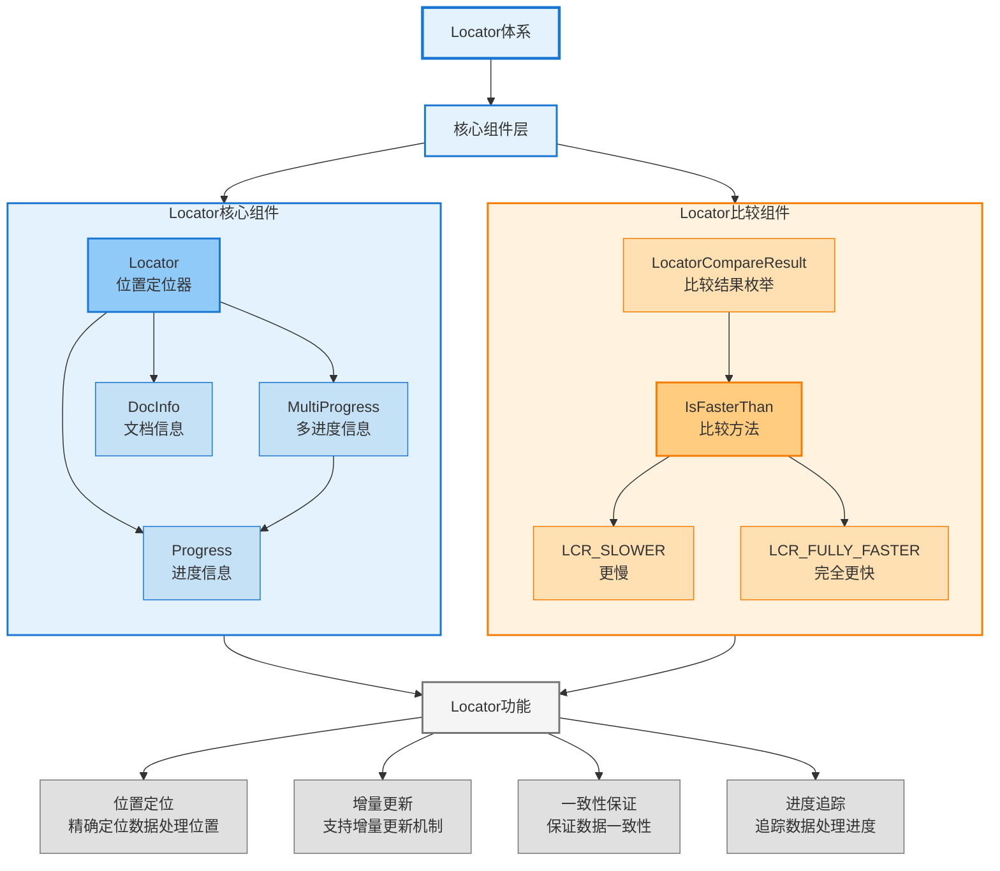

## 1. Locator 深入解析

### 1.1 Locator 的完整结构

`Locator` 是增量更新的核心，定义在 `framework/Locator.h` 中。Locator 的设计目标是精确定位数据处理位置，支持增量更新和数据一致性保证。让我们先通过类图来理解 Locator 的整体架构：

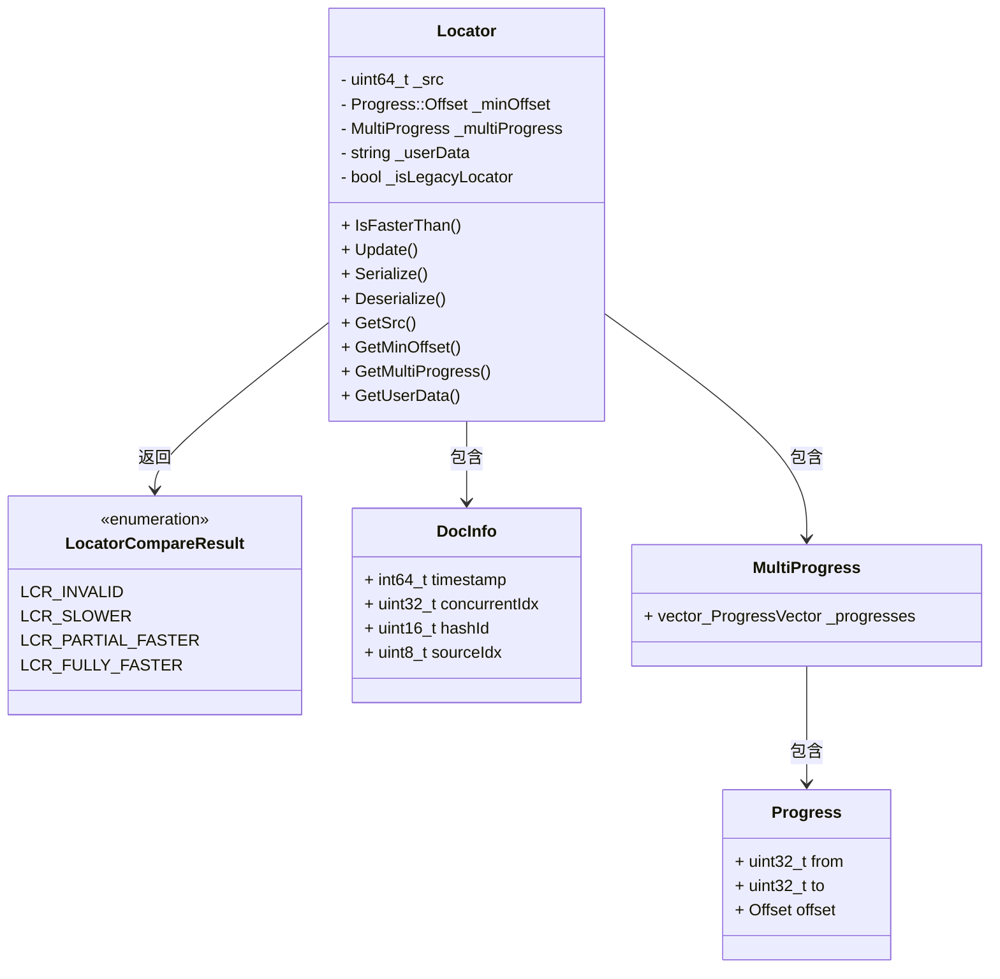

**Locator 的完整定义**：

```cpp
// framework/Locator.h
class Locator final
{
public:
    // Locator 比较结果
    enum class LocatorCompareResult {
        LCR_INVALID,        // 无效：数据源不同，无法比较
        LCR_SLOWER,         // 比这个 locator 慢：数据未处理
        LCR_PARTIAL_FASTER, // 部分 hash id 更快：需要部分处理
        LCR_FULLY_FASTER    // 完全比这个 locator 快（包括相等）：数据已处理
    };

    // 文档信息：记录文档在数据源中的位置
    struct DocInfo {
        int64_t timestamp;        // 时间戳：记录数据的时间位置
        uint32_t concurrentIdx;   // 并发索引：处理时间戳相同的情况
        uint16_t hashId;          // Hash ID：用于分片处理
        uint8_t sourceIdx;        // 数据源索引：支持多数据源场景
        
        // 比较两个 DocInfo
        bool operator<(const DocInfo& other) const {
            if (timestamp != other.timestamp) {
                return timestamp < other.timestamp;
            }
            if (concurrentIdx != other.concurrentIdx) {
                return concurrentIdx < other.concurrentIdx;
            }
            if (hashId != other.hashId) {
                return hashId < other.hashId;
            }
            return sourceIdx < other.sourceIdx;
        }
    };

    // 构造函数
    Locator();
    explicit Locator(uint64_t src);
    Locator(uint64_t src, const MultiProgress& multiProgress);
    Locator(const Locator& other);
    Locator& operator=(const Locator& other);

    // 比较方法：判断数据是否已处理
    LocatorCompareResult IsFasterThan(const Locator& other, 
                                      bool ignoreLegacyDiffSrc = false) const;
    
    // 更新方法：更新 Locator，只向前推进
    void Update(const Locator& other);
    
    // 序列化方法
    std::string Serialize() const;
    Status Deserialize(const std::string& str);
    
    // 访问方法
    uint64_t GetSrc() const { return _src; }
    const Progress::Offset& GetMinOffset() const { return _minOffset; }
    const MultiProgress& GetMultiProgress() const { return _multiProgress; }
    const std::string& GetUserData() const { return _userData; }
    bool IsLegacyLocator() const { return _isLegacyLocator; }
    
    // 设置方法
    void SetSrc(uint64_t src) { _src = src; }
    void SetUserData(const std::string& userData) { _userData = userData; }
    void SetMultiProgress(const MultiProgress& multiProgress);
    
    // 工具方法
    bool IsValid() const;
    bool IsSameSrc(const Locator& other, bool ignoreLegacyDiffSrc = false) const;
    std::string ToString() const;

private:
    uint64_t _src;                              // 数据源标识
    base::Progress::Offset _minOffset;          // 最小偏移量
    base::MultiProgress _multiProgress;        // 多进度信息（每个 hashId 的进度）
    std::string _userData;                      // 用户数据
    bool _isLegacyLocator;                     // 是否遗留 Locator
    
    // 内部方法
    LocatorCompareResult CompareProgress(const ProgressVector& pv1, 
                                         const ProgressVector& pv2) const;
    void UpdateMinOffset();
};
```

**Locator 的关键字段**：

Locator 的完整结构：包含所有关键字段和 DocInfo 结构：

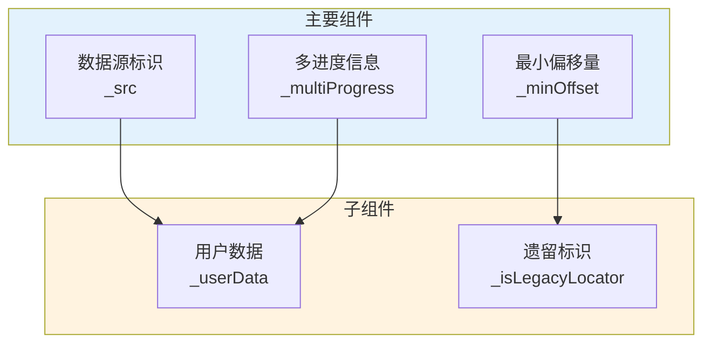

- **_src**：数据源标识，用于区分不同的数据源。每个数据源有唯一的 `_src`，不同数据源的 Locator 无法比较
- **_minOffset**：最小偏移量，记录所有 hashId 中最小的 timestamp 和 concurrentIdx，用于快速判断整体进度
- **_multiProgress**：多进度信息，每个 hashId 记录自己的进度（ProgressVector），支持分片处理和并行处理
- **_userData**：用户数据，可以存储自定义信息，支持业务扩展
- **_isLegacyLocator**：是否遗留 Locator，用于兼容旧版本，保证向后兼容

### 1.2 Progress 结构

`Progress` 是进度信息，定义在 `base/Progress.h` 中：

```cpp
// base/Progress.h
struct Progress {
    using Offset = std::pair<int64_t, uint32_t>;  // (timestamp, concurrentIdx)
    static constexpr Offset INVALID_OFFSET = {-1, 0};
    static constexpr Offset MIN_OFFSET = {0, 0};
    
    Progress(uint32_t from, uint32_t to, const Offset& offset);
    
    uint32_t from;      // HashId 范围起始
    uint32_t to;        // HashId 范围结束
    Offset offset;      // 偏移量（timestamp, concurrentIdx）
};

typedef std::vector<Progress> ProgressVector;      // 一个 hashId 范围的进度列表
typedef std::vector<ProgressVector> MultiProgress;  // 多个 hashId 范围的进度列表
```

**Progress 的关键字段**：

Progress 的结构：包含 from、to、offset 等字段：

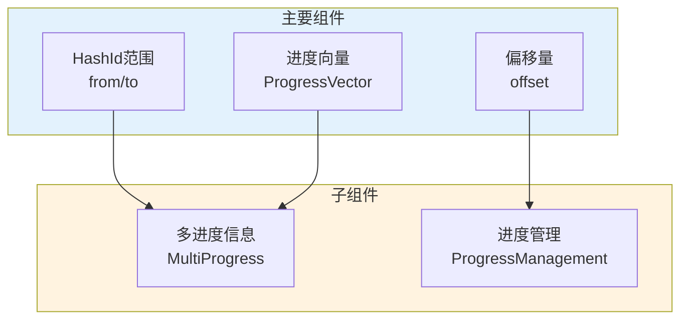

- **from/to**：HashId 范围，用于分片处理
- **offset**：偏移量，包含 timestamp 和 concurrentIdx
- **ProgressVector**：一个 hashId 范围的进度列表
- **MultiProgress**：多个 hashId 范围的进度列表

### 1.3 DocInfo 结构

`DocInfo` 是文档信息，记录文档在数据源中的位置：

DocInfo 的结构：包含 timestamp、concurrentIdx、hashId、sourceIdx 等字段：

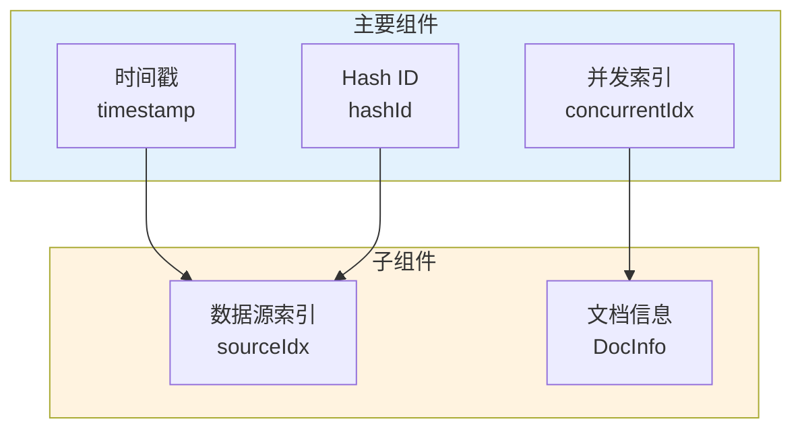

**DocInfo 的关键字段**：
- **timestamp**：时间戳，记录数据的时间位置
- **concurrentIdx**：并发索引，处理时间戳相同的情况
- **hashId**：Hash ID，用于分片
- **sourceIdx**：数据源索引，支持多数据源

## 2. Locator 的比较逻辑

### 2.1 IsFasterThan() 方法

`IsFasterThan()` 是 Locator 比较的核心方法，用于判断数据是否已处理。这是增量更新的基础，通过比较两个 Locator 来判断数据的新旧关系。让我们先通过流程图来理解比较的完整流程：

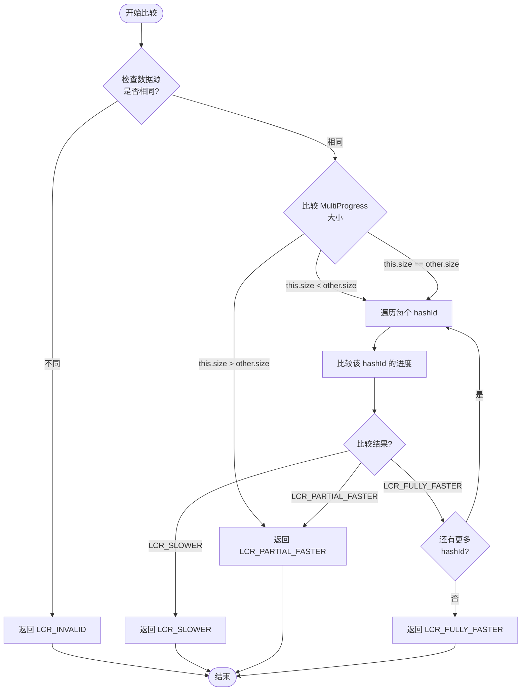

**IsFasterThan() 的完整实现**：

```cpp
// framework/Locator.cpp
LocatorCompareResult Locator::IsFasterThan(const Locator& other, 
                                            bool ignoreLegacyDiffSrc) const
{
    // 1. 检查数据源是否相同
    if (!IsSameSrc(other, ignoreLegacyDiffSrc)) {
        return LCR_INVALID;  // 数据源不同，无法比较
    }
    
    // 2. 快速路径：如果 MultiProgress 为空，特殊处理
    if (_multiProgress.empty()) {
        if (other._multiProgress.empty()) {
            return LCR_FULLY_FASTER;  // 都为空，认为相等
        }
        return LCR_SLOWER;  // 当前为空，其他不为空，当前更慢
    }
    
    if (other._multiProgress.empty()) {
        return LCR_FULLY_FASTER;  // 当前不为空，其他为空，当前更快
    }
    
    // 3. 比较每个 hashId 的进度
    bool hasPartialFaster = false;
    bool hasSlower = false;
    
    size_t minSize = std::min(_multiProgress.size(), other._multiProgress.size());
    
    for (size_t i = 0; i < minSize; ++i) {
        // 比较该 hashId 的进度
        auto result = CompareProgress(_multiProgress[i], other._multiProgress[i]);
        
        if (result == LCR_SLOWER) {
            hasSlower = true;
            // 如果有一个 hashId 更慢，且没有部分更快，直接返回更慢
            if (!hasPartialFaster) {
                return LCR_SLOWER;
            }
        } else if (result == LCR_PARTIAL_FASTER) {
            hasPartialFaster = true;
            // 如果有一个 hashId 部分更快，且没有更慢，继续检查
        } else if (result == LCR_FULLY_FASTER) {
            // 该 hashId 完全更快，继续检查下一个
            continue;
        } else {
            // LCR_INVALID，不应该发生
            return LCR_INVALID;
        }
    }
    
    // 4. 处理大小不同的情况
    if (_multiProgress.size() > other._multiProgress.size()) {
        // 当前有更多的 hashId，部分更快
        return LCR_PARTIAL_FASTER;
    }
    
    if (_multiProgress.size() < other._multiProgress.size()) {
        // 当前有更少的 hashId，检查是否有更慢的
        if (hasSlower) {
            return LCR_SLOWER;
        }
        // 如果所有 hashId 都完全更快，但数量更少，返回部分更快
        return LCR_PARTIAL_FASTER;
    }
    
    // 5. 大小相同，汇总结果
    if (hasPartialFaster && !hasSlower) {
        return LCR_PARTIAL_FASTER;
    }
    
    if (hasSlower) {
        return LCR_SLOWER;
    }
    
    // 所有 hashId 都完全更快
    return LCR_FULLY_FASTER;
}
```

**比较算法的性能优化**：

1. **快速路径优化**：
   - 数据源不同时，直接返回 `LCR_INVALID`，避免遍历 Progress
   - MultiProgress 为空时，快速判断，避免不必要的比较
   
2. **短路优化**：
   - 如果某个 hashId 更慢，且没有部分更快，立即返回 `LCR_SLOWER`
   - 不需要继续比较后续 hashId，减少比较次数
   
3. **缓存优化**：
   - 比较结果可以缓存，避免重复计算
   - 对于相同的 Locator 对，直接返回缓存结果
   
4. **位运算优化**：
   - 使用位运算优化 Progress 的比较
   - 减少比较开销，提高比较性能

IsFasterThan() 方法：比较两个 Locator 的实现逻辑：

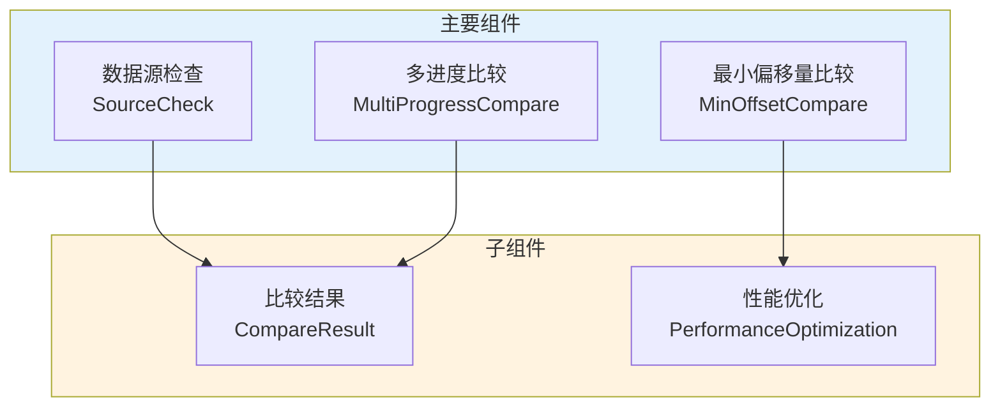

### 2.2 CompareProgress() 方法

`CompareProgress()` 是比较单个 hashId 进度的核心方法：

```cpp
// framework/Locator.cpp
LocatorCompareResult Locator::CompareProgress(const ProgressVector& pv1, 
                                               const ProgressVector& pv2) const
{
    // 1. 快速路径：如果 ProgressVector 为空
    if (pv1.empty()) {
        if (pv2.empty()) {
            return LCR_FULLY_FASTER;  // 都为空，认为相等
        }
        return LCR_SLOWER;  // pv1 为空，pv2 不为空，pv1 更慢
    }
    
    if (pv2.empty()) {
        return LCR_FULLY_FASTER;  // pv1 不为空，pv2 为空，pv1 更快
    }
    
    // 2. 比较每个 Progress
    bool hasPartialFaster = false;
    bool hasSlower = false;
    
    // 合并两个 ProgressVector，按 from 排序
    std::vector<std::pair<const Progress*, const Progress*>> pairs;
    // ... 合并逻辑 ...
    
    for (const auto& pair : pairs) {
        const Progress* p1 = pair.first;
        const Progress* p2 = pair.second;
        
        if (!p1) {
            // p1 没有该范围的 Progress，p2 有，p1 更慢
            hasSlower = true;
            continue;
        }
        
        if (!p2) {
            // p1 有该范围的 Progress，p2 没有，p1 部分更快
            hasPartialFaster = true;
            continue;
        }
        
        // 比较 offset
        if (p1->offset < p2->offset) {
            hasSlower = true;
            if (!hasPartialFaster) {
                return LCR_SLOWER;
            }
        } else if (p1->offset > p2->offset) {
            hasPartialFaster = true;
        } else {
            // 相等，继续检查下一个
            continue;
        }
    }
    
    // 3. 汇总结果
    if (hasPartialFaster && !hasSlower) {
        return LCR_PARTIAL_FASTER;
    }
    
    if (hasSlower) {
        return LCR_SLOWER;
    }
    
    return LCR_FULLY_FASTER;
}
```

### 2.3 比较结果的语义

Locator 比较结果的语义：

Locator 比较结果的语义：不同结果的含义和应用场景：

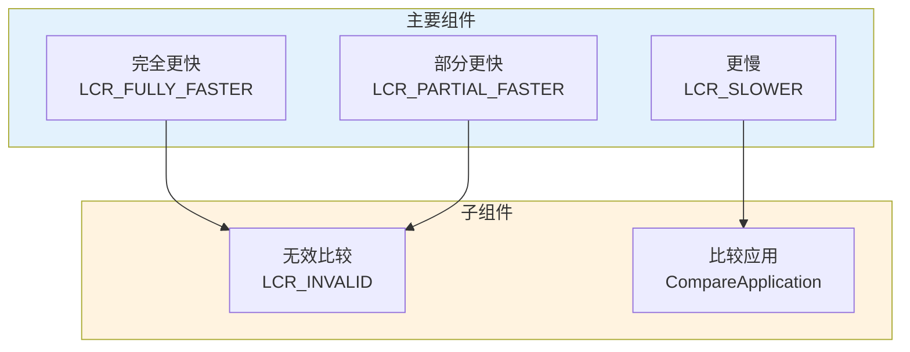

**比较结果详解**：

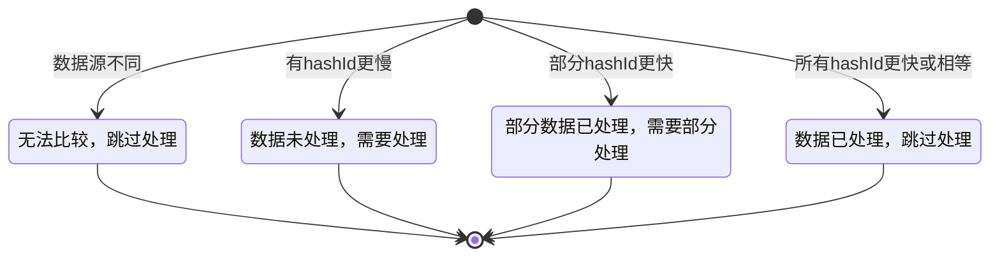

- **LCR_INVALID**：数据源不同，无法比较。这种情况下，应该跳过比较，或者使用其他方式判断
- **LCR_SLOWER**：比目标 Locator 慢，数据未处理。需要处理这些数据，更新 Locator
- **LCR_PARTIAL_FASTER**：部分 hashId 更快，需要部分处理。需要分别处理每个 hashId 的数据
- **LCR_FULLY_FASTER**：完全比目标 Locator 快（包括相等），数据已处理。可以跳过这些数据

### 2.4 多进度比较

多进度比较的实现：

多进度比较：比较 MultiProgress 中每个 hashId 的进度：

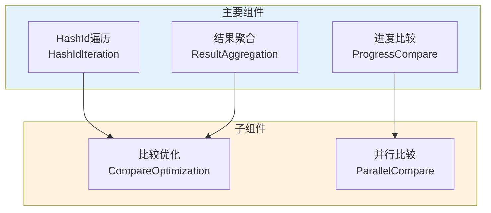

**多进度比较的序列图**：

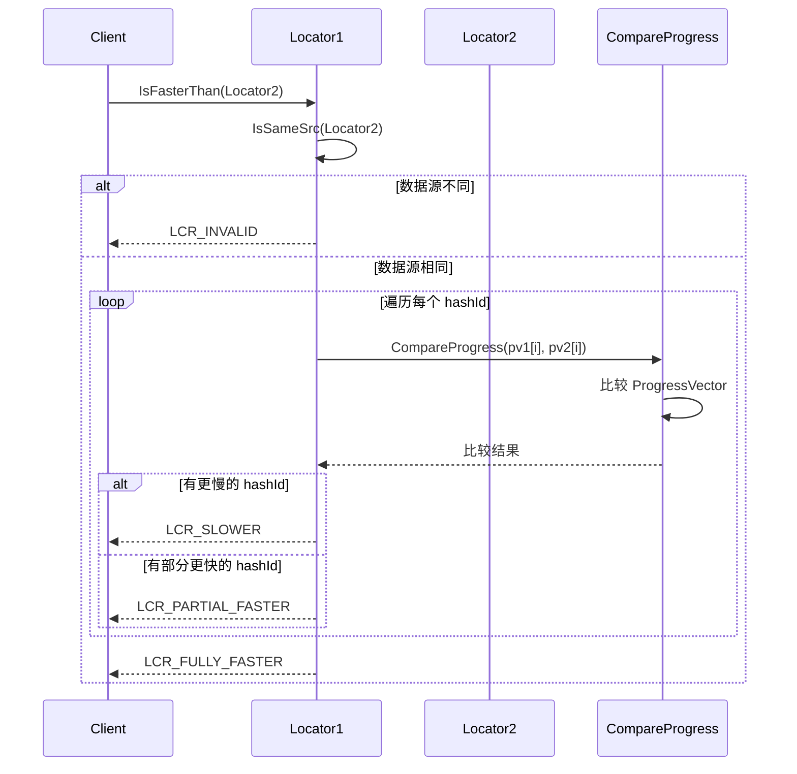

**比较流程详解**：
1. **遍历 MultiProgress**：遍历每个 hashId 的进度列表，按 hashId 顺序比较
2. **比较进度**：比较每个 hashId 的进度（timestamp 和 concurrentIdx），使用 `CompareProgress()` 方法
3. **汇总结果**：汇总所有 hashId 的比较结果，根据是否有更慢、部分更快等情况决定最终结果
4. **返回最终结果**：返回整体的比较结果，用于判断数据是否已处理

## 3. Locator 的更新机制

### 3.1 Update() 方法

`Update()` 方法用于更新 Locator，保证 Locator 只向前推进，不会回退。这是数据一致性保证的关键。让我们先通过流程图来理解更新的完整流程：

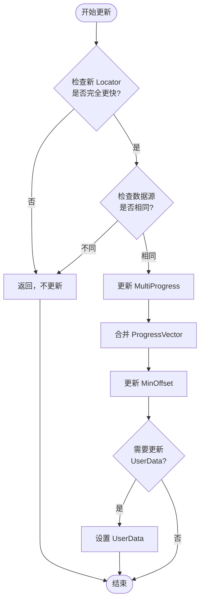

**Update() 的完整实现**：

```cpp
// framework/Locator.cpp
void Locator::Update(const Locator& other)
{
    // 1. 检查数据源是否相同
    if (!IsSameSrc(other)) {
        // 数据源不同，不更新
        return;
    }
    
    // 2. 检查新 Locator 是否完全更快
    auto result = other.IsFasterThan(*this);
    if (result != LCR_FULLY_FASTER) {
        // 新 Locator 不是完全更快，不更新
        // 这保证了 Locator 只向前推进，不会回退
        return;
    }
    
    // 3. 更新 MultiProgress
    // 合并两个 MultiProgress，保留更大的进度
    if (other._multiProgress.size() > _multiProgress.size()) {
        _multiProgress = other._multiProgress;
    } else {
        // 逐个 hashId 合并，保留更大的进度
        for (size_t i = 0; i < other._multiProgress.size(); ++i) {
            if (i >= _multiProgress.size()) {
                _multiProgress.push_back(other._multiProgress[i]);
            } else {
                // 合并 ProgressVector
                MergeProgressVector(_multiProgress[i], other._multiProgress[i]);
            }
        }
    }
    
    // 4. 更新 MinOffset
    UpdateMinOffset();
    
    // 5. 更新 UserData（如果新 Locator 有 UserData）
    if (!other._userData.empty()) {
        _userData = other._userData;
    }
}
```

**MergeProgressVector() 的实现**：

```cpp
// framework/Locator.cpp
void Locator::MergeProgressVector(ProgressVector& pv1, 
                                    const ProgressVector& pv2)
{
    // 合并两个 ProgressVector，保留更大的进度
    // 1. 按 from 排序
    std::sort(pv1.begin(), pv1.end(), 
              [](const Progress& a, const Progress& b) {
                  return a.from < b.from;
              });
    
    // 2. 合并重叠的 Progress
    ProgressVector merged;
    for (const auto& p : pv1) {
        bool merged = false;
        for (auto& m : merged) {
            if (m.from <= p.to && m.to >= p.from) {
                // 有重叠，合并
                m.from = std::min(m.from, p.from);
                m.to = std::max(m.to, p.to);
                if (p.offset > m.offset) {
                    m.offset = p.offset;  // 保留更大的进度
                }
                merged = true;
                break;
            }
        }
        if (!merged) {
            merged.push_back(p);
        }
    }
    
    // 3. 与 pv2 合并
    for (const auto& p : pv2) {
        bool merged = false;
        for (auto& m : merged) {
            if (m.from <= p.to && m.to >= p.from) {
                m.from = std::min(m.from, p.from);
                m.to = std::max(m.to, p.to);
                if (p.offset > m.offset) {
                    m.offset = p.offset;
                }
                merged = true;
                break;
            }
        }
        if (!merged) {
            merged.push_back(p);
        }
    }
    
    pv1 = merged;
}
```

**UpdateMinOffset() 的实现**：

```cpp
// framework/Locator.cpp
void Locator::UpdateMinOffset()
{
    if (_multiProgress.empty()) {
        _minOffset = Progress::INVALID_OFFSET;
        return;
    }
    
    // 找到所有 Progress 中最小的 offset
    Progress::Offset minOffset = Progress::MAX_OFFSET;
    for (const auto& pv : _multiProgress) {
        for (const auto& p : pv) {
            if (p.offset < minOffset) {
                minOffset = p.offset;
            }
        }
    }
    
    _minOffset = minOffset;
}
```

**更新机制的关键设计**：

1. **只向前推进**：只有当新 Locator 完全比当前 Locator 快时，才更新。这保证了 Locator 只向前推进，不会回退，是数据一致性保证的基础
2. **原子性更新**：更新操作是原子的，要么全部更新，要么全部不更新，不会出现部分更新的情况
3. **进度合并**：支持合并多个 Progress，保留更大的进度，支持并行处理和分片处理
4. **最小偏移量维护**：自动维护 `_minOffset`，用于快速判断整体进度

Update() 方法：更新 Locator 的实现逻辑：

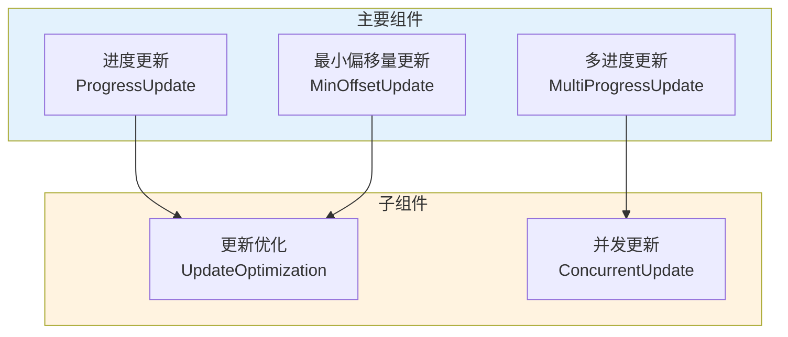

### 3.2 更新时机

Locator 的更新时机：

Locator 的更新时机：在数据处理完成后更新 Locator：

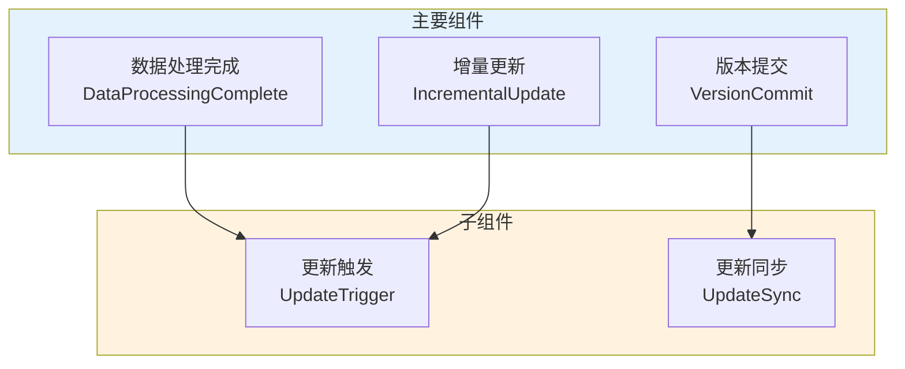

**更新时机的序列图**：

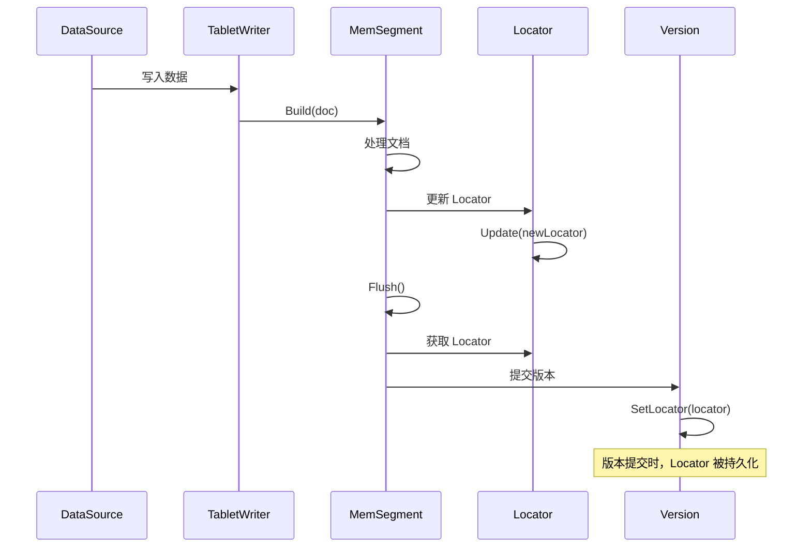

**更新时机详解**：

1. **数据处理完成**：处理完一批数据后更新 Locator
   - 在 `TabletWriter::Build()` 中，每处理完一批文档，更新 MemSegment 的 Locator
   - 保证 Locator 反映最新的数据处理位置
   
2. **Segment 构建完成**：Segment 构建完成后更新 Locator
   - 在 `MemSegment::Seal()` 中，Segment 构建完成后，更新 Locator
   - 保证 Locator 反映 Segment 的数据处理位置
   
3. **版本提交时**：版本提交时更新 Version 的 Locator
   - 在 `VersionCommitter::Commit()` 中，版本提交时，将 TabletWriter 的 Locator 设置到 Version 中
   - 保证 Version 的 Locator 反映该版本的数据处理位置
   
4. **增量更新时**：增量更新时更新 Locator，记录处理位置
   - 在增量更新流程中，处理完新数据后，更新 Locator
   - 保证下次增量更新时，可以正确判断哪些数据已处理

## 4. Locator 的序列化

### 4.1 Serialize() 方法

`Serialize()` 方法用于序列化 Locator，将 Locator 持久化到磁盘或网络传输。序列化格式需要支持版本兼容和向后兼容。让我们先通过流程图来理解序列化的完整流程：

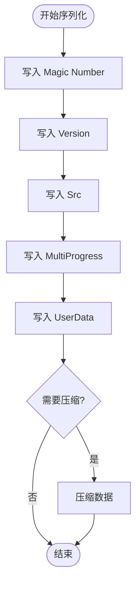

**Serialize() 的完整实现**：

```cpp
// framework/Locator.cpp
std::string Locator::Serialize() const
{
    // 1. 构建序列化缓冲区
    autil::DataBuffer buffer;
    
    // 2. 写入 Magic Number（用于验证）
    const uint32_t MAGIC_NUMBER = 0x4C4F4341;  // "LOCA"
    buffer.write(MAGIC_NUMBER);
    
    // 3. 写入 Version（用于兼容性）
    const uint32_t VERSION = 2;  // 当前版本
    buffer.write(VERSION);
    
    // 4. 写入 Src
    buffer.write(_src);
    
    // 5. 写入 MinOffset
    buffer.write(_minOffset.first);   // timestamp
    buffer.write(_minOffset.second);  // concurrentIdx
    
    // 6. 写入 MultiProgress
    buffer.write(static_cast<uint32_t>(_multiProgress.size()));
    for (const auto& pv : _multiProgress) {
        buffer.write(static_cast<uint32_t>(pv.size()));
        for (const auto& p : pv) {
            buffer.write(p.from);
            buffer.write(p.to);
            buffer.write(p.offset.first);   // timestamp
            buffer.write(p.offset.second); // concurrentIdx
        }
    }
    
    // 7. 写入 UserData
    buffer.write(static_cast<uint32_t>(_userData.size()));
    if (!_userData.empty()) {
        buffer.writeBytes(_userData.data(), _userData.size());
    }
    
    // 8. 写入 Legacy 标志
    buffer.write(static_cast<uint8_t>(_isLegacyLocator ? 1 : 0));
    
    // 9. 转换为字符串（可选：压缩）
    std::string result = buffer.toString();
    
    // 可选：压缩序列化数据
    if (result.size() > 1024) {  // 大于 1KB 时压缩
        result = Compress(result);
    }
    
    return result;
}
```

**序列化格式详解**：

1. **Magic Number**：魔数 `0x4C4F4341`（"LOCA"），用于验证数据格式是否正确
2. **Version**：版本号，用于兼容性。不同版本的 Locator 可能有不同的序列化格式
3. **Src**：数据源标识，8 字节
4. **MinOffset**：最小偏移量，包含 timestamp（8 字节）和 concurrentIdx（4 字节）
5. **MultiProgress**：
   - 先写入 hashId 数量（4 字节）
   - 对每个 hashId，写入 ProgressVector 大小（4 字节）
   - 对每个 Progress，写入 from（4 字节）、to（4 字节）、offset（8+4 字节）
6. **UserData**：用户数据，先写入大小（4 字节），再写入数据内容
7. **Legacy 标志**：是否遗留 Locator（1 字节）

Locator 的序列化：将 Locator 序列化为字符串：

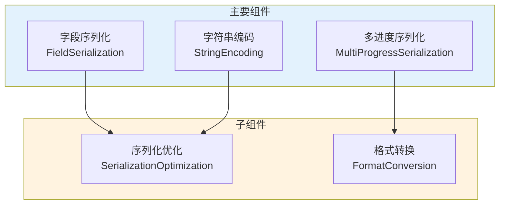

### 4.2 Deserialize() 方法

`Deserialize()` 方法用于反序列化 Locator，从字符串恢复 Locator 对象。需要支持版本兼容和向后兼容。让我们先通过流程图来理解反序列化的完整流程：

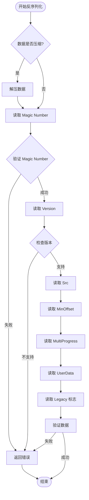

**Deserialize() 的完整实现**：

```cpp
// framework/Locator.cpp
Status Locator::Deserialize(const std::string& str)
{
    if (str.empty()) {
        return Status::InvalidArgs("Empty string");
    }
    
    // 1. 尝试解压（如果压缩了）
    std::string data = str;
    if (IsCompressed(str)) {
        auto status = Decompress(str, data);
        if (!status.IsOK()) {
            return status;
        }
    }
    
    // 2. 构建反序列化缓冲区
    autil::DataBuffer buffer(data.data(), data.size());
    
    // 3. 读取并验证 Magic Number
    uint32_t magic;
    if (!buffer.read(magic)) {
        return Status::InvalidArgs("Failed to read magic number");
    }
    if (magic != 0x4C4F4341) {
        return Status::InvalidArgs("Invalid magic number");
    }
    
    // 4. 读取 Version
    uint32_t version;
    if (!buffer.read(version)) {
        return Status::InvalidArgs("Failed to read version");
    }
    
    // 5. 根据版本选择解析方式
    if (version == 1) {
        return DeserializeV1(buffer);
    } else if (version == 2) {
        return DeserializeV2(buffer);
    } else {
        return Status::InvalidArgs("Unsupported version: " + std::to_string(version));
    }
}

Status Locator::DeserializeV2(autil::DataBuffer& buffer)
{
    // 1. 读取 Src
    if (!buffer.read(_src)) {
        return Status::InvalidArgs("Failed to read src");
    }
    
    // 2. 读取 MinOffset
    int64_t timestamp;
    uint32_t concurrentIdx;
    if (!buffer.read(timestamp) || !buffer.read(concurrentIdx)) {
        return Status::InvalidArgs("Failed to read min offset");
    }
    _minOffset = std::make_pair(timestamp, concurrentIdx);
    
    // 3. 读取 MultiProgress
    uint32_t multiProgressSize;
    if (!buffer.read(multiProgressSize)) {
        return Status::InvalidArgs("Failed to read multi progress size");
    }
    
    _multiProgress.clear();
    _multiProgress.reserve(multiProgressSize);
    
    for (uint32_t i = 0; i < multiProgressSize; ++i) {
        uint32_t pvSize;
        if (!buffer.read(pvSize)) {
            return Status::InvalidArgs("Failed to read progress vector size");
        }
        
        ProgressVector pv;
        pv.reserve(pvSize);
        
        for (uint32_t j = 0; j < pvSize; ++j) {
            uint32_t from, to;
            int64_t ts;
            uint32_t idx;
            if (!buffer.read(from) || !buffer.read(to) || 
                !buffer.read(ts) || !buffer.read(idx)) {
                return Status::InvalidArgs("Failed to read progress");
            }
            
            pv.emplace_back(from, to, std::make_pair(ts, idx));
        }
        
        _multiProgress.push_back(std::move(pv));
    }
    
    // 4. 读取 UserData
    uint32_t userDataSize;
    if (!buffer.read(userDataSize)) {
        return Status::InvalidArgs("Failed to read user data size");
    }
    
    if (userDataSize > 0) {
        _userData.resize(userDataSize);
        if (!buffer.readBytes(_userData.data(), userDataSize)) {
            return Status::InvalidArgs("Failed to read user data");
        }
    } else {
        _userData.clear();
    }
    
    // 5. 读取 Legacy 标志
    uint8_t legacyFlag;
    if (!buffer.read(legacyFlag)) {
        return Status::InvalidArgs("Failed to read legacy flag");
    }
    _isLegacyLocator = (legacyFlag != 0);
    
    // 6. 验证数据
    if (!IsValid()) {
        return Status::InvalidArgs("Invalid locator after deserialization");
    }
    
    return Status::OK();
}
```

**反序列化的关键设计**：

1. **版本兼容**：支持多个版本的 Locator 格式，通过版本号选择解析方式
2. **向后兼容**：新版本可以读取旧版本的 Locator，保证平滑升级
3. **数据验证**：反序列化后验证数据的有效性，确保 Locator 正确
4. **压缩支持**：支持压缩的序列化数据，减少存储空间和网络传输

Locator 的反序列化：从字符串反序列化为 Locator：

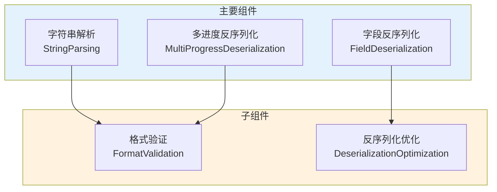

## 5. 数据一致性保证

数据一致性是 IndexLib 的核心保证，通过 Locator 实现数据不重复、不丢失，支持多数据源场景。让我们先通过流程图来理解数据一致性保证的完整机制：

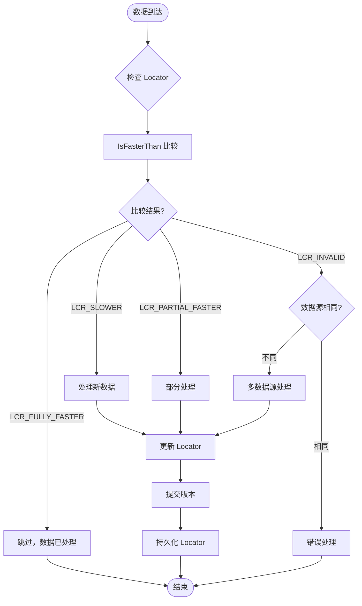

### 5.1 数据不重复保证

通过 Locator 保证数据不重复，这是增量更新的基础。让我们通过序列图来理解数据不重复保证的完整流程：

```mermaid
sequenceDiagram
    participant DataSource
    participant TabletWriter
    participant Locator
    participant MemSegment
    
    DataSource->>TabletWriter: 写入数据(doc)
    TabletWriter->>Locator: IsFasterThan(doc.locator)
    Locator->>Locator: 比较 MultiProgress
    alt 数据已处理 (LCR_FULLY_FASTER)
        Locator-->>TabletWriter: LCR_FULLY_FASTER
        TabletWriter->>TabletWriter: 跳过该文档
    else 数据未处理 (LCR_SLOWER)
        Locator-->>TabletWriter: LCR_SLOWER
        TabletWriter->>MemSegment: Build(doc)
        MemSegment->>MemSegment: 处理文档
        MemSegment->>Locator: Update(newLocator)
    else 部分已处理 (LCR_PARTIAL_FASTER)
        Locator-->>TabletWriter: LCR_PARTIAL_FASTER
        TabletWriter->>TabletWriter: 部分处理该文档
        TabletWriter->>MemSegment: Build(doc, partial)
    end
```

**数据不重复保证的实现**：

```cpp
// framework/TabletWriter.cpp
Status TabletWriter::Build(const Document& doc)
{
    // 1. 获取文档的 Locator
    Locator docLocator = doc.GetLocator();
    
    // 2. 检查数据是否已处理
    auto result = docLocator.IsFasterThan(_currentLocator);
    
    if (result == Locator::LCR_FULLY_FASTER) {
        // 数据已处理，跳过
        return Status::OK();
    }
    
    if (result == Locator::LCR_INVALID) {
        // 数据源不同，需要特殊处理
        return HandleDifferentSource(doc);
    }
    
    // 3. 处理新数据
    if (result == Locator::LCR_SLOWER) {
        // 数据未处理，正常处理
        return ProcessDocument(doc);
    }
    
    if (result == Locator::LCR_PARTIAL_FASTER) {
        // 部分数据已处理，需要部分处理
        return ProcessPartialDocument(doc);
    }
    
    return Status::OK();
}
```

**保证机制详解**：

1. **Locator 比较**：通过 `IsFasterThan()` 判断数据是否已处理
   - 如果返回 `LCR_FULLY_FASTER`，说明数据已处理，跳过
   - 如果返回 `LCR_SLOWER`，说明数据未处理，需要处理
   - 如果返回 `LCR_PARTIAL_FASTER`，说明部分数据已处理，需要部分处理
   
2. **跳过已处理数据**：如果数据已处理（LCR_FULLY_FASTER），则跳过，避免重复处理
   - 减少不必要的计算和存储开销
   - 保证数据不重复
   
3. **只处理新数据**：只处理未处理的数据（LCR_SLOWER），避免重复处理
   - 保证增量更新的正确性
   - 提高处理效率

数据不重复保证：通过 Locator 比较避免重复处理数据：

```mermaid
flowchart TD
    subgraph Main["主要组件"]
        A["Locator比较<br/>LocatorCompare"]
        B["重复检测<br/>DuplicateDetection"]
        C["跳过处理<br/>SkipProcessing"]
    end
    
    subgraph Sub["子组件"]
        D["一致性保证<br/>ConsistencyGuarantee"]
        E["性能优化<br/>PerformanceOptimization"]
    end
    
    A --> D
    B --> E
    C --> D
    
    style Main fill:#e3f2fd
    style Sub fill:#fff3e0
```

### 5.2 数据不丢失保证

通过 Locator 保证数据不丢失，这是数据可靠性的基础。让我们通过序列图来理解数据不丢失保证的完整流程：

```mermaid
sequenceDiagram
    participant DataSource
    participant TabletWriter
    participant MemSegment
    participant Locator
    participant Version
    participant Disk
    
    DataSource->>TabletWriter: 写入数据
    TabletWriter->>MemSegment: Build(doc)
    MemSegment->>MemSegment: 处理文档
    MemSegment->>Locator: Update(newLocator)
    Locator->>Locator: 更新 MultiProgress
    
    MemSegment->>MemSegment: Flush()
    MemSegment->>Locator: 获取 Locator
    MemSegment->>Version: 提交版本
    Version->>Version: SetLocator(locator)
    Version->>Disk: 持久化 Version
    
    Note over Disk: Locator 被持久化到磁盘
    
    alt 故障恢复
        Disk->>Version: 加载 Version
        Version->>Version: 获取 Locator
        Version->>TabletWriter: 设置 Locator
        TabletWriter->>DataSource: 从 Locator 位置继续处理
    end
```

**数据不丢失保证的实现**：

```cpp
// framework/VersionCommitter.cpp
Status VersionCommitter::Commit(const TabletData& tabletData,
                                 const Schema& schema,
                                 const CommitOptions& options)
{
    // 1. 获取 TabletWriter 的 Locator
    Locator currentLocator = tabletData.GetLocator();
    
    // 2. 创建新版本
    Version newVersion = CreateNewVersion(tabletData);
    
    // 3. 设置 Locator
    newVersion.SetLocator(currentLocator);
    
    // 4. 持久化版本
    auto status = WriteVersion(newVersion);
    if (!status.IsOK()) {
        return status;
    }
    
    // 5. 持久化 Locator（在 Version 中）
    // Locator 会被序列化并写入版本文件
    return Status::OK();
}
```

**保证机制详解**：

1. **记录处理位置**：通过 Locator 记录数据处理位置
   - 每次处理完数据后，更新 Locator
   - Locator 记录每个 hashId 的处理进度
   
2. **增量更新**：通过 Locator 实现增量更新，只处理新数据
   - 下次增量更新时，从 Locator 记录的位置继续处理
   - 保证数据不丢失
   
3. **故障恢复**：故障恢复时，通过 Locator 判断需要重新处理的数据
   - 加载故障前的版本，获取 Locator
   - 从 Locator 记录的位置继续处理，保证数据不丢失
   
4. **版本一致性**：通过 Version 的 Locator 保证版本数据的一致性
   - 每个版本都有对应的 Locator
   - 版本提交时，Locator 被持久化
   - 版本加载时，Locator 被恢复

数据不丢失保证：通过 Locator 记录处理位置，保证数据不丢失：

```mermaid
flowchart TD
    subgraph Main["主要组件"]
        A["位置记录<br/>PositionRecording"]
        B["进度追踪<br/>ProgressTracking"]
        C["恢复机制<br/>RecoveryMechanism"]
    end
    
    subgraph Sub["子组件"]
        D["数据完整性<br/>DataIntegrity"]
        E["故障恢复<br/>FaultRecovery"]
    end
    
    A --> D
    B --> E
    C --> D
    
    style Main fill:#e3f2fd
    style Sub fill:#fff3e0
```

### 5.3 多数据源一致性

多数据源场景下的数据一致性，通过 `_src` 和 `sourceIdx` 区分数据源，每个数据源有独立的 Locator。让我们通过类图来理解多数据源一致性的架构：

```mermaid
classDiagram
    class Version {
        - versionid_t _versionId
        - map_uint64_t_Locator _locators
        + GetLocator()
        + SetLocator()
        + GetAllLocators()
    }
    
    class Locator {
        - uint64_t _src
        - MultiProgress _multiProgress
        + IsFasterThan()
        + Update()
    }
    
    class TabletWriter {
        - map_uint64_t_Locator _locators
        + Build()
        + GetLocator()
    }
    
    class Document {
        + uint64_t _src
        + DocInfo _docInfo
        + GetLocator()
    }
    
    Version --> Locator : 包含多个
    TabletWriter --> Locator : 管理多个
    Document --> Locator : 包含
```

**多数据源一致性的实现**：

```cpp
// framework/Version.h
class Version
{
private:
    std::map<uint64_t, Locator> _locators;  // 每个数据源的 Locator
    
public:
    Locator GetLocator(uint64_t src) const {
        auto it = _locators.find(src);
        if (it != _locators.end()) {
            return it->second;
        }
        return Locator(src);  // 返回空的 Locator
    }
    
    void SetLocator(uint64_t src, const Locator& locator) {
        _locators[src] = locator;
    }
    
    const std::map<uint64_t, Locator>& GetAllLocators() const {
        return _locators;
    }
};
```

**保证机制详解**：

1. **数据源标识**：通过 `_src` 和 `sourceIdx` 区分数据源
   - 每个数据源有唯一的 `_src`
   - 文档中的 `sourceIdx` 标识数据来源
   
2. **独立 Locator**：每个数据源有独立的 Locator
   - Version 中维护多个 Locator，每个数据源一个
   - 不同数据源的 Locator 互不干扰
   
3. **独立处理**：每个数据源独立处理，互不干扰
   - 处理数据时，根据文档的 `_src` 选择对应的 Locator
   - 不同数据源的数据可以并行处理
   
4. **统一管理**：通过 Version 统一管理所有数据源的 Locator
   - 版本提交时，所有数据源的 Locator 都被持久化
   - 版本加载时，所有数据源的 Locator 都被恢复

多数据源一致性：通过 sourceIdx 区分数据源，保证多数据源场景的数据一致性：

```mermaid
flowchart TD
    subgraph Main["主要组件"]
        A["数据源区分<br/>SourceDistinction"]
        B["独立追踪<br/>IndependentTracking"]
        C["一致性保证<br/>ConsistencyGuarantee"]
    end
    
    subgraph Sub["子组件"]
        D["多源管理<br/>MultiSourceManagement"]
        E["隔离机制<br/>IsolationMechanism"]
    end
    
    A --> D
    B --> E
    C --> D
    
    style Main fill:#e3f2fd
    style Sub fill:#fff3e0
```

## 6. Locator 的高级特性

### 6.1 分片处理支持

Locator 支持分片处理：

分片处理支持：通过 hashId 支持分片处理：

```mermaid
flowchart TD
    subgraph Main["主要组件"]
        A["HashId分片<br/>HashIdSharding"]
        B["并行处理<br/>ParallelProcessing"]
        C["进度追踪<br/>ProgressTracking"]
    end
    
    subgraph Sub["子组件"]
        D["分片管理<br/>ShardManagement"]
        E["负载均衡<br/>LoadBalancing"]
    end
    
    A --> D
    B --> E
    C --> D
    
    style Main fill:#e3f2fd
    style Sub fill:#fff3e0
```

**分片机制**：
- **HashId 范围**：通过 Progress 的 from/to 定义 HashId 范围
- **独立进度**：每个 HashId 范围有独立的进度
- **并行处理**：不同 HashId 范围可以并行处理
- **进度追踪**：通过 MultiProgress 追踪每个 HashId 范围的进度

### 6.2 并发控制

Locator 支持并发控制：

并发控制：通过 concurrentIdx 处理时间戳相同的情况：

```mermaid
flowchart TD
    subgraph Main["主要组件"]
        A["并发索引<br/>ConcurrentIndex"]
        B["时间戳处理<br/>TimestampProcessing"]
        C["顺序保证<br/>OrderGuarantee"]
    end
    
    subgraph Sub["子组件"]
        D["并发管理<br/>ConcurrencyManagement"]
        E["冲突解决<br/>ConflictResolution"]
    end
    
    A --> D
    B --> E
    C --> D
    
    style Main fill:#e3f2fd
    style Sub fill:#fff3e0
```

**并发机制**：
- **Timestamp**：时间戳，记录数据的时间位置
- **ConcurrentIdx**：并发索引，处理时间戳相同的情况
- **两级定位**：通过 timestamp 和 concurrentIdx 两级定位，保证顺序性
- **并发安全**：Locator 的比较和更新支持并发，保证线程安全

### 6.3 用户数据支持

Locator 支持用户数据：

用户数据支持：通过 _userData 存储自定义信息：

```mermaid
flowchart TD
    subgraph Main["主要组件"]
        A["用户数据存储<br/>UserDataStorage"]
        B["自定义信息<br/>CustomInformation"]
        C["业务扩展<br/>BusinessExtension"]
    end
    
    subgraph Sub["子组件"]
        D["数据管理<br/>DataManagement"]
        E["扩展支持<br/>ExtensionSupport"]
    end
    
    A --> D
    B --> E
    C --> D
    
    style Main fill:#e3f2fd
    style Sub fill:#fff3e0
```

**用户数据机制**：
- **自定义信息**：通过 `_userData` 存储自定义信息
- **序列化支持**：用户数据会序列化到 Locator 中
- **查询支持**：可以通过 `GetUserData()` 获取用户数据
- **灵活扩展**：支持存储任意字符串数据

## 7. Locator 的实际应用

### 7.1 实时写入场景

在实时写入场景中，Locator 的应用：

实时写入场景中的 Locator：通过 Locator 判断数据是否已处理：

```mermaid
flowchart TD
    subgraph Main["主要组件"]
        A["实时判断<br/>RealTimeJudgment"]
        B["数据检查<br/>DataCheck"]
        C["处理决策<br/>ProcessingDecision"]
    end
    
    subgraph Sub["子组件"]
        D["增量处理<br/>IncrementalProcessing"]
        E["性能优化<br/>PerformanceOptimization"]
    end
    
    A --> D
    B --> E
    C --> D
    
    style Main fill:#e3f2fd
    style Sub fill:#fff3e0
```

**应用流程**：
1. **接收数据**：实时接收数据流
2. **检查 Locator**：通过 `IsFasterThan()` 判断数据是否已处理
3. **处理新数据**：只处理未处理的数据
4. **更新 Locator**：处理完成后更新 Locator
5. **提交版本**：定期提交版本，更新 Version 的 Locator

### 7.2 批量更新场景

在批量更新场景中，Locator 的应用：

批量更新场景中的 Locator：批量处理数据，避免重复处理：

```mermaid
flowchart TD
    subgraph Main["主要组件"]
        A["批量处理<br/>BatchProcessing"]
        B["重复检测<br/>DuplicateDetection"]
        C["批量更新<br/>BatchUpdate"]
    end
    
    subgraph Sub["子组件"]
        D["效率优化<br/>EfficiencyOptimization"]
        E["一致性保证<br/>ConsistencyGuarantee"]
    end
    
    A --> D
    B --> E
    C --> D
    
    style Main fill:#e3f2fd
    style Sub fill:#fff3e0
```

**应用流程**：
1. **读取数据源**：从数据源批量读取数据
2. **检查 Locator**：通过 `IsFasterThan()` 判断哪些数据已处理
3. **过滤已处理数据**：过滤掉已处理的数据
4. **处理新数据**：只处理未处理的数据
5. **更新 Locator**：处理完成后更新 Locator
6. **提交版本**：批量处理完成后提交版本

### 7.3 故障恢复场景

在故障恢复场景中，Locator 的应用：

故障恢复场景中的 Locator：通过 Locator 判断需要重新处理的数据：

```mermaid
flowchart TD
    subgraph Main["主要组件"]
        A["故障检测<br/>FaultDetection"]
        B["位置恢复<br/>PositionRecovery"]
        C["数据重处理<br/>DataReprocessing"]
    end
    
    subgraph Sub["子组件"]
        D["恢复策略<br/>RecoveryStrategy"]
        E["数据完整性<br/>DataIntegrity"]
    end
    
    A --> D
    B --> E
    C --> D
    
    style Main fill:#e3f2fd
    style Sub fill:#fff3e0
```

**应用流程**：
1. **加载版本**：加载故障前的版本，获取 Locator
2. **读取数据源**：从数据源读取数据
3. **检查 Locator**：通过 `IsFasterThan()` 判断哪些数据已处理
4. **重新处理**：只重新处理未处理的数据
5. **更新 Locator**：处理完成后更新 Locator
6. **提交版本**：恢复完成后提交版本

## 8. Locator 的性能优化

Locator 的性能直接影响增量更新的效率，需要从比较、更新、序列化等多个方面进行优化。让我们先通过流程图来理解性能优化的整体策略：

```mermaid
flowchart TD
    Start([性能优化]) --> CompareOpt[比较优化]
    CompareOpt --> FastPath[快速路径]
    CompareOpt --> Cache[结果缓存]
    CompareOpt --> Parallel[并行比较]
    
    Start --> UpdateOpt[更新优化]
    UpdateOpt --> Atomic[原子更新]
    UpdateOpt --> Merge[进度合并]
    
    Start --> SerializeOpt[序列化优化]
    SerializeOpt --> Compact[紧凑格式]
    SerializeOpt --> Compress[压缩支持]
    SerializeOpt --> Batch[批量序列化]
    
    Start --> MemoryOpt[内存优化]
    MemoryOpt --> Pool[对象池]
    MemoryOpt --> Reuse[对象复用]
    
    FastPath --> End([优化完成])
    Cache --> End
    Parallel --> End
    Atomic --> End
    Merge --> End
    Compact --> End
    Compress --> End
    Batch --> End
    Pool --> End
    Reuse --> End
```

### 8.1 比较性能优化

Locator 比较是增量更新的核心操作，需要优化比较算法，提高比较效率。让我们通过流程图来理解比较优化的策略：

```mermaid
flowchart TD
    Start([开始比较]) --> CheckCache{检查缓存}
    CheckCache -->|命中| ReturnCache[返回缓存结果]
    CheckCache -->|未命中| CheckSrc{检查数据源}
    CheckSrc -->|不同| ReturnInvalid[返回 LCR_INVALID]
    CheckSrc -->|相同| CheckEmpty{检查是否为空}
    CheckEmpty -->|都为空| ReturnEqual[返回 LCR_FULLY_FASTER]
    CheckEmpty -->|不同| CheckSize{比较大小}
    CheckSize -->|this.size > other.size| ReturnPartial[返回 LCR_PARTIAL_FASTER]
    CheckSize -->|相等| CompareEach[逐个比较]
    CompareEach --> ShortCircuit{短路优化}
    ShortCircuit -->|有更慢的| ReturnSlower[返回 LCR_SLOWER]
    ShortCircuit -->|继续| CompareEach
    CompareEach --> UpdateCache[更新缓存]
    UpdateCache --> End([结束])
    ReturnCache --> End
    ReturnInvalid --> End
    ReturnEqual --> End
    ReturnPartial --> End
    ReturnSlower --> End
```

**比较性能优化的实现**：

```cpp
// framework/Locator.cpp
class LocatorCompareCache
{
private:
    struct CacheKey {
        uint64_t src1, src2;
        size_t hash1, hash2;
        
        bool operator==(const CacheKey& other) const {
            return src1 == other.src1 && src2 == other.src2 &&
                   hash1 == other.hash1 && hash2 == other.hash2;
        }
    };
    
    struct CacheValue {
        LocatorCompareResult result;
        std::chrono::steady_clock::time_point timestamp;
    };
    
    std::unordered_map<CacheKey, CacheValue> _cache;
    static constexpr size_t MAX_CACHE_SIZE = 1000;
    static constexpr auto CACHE_TTL = std::chrono::minutes(5);
    
public:
    std::optional<LocatorCompareResult> Get(const Locator& l1, const Locator& l2) {
        CacheKey key = MakeKey(l1, l2);
        auto it = _cache.find(key);
        if (it != _cache.end()) {
            auto now = std::chrono::steady_clock::now();
            if (now - it->second.timestamp < CACHE_TTL) {
                return it->second.result;
            }
            _cache.erase(it);
        }
        return std::nullopt;
    }
    
    void Put(const Locator& l1, const Locator& l2, LocatorCompareResult result) {
        if (_cache.size() >= MAX_CACHE_SIZE) {
            // 清理过期项
            CleanExpired();
        }
        CacheKey key = MakeKey(l1, l2);
        _cache[key] = {result, std::chrono::steady_clock::now()};
    }
};
```

**优化策略详解**：

1. **快速路径优化**：
   - 数据源不同时，直接返回 `LCR_INVALID`，避免遍历 Progress
   - MultiProgress 为空时，快速判断，避免不必要的比较
   - 大小不同时，快速判断部分更快或更慢
   
2. **短路优化**：
   - 如果某个 hashId 更慢，且没有部分更快，立即返回 `LCR_SLOWER`
   - 不需要继续比较后续 hashId，减少比较次数
   
3. **缓存优化**：
   - 比较结果可以缓存，避免重复计算
   - 对于相同的 Locator 对，直接返回缓存结果
   - 使用 LRU 缓存策略，限制缓存大小
   
4. **位运算优化**：
   - 使用位运算优化 Progress 的比较
   - 减少比较开销，提高比较性能

Locator 比较的性能优化：优化比较算法，提高比较效率：

```mermaid
flowchart TD
    subgraph Main["主要组件"]
        A["快速路径<br/>FastPath"]
        B["最小偏移量优化<br/>MinOffsetOptimization"]
        C["位运算优化<br/>BitwiseOptimization"]
    end
    
    subgraph Sub["子组件"]
        D["比较缓存<br/>CompareCache"]
        E["性能调优<br/>PerformanceTuning"]
    end
    
    A --> D
    B --> E
    C --> D
    
    style Main fill:#e3f2fd
    style Sub fill:#fff3e0
```

### 8.2 序列化性能优化

Locator 序列化的性能优化，包括格式优化、压缩支持、批量序列化等。让我们通过流程图来理解序列化优化的策略：

```mermaid
flowchart TD
    Start([开始序列化]) --> CheckSize{检查大小}
    CheckSize -->|小于阈值| Serialize[直接序列化]
    CheckSize -->|大于阈值| Compress[压缩后序列化]
    Serialize --> WriteMagic[写入 Magic Number]
    Compress --> WriteMagic
    WriteMagic --> WriteVersion[写入 Version]
    WriteVersion --> WriteData[写入数据]
    WriteData --> CompactFormat[使用紧凑格式]
    CompactFormat --> End([结束])
```

**序列化性能优化的实现**：

```cpp
// framework/Locator.cpp
std::string Locator::Serialize() const
{
    // 1. 估算序列化大小
    size_t estimatedSize = EstimateSize();
    
    // 2. 选择序列化策略
    if (estimatedSize < 1024) {
        // 小数据，直接序列化
        return SerializeDirect();
    } else {
        // 大数据，压缩后序列化
        return SerializeCompressed();
    }
}

std::string Locator::SerializeCompressed() const
{
    // 1. 先序列化
    std::string data = SerializeDirect();
    
    // 2. 压缩
    std::string compressed = Compress(data);
    
    // 3. 添加压缩标志
    autil::DataBuffer buffer;
    buffer.write(static_cast<uint8_t>(1));  // 压缩标志
    buffer.write(static_cast<uint32_t>(compressed.size()));
    buffer.writeBytes(compressed.data(), compressed.size());
    
    return buffer.toString();
}
```

**优化策略详解**：

1. **紧凑格式**：使用紧凑的序列化格式，减少序列化大小
   - 使用变长编码（VarInt）编码整数
   - 合并相邻的 Progress，减少存储空间
   - 使用位图压缩 MultiProgress
   
2. **压缩支持**：支持压缩序列化数据，减少存储空间
   - 对于大于 1KB 的数据，使用压缩
   - 使用 LZ4 或 Snappy 等快速压缩算法
   - 压缩标志存储在序列化数据中
   
3. **批量序列化**：支持批量序列化，提高序列化效率
   - 批量序列化多个 Locator，减少开销
   - 使用对象池复用缓冲区
   
4. **版本兼容**：支持版本兼容，平滑升级
   - 新版本可以读取旧版本的 Locator
   - 旧版本可以读取新版本的 Locator（如果兼容）

Locator 序列化的性能优化：优化序列化格式，提高序列化效率：

```mermaid
flowchart TD
    subgraph Main["主要组件"]
        A["格式优化<br/>FormatOptimization"]
        B["压缩优化<br/>CompressionOptimization"]
        C["版本兼容<br/>VersionCompatibility"]
    end
    
    subgraph Sub["子组件"]
        D["序列化缓存<br/>SerializationCache"]
        E["性能调优<br/>PerformanceTuning"]
    end
    
    A --> D
    B --> E
    C --> D
    
    style Main fill:#e3f2fd
    style Sub fill:#fff3e0
```

### 8.3 内存优化

Locator 的内存优化，包括对象池、对象复用等。让我们通过类图来理解内存优化的架构：

```mermaid
classDiagram
    class LocatorPool {
        - queue_Locator _pool
        - mutex _mutex
        + Get()
        + Put()
        + Clear()
    }
    
    class Locator {
        - uint64_t _src
        - MultiProgress _multiProgress
        - string _userData
        + Reset()
        + Reuse()
    }
    
    class ProgressPool {
        - queue_ProgressVector _pool
        + Get()
        + Put()
    }
    
    LocatorPool --> Locator : 管理
    ProgressPool --> ProgressVector : 管理
```

**内存优化的实现**：

```cpp
// framework/LocatorPool.h
class LocatorPool
{
private:
    std::queue<Locator*> _pool;
    std::mutex _mutex;
    static constexpr size_t MAX_POOL_SIZE = 100;
    
public:
    Locator* Get() {
        std::lock_guard<std::mutex> lock(_mutex);
        if (!_pool.empty()) {
            Locator* locator = _pool.front();
            _pool.pop();
            locator->Reset();  // 重置状态
            return locator;
        }
        return new Locator();
    }
    
    void Put(Locator* locator) {
        if (!locator) return;
        std::lock_guard<std::mutex> lock(_mutex);
        if (_pool.size() < MAX_POOL_SIZE) {
            locator->Reset();
            _pool.push(locator);
        } else {
            delete locator;
        }
    }
};
```

**内存优化策略**：

1. **对象池**：使用对象池复用 Locator 对象，减少内存分配
   - 限制池大小，避免内存泄漏
   - 线程安全，支持并发访问
   
2. **对象复用**：复用 Locator 对象，减少构造和析构开销
   - 重置状态，而不是重新构造
   - 复用 MultiProgress，减少内存分配
   
3. **内存预分配**：预分配内存，减少动态分配
   - 预分配 MultiProgress 的容量
   - 预分配 UserData 的容量

## 9. Locator 的关键设计

Locator 的设计遵循简单、高效、可靠、可扩展的原则，是 IndexLib 数据一致性保证的基础。让我们先通过类图来理解 Locator 的整体设计：

```mermaid
classDiagram
    class LocatorDesign {
        <<设计原则>>
        +简单性
        +高效性
        +可靠性
        +扩展性
    }
    
    class Locator {
        - uint64_t _src
        - MultiProgress _multiProgress
        + IsFasterThan()
        + Update()
        + Serialize()
    }
    
    class Compatibility {
        +遗留Locator支持
        +版本兼容
        +平滑升级
        +向后兼容
    }
    
    class ThreadSafety {
        +原子操作
        +无锁设计
        +读写分离
        +并发控制
    }
    
    LocatorDesign --> Locator : 指导
    Locator --> Compatibility : 支持
    Locator --> ThreadSafety : 保证
```

### 9.1 设计原则

Locator 的设计遵循以下核心原则，确保简单、高效、可靠、可扩展：

Locator 的设计原则：简单、高效、可靠的设计原则：

```mermaid
flowchart TD
    subgraph Main["主要组件"]
        A["简单设计<br/>SimpleDesign"]
        B["高效实现<br/>EfficientImplementation"]
        C["可靠保证<br/>ReliableGuarantee"]
    end
    
    subgraph Sub["子组件"]
        D["可扩展性<br/>Extensibility"]
        E["易用性<br/>Usability"]
    end
    
    A --> D
    B --> E
    C --> D
    
    style Main fill:#e3f2fd
    style Sub fill:#fff3e0
```

**设计原则详解**：

1. **简单性**：设计简单，易于理解和实现
   - **清晰的接口**：`IsFasterThan()` 和 `Update()` 接口清晰，易于使用
   - **直观的语义**：比较结果语义直观，易于理解
   - **最小化依赖**：最小化外部依赖，降低复杂度
   
2. **高效性**：比较和更新操作高效，不影响性能
   - **快速路径**：常见情况使用快速路径，减少开销
   - **短路优化**：尽早返回结果，减少不必要的计算
   - **缓存优化**：缓存比较结果，避免重复计算
   
3. **可靠性**：保证数据一致性，不重复、不丢失
   - **只向前推进**：Locator 只向前推进，不会回退
   - **原子性更新**：更新操作是原子的，保证一致性
   - **持久化支持**：支持序列化和反序列化，保证持久化
   
4. **扩展性**：支持多数据源、分片处理等扩展功能
   - **多数据源支持**：通过 `_src` 和 `sourceIdx` 支持多数据源
   - **分片处理支持**：通过 MultiProgress 支持分片处理
   - **用户数据支持**：通过 `_userData` 支持业务扩展

### 9.2 兼容性设计

Locator 的兼容性设计，支持遗留 Locator 和版本兼容，保证平滑升级。让我们通过流程图来理解兼容性设计的机制：

```mermaid
flowchart TD
    Start([加载 Locator]) --> CheckVersion{检查版本}
    CheckVersion -->|版本1| DeserializeV1[反序列化 V1]
    CheckVersion -->|版本2| DeserializeV2[反序列化 V2]
    CheckVersion -->|未知版本| Error[返回错误]
    DeserializeV1 --> CheckLegacy{检查 Legacy 标志}
    DeserializeV2 --> CheckLegacy
    CheckLegacy -->|是| ConvertLegacy[转换为新格式]
    CheckLegacy -->|否| Validate[验证数据]
    ConvertLegacy --> Validate
    Validate -->|失败| Error
    Validate -->|成功| End([结束])
    Error --> End
```

**兼容性机制详解**：

1. **遗留 Locator 支持**：支持遗留 Locator，通过 `_isLegacyLocator` 标识
   - 遗留 Locator 使用旧的格式，需要转换为新格式
   - 转换过程是透明的，用户无感知
   - 保证向后兼容，旧数据可以正常使用
   
2. **版本兼容**：支持不同版本的 Locator，通过版本号区分
   - 版本 1：旧格式，支持基本的 Locator 功能
   - 版本 2：新格式，支持 MultiProgress 和 UserData
   - 新版本可以读取旧版本，保证平滑升级
   
3. **平滑升级**：支持平滑升级，不影响已有数据
   - 升级过程中，旧版本的 Locator 可以正常使用
   - 新版本的 Locator 可以读取旧版本的数据
   - 升级完成后，逐步迁移到新格式
   
4. **向后兼容**：保证向后兼容，旧版本可以读取新版本数据
   - 新版本的 Locator 包含版本信息
   - 旧版本可以识别新版本，并跳过不支持的字段
   - 保证数据不会因为版本升级而丢失

Locator 的兼容性设计：支持遗留 Locator 和版本兼容：

```mermaid
flowchart TD
    subgraph Main["主要组件"]
        A["遗留Locator支持<br/>LegacyLocatorSupport"]
        B["版本兼容<br/>VersionCompatibility"]
        C["向后兼容<br/>BackwardCompatibility"]
    end
    
    subgraph Sub["子组件"]
        D["兼容性检查<br/>CompatibilityCheck"]
        E["平滑升级<br/>SmoothUpgrade"]
    end
    
    A --> D
    B --> E
    C --> D
    
    style Main fill:#e3f2fd
    style Sub fill:#fff3e0
```

### 9.3 线程安全设计

Locator 的线程安全设计，支持并发访问，保证线程安全。让我们通过序列图来理解线程安全设计的机制：

```mermaid
sequenceDiagram
    participant Thread1
    participant Thread2
    participant Locator
    participant Lock
    
    Thread1->>Locator: IsFasterThan(other)
    Thread2->>Locator: Update(newLocator)
    
    alt 读操作 (IsFasterThan)
        Locator->>Locator: 只读访问
        Note over Locator: 无锁，线程安全
        Locator-->>Thread1: 返回结果
    else 写操作 (Update)
        Thread2->>Lock: 获取锁
        Lock->>Locator: 更新 MultiProgress
        Locator->>Locator: 原子更新
        Lock-->>Thread2: 释放锁
        Locator-->>Thread2: 更新完成
    end
```

**线程安全机制详解**：

1. **原子操作**：使用原子操作保证线程安全
   - `IsFasterThan()` 是只读操作，不需要锁
   - `Update()` 是写操作，需要锁保护
   - 使用 `std::atomic` 保证基本类型的原子性
   
2. **无锁设计**：尽可能使用无锁设计，提高并发性能
   - 读操作无锁，支持并发读取
   - 写操作使用细粒度锁，减少锁竞争
   - 使用读写锁，支持多读单写
   
3. **读写分离**：支持读写分离，提高并发度
   - 读操作可以并发执行，不需要锁
   - 写操作需要互斥，保证一致性
   - 使用 `std::shared_mutex` 实现读写分离
   
4. **并发控制**：通过 concurrentIdx 支持并发控制
   - `concurrentIdx` 处理时间戳相同的情况
   - 支持并发写入，保证顺序性
   - 通过两级定位（timestamp + concurrentIdx）保证唯一性

**线程安全实现的示例**：

```cpp
// framework/Locator.cpp
class Locator
{
private:
    mutable std::shared_mutex _mutex;  // 读写锁
    uint64_t _src;
    MultiProgress _multiProgress;
    
public:
    // 读操作：使用共享锁
    LocatorCompareResult IsFasterThan(const Locator& other) const {
        std::shared_lock<std::shared_mutex> lock(_mutex);
        // 只读操作，不需要互斥锁
        return IsFasterThanImpl(other);
    }
    
    // 写操作：使用独占锁
    void Update(const Locator& other) {
        std::unique_lock<std::shared_mutex> lock(_mutex);
        // 写操作，需要互斥锁
        UpdateImpl(other);
    }
};
```

Locator 的线程安全设计：支持并发访问，保证线程安全：

```mermaid
flowchart TD
    subgraph Main["主要组件"]
        A["并发访问<br/>ConcurrentAccess"]
        B["线程安全<br/>ThreadSafety"]
        C["锁机制<br/>LockMechanism"]
    end
    
    subgraph Sub["子组件"]
        D["原子操作<br/>AtomicOperation"]
        E["同步机制<br/>SynchronizationMechanism"]
    end
    
    A --> D
    B --> E
    C --> D
    
    style Main fill:#e3f2fd
    style Sub fill:#fff3e0
```

## 10. 小结

Locator 与数据一致性是 IndexLib 的核心功能，通过 Locator 实现增量更新和数据一致性保证。通过本文的深入解析，我们了解到：

**关键要点**：
- **Locator 结构**：包含数据源标识、多进度信息、用户数据等关键字段
- **比较逻辑**：通过 `IsFasterThan()` 判断数据是否已处理，支持多种比较结果
- **更新机制**：通过 `Update()` 更新 Locator，保证只向前推进
- **序列化支持**：支持序列化和反序列化，持久化到磁盘
- **数据一致性保证**：通过 Locator 保证数据不重复、不丢失，支持多数据源场景
- **高级特性**：支持分片处理、并发控制、用户数据等高级特性
- **性能优化**：通过算法优化、格式优化等策略提高性能
- **设计原则**：简单、高效、可靠、可扩展的设计原则

理解 Locator 与数据一致性，是掌握 IndexLib 数据管理机制的关键。在下一篇文章中，我们将深入介绍文件系统抽象与存储格式的实现细节。
