在上一篇文章中，我们深入了解了索引类型的实现。本文将继续深入，详细解析 Locator 的实现细节和数据一致性保证机制，这是理解 IndexLib 如何保证数据不重复、不丢失的关键。

Locator 与数据一致性概览：从 Locator 结构到数据一致性保证的完整机制：

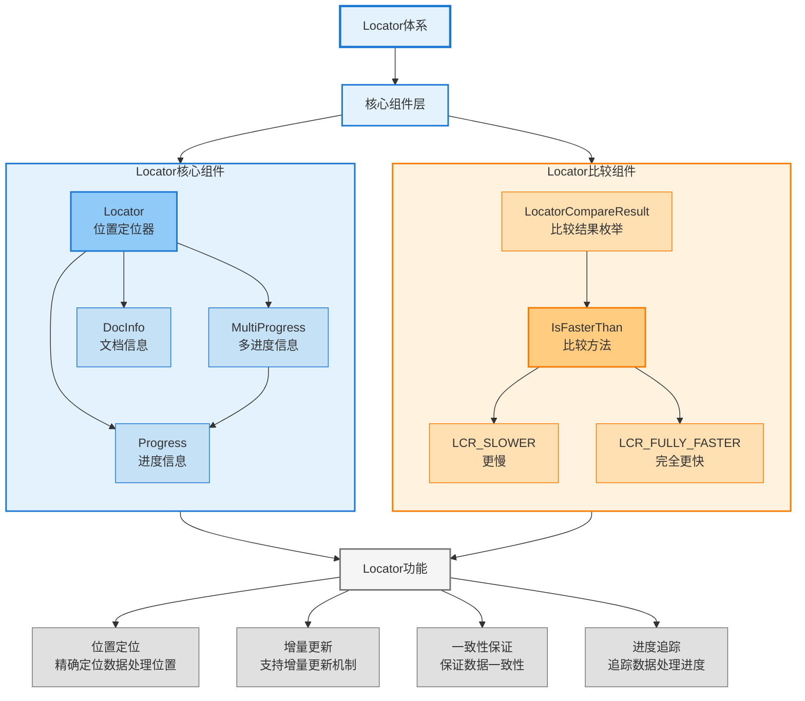
```mermaid
flowchart TD
    Start[Locator体系] --> CoreLayer[核心组件层]
    
    subgraph LocatorGroup["Locator核心组件"]
        direction TB
        L1[Locator<br/>位置定位器]
        L2[Progress<br/>进度信息]
        L3[MultiProgress<br/>多进度信息]
        L4[DocInfo<br/>文档信息]
        L1 --> L2
        L1 --> L3
        L1 --> L4
        L3 --> L2
    end
    
    subgraph CompareGroup["Locator比较组件"]
        direction TB
        C1[LocatorCompareResult<br/>比较结果枚举]
        C2[IsFasterThan<br/>比较方法]
        C3[LCR_SLOWER<br/>更慢]
        C4[LCR_FULLY_FASTER<br/>完全更快]
        C1 --> C2
        C2 --> C3
        C2 --> C4
    end
    
    CoreLayer --> LocatorGroup
    CoreLayer --> CompareGroup
    
    LocatorGroup --> Function[Locator功能]
    CompareGroup --> Function
    
    Function --> F1[位置定位<br/>精确定位数据处理位置]
    Function --> F2[增量更新<br/>支持增量更新机制]
    Function --> F3[一致性保证<br/>保证数据一致性]
    Function --> F4[进度追踪<br/>追踪数据处理进度]
    
    style Start fill:#e3f2fd,stroke:#1976d2,stroke-width:3px
    style CoreLayer fill:#e3f2fd,stroke:#1976d2,stroke-width:2px
    style LocatorGroup fill:#e3f2fd,stroke:#1976d2,stroke-width:2px
    style L1 fill:#90caf9,stroke:#1976d2,stroke-width:2px
    style L2 fill:#c5e1f5,stroke:#1976d2,stroke-width:1px
    style L3 fill:#c5e1f5,stroke:#1976d2,stroke-width:1px
    style L4 fill:#c5e1f5,stroke:#1976d2,stroke-width:1px
    style CompareGroup fill:#fff3e0,stroke:#f57c00,stroke-width:2px
    style C1 fill:#ffe0b2,stroke:#f57c00,stroke-width:1px
    style C2 fill:#ffcc80,stroke:#f57c00,stroke-width:2px
    style C3 fill:#ffe0b2,stroke:#f57c00,stroke-width:1px
    style C4 fill:#ffe0b2,stroke:#f57c00,stroke-width:1px
    style Function fill:#f5f5f5,stroke:#757575,stroke-width:2px
    style F1 fill:#e0e0e0,stroke:#757575,stroke-width:1px
    style F2 fill:#e0e0e0,stroke:#757575,stroke-width:1px
    style F3 fill:#e0e0e0,stroke:#757575,stroke-width:1px
    style F4 fill:#e0e0e0,stroke:#757575,stroke-width:1px
```

## 1. Locator 深入解析

### 1.1 Locator 的完整结构

`Locator` 是增量更新的核心，定义在 `framework/Locator.h` 中。Locator 的设计目标是精确定位数据处理位置，支持增量更新和数据一致性保证。让我们先通过类图来理解 Locator 的整体架构：

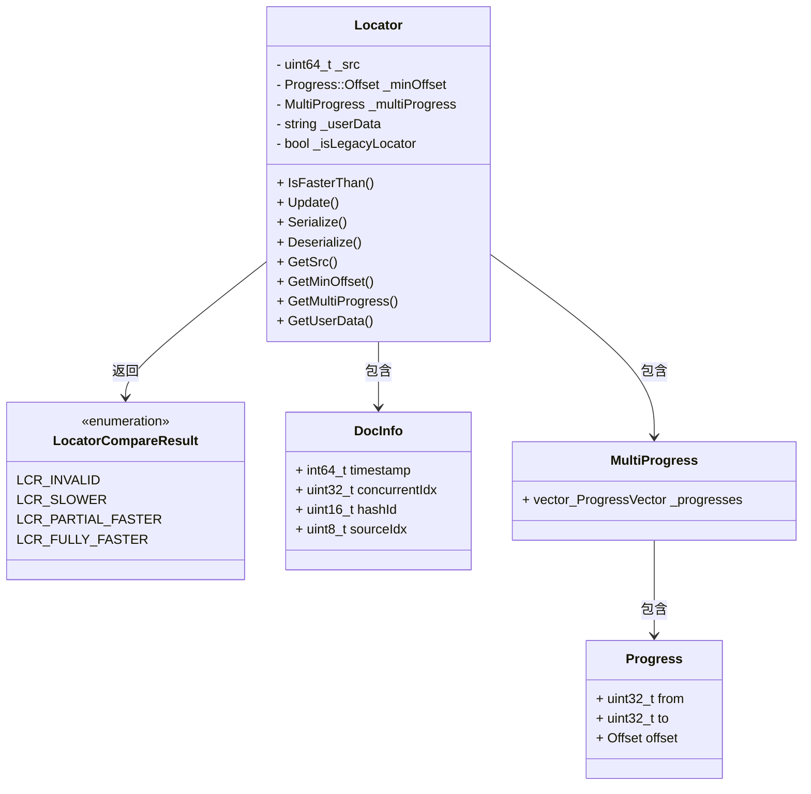
```mermaid
classDiagram
    class Locator {
        - uint64_t _src
        - Progress::Offset _minOffset
        - MultiProgress _multiProgress
        - string _userData
        - bool _isLegacyLocator
        + IsFasterThan()
        + Update()
        + Serialize()
        + Deserialize()
        + GetSrc()
        + GetMinOffset()
        + GetMultiProgress()
        + GetUserData()
    }
    
    class LocatorCompareResult {
        <<enumeration>>
        LCR_INVALID
        LCR_SLOWER
        LCR_PARTIAL_FASTER
        LCR_FULLY_FASTER
    }
    
    class DocInfo {
        + int64_t timestamp
        + uint32_t concurrentIdx
        + uint16_t hashId
        + uint8_t sourceIdx
    }
    
    class Progress {
        + uint32_t from
        + uint32_t to
        + Offset offset
    }
    
    class MultiProgress {
        + vector_ProgressVector _progresses
    }
    
    Locator --> LocatorCompareResult : 返回
    Locator --> DocInfo : 包含
    Locator --> MultiProgress : 包含
    MultiProgress --> Progress : 包含
```

**Locator 的完整定义**：

```cpp
// framework/Locator.h
class Locator final
{
public:
    // Locator 比较结果
    enum class LocatorCompareResult {
        LCR_INVALID,        // 无效：数据源不同，无法比较
        LCR_SLOWER,         // 比这个 locator 慢：数据未处理
        LCR_PARTIAL_FASTER, // 部分 hash id 更快：需要部分处理
        LCR_FULLY_FASTER    // 完全比这个 locator 快（包括相等）：数据已处理
    };

    // 文档信息：记录文档在数据源中的位置
    struct DocInfo {
        int64_t timestamp;        // 时间戳：记录数据的时间位置
        uint32_t concurrentIdx;   // 并发索引：处理时间戳相同的情况
        uint16_t hashId;          // Hash ID：用于分片处理
        uint8_t sourceIdx;        // 数据源索引：支持多数据源场景
        
        // 比较两个 DocInfo
        bool operator<(const DocInfo& other) const {
            if (timestamp != other.timestamp) {
                return timestamp < other.timestamp;
            }
            if (concurrentIdx != other.concurrentIdx) {
                return concurrentIdx < other.concurrentIdx;
            }
            if (hashId != other.hashId) {
                return hashId < other.hashId;
            }
            return sourceIdx < other.sourceIdx;
        }
    };

    // 构造函数
    Locator();
    explicit Locator(uint64_t src);
    Locator(uint64_t src, const MultiProgress& multiProgress);
    Locator(const Locator& other);
    Locator& operator=(const Locator& other);

    // 比较方法：判断数据是否已处理
    LocatorCompareResult IsFasterThan(const Locator& other, 
                                      bool ignoreLegacyDiffSrc = false) const;
    
    // 更新方法：更新 Locator，只向前推进
    void Update(const Locator& other);
    
    // 序列化方法
    std::string Serialize() const;
    Status Deserialize(const std::string& str);
    
    // 访问方法
    uint64_t GetSrc() const { return _src; }
    const Progress::Offset& GetMinOffset() const { return _minOffset; }
    const MultiProgress& GetMultiProgress() const { return _multiProgress; }
    const std::string& GetUserData() const { return _userData; }
    bool IsLegacyLocator() const { return _isLegacyLocator; }
    
    // 设置方法
    void SetSrc(uint64_t src) { _src = src; }
    void SetUserData(const std::string& userData) { _userData = userData; }
    void SetMultiProgress(const MultiProgress& multiProgress);
    
    // 工具方法
    bool IsValid() const;
    bool IsSameSrc(const Locator& other, bool ignoreLegacyDiffSrc = false) const;
    std::string ToString() const;

private:
    uint64_t _src;                              // 数据源标识
    base::Progress::Offset _minOffset;          // 最小偏移量
    base::MultiProgress _multiProgress;        // 多进度信息（每个 hashId 的进度）
    std::string _userData;                      // 用户数据
    bool _isLegacyLocator;                     // 是否遗留 Locator
    
    // 内部方法
    LocatorCompareResult CompareProgress(const ProgressVector& pv1, 
                                         const ProgressVector& pv2) const;
    void UpdateMinOffset();
};
```

**Locator 的关键字段**：

Locator 的完整结构：包含所有关键字段和 DocInfo 结构：

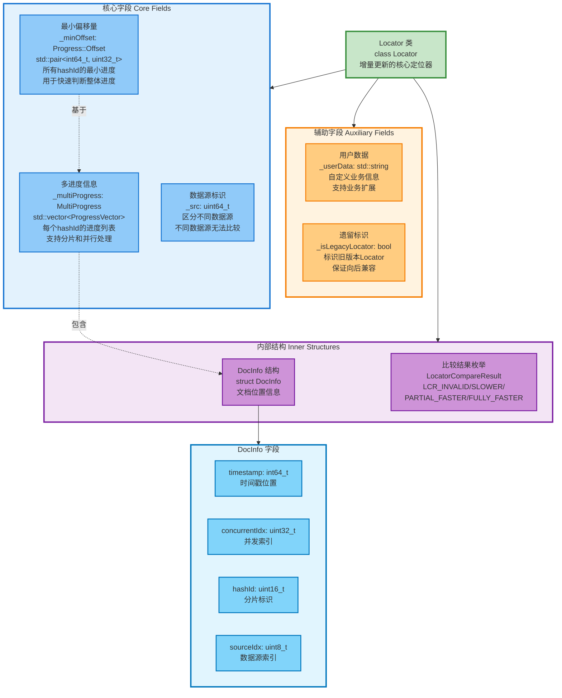
```mermaid
flowchart TB
    Locator["Locator 类<br/>class Locator<br/>增量更新的核心定位器"]
    
    subgraph CoreFields["核心字段 Core Fields"]
        direction LR
        A["数据源标识<br/>_src: uint64_t<br/>区分不同数据源<br/>不同数据源无法比较"]
        B["最小偏移量<br/>_minOffset: Progress::Offset<br/>std::pair&lt;int64_t, uint32_t&gt;<br/>所有hashId的最小进度<br/>用于快速判断整体进度"]
        C["多进度信息<br/>_multiProgress: MultiProgress<br/>std::vector&lt;ProgressVector&gt;<br/>每个hashId的进度列表<br/>支持分片和并行处理"]
    end
    
    subgraph AuxFields["辅助字段 Auxiliary Fields"]
        direction LR
        D["用户数据<br/>_userData: std::string<br/>自定义业务信息<br/>支持业务扩展"]
        E["遗留标识<br/>_isLegacyLocator: bool<br/>标识旧版本Locator<br/>保证向后兼容"]
    end
    
    subgraph InnerStruct["内部结构 Inner Structures"]
        direction LR
        F["DocInfo 结构<br/>struct DocInfo<br/>文档位置信息"]
        G["比较结果枚举<br/>LocatorCompareResult<br/>LCR_INVALID/SLOWER/<br/>PARTIAL_FASTER/FULLY_FASTER"]
    end
    
    subgraph DocInfoFields["DocInfo 字段"]
        direction LR
        F1["timestamp: int64_t<br/>时间戳位置"]
        F2["concurrentIdx: uint32_t<br/>并发索引"]
        F3["hashId: uint16_t<br/>分片标识"]
        F4["sourceIdx: uint8_t<br/>数据源索引"]
    end
    
    Locator --> CoreFields
    Locator --> AuxFields
    Locator --> InnerStruct
    
    F --> DocInfoFields
    B -.->|基于| C
    C -.->|包含| F
    
    style Locator fill:#c8e6c9,stroke:#388e3c,stroke-width:3px
    style CoreFields fill:#e3f2fd,stroke:#1976d2,stroke-width:3px
    style AuxFields fill:#fff3e0,stroke:#f57c00,stroke-width:3px
    style InnerStruct fill:#f3e5f5,stroke:#7b1fa2,stroke-width:3px
    style DocInfoFields fill:#e1f5fe,stroke:#0277bd,stroke-width:3px
    style A fill:#90caf9,stroke:#1976d2,stroke-width:2px
    style B fill:#90caf9,stroke:#1976d2,stroke-width:2px
    style C fill:#90caf9,stroke:#1976d2,stroke-width:2px
    style D fill:#ffcc80,stroke:#f57c00,stroke-width:2px
    style E fill:#ffcc80,stroke:#f57c00,stroke-width:2px
    style F fill:#ce93d8,stroke:#7b1fa2,stroke-width:2px
    style G fill:#ce93d8,stroke:#7b1fa2,stroke-width:2px
    style F1 fill:#81d4fa,stroke:#0277bd,stroke-width:2px
    style F2 fill:#81d4fa,stroke:#0277bd,stroke-width:2px
    style F3 fill:#81d4fa,stroke:#0277bd,stroke-width:2px
    style F4 fill:#81d4fa,stroke:#0277bd,stroke-width:2px
```

- **_src**：数据源标识，用于区分不同的数据源。每个数据源有唯一的 `_src`，不同数据源的 Locator 无法比较
- **_minOffset**：最小偏移量，记录所有 hashId 中最小的 timestamp 和 concurrentIdx，用于快速判断整体进度
- **_multiProgress**：多进度信息，每个 hashId 记录自己的进度（ProgressVector），支持分片处理和并行处理
- **_userData**：用户数据，可以存储自定义信息，支持业务扩展
- **_isLegacyLocator**：是否遗留 Locator，用于兼容旧版本，保证向后兼容

### 1.2 Progress 结构

`Progress` 是进度信息，定义在 `base/Progress.h` 中：

```cpp
// base/Progress.h
struct Progress {
    using Offset = std::pair<int64_t, uint32_t>;  // (timestamp, concurrentIdx)
    static constexpr Offset INVALID_OFFSET = {-1, 0};
    static constexpr Offset MIN_OFFSET = {0, 0};
    
    Progress(uint32_t from, uint32_t to, const Offset& offset);
    
    uint32_t from;      // HashId 范围起始
    uint32_t to;        // HashId 范围结束
    Offset offset;      // 偏移量（timestamp, concurrentIdx）
};

typedef std::vector<Progress> ProgressVector;      // 一个 hashId 范围的进度列表
typedef std::vector<ProgressVector> MultiProgress;  // 多个 hashId 范围的进度列表
```

**Progress 的关键字段**：

Progress 的结构：包含 from、to、offset 等字段：

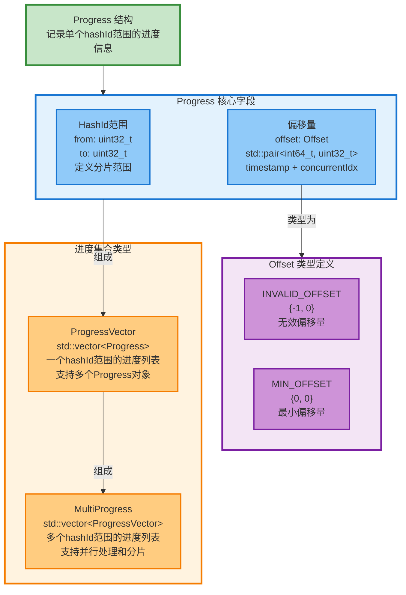
```mermaid
flowchart TB
    Progress["Progress 结构<br/>记录单个hashId范围的进度信息"]
    
    subgraph Fields["Progress 核心字段"]
        direction LR
        A["HashId范围<br/>from: uint32_t<br/>to: uint32_t<br/>定义分片范围"]
        B["偏移量<br/>offset: Offset<br/>std::pair&lt;int64_t, uint32_t&gt;<br/>timestamp + concurrentIdx"]
    end
    
    subgraph OffsetType["Offset 类型定义"]
        direction LR
        O1["INVALID_OFFSET<br/>{-1, 0}<br/>无效偏移量"]
        O2["MIN_OFFSET<br/>{0, 0}<br/>最小偏移量"]
    end
    
    subgraph Collection["进度集合类型"]
        direction LR
        C["ProgressVector<br/>std::vector&lt;Progress&gt;<br/>一个hashId范围的进度列表<br/>支持多个Progress对象"]
        D["MultiProgress<br/>std::vector&lt;ProgressVector&gt;<br/>多个hashId范围的进度列表<br/>支持并行处理和分片"]
    end
    
    Progress --> Fields
    B -->|类型为| OffsetType
    Fields -->|组成| C
    C -->|组成| D
    
    style Progress fill:#c8e6c9,stroke:#388e3c,stroke-width:3px
    style Fields fill:#e3f2fd,stroke:#1976d2,stroke-width:3px
    style OffsetType fill:#f3e5f5,stroke:#7b1fa2,stroke-width:3px
    style Collection fill:#fff3e0,stroke:#f57c00,stroke-width:3px
    style A fill:#90caf9,stroke:#1976d2,stroke-width:2px
    style B fill:#90caf9,stroke:#1976d2,stroke-width:2px
    style O1 fill:#ce93d8,stroke:#7b1fa2,stroke-width:2px
    style O2 fill:#ce93d8,stroke:#7b1fa2,stroke-width:2px
    style C fill:#ffcc80,stroke:#f57c00,stroke-width:2px
    style D fill:#ffcc80,stroke:#f57c00,stroke-width:2px
```

- **from/to**：HashId 范围，用于分片处理
- **offset**：偏移量，包含 timestamp 和 concurrentIdx
- **ProgressVector**：一个 hashId 范围的进度列表
- **MultiProgress**：多个 hashId 范围的进度列表

### 1.3 DocInfo 结构

`DocInfo` 是文档信息，记录文档在数据源中的位置：

DocInfo 的结构：包含 timestamp、concurrentIdx、hashId、sourceIdx 等字段：

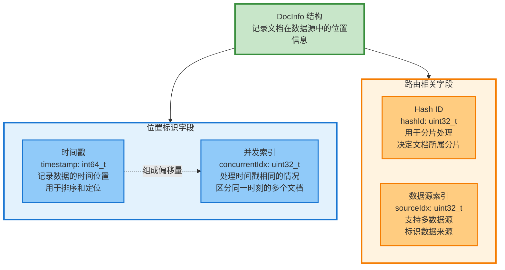
```mermaid
flowchart TB
    DocInfo["DocInfo 结构<br/>记录文档在数据源中的位置信息"]
    
    subgraph Position["位置标识字段"]
        direction LR
        A["时间戳<br/>timestamp: int64_t<br/>记录数据的时间位置<br/>用于排序和定位"]
        B["并发索引<br/>concurrentIdx: uint32_t<br/>处理时间戳相同的情况<br/>区分同一时刻的多个文档"]
    end
    
    subgraph Routing["路由相关字段"]
        direction LR
        C["Hash ID<br/>hashId: uint32_t<br/>用于分片处理<br/>决定文档所属分片"]
        D["数据源索引<br/>sourceIdx: uint32_t<br/>支持多数据源<br/>标识数据来源"]
    end
    
    DocInfo --> Position
    DocInfo --> Routing
    
    A -.->|组成偏移量| B
    
    style DocInfo fill:#c8e6c9,stroke:#388e3c,stroke-width:3px
    style Position fill:#e3f2fd,stroke:#1976d2,stroke-width:3px
    style Routing fill:#fff3e0,stroke:#f57c00,stroke-width:3px
    style A fill:#90caf9,stroke:#1976d2,stroke-width:2px
    style B fill:#90caf9,stroke:#1976d2,stroke-width:2px
    style C fill:#ffcc80,stroke:#f57c00,stroke-width:2px
    style D fill:#ffcc80,stroke:#f57c00,stroke-width:2px
```

**DocInfo 的关键字段**：
- **timestamp**：时间戳，记录数据的时间位置
- **concurrentIdx**：并发索引，处理时间戳相同的情况
- **hashId**：Hash ID，用于分片
- **sourceIdx**：数据源索引，支持多数据源

## 2. Locator 的比较逻辑

### 2.1 IsFasterThan() 方法

`IsFasterThan()` 是 Locator 比较的核心方法，用于判断数据是否已处理。这是增量更新的基础，通过比较两个 Locator 来判断数据的新旧关系。让我们先通过流程图来理解比较的完整流程：

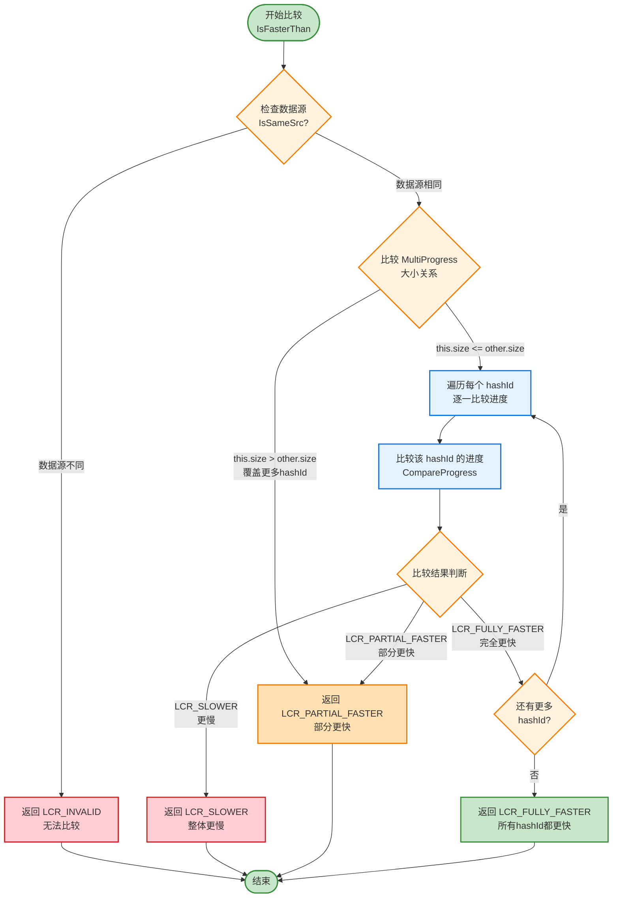
```mermaid
flowchart TD
    Start([开始比较<br/>IsFasterThan]) --> CheckSrc{检查数据源<br/>IsSameSrc?}
    
    CheckSrc -->|数据源不同| ReturnInvalid[返回 LCR_INVALID<br/>无法比较]
    CheckSrc -->|数据源相同| CheckSize{比较 MultiProgress<br/>大小关系}
    
    CheckSize -->|this.size > other.size<br/>覆盖更多hashId| ReturnPartial[返回 LCR_PARTIAL_FASTER<br/>部分更快]
    CheckSize -->|this.size <= other.size| CheckEach[遍历每个 hashId<br/>逐一比较进度]
    
    CheckEach --> CompareProgress[比较该 hashId 的进度<br/>CompareProgress]
    CompareProgress --> CheckResult{比较结果判断}
    
    CheckResult -->|LCR_FULLY_FASTER<br/>完全更快| CheckNext{还有更多<br/>hashId?}
    CheckResult -->|LCR_SLOWER<br/>更慢| ReturnSlower[返回 LCR_SLOWER<br/>整体更慢]
    CheckResult -->|LCR_PARTIAL_FASTER<br/>部分更快| ReturnPartial
    
    CheckNext -->|是| CheckEach
    CheckNext -->|否| ReturnFully[返回 LCR_FULLY_FASTER<br/>所有hashId都更快]
    
    ReturnInvalid --> End([结束])
    ReturnSlower --> End
    ReturnPartial --> End
    ReturnFully --> End
    
    style Start fill:#c8e6c9,stroke:#388e3c,stroke-width:2px
    style End fill:#c8e6c9,stroke:#388e3c,stroke-width:2px
    style CheckSrc fill:#fff3e0,stroke:#f57c00,stroke-width:2px
    style CheckSize fill:#fff3e0,stroke:#f57c00,stroke-width:2px
    style CheckResult fill:#fff3e0,stroke:#f57c00,stroke-width:2px
    style CheckNext fill:#fff3e0,stroke:#f57c00,stroke-width:2px
    style ReturnInvalid fill:#ffcdd2,stroke:#c62828,stroke-width:2px
    style ReturnSlower fill:#ffcdd2,stroke:#c62828,stroke-width:2px
    style ReturnPartial fill:#ffe0b2,stroke:#f57c00,stroke-width:2px
    style ReturnFully fill:#c8e6c9,stroke:#388e3c,stroke-width:2px
    style CheckEach fill:#e3f2fd,stroke:#1976d2,stroke-width:2px
    style CompareProgress fill:#e3f2fd,stroke:#1976d2,stroke-width:2px
```

**IsFasterThan() 的完整实现**：

```cpp
// framework/Locator.cpp
LocatorCompareResult Locator::IsFasterThan(const Locator& other, 
                                            bool ignoreLegacyDiffSrc) const
{
    // 1. 检查数据源是否相同
    if (!IsSameSrc(other, ignoreLegacyDiffSrc)) {
        return LCR_INVALID;  // 数据源不同，无法比较
    }
    
    // 2. 快速路径：如果 MultiProgress 为空，特殊处理
    if (_multiProgress.empty()) {
        if (other._multiProgress.empty()) {
            return LCR_FULLY_FASTER;  // 都为空，认为相等
        }
        return LCR_SLOWER;  // 当前为空，其他不为空，当前更慢
    }
    
    if (other._multiProgress.empty()) {
        return LCR_FULLY_FASTER;  // 当前不为空，其他为空，当前更快
    }
    
    // 3. 比较每个 hashId 的进度
    bool hasPartialFaster = false;
    bool hasSlower = false;
    
    size_t minSize = std::min(_multiProgress.size(), other._multiProgress.size());
    
    for (size_t i = 0; i < minSize; ++i) {
        // 比较该 hashId 的进度
        auto result = CompareProgress(_multiProgress[i], other._multiProgress[i]);
        
        if (result == LCR_SLOWER) {
            hasSlower = true;
            // 如果有一个 hashId 更慢，且没有部分更快，直接返回更慢
            if (!hasPartialFaster) {
                return LCR_SLOWER;
            }
        } else if (result == LCR_PARTIAL_FASTER) {
            hasPartialFaster = true;
            // 如果有一个 hashId 部分更快，且没有更慢，继续检查
        } else if (result == LCR_FULLY_FASTER) {
            // 该 hashId 完全更快，继续检查下一个
            continue;
        } else {
            // LCR_INVALID，不应该发生
            return LCR_INVALID;
        }
    }
    
    // 4. 处理大小不同的情况
    if (_multiProgress.size() > other._multiProgress.size()) {
        // 当前有更多的 hashId，部分更快
        return LCR_PARTIAL_FASTER;
    }
    
    if (_multiProgress.size() < other._multiProgress.size()) {
        // 当前有更少的 hashId，检查是否有更慢的
        if (hasSlower) {
            return LCR_SLOWER;
        }
        // 如果所有 hashId 都完全更快，但数量更少，返回部分更快
        return LCR_PARTIAL_FASTER;
    }
    
    // 5. 大小相同，汇总结果
    if (hasPartialFaster && !hasSlower) {
        return LCR_PARTIAL_FASTER;
    }
    
    if (hasSlower) {
        return LCR_SLOWER;
    }
    
    // 所有 hashId 都完全更快
    return LCR_FULLY_FASTER;
}
```

**比较算法的性能优化**：

1. **快速路径优化**：
   - 数据源不同时，直接返回 `LCR_INVALID`，避免遍历 Progress
   - MultiProgress 为空时，快速判断，避免不必要的比较
   
2. **短路优化**：
   - 如果某个 hashId 更慢，且没有部分更快，立即返回 `LCR_SLOWER`
   - 不需要继续比较后续 hashId，减少比较次数
   
3. **缓存优化**：
   - 比较结果可以缓存，避免重复计算
   - 对于相同的 Locator 对，直接返回缓存结果
   
4. **位运算优化**：
   - 使用位运算优化 Progress 的比较
   - 减少比较开销，提高比较性能

IsFasterThan() 方法：比较两个 Locator 的实现逻辑：

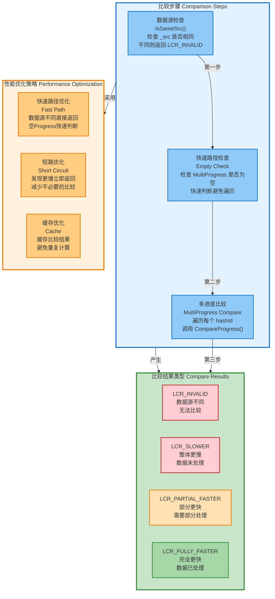
```mermaid
flowchart TB
    subgraph Steps["比较步骤 Comparison Steps"]
        direction LR
        A["数据源检查<br/>IsSameSrc()<br/>检查 _src 是否相同<br/>不同则返回 LCR_INVALID"]
        B["快速路径检查<br/>Empty Check<br/>检查 MultiProgress 是否为空<br/>快速判断避免遍历"]
        C["多进度比较<br/>MultiProgress Compare<br/>遍历每个 hashId<br/>调用 CompareProgress()"]
    end
    
    subgraph Optimization["性能优化策略 Performance Optimization"]
        direction LR
        D["快速路径优化<br/>Fast Path<br/>数据源不同直接返回<br/>空Progress快速判断"]
        E["短路优化<br/>Short Circuit<br/>发现更慢立即返回<br/>减少不必要的比较"]
        F["缓存优化<br/>Cache<br/>缓存比较结果<br/>避免重复计算"]
    end
    
    subgraph Results["比较结果类型 Compare Results"]
        direction LR
        G["LCR_INVALID<br/>数据源不同<br/>无法比较"]
        H["LCR_SLOWER<br/>整体更慢<br/>数据未处理"]
        I["LCR_PARTIAL_FASTER<br/>部分更快<br/>需要部分处理"]
        J["LCR_FULLY_FASTER<br/>完全更快<br/>数据已处理"]
    end
    
    Steps -->|产生| Results
    Steps -->|采用| Optimization
    
    A -->|第一步| B
    B -->|第二步| C
    C -->|第三步| Results
    
    style Steps fill:#e3f2fd,stroke:#1976d2,stroke-width:3px
    style Optimization fill:#fff3e0,stroke:#f57c00,stroke-width:3px
    style Results fill:#c8e6c9,stroke:#388e3c,stroke-width:3px
    style A fill:#90caf9,stroke:#1976d2,stroke-width:2px
    style B fill:#90caf9,stroke:#1976d2,stroke-width:2px
    style C fill:#90caf9,stroke:#1976d2,stroke-width:2px
    style D fill:#ffcc80,stroke:#f57c00,stroke-width:2px
    style E fill:#ffcc80,stroke:#f57c00,stroke-width:2px
    style F fill:#ffcc80,stroke:#f57c00,stroke-width:2px
    style G fill:#ffcdd2,stroke:#c62828,stroke-width:2px
    style H fill:#ffcdd2,stroke:#c62828,stroke-width:2px
    style I fill:#ffe0b2,stroke:#f57c00,stroke-width:2px
    style J fill:#a5d6a7,stroke:#388e3c,stroke-width:2px
```

### 2.2 CompareProgress() 方法

`CompareProgress()` 是比较单个 hashId 进度的核心方法：

```cpp
// framework/Locator.cpp
LocatorCompareResult Locator::CompareProgress(const ProgressVector& pv1, 
                                               const ProgressVector& pv2) const
{
    // 1. 快速路径：如果 ProgressVector 为空
    if (pv1.empty()) {
        if (pv2.empty()) {
            return LCR_FULLY_FASTER;  // 都为空，认为相等
        }
        return LCR_SLOWER;  // pv1 为空，pv2 不为空，pv1 更慢
    }
    
    if (pv2.empty()) {
        return LCR_FULLY_FASTER;  // pv1 不为空，pv2 为空，pv1 更快
    }
    
    // 2. 比较每个 Progress
    bool hasPartialFaster = false;
    bool hasSlower = false;
    
    // 合并两个 ProgressVector，按 from 排序
    std::vector<std::pair<const Progress*, const Progress*>> pairs;
    // ... 合并逻辑 ...
    
    for (const auto& pair : pairs) {
        const Progress* p1 = pair.first;
        const Progress* p2 = pair.second;
        
        if (!p1) {
            // p1 没有该范围的 Progress，p2 有，p1 更慢
            hasSlower = true;
            continue;
        }
        
        if (!p2) {
            // p1 有该范围的 Progress，p2 没有，p1 部分更快
            hasPartialFaster = true;
            continue;
        }
        
        // 比较 offset
        if (p1->offset < p2->offset) {
            hasSlower = true;
            if (!hasPartialFaster) {
                return LCR_SLOWER;
            }
        } else if (p1->offset > p2->offset) {
            hasPartialFaster = true;
        } else {
            // 相等，继续检查下一个
            continue;
        }
    }
    
    // 3. 汇总结果
    if (hasPartialFaster && !hasSlower) {
        return LCR_PARTIAL_FASTER;
    }
    
    if (hasSlower) {
        return LCR_SLOWER;
    }
    
    return LCR_FULLY_FASTER;
}
```

### 2.3 比较结果的语义

Locator 比较结果的语义：

Locator 比较结果的语义：不同结果的含义和应用场景：

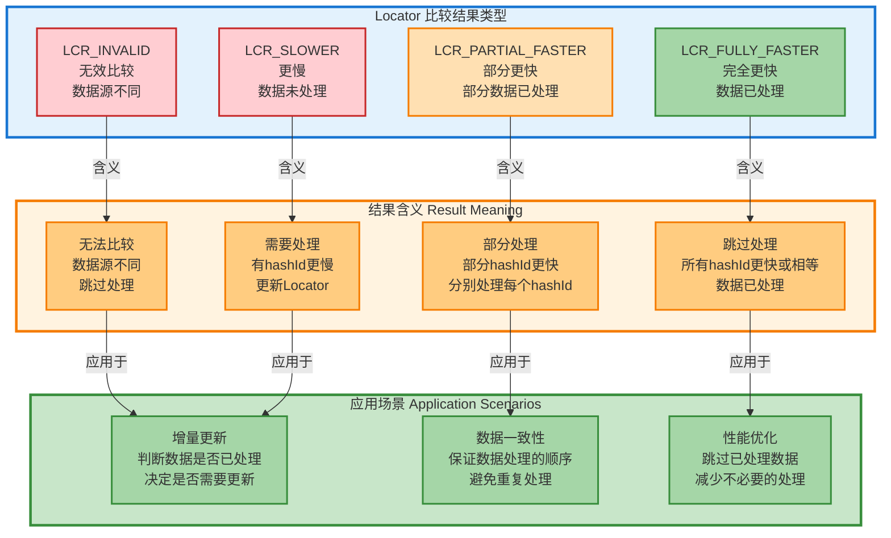
```mermaid
flowchart TB
    subgraph Results["Locator 比较结果类型"]
        direction LR
        A["LCR_INVALID<br/>无效比较<br/>数据源不同"]
        B["LCR_SLOWER<br/>更慢<br/>数据未处理"]
        C["LCR_PARTIAL_FASTER<br/>部分更快<br/>部分数据已处理"]
        D["LCR_FULLY_FASTER<br/>完全更快<br/>数据已处理"]
    end
    
    subgraph Meaning["结果含义 Result Meaning"]
        direction LR
        E["无法比较<br/>数据源不同<br/>跳过处理"]
        F["需要处理<br/>有hashId更慢<br/>更新Locator"]
        G["部分处理<br/>部分hashId更快<br/>分别处理每个hashId"]
        H["跳过处理<br/>所有hashId更快或相等<br/>数据已处理"]
    end
    
    subgraph Application["应用场景 Application Scenarios"]
        direction LR
        I["增量更新<br/>判断数据是否已处理<br/>决定是否需要更新"]
        J["数据一致性<br/>保证数据处理的顺序<br/>避免重复处理"]
        K["性能优化<br/>跳过已处理数据<br/>减少不必要的处理"]
    end
    
    A -->|含义| E
    B -->|含义| F
    C -->|含义| G
    D -->|含义| H
    
    E -->|应用于| I
    F -->|应用于| I
    G -->|应用于| J
    H -->|应用于| K
    
    style Results fill:#e3f2fd,stroke:#1976d2,stroke-width:3px
    style Meaning fill:#fff3e0,stroke:#f57c00,stroke-width:3px
    style Application fill:#c8e6c9,stroke:#388e3c,stroke-width:3px
    style A fill:#ffcdd2,stroke:#c62828,stroke-width:2px
    style B fill:#ffcdd2,stroke:#c62828,stroke-width:2px
    style C fill:#ffe0b2,stroke:#f57c00,stroke-width:2px
    style D fill:#a5d6a7,stroke:#388e3c,stroke-width:2px
    style E fill:#ffcc80,stroke:#f57c00,stroke-width:2px
    style F fill:#ffcc80,stroke:#f57c00,stroke-width:2px
    style G fill:#ffcc80,stroke:#f57c00,stroke-width:2px
    style H fill:#ffcc80,stroke:#f57c00,stroke-width:2px
    style I fill:#a5d6a7,stroke:#388e3c,stroke-width:2px
    style J fill:#a5d6a7,stroke:#388e3c,stroke-width:2px
    style K fill:#a5d6a7,stroke:#388e3c,stroke-width:2px
```

**比较结果详解**：

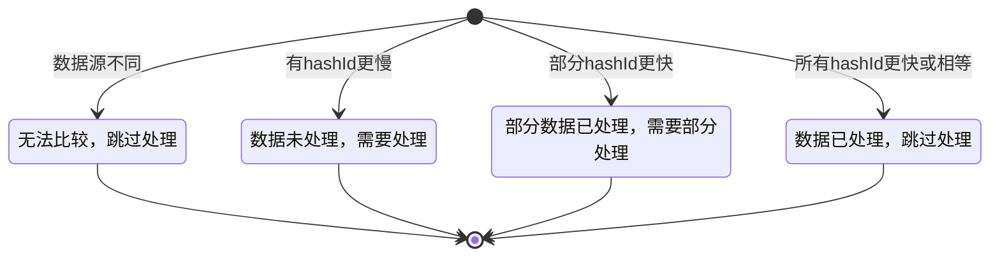
```mermaid
stateDiagram-v2
    [*] --> LCR_INVALID: 数据源不同
    [*] --> LCR_SLOWER: 有hashId更慢
    [*] --> LCR_PARTIAL_FASTER: 部分hashId更快
    [*] --> LCR_FULLY_FASTER: 所有hashId更快或相等
    
    LCR_INVALID: 无法比较，跳过处理
    LCR_SLOWER: 数据未处理，需要处理
    LCR_PARTIAL_FASTER: 部分数据已处理，需要部分处理
    LCR_FULLY_FASTER: 数据已处理，跳过处理
    
    LCR_INVALID --> [*]
    LCR_SLOWER --> [*]
    LCR_PARTIAL_FASTER --> [*]
    LCR_FULLY_FASTER --> [*]
```

- **LCR_INVALID**：数据源不同，无法比较。这种情况下，应该跳过比较，或者使用其他方式判断
- **LCR_SLOWER**：比目标 Locator 慢，数据未处理。需要处理这些数据，更新 Locator
- **LCR_PARTIAL_FASTER**：部分 hashId 更快，需要部分处理。需要分别处理每个 hashId 的数据
- **LCR_FULLY_FASTER**：完全比目标 Locator 快（包括相等），数据已处理。可以跳过这些数据

### 2.4 多进度比较

多进度比较的实现：

多进度比较：比较 MultiProgress 中每个 hashId 的进度：

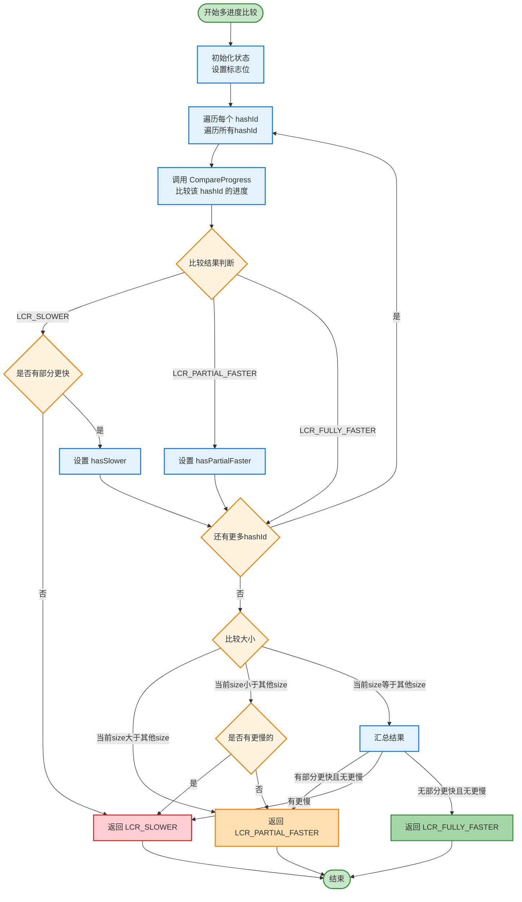
```mermaid
flowchart TB
    Start([开始多进度比较]) --> Init[初始化状态<br/>设置标志位]
    
    Init --> Iterate[遍历每个 hashId<br/>遍历所有hashId]
    
    Iterate --> Compare[调用 CompareProgress<br/>比较该 hashId 的进度]
    
    Compare --> CheckResult{比较结果判断}
    
    CheckResult -->|LCR_SLOWER| CheckPartial{是否有部分更快}
    CheckResult -->|LCR_PARTIAL_FASTER| SetPartial[设置 hasPartialFaster]
    CheckResult -->|LCR_FULLY_FASTER| CheckNext{还有更多hashId}
    
    CheckPartial -->|否| ReturnSlower[返回 LCR_SLOWER]
    CheckPartial -->|是| SetSlower[设置 hasSlower]
    
    SetPartial --> CheckNext
    SetSlower --> CheckNext
    
    CheckNext -->|是| Iterate
    CheckNext -->|否| CheckSize{比较大小}
    
    CheckSize -->|当前size大于其他size| ReturnPartial[返回 LCR_PARTIAL_FASTER]
    CheckSize -->|当前size小于其他size| CheckSlower2{是否有更慢的}
    CheckSize -->|当前size等于其他size| Aggregate[汇总结果]
    
    CheckSlower2 -->|是| ReturnSlower
    CheckSlower2 -->|否| ReturnPartial
    
    Aggregate -->|有部分更快且无更慢| ReturnPartial
    Aggregate -->|有更慢| ReturnSlower
    Aggregate -->|无部分更快且无更慢| ReturnFully[返回 LCR_FULLY_FASTER]
    
    ReturnSlower --> End([结束])
    ReturnPartial --> End
    ReturnFully --> End
    
    style Start fill:#c8e6c9,stroke:#388e3c,stroke-width:2px
    style End fill:#c8e6c9,stroke:#388e3c,stroke-width:2px
    style Init fill:#e3f2fd,stroke:#1976d2,stroke-width:2px
    style Iterate fill:#e3f2fd,stroke:#1976d2,stroke-width:2px
    style Compare fill:#e3f2fd,stroke:#1976d2,stroke-width:2px
    style CheckResult fill:#fff3e0,stroke:#f57c00,stroke-width:2px
    style CheckPartial fill:#fff3e0,stroke:#f57c00,stroke-width:2px
    style CheckNext fill:#fff3e0,stroke:#f57c00,stroke-width:2px
    style CheckSize fill:#fff3e0,stroke:#f57c00,stroke-width:2px
    style CheckSlower2 fill:#fff3e0,stroke:#f57c00,stroke-width:2px
    style SetPartial fill:#e3f2fd,stroke:#1976d2,stroke-width:2px
    style SetSlower fill:#e3f2fd,stroke:#1976d2,stroke-width:2px
    style Aggregate fill:#e3f2fd,stroke:#1976d2,stroke-width:2px
    style ReturnSlower fill:#ffcdd2,stroke:#c62828,stroke-width:2px
    style ReturnPartial fill:#ffe0b2,stroke:#f57c00,stroke-width:2px
    style ReturnFully fill:#a5d6a7,stroke:#388e3c,stroke-width:2px
```

**多进度比较的序列图**：

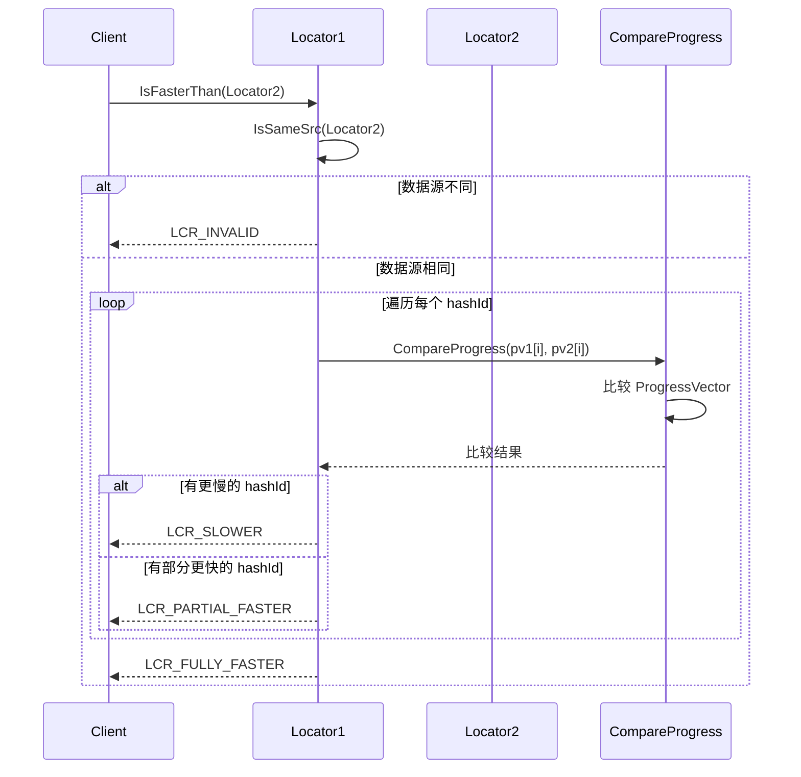
```mermaid
sequenceDiagram
    participant Client
    participant Locator1
    participant Locator2
    participant CompareProgress
    
    Client->>Locator1: IsFasterThan(Locator2)
    Locator1->>Locator1: IsSameSrc(Locator2)
    alt 数据源不同
        Locator1-->>Client: LCR_INVALID
    else 数据源相同
        loop 遍历每个 hashId
            Locator1->>CompareProgress: CompareProgress(pv1[i], pv2[i])
            CompareProgress->>CompareProgress: 比较 ProgressVector
            CompareProgress-->>Locator1: 比较结果
            alt 有更慢的 hashId
                Locator1-->>Client: LCR_SLOWER
            else 有部分更快的 hashId
                Locator1-->>Client: LCR_PARTIAL_FASTER
            end
        end
        Locator1-->>Client: LCR_FULLY_FASTER
    end
```

**比较流程详解**：
1. **遍历 MultiProgress**：遍历每个 hashId 的进度列表，按 hashId 顺序比较
2. **比较进度**：比较每个 hashId 的进度（timestamp 和 concurrentIdx），使用 `CompareProgress()` 方法
3. **汇总结果**：汇总所有 hashId 的比较结果，根据是否有更慢、部分更快等情况决定最终结果
4. **返回最终结果**：返回整体的比较结果，用于判断数据是否已处理

## 3. Locator 的更新机制

### 3.1 Update() 方法

`Update()` 方法用于更新 Locator，保证 Locator 只向前推进，不会回退。这是数据一致性保证的关键。让我们先通过流程图来理解更新的完整流程：


```mermaid
flowchart TD
    Start([开始更新]) --> CheckFaster{检查新 Locator<br/>是否完全更快?}
    CheckFaster -->|否| Return[返回，不更新]
    CheckFaster -->|是| CheckSrc{检查数据源<br/>是否相同?}
    CheckSrc -->|不同| Return
    CheckSrc -->|相同| UpdateMulti[更新 MultiProgress]
    UpdateMulti --> MergeProgress[合并 ProgressVector]
    MergeProgress --> UpdateMin[更新 MinOffset]
    UpdateMin --> UpdateUserData{需要更新<br/>UserData?}
    UpdateUserData -->|是| SetUserData[设置 UserData]
    UpdateUserData -->|否| End([结束])
    SetUserData --> End
    Return --> End
```

**Update() 的完整实现**：

```cpp
// framework/Locator.cpp
void Locator::Update(const Locator& other)
{
    // 1. 检查数据源是否相同
    if (!IsSameSrc(other)) {
        // 数据源不同，不更新
        return;
    }
    
    // 2. 检查新 Locator 是否完全更快
    auto result = other.IsFasterThan(*this);
    if (result != LCR_FULLY_FASTER) {
        // 新 Locator 不是完全更快，不更新
        // 这保证了 Locator 只向前推进，不会回退
        return;
    }
    
    // 3. 更新 MultiProgress
    // 合并两个 MultiProgress，保留更大的进度
    if (other._multiProgress.size() > _multiProgress.size()) {
        _multiProgress = other._multiProgress;
    } else {
        // 逐个 hashId 合并，保留更大的进度
        for (size_t i = 0; i < other._multiProgress.size(); ++i) {
            if (i >= _multiProgress.size()) {
                _multiProgress.push_back(other._multiProgress[i]);
            } else {
                // 合并 ProgressVector
                MergeProgressVector(_multiProgress[i], other._multiProgress[i]);
            }
        }
    }
    
    // 4. 更新 MinOffset
    UpdateMinOffset();
    
    // 5. 更新 UserData（如果新 Locator 有 UserData）
    if (!other._userData.empty()) {
        _userData = other._userData;
    }
}
```

**MergeProgressVector() 的实现**：

```cpp
// framework/Locator.cpp
void Locator::MergeProgressVector(ProgressVector& pv1, 
                                    const ProgressVector& pv2)
{
    // 合并两个 ProgressVector，保留更大的进度
    // 1. 按 from 排序
    std::sort(pv1.begin(), pv1.end(), 
              [](const Progress& a, const Progress& b) {
                  return a.from < b.from;
              });
    
    // 2. 合并重叠的 Progress
    ProgressVector merged;
    for (const auto& p : pv1) {
        bool merged = false;
        for (auto& m : merged) {
            if (m.from <= p.to && m.to >= p.from) {
                // 有重叠，合并
                m.from = std::min(m.from, p.from);
                m.to = std::max(m.to, p.to);
                if (p.offset > m.offset) {
                    m.offset = p.offset;  // 保留更大的进度
                }
                merged = true;
                break;
            }
        }
        if (!merged) {
            merged.push_back(p);
        }
    }
    
    // 3. 与 pv2 合并
    for (const auto& p : pv2) {
        bool merged = false;
        for (auto& m : merged) {
            if (m.from <= p.to && m.to >= p.from) {
                m.from = std::min(m.from, p.from);
                m.to = std::max(m.to, p.to);
                if (p.offset > m.offset) {
                    m.offset = p.offset;
                }
                merged = true;
                break;
            }
        }
        if (!merged) {
            merged.push_back(p);
        }
    }
    
    pv1 = merged;
}
```

**UpdateMinOffset() 的实现**：

```cpp
// framework/Locator.cpp
void Locator::UpdateMinOffset()
{
    if (_multiProgress.empty()) {
        _minOffset = Progress::INVALID_OFFSET;
        return;
    }
    
    // 找到所有 Progress 中最小的 offset
    Progress::Offset minOffset = Progress::MAX_OFFSET;
    for (const auto& pv : _multiProgress) {
        for (const auto& p : pv) {
            if (p.offset < minOffset) {
                minOffset = p.offset;
            }
        }
    }
    
    _minOffset = minOffset;
}
```

**更新机制的关键设计**：

1. **只向前推进**：只有当新 Locator 完全比当前 Locator 快时，才更新。这保证了 Locator 只向前推进，不会回退，是数据一致性保证的基础
2. **原子性更新**：更新操作是原子的，要么全部更新，要么全部不更新，不会出现部分更新的情况
3. **进度合并**：支持合并多个 Progress，保留更大的进度，支持并行处理和分片处理
4. **最小偏移量维护**：自动维护 `_minOffset`，用于快速判断整体进度

Update() 方法：更新 Locator 的实现逻辑：

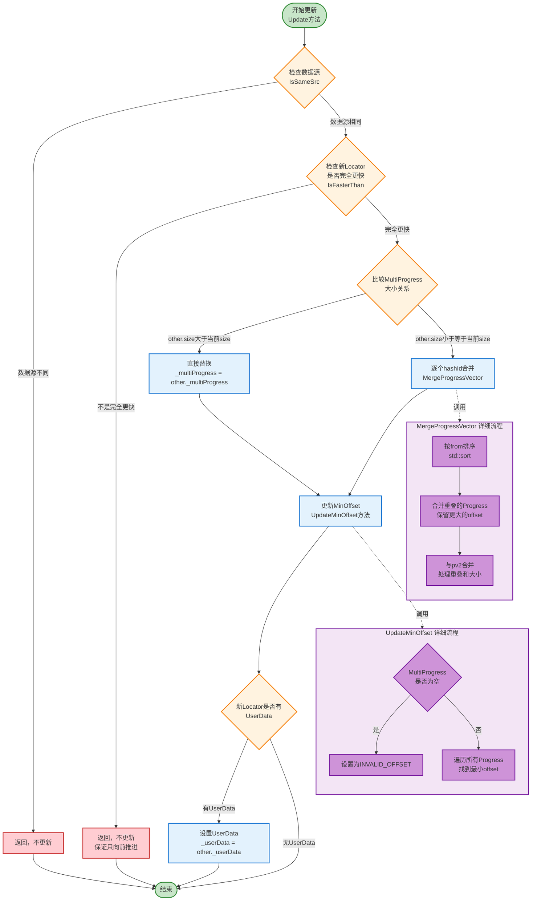
```mermaid
flowchart TB
    Start([开始更新<br/>Update方法]) --> CheckSrc{检查数据源<br/>IsSameSrc}
    
    CheckSrc -->|数据源不同| Return1[返回，不更新]
    CheckSrc -->|数据源相同| CheckFaster{检查新Locator<br/>是否完全更快<br/>IsFasterThan}
    
    CheckFaster -->|不是完全更快| Return2[返回，不更新<br/>保证只向前推进]
    CheckFaster -->|完全更快| CheckSize{比较MultiProgress<br/>大小关系}
    
    CheckSize -->|other.size大于当前size| Replace[直接替换<br/>_multiProgress = other._multiProgress]
    CheckSize -->|other.size小于等于当前size| Merge[逐个hashId合并<br/>MergeProgressVector]
    
    Replace --> UpdateMin[更新MinOffset<br/>UpdateMinOffset方法]
    Merge --> UpdateMin
    
    UpdateMin --> CheckUserData{新Locator是否有<br/>UserData}
    
    CheckUserData -->|有UserData| SetUserData[设置UserData<br/>_userData = other._userData]
    CheckUserData -->|无UserData| End([结束])
    
    SetUserData --> End
    Return1 --> End
    Return2 --> End
    
    subgraph MergeDetail["MergeProgressVector 详细流程"]
        direction TB
        M1[按from排序<br/>std::sort]
        M2[合并重叠的Progress<br/>保留更大的offset]
        M3[与pv2合并<br/>处理重叠和大小]
    end
    
    Merge -.->|调用| MergeDetail
    M1 --> M2
    M2 --> M3
    
    subgraph MinOffsetDetail["UpdateMinOffset 详细流程"]
        direction TB
        O1{MultiProgress<br/>是否为空}
        O2[设置为INVALID_OFFSET]
        O3[遍历所有Progress<br/>找到最小offset]
    end
    
    UpdateMin -.->|调用| MinOffsetDetail
    O1 -->|是| O2
    O1 -->|否| O3
    
    style Start fill:#c8e6c9,stroke:#388e3c,stroke-width:2px
    style End fill:#c8e6c9,stroke:#388e3c,stroke-width:2px
    style CheckSrc fill:#fff3e0,stroke:#f57c00,stroke-width:2px
    style CheckFaster fill:#fff3e0,stroke:#f57c00,stroke-width:2px
    style CheckSize fill:#fff3e0,stroke:#f57c00,stroke-width:2px
    style CheckUserData fill:#fff3e0,stroke:#f57c00,stroke-width:2px
    style Replace fill:#e3f2fd,stroke:#1976d2,stroke-width:2px
    style Merge fill:#e3f2fd,stroke:#1976d2,stroke-width:2px
    style UpdateMin fill:#e3f2fd,stroke:#1976d2,stroke-width:2px
    style SetUserData fill:#e3f2fd,stroke:#1976d2,stroke-width:2px
    style Return1 fill:#ffcdd2,stroke:#c62828,stroke-width:2px
    style Return2 fill:#ffcdd2,stroke:#c62828,stroke-width:2px
    style MergeDetail fill:#f3e5f5,stroke:#7b1fa2,stroke-width:2px
    style MinOffsetDetail fill:#f3e5f5,stroke:#7b1fa2,stroke-width:2px
    style M1 fill:#ce93d8,stroke:#7b1fa2,stroke-width:2px
    style M2 fill:#ce93d8,stroke:#7b1fa2,stroke-width:2px
    style M3 fill:#ce93d8,stroke:#7b1fa2,stroke-width:2px
    style O1 fill:#ce93d8,stroke:#7b1fa2,stroke-width:2px
    style O2 fill:#ce93d8,stroke:#7b1fa2,stroke-width:2px
    style O3 fill:#ce93d8,stroke:#7b1fa2,stroke-width:2px
```

### 3.2 更新时机

Locator 的更新时机：

Locator 的更新时机：在数据处理完成后更新 Locator：

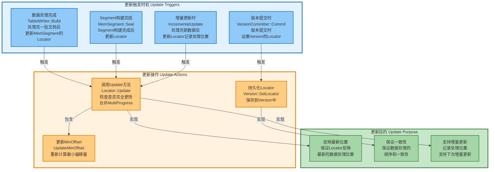
```mermaid
flowchart TB
    subgraph Trigger["更新触发时机 Update Triggers"]
        direction LR
        A["数据处理完成<br/>TabletWriter::Build<br/>处理完一批文档后<br/>更新MemSegment的Locator"]
        B["Segment构建完成<br/>MemSegment::Seal<br/>Segment构建完成后<br/>更新Locator"]
        C["版本提交时<br/>VersionCommitter::Commit<br/>版本提交时<br/>设置Version的Locator"]
        D["增量更新时<br/>IncrementalUpdate<br/>处理完新数据后<br/>更新Locator记录处理位置"]
    end
    
    subgraph Action["更新操作 Update Actions"]
        direction LR
        E["调用Update方法<br/>Locator::Update<br/>检查是否完全更快<br/>合并MultiProgress"]
        F["更新MinOffset<br/>UpdateMinOffset<br/>重新计算最小偏移量"]
        G["持久化Locator<br/>Version::SetLocator<br/>保存到Version中"]
    end
    
    subgraph Purpose["更新目的 Update Purpose"]
        direction LR
        H["反映最新位置<br/>保证Locator反映<br/>最新的数据处理位置"]
        I["保证一致性<br/>保证数据处理的<br/>顺序和一致性"]
        J["支持增量更新<br/>记录处理位置<br/>支持下次增量更新"]
    end
    
    A -->|触发| E
    B -->|触发| E
    C -->|触发| G
    D -->|触发| E
    
    E -->|包含| F
    E -->|实现| H
    G -->|实现| I
    E -->|实现| J
    
    style Trigger fill:#e3f2fd,stroke:#1976d2,stroke-width:3px
    style Action fill:#fff3e0,stroke:#f57c00,stroke-width:3px
    style Purpose fill:#c8e6c9,stroke:#388e3c,stroke-width:3px
    style A fill:#90caf9,stroke:#1976d2,stroke-width:2px
    style B fill:#90caf9,stroke:#1976d2,stroke-width:2px
    style C fill:#90caf9,stroke:#1976d2,stroke-width:2px
    style D fill:#90caf9,stroke:#1976d2,stroke-width:2px
    style E fill:#ffcc80,stroke:#f57c00,stroke-width:2px
    style F fill:#ffcc80,stroke:#f57c00,stroke-width:2px
    style G fill:#ffcc80,stroke:#f57c00,stroke-width:2px
    style H fill:#a5d6a7,stroke:#388e3c,stroke-width:2px
    style I fill:#a5d6a7,stroke:#388e3c,stroke-width:2px
    style J fill:#a5d6a7,stroke:#388e3c,stroke-width:2px
```

**更新时机的序列图**：

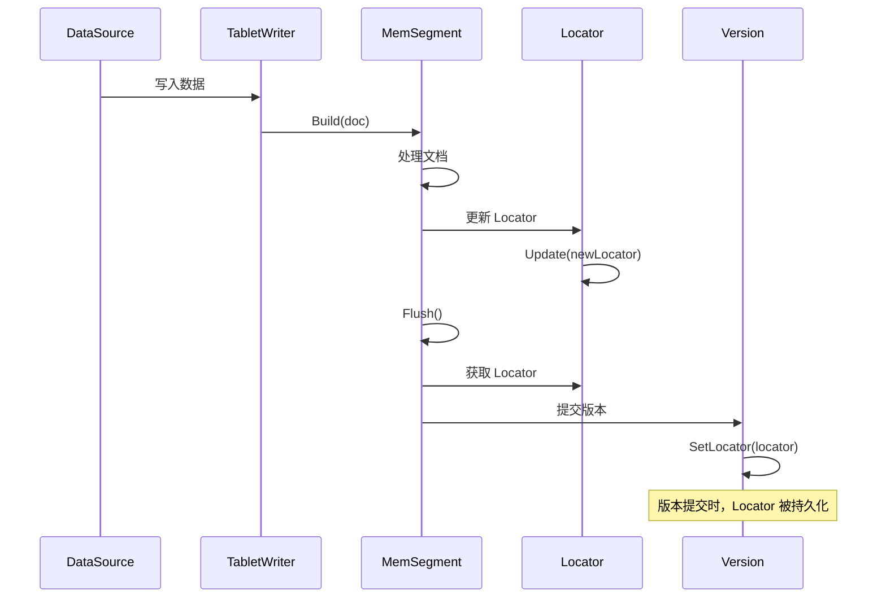
```mermaid
sequenceDiagram
    participant DataSource
    participant TabletWriter
    participant MemSegment
    participant Locator
    participant Version
    
    DataSource->>TabletWriter: 写入数据
    TabletWriter->>MemSegment: Build(doc)
    MemSegment->>MemSegment: 处理文档
    MemSegment->>Locator: 更新 Locator
    Locator->>Locator: Update(newLocator)
    
    MemSegment->>MemSegment: Flush()
    MemSegment->>Locator: 获取 Locator
    MemSegment->>Version: 提交版本
    Version->>Version: SetLocator(locator)
    
    Note over Version: 版本提交时，Locator 被持久化
```

**更新时机详解**：

1. **数据处理完成**：处理完一批数据后更新 Locator
   - 在 `TabletWriter::Build()` 中，每处理完一批文档，更新 MemSegment 的 Locator
   - 保证 Locator 反映最新的数据处理位置
   
2. **Segment 构建完成**：Segment 构建完成后更新 Locator
   - 在 `MemSegment::Seal()` 中，Segment 构建完成后，更新 Locator
   - 保证 Locator 反映 Segment 的数据处理位置
   
3. **版本提交时**：版本提交时更新 Version 的 Locator
   - 在 `VersionCommitter::Commit()` 中，版本提交时，将 TabletWriter 的 Locator 设置到 Version 中
   - 保证 Version 的 Locator 反映该版本的数据处理位置
   
4. **增量更新时**：增量更新时更新 Locator，记录处理位置
   - 在增量更新流程中，处理完新数据后，更新 Locator
   - 保证下次增量更新时，可以正确判断哪些数据已处理

## 4. Locator 的序列化

### 4.1 Serialize() 方法

`Serialize()` 方法用于序列化 Locator，将 Locator 持久化到磁盘或网络传输。序列化格式需要支持版本兼容和向后兼容。让我们先通过流程图来理解序列化的完整流程：

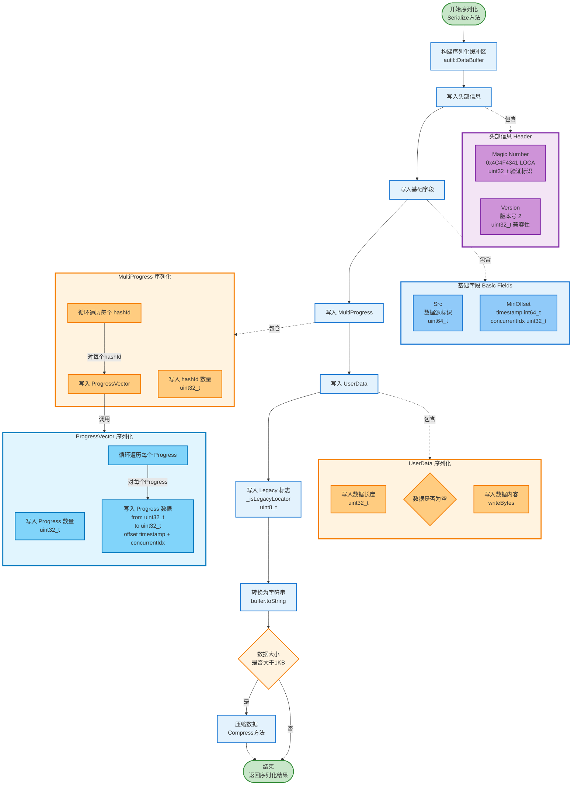
```mermaid
flowchart TB
    Start([开始序列化<br/>Serialize方法]) --> InitBuffer[构建序列化缓冲区<br/>autil::DataBuffer]
    
    InitBuffer --> WriteHeader[写入头部信息]
    
    subgraph HeaderGroup["头部信息 Header"]
        direction LR
        H1[Magic Number<br/>0x4C4F4341 LOCA<br/>uint32_t 验证标识]
        H2[Version<br/>版本号 2<br/>uint32_t 兼容性]
    end
    
    WriteHeader --> WriteBasic[写入基础字段]
    
    subgraph BasicGroup["基础字段 Basic Fields"]
        direction TB
        B1[Src<br/>数据源标识<br/>uint64_t]
        B2[MinOffset<br/>timestamp int64_t<br/>concurrentIdx uint32_t]
    end
    
    WriteBasic --> WriteMulti[写入 MultiProgress]
    
    subgraph MultiGroup["MultiProgress 序列化"]
        direction TB
        M1[写入 hashId 数量<br/>uint32_t]
        M2[循环遍历每个 hashId]
        M3[写入 ProgressVector]
    end
    
    subgraph PVGroup["ProgressVector 序列化"]
        direction TB
        P1[写入 Progress 数量<br/>uint32_t]
        P2[循环遍历每个 Progress]
        P3[写入 Progress 数据<br/>from uint32_t<br/>to uint32_t<br/>offset timestamp + concurrentIdx]
    end
    
    WriteMulti --> WriteUser[写入 UserData]
    M2 -->|对每个hashId| M3
    M3 -->|调用| PVGroup
    P2 -->|对每个Progress| P3
    
    subgraph UserGroup["UserData 序列化"]
        direction TB
        U1[写入数据长度<br/>uint32_t]
        U2{数据是否为空}
        U3[写入数据内容<br/>writeBytes]
    end
    
    WriteUser --> WriteLegacy[写入 Legacy 标志<br/>_isLegacyLocator<br/>uint8_t]
    
    WriteLegacy --> ToString[转换为字符串<br/>buffer.toString]
    
    ToString --> CheckSize{数据大小<br/>是否大于1KB}
    
    CheckSize -->|是| Compress[压缩数据<br/>Compress方法]
    CheckSize -->|否| End([结束<br/>返回序列化结果])
    
    Compress --> End
    
    WriteHeader -.->|包含| HeaderGroup
    WriteBasic -.->|包含| BasicGroup
    WriteMulti -.->|包含| MultiGroup
    WriteUser -.->|包含| UserGroup
    
    style Start fill:#c8e6c9,stroke:#388e3c,stroke-width:2px
    style End fill:#c8e6c9,stroke:#388e3c,stroke-width:2px
    style InitBuffer fill:#e3f2fd,stroke:#1976d2,stroke-width:2px
    style WriteHeader fill:#e3f2fd,stroke:#1976d2,stroke-width:2px
    style WriteBasic fill:#e3f2fd,stroke:#1976d2,stroke-width:2px
    style WriteMulti fill:#e3f2fd,stroke:#1976d2,stroke-width:2px
    style WriteUser fill:#e3f2fd,stroke:#1976d2,stroke-width:2px
    style WriteLegacy fill:#e3f2fd,stroke:#1976d2,stroke-width:2px
    style ToString fill:#e3f2fd,stroke:#1976d2,stroke-width:2px
    style CheckSize fill:#fff3e0,stroke:#f57c00,stroke-width:2px
    style Compress fill:#e3f2fd,stroke:#1976d2,stroke-width:2px
    style HeaderGroup fill:#f3e5f5,stroke:#7b1fa2,stroke-width:3px
    style H1 fill:#ce93d8,stroke:#7b1fa2,stroke-width:2px
    style H2 fill:#ce93d8,stroke:#7b1fa2,stroke-width:2px
    style BasicGroup fill:#e3f2fd,stroke:#1976d2,stroke-width:3px
    style B1 fill:#90caf9,stroke:#1976d2,stroke-width:2px
    style B2 fill:#90caf9,stroke:#1976d2,stroke-width:2px
    style MultiGroup fill:#fff3e0,stroke:#f57c00,stroke-width:3px
    style M1 fill:#ffcc80,stroke:#f57c00,stroke-width:2px
    style M2 fill:#ffcc80,stroke:#f57c00,stroke-width:2px
    style M3 fill:#ffcc80,stroke:#f57c00,stroke-width:2px
    style PVGroup fill:#e1f5fe,stroke:#0277bd,stroke-width:3px
    style P1 fill:#81d4fa,stroke:#0277bd,stroke-width:2px
    style P2 fill:#81d4fa,stroke:#0277bd,stroke-width:2px
    style P3 fill:#81d4fa,stroke:#0277bd,stroke-width:2px
    style UserGroup fill:#fff3e0,stroke:#f57c00,stroke-width:3px
    style U1 fill:#ffcc80,stroke:#f57c00,stroke-width:2px
    style U2 fill:#ffcc80,stroke:#f57c00,stroke-width:2px
    style U3 fill:#ffcc80,stroke:#f57c00,stroke-width:2px
```

**Serialize() 的完整实现**：

```cpp
// framework/Locator.cpp
std::string Locator::Serialize() const
{
    // 1. 构建序列化缓冲区
    autil::DataBuffer buffer;
    
    // 2. 写入 Magic Number（用于验证）
    const uint32_t MAGIC_NUMBER = 0x4C4F4341;  // "LOCA"
    buffer.write(MAGIC_NUMBER);
    
    // 3. 写入 Version（用于兼容性）
    const uint32_t VERSION = 2;  // 当前版本
    buffer.write(VERSION);
    
    // 4. 写入 Src
    buffer.write(_src);
    
    // 5. 写入 MinOffset
    buffer.write(_minOffset.first);   // timestamp
    buffer.write(_minOffset.second);  // concurrentIdx
    
    // 6. 写入 MultiProgress
    buffer.write(static_cast<uint32_t>(_multiProgress.size()));
    for (const auto& pv : _multiProgress) {
        buffer.write(static_cast<uint32_t>(pv.size()));
        for (const auto& p : pv) {
            buffer.write(p.from);
            buffer.write(p.to);
            buffer.write(p.offset.first);   // timestamp
            buffer.write(p.offset.second); // concurrentIdx
        }
    }
    
    // 7. 写入 UserData
    buffer.write(static_cast<uint32_t>(_userData.size()));
    if (!_userData.empty()) {
        buffer.writeBytes(_userData.data(), _userData.size());
    }
    
    // 8. 写入 Legacy 标志
    buffer.write(static_cast<uint8_t>(_isLegacyLocator ? 1 : 0));
    
    // 9. 转换为字符串（可选：压缩）
    std::string result = buffer.toString();
    
    // 可选：压缩序列化数据
    if (result.size() > 1024) {  // 大于 1KB 时压缩
        result = Compress(result);
    }
    
    return result;
}
```

**序列化格式详解**：

1. **Magic Number**：魔数 `0x4C4F4341`（"LOCA"），用于验证数据格式是否正确
2. **Version**：版本号，用于兼容性。不同版本的 Locator 可能有不同的序列化格式
3. **Src**：数据源标识，8 字节
4. **MinOffset**：最小偏移量，包含 timestamp（8 字节）和 concurrentIdx（4 字节）
5. **MultiProgress**：
   - 先写入 hashId 数量（4 字节）
   - 对每个 hashId，写入 ProgressVector 大小（4 字节）
   - 对每个 Progress，写入 from（4 字节）、to（4 字节）、offset（8+4 字节）
6. **UserData**：用户数据，先写入大小（4 字节），再写入数据内容
7. **Legacy 标志**：是否遗留 Locator（1 字节）

Locator 的序列化：将 Locator 序列化为字符串：

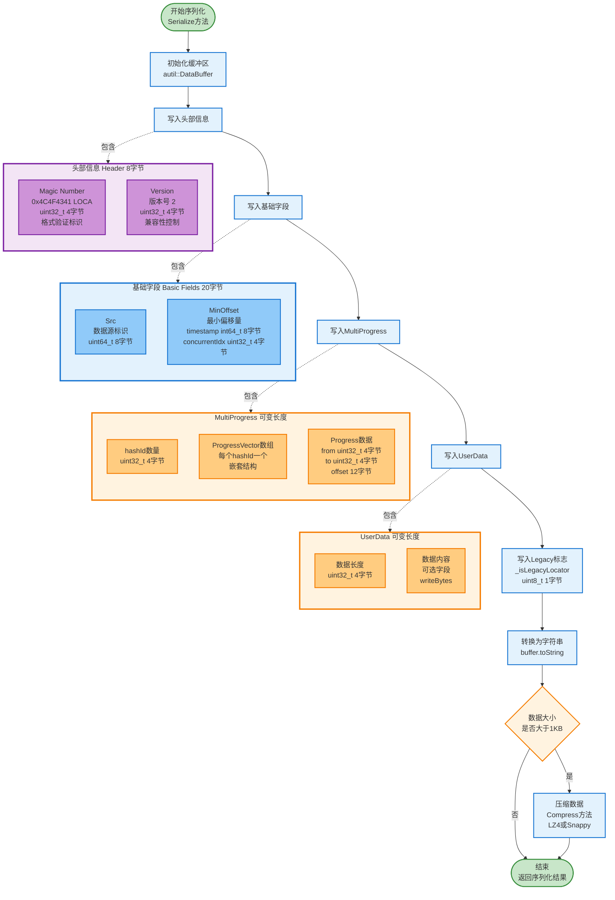
```mermaid
flowchart TB
    Start([开始序列化<br/>Serialize方法]) --> InitBuffer[初始化缓冲区<br/>autil::DataBuffer]
    
    InitBuffer --> WriteHeader[写入头部信息]
    
    subgraph Header["头部信息 Header 8字节"]
        direction TB
        H1["Magic Number<br/>0x4C4F4341 LOCA<br/>uint32_t 4字节<br/>格式验证标识"]
        H2["Version<br/>版本号 2<br/>uint32_t 4字节<br/>兼容性控制"]
    end
    
    WriteHeader --> WriteBasic[写入基础字段]
    
    subgraph Basic["基础字段 Basic Fields 20字节"]
        direction TB
        B1["Src<br/>数据源标识<br/>uint64_t 8字节"]
        B2["MinOffset<br/>最小偏移量<br/>timestamp int64_t 8字节<br/>concurrentIdx uint32_t 4字节"]
    end
    
    WriteBasic --> WriteMulti[写入MultiProgress]
    
    subgraph Multi["MultiProgress 可变长度"]
        direction TB
        M1["hashId数量<br/>uint32_t 4字节"]
        M2["ProgressVector数组<br/>每个hashId一个<br/>嵌套结构"]
        M3["Progress数据<br/>from uint32_t 4字节<br/>to uint32_t 4字节<br/>offset 12字节"]
    end
    
    WriteMulti --> WriteUser[写入UserData]
    
    subgraph User["UserData 可变长度"]
        direction TB
        U1["数据长度<br/>uint32_t 4字节"]
        U2["数据内容<br/>可选字段<br/>writeBytes"]
    end
    
    WriteUser --> WriteLegacy[写入Legacy标志<br/>_isLegacyLocator<br/>uint8_t 1字节]
    
    WriteLegacy --> ToString[转换为字符串<br/>buffer.toString]
    
    ToString --> CheckSize{数据大小<br/>是否大于1KB}
    
    CheckSize -->|是| Compress[压缩数据<br/>Compress方法<br/>LZ4或Snappy]
    CheckSize -->|否| End([结束<br/>返回序列化结果])
    
    Compress --> End
    
    WriteHeader -.->|包含| Header
    WriteBasic -.->|包含| Basic
    WriteMulti -.->|包含| Multi
    WriteUser -.->|包含| User
    
    style Start fill:#c8e6c9,stroke:#388e3c,stroke-width:2px
    style End fill:#c8e6c9,stroke:#388e3c,stroke-width:2px
    style InitBuffer fill:#e3f2fd,stroke:#1976d2,stroke-width:2px
    style WriteHeader fill:#e3f2fd,stroke:#1976d2,stroke-width:2px
    style WriteBasic fill:#e3f2fd,stroke:#1976d2,stroke-width:2px
    style WriteMulti fill:#e3f2fd,stroke:#1976d2,stroke-width:2px
    style WriteUser fill:#e3f2fd,stroke:#1976d2,stroke-width:2px
    style WriteLegacy fill:#e3f2fd,stroke:#1976d2,stroke-width:2px
    style ToString fill:#e3f2fd,stroke:#1976d2,stroke-width:2px
    style CheckSize fill:#fff3e0,stroke:#f57c00,stroke-width:2px
    style Compress fill:#e3f2fd,stroke:#1976d2,stroke-width:2px
    style Header fill:#f3e5f5,stroke:#7b1fa2,stroke-width:3px
    style H1 fill:#ce93d8,stroke:#7b1fa2,stroke-width:2px
    style H2 fill:#ce93d8,stroke:#7b1fa2,stroke-width:2px
    style Basic fill:#e3f2fd,stroke:#1976d2,stroke-width:3px
    style B1 fill:#90caf9,stroke:#1976d2,stroke-width:2px
    style B2 fill:#90caf9,stroke:#1976d2,stroke-width:2px
    style Multi fill:#fff3e0,stroke:#f57c00,stroke-width:3px
    style M1 fill:#ffcc80,stroke:#f57c00,stroke-width:2px
    style M2 fill:#ffcc80,stroke:#f57c00,stroke-width:2px
    style M3 fill:#ffcc80,stroke:#f57c00,stroke-width:2px
    style User fill:#fff3e0,stroke:#f57c00,stroke-width:3px
    style U1 fill:#ffcc80,stroke:#f57c00,stroke-width:2px
    style U2 fill:#ffcc80,stroke:#f57c00,stroke-width:2px
```

### 4.2 Deserialize() 方法

`Deserialize()` 方法用于反序列化 Locator，从字符串恢复 Locator 对象。需要支持版本兼容和向后兼容。让我们先通过流程图来理解反序列化的完整流程：

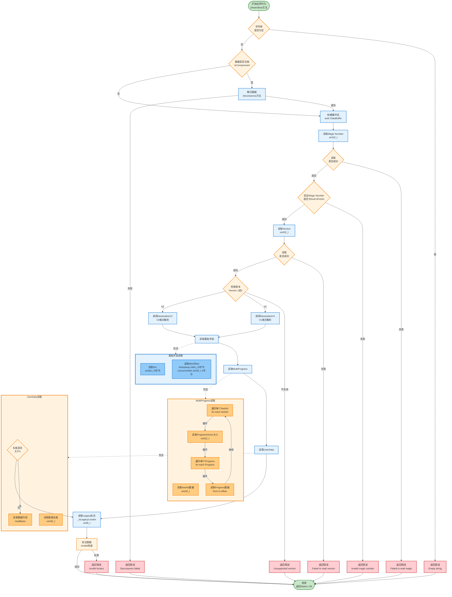
```mermaid
flowchart TB
    Start([开始反序列化<br/>Deserialize方法]) --> CheckEmpty{字符串<br/>是否为空}
    
    CheckEmpty -->|是| Error1[返回错误<br/>Empty string]
    CheckEmpty -->|否| CheckCompress{数据是否压缩<br/>IsCompressed}
    
    CheckCompress -->|是| Decompress[解压数据<br/>Decompress方法]
    CheckCompress -->|否| InitBuffer[构建缓冲区<br/>autil::DataBuffer]
    
    Decompress -->|成功| InitBuffer
    Decompress -->|失败| Error2[返回错误<br/>Decompress failed]
    
    InitBuffer --> ReadMagic[读取Magic Number<br/>uint32_t]
    
    ReadMagic --> CheckReadMagic{读取<br/>是否成功}
    CheckReadMagic -->|失败| Error3[返回错误<br/>Failed to read magic]
    CheckReadMagic -->|成功| CheckMagic{验证Magic Number<br/>是否为0x4C4F4341}
    
    CheckMagic -->|失败| Error4[返回错误<br/>Invalid magic number]
    CheckMagic -->|成功| ReadVersion[读取Version<br/>uint32_t]
    
    ReadVersion --> CheckReadVersion{读取<br/>是否成功}
    CheckReadVersion -->|失败| Error5[返回错误<br/>Failed to read version]
    CheckReadVersion -->|成功| CheckVersion{检查版本<br/>Version 1或2}
    
    CheckVersion -->|不支持| Error6[返回错误<br/>Unsupported version]
    CheckVersion -->|V1| DeserializeV1[调用DeserializeV1<br/>V1格式解析]
    CheckVersion -->|V2| DeserializeV2[调用DeserializeV2<br/>V2格式解析]
    
    DeserializeV1 --> ReadFields[读取基础字段]
    DeserializeV2 --> ReadFields
    
    subgraph Fields["基础字段读取"]
        direction TB
        F1[读取Src<br/>uint64_t 8字节]
        F2[读取MinOffset<br/>timestamp int64_t 8字节<br/>concurrentIdx uint32_t 4字节]
    end
    
    ReadFields --> ReadMulti[读取MultiProgress]
    
    subgraph Multi["MultiProgress读取"]
        direction TB
        M1[读取hashId数量<br/>uint32_t]
        M2[遍历每个hashId<br/>for each hashId]
        M3[读取ProgressVector大小<br/>uint32_t]
        M4[遍历每个Progress<br/>for each Progress]
        M5[读取Progress数据<br/>from to offset]
    end
    
    ReadMulti --> ReadUser[读取UserData]
    
    subgraph User["UserData读取"]
        direction TB
        U1[读取数据长度<br/>uint32_t]
        U2{长度是否<br/>大于0}
        U3[读取数据内容<br/>readBytes]
    end
    
    ReadUser --> ReadLegacy[读取Legacy标志<br/>_isLegacyLocator<br/>uint8_t]
    
    ReadLegacy --> Validate[验证数据<br/>IsValid检查]
    
    Validate -->|失败| Error7[返回错误<br/>Invalid locator]
    Validate -->|成功| End([结束<br/>返回Status::OK])
    
    Error1 --> End
    Error2 --> End
    Error3 --> End
    Error4 --> End
    Error5 --> End
    Error6 --> End
    Error7 --> End
    
    ReadFields -.->|包含| Fields
    ReadMulti -.->|包含| Multi
    ReadUser -.->|包含| User
    
    M2 -->|循环| M3
    M3 -->|循环| M4
    M4 -->|循环| M5
    M5 -->|继续| M2
    U2 -->|是| U3
    U2 -->|否| ReadLegacy
    
    style Start fill:#c8e6c9,stroke:#388e3c,stroke-width:2px
    style End fill:#c8e6c9,stroke:#388e3c,stroke-width:2px
    style CheckEmpty fill:#fff3e0,stroke:#f57c00,stroke-width:2px
    style CheckCompress fill:#fff3e0,stroke:#f57c00,stroke-width:2px
    style Decompress fill:#e3f2fd,stroke:#1976d2,stroke-width:2px
    style InitBuffer fill:#e3f2fd,stroke:#1976d2,stroke-width:2px
    style ReadMagic fill:#e3f2fd,stroke:#1976d2,stroke-width:2px
    style CheckReadMagic fill:#fff3e0,stroke:#f57c00,stroke-width:2px
    style CheckMagic fill:#fff3e0,stroke:#f57c00,stroke-width:2px
    style ReadVersion fill:#e3f2fd,stroke:#1976d2,stroke-width:2px
    style CheckReadVersion fill:#fff3e0,stroke:#f57c00,stroke-width:2px
    style CheckVersion fill:#fff3e0,stroke:#f57c00,stroke-width:2px
    style DeserializeV1 fill:#e3f2fd,stroke:#1976d2,stroke-width:2px
    style DeserializeV2 fill:#e3f2fd,stroke:#1976d2,stroke-width:2px
    style ReadFields fill:#e3f2fd,stroke:#1976d2,stroke-width:2px
    style ReadMulti fill:#e3f2fd,stroke:#1976d2,stroke-width:2px
    style ReadUser fill:#e3f2fd,stroke:#1976d2,stroke-width:2px
    style ReadLegacy fill:#e3f2fd,stroke:#1976d2,stroke-width:2px
    style Validate fill:#fff3e0,stroke:#f57c00,stroke-width:2px
    style Error1 fill:#ffcdd2,stroke:#c62828,stroke-width:2px
    style Error2 fill:#ffcdd2,stroke:#c62828,stroke-width:2px
    style Error3 fill:#ffcdd2,stroke:#c62828,stroke-width:2px
    style Error4 fill:#ffcdd2,stroke:#c62828,stroke-width:2px
    style Error5 fill:#ffcdd2,stroke:#c62828,stroke-width:2px
    style Error6 fill:#ffcdd2,stroke:#c62828,stroke-width:2px
    style Error7 fill:#ffcdd2,stroke:#c62828,stroke-width:2px
    style Fields fill:#e3f2fd,stroke:#1976d2,stroke-width:3px
    style F1 fill:#90caf9,stroke:#1976d2,stroke-width:2px
    style F2 fill:#90caf9,stroke:#1976d2,stroke-width:2px
    style Multi fill:#fff3e0,stroke:#f57c00,stroke-width:3px
    style M1 fill:#ffcc80,stroke:#f57c00,stroke-width:2px
    style M2 fill:#ffcc80,stroke:#f57c00,stroke-width:2px
    style M3 fill:#ffcc80,stroke:#f57c00,stroke-width:2px
    style M4 fill:#ffcc80,stroke:#f57c00,stroke-width:2px
    style M5 fill:#ffcc80,stroke:#f57c00,stroke-width:2px
    style User fill:#fff3e0,stroke:#f57c00,stroke-width:3px
    style U1 fill:#ffcc80,stroke:#f57c00,stroke-width:2px
    style U2 fill:#fff3e0,stroke:#f57c00,stroke-width:2px
    style U3 fill:#ffcc80,stroke:#f57c00,stroke-width:2px
```

**Deserialize() 的完整实现**：

```cpp
// framework/Locator.cpp
Status Locator::Deserialize(const std::string& str)
{
    if (str.empty()) {
        return Status::InvalidArgs("Empty string");
    }
    
    // 1. 尝试解压（如果压缩了）
    std::string data = str;
    if (IsCompressed(str)) {
        auto status = Decompress(str, data);
        if (!status.IsOK()) {
            return status;
        }
    }
    
    // 2. 构建反序列化缓冲区
    autil::DataBuffer buffer(data.data(), data.size());
    
    // 3. 读取并验证 Magic Number
    uint32_t magic;
    if (!buffer.read(magic)) {
        return Status::InvalidArgs("Failed to read magic number");
    }
    if (magic != 0x4C4F4341) {
        return Status::InvalidArgs("Invalid magic number");
    }
    
    // 4. 读取 Version
    uint32_t version;
    if (!buffer.read(version)) {
        return Status::InvalidArgs("Failed to read version");
    }
    
    // 5. 根据版本选择解析方式
    if (version == 1) {
        return DeserializeV1(buffer);
    } else if (version == 2) {
        return DeserializeV2(buffer);
    } else {
        return Status::InvalidArgs("Unsupported version: " + std::to_string(version));
    }
}

Status Locator::DeserializeV2(autil::DataBuffer& buffer)
{
    // 1. 读取 Src
    if (!buffer.read(_src)) {
        return Status::InvalidArgs("Failed to read src");
    }
    
    // 2. 读取 MinOffset
    int64_t timestamp;
    uint32_t concurrentIdx;
    if (!buffer.read(timestamp) || !buffer.read(concurrentIdx)) {
        return Status::InvalidArgs("Failed to read min offset");
    }
    _minOffset = std::make_pair(timestamp, concurrentIdx);
    
    // 3. 读取 MultiProgress
    uint32_t multiProgressSize;
    if (!buffer.read(multiProgressSize)) {
        return Status::InvalidArgs("Failed to read multi progress size");
    }
    
    _multiProgress.clear();
    _multiProgress.reserve(multiProgressSize);
    
    for (uint32_t i = 0; i < multiProgressSize; ++i) {
        uint32_t pvSize;
        if (!buffer.read(pvSize)) {
            return Status::InvalidArgs("Failed to read progress vector size");
        }
        
        ProgressVector pv;
        pv.reserve(pvSize);
        
        for (uint32_t j = 0; j < pvSize; ++j) {
            uint32_t from, to;
            int64_t ts;
            uint32_t idx;
            if (!buffer.read(from) || !buffer.read(to) || 
                !buffer.read(ts) || !buffer.read(idx)) {
                return Status::InvalidArgs("Failed to read progress");
            }
            
            pv.emplace_back(from, to, std::make_pair(ts, idx));
        }
        
        _multiProgress.push_back(std::move(pv));
    }
    
    // 4. 读取 UserData
    uint32_t userDataSize;
    if (!buffer.read(userDataSize)) {
        return Status::InvalidArgs("Failed to read user data size");
    }
    
    if (userDataSize > 0) {
        _userData.resize(userDataSize);
        if (!buffer.readBytes(_userData.data(), userDataSize)) {
            return Status::InvalidArgs("Failed to read user data");
        }
    } else {
        _userData.clear();
    }
    
    // 5. 读取 Legacy 标志
    uint8_t legacyFlag;
    if (!buffer.read(legacyFlag)) {
        return Status::InvalidArgs("Failed to read legacy flag");
    }
    _isLegacyLocator = (legacyFlag != 0);
    
    // 6. 验证数据
    if (!IsValid()) {
        return Status::InvalidArgs("Invalid locator after deserialization");
    }
    
    return Status::OK();
}
```

**反序列化的关键设计**：

1. **版本兼容**：支持多个版本的 Locator 格式，通过版本号选择解析方式
2. **向后兼容**：新版本可以读取旧版本的 Locator，保证平滑升级
3. **数据验证**：反序列化后验证数据的有效性，确保 Locator 正确
4. **压缩支持**：支持压缩的序列化数据，减少存储空间和网络传输

Locator 的反序列化：从字符串反序列化为 Locator：

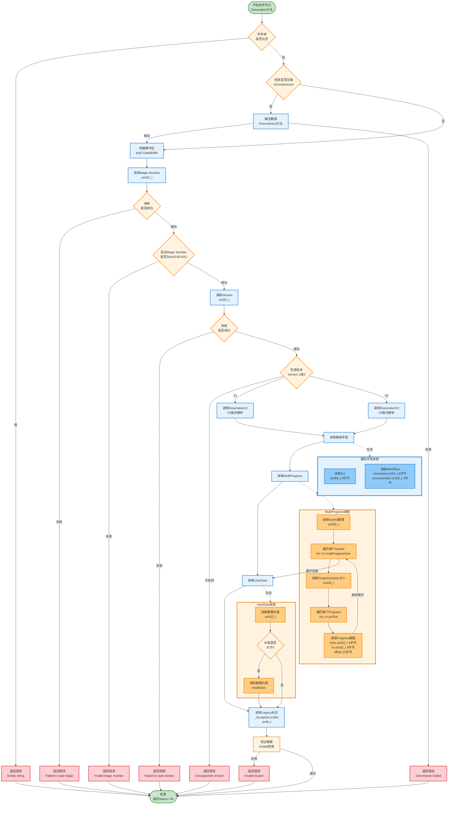
```mermaid
flowchart TB
    Start([开始反序列化<br/>Deserialize方法]) --> CheckEmpty{字符串<br/>是否为空}
    
    CheckEmpty -->|是| Error1[返回错误<br/>Empty string]
    CheckEmpty -->|否| CheckCompress{检查是否压缩<br/>IsCompressed}
    
    CheckCompress -->|是| Decompress[解压数据<br/>Decompress方法]
    CheckCompress -->|否| InitBuffer[构建缓冲区<br/>autil::DataBuffer]
    
    Decompress -->|成功| InitBuffer
    Decompress -->|失败| Error2[返回错误<br/>Decompress failed]
    
    InitBuffer --> ReadMagic[读取Magic Number<br/>uint32_t]
    
    ReadMagic --> CheckReadMagic{读取<br/>是否成功}
    CheckReadMagic -->|失败| Error3[返回错误<br/>Failed to read magic]
    CheckReadMagic -->|成功| CheckMagic{验证Magic Number<br/>是否为0x4C4F4341}
    
    CheckMagic -->|失败| Error4[返回错误<br/>Invalid magic number]
    CheckMagic -->|成功| ReadVersion[读取Version<br/>uint32_t]
    
    ReadVersion --> CheckReadVersion{读取<br/>是否成功}
    CheckReadVersion -->|失败| Error5[返回错误<br/>Failed to read version]
    CheckReadVersion -->|成功| CheckVersion{检查版本<br/>Version 1或2}
    
    CheckVersion -->|不支持| Error6[返回错误<br/>Unsupported version]
    CheckVersion -->|V1| DeserializeV1[调用DeserializeV1<br/>V1格式解析]
    CheckVersion -->|V2| DeserializeV2[调用DeserializeV2<br/>V2格式解析]
    
    DeserializeV1 --> ReadFields[读取基础字段]
    DeserializeV2 --> ReadFields
    
    subgraph Fields["基础字段读取"]
        direction TB
        F1[读取Src<br/>uint64_t 8字节]
        F2[读取MinOffset<br/>timestamp int64_t 8字节<br/>concurrentIdx uint32_t 4字节]
    end
    
    ReadFields --> ReadMulti[读取MultiProgress]
    
    subgraph Multi["MultiProgress读取"]
        direction TB
        M1[读取hashId数量<br/>uint32_t]
        M2[遍历每个hashId<br/>for i in multiProgressSize]
        M3[读取ProgressVector大小<br/>uint32_t]
        M4[遍历每个Progress<br/>for j in pvSize]
        M5[读取Progress数据<br/>from uint32_t 4字节<br/>to uint32_t 4字节<br/>offset 12字节]
    end
    
    ReadMulti --> ReadUser[读取UserData]
    
    subgraph User["UserData读取"]
        direction TB
        U1[读取数据长度<br/>uint32_t]
        U2{长度是否<br/>大于0}
        U3[读取数据内容<br/>readBytes]
    end
    
    ReadUser --> ReadLegacy[读取Legacy标志<br/>_isLegacyLocator<br/>uint8_t]
    
    ReadLegacy --> Validate[验证数据<br/>IsValid检查]
    
    Validate -->|失败| Error7[返回错误<br/>Invalid locator]
    Validate -->|成功| End([结束<br/>返回Status::OK])
    
    Error1 --> End
    Error2 --> End
    Error3 --> End
    Error4 --> End
    Error5 --> End
    Error6 --> End
    Error7 --> End
    
    ReadFields -.->|包含| Fields
    ReadMulti -.->|包含| Multi
    ReadUser -.->|包含| User
    
    M1 --> M2
    M2 --> M3
    M3 --> M4
    M4 --> M5
    M5 -->|继续循环| M2
    M2 -->|循环结束| ReadUser
    U1 --> U2
    U2 -->|是| U3
    U2 -->|否| ReadLegacy
    U3 --> ReadLegacy
    
    style Start fill:#c8e6c9,stroke:#388e3c,stroke-width:2px
    style End fill:#c8e6c9,stroke:#388e3c,stroke-width:2px
    style CheckEmpty fill:#fff3e0,stroke:#f57c00,stroke-width:2px
    style CheckCompress fill:#fff3e0,stroke:#f57c00,stroke-width:2px
    style Decompress fill:#e3f2fd,stroke:#1976d2,stroke-width:2px
    style InitBuffer fill:#e3f2fd,stroke:#1976d2,stroke-width:2px
    style ReadMagic fill:#e3f2fd,stroke:#1976d2,stroke-width:2px
    style CheckReadMagic fill:#fff3e0,stroke:#f57c00,stroke-width:2px
    style CheckMagic fill:#fff3e0,stroke:#f57c00,stroke-width:2px
    style ReadVersion fill:#e3f2fd,stroke:#1976d2,stroke-width:2px
    style CheckReadVersion fill:#fff3e0,stroke:#f57c00,stroke-width:2px
    style CheckVersion fill:#fff3e0,stroke:#f57c00,stroke-width:2px
    style DeserializeV1 fill:#e3f2fd,stroke:#1976d2,stroke-width:2px
    style DeserializeV2 fill:#e3f2fd,stroke:#1976d2,stroke-width:2px
    style ReadFields fill:#e3f2fd,stroke:#1976d2,stroke-width:2px
    style ReadMulti fill:#e3f2fd,stroke:#1976d2,stroke-width:2px
    style ReadUser fill:#e3f2fd,stroke:#1976d2,stroke-width:2px
    style ReadLegacy fill:#e3f2fd,stroke:#1976d2,stroke-width:2px
    style Validate fill:#fff3e0,stroke:#f57c00,stroke-width:2px
    style Error1 fill:#ffcdd2,stroke:#c62828,stroke-width:2px
    style Error2 fill:#ffcdd2,stroke:#c62828,stroke-width:2px
    style Error3 fill:#ffcdd2,stroke:#c62828,stroke-width:2px
    style Error4 fill:#ffcdd2,stroke:#c62828,stroke-width:2px
    style Error5 fill:#ffcdd2,stroke:#c62828,stroke-width:2px
    style Error6 fill:#ffcdd2,stroke:#c62828,stroke-width:2px
    style Error7 fill:#ffcdd2,stroke:#c62828,stroke-width:2px
    style Fields fill:#e3f2fd,stroke:#1976d2,stroke-width:3px
    style F1 fill:#90caf9,stroke:#1976d2,stroke-width:2px
    style F2 fill:#90caf9,stroke:#1976d2,stroke-width:2px
    style Multi fill:#fff3e0,stroke:#f57c00,stroke-width:3px
    style M1 fill:#ffcc80,stroke:#f57c00,stroke-width:2px
    style M2 fill:#ffcc80,stroke:#f57c00,stroke-width:2px
    style M3 fill:#ffcc80,stroke:#f57c00,stroke-width:2px
    style M4 fill:#ffcc80,stroke:#f57c00,stroke-width:2px
    style M5 fill:#ffcc80,stroke:#f57c00,stroke-width:2px
    style User fill:#fff3e0,stroke:#f57c00,stroke-width:3px
    style U1 fill:#ffcc80,stroke:#f57c00,stroke-width:2px
    style U2 fill:#fff3e0,stroke:#f57c00,stroke-width:2px
    style U3 fill:#ffcc80,stroke:#f57c00,stroke-width:2px
```

## 5. 数据一致性保证

数据一致性是 IndexLib 的核心保证，通过 Locator 实现数据不重复、不丢失，支持多数据源场景。让我们先通过流程图来理解数据一致性保证的完整机制：

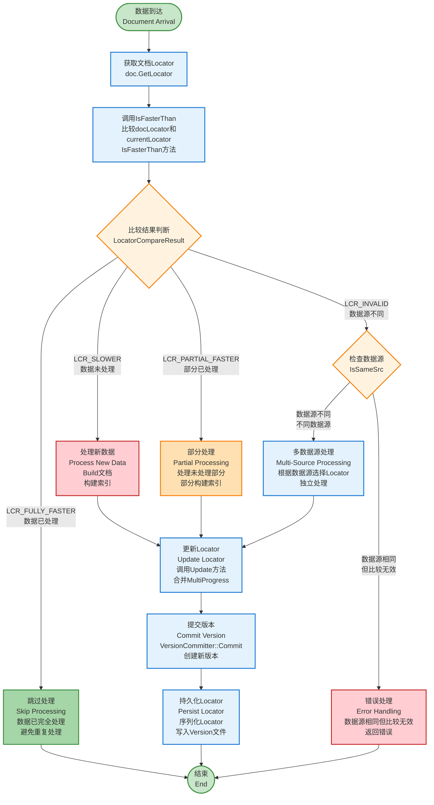
```mermaid
flowchart TB
    Start([数据到达<br/>Document Arrival]) --> GetLocator[获取文档Locator<br/>doc.GetLocator]
    
    GetLocator --> Compare[调用IsFasterThan<br/>比较docLocator和currentLocator<br/>IsFasterThan方法]
    
    Compare --> CheckResult{比较结果判断<br/>LocatorCompareResult}
    
    CheckResult -->|LCR_FULLY_FASTER<br/>数据已处理| Skip[跳过处理<br/>Skip Processing<br/>数据已完全处理<br/>避免重复处理]
    
    CheckResult -->|LCR_SLOWER<br/>数据未处理| Process[处理新数据<br/>Process New Data<br/>Build文档<br/>构建索引]
    
    CheckResult -->|LCR_PARTIAL_FASTER<br/>部分已处理| ProcessPartial[部分处理<br/>Partial Processing<br/>处理未处理部分<br/>部分构建索引]
    
    CheckResult -->|LCR_INVALID<br/>数据源不同| CheckSrc{检查数据源<br/>IsSameSrc}
    
    CheckSrc -->|数据源不同<br/>不同数据源| ProcessMulti[多数据源处理<br/>Multi-Source Processing<br/>根据数据源选择Locator<br/>独立处理]
    
    CheckSrc -->|数据源相同<br/>但比较无效| Error[错误处理<br/>Error Handling<br/>数据源相同但比较无效<br/>返回错误]
    
    Process --> UpdateLocator[更新Locator<br/>Update Locator<br/>调用Update方法<br/>合并MultiProgress]
    
    ProcessPartial --> UpdateLocator
    
    ProcessMulti --> UpdateLocator
    
    UpdateLocator --> Commit[提交版本<br/>Commit Version<br/>VersionCommitter::Commit<br/>创建新版本]
    
    Commit --> Persist[持久化Locator<br/>Persist Locator<br/>序列化Locator<br/>写入Version文件]
    
    Persist --> End([结束<br/>End])
    
    Skip --> End
    Error --> End
    
    style Start fill:#c8e6c9,stroke:#388e3c,stroke-width:2px
    style End fill:#c8e6c9,stroke:#388e3c,stroke-width:2px
    style GetLocator fill:#e3f2fd,stroke:#1976d2,stroke-width:2px
    style Compare fill:#e3f2fd,stroke:#1976d2,stroke-width:2px
    style CheckResult fill:#fff3e0,stroke:#f57c00,stroke-width:2px
    style CheckSrc fill:#fff3e0,stroke:#f57c00,stroke-width:2px
    style Skip fill:#a5d6a7,stroke:#388e3c,stroke-width:2px
    style Process fill:#ffcdd2,stroke:#c62828,stroke-width:2px
    style ProcessPartial fill:#ffe0b2,stroke:#f57c00,stroke-width:2px
    style ProcessMulti fill:#e3f2fd,stroke:#1976d2,stroke-width:2px
    style Error fill:#ffcdd2,stroke:#c62828,stroke-width:2px
    style UpdateLocator fill:#e3f2fd,stroke:#1976d2,stroke-width:2px
    style Commit fill:#e3f2fd,stroke:#1976d2,stroke-width:2px
    style Persist fill:#e3f2fd,stroke:#1976d2,stroke-width:2px
```

### 5.1 数据不重复保证

通过 Locator 保证数据不重复，这是增量更新的基础。让我们通过序列图来理解数据不重复保证的完整流程：

```mermaid
sequenceDiagram
    participant DataSource
    participant TabletWriter
    participant Locator
    participant MemSegment
    
    DataSource->>TabletWriter: 写入数据(doc)
    TabletWriter->>Locator: IsFasterThan(doc.locator)
    Locator->>Locator: 比较 MultiProgress
    alt 数据已处理 (LCR_FULLY_FASTER)
        Locator-->>TabletWriter: LCR_FULLY_FASTER
        TabletWriter->>TabletWriter: 跳过该文档
    else 数据未处理 (LCR_SLOWER)
        Locator-->>TabletWriter: LCR_SLOWER
        TabletWriter->>MemSegment: Build(doc)
        MemSegment->>MemSegment: 处理文档
        MemSegment->>Locator: Update(newLocator)
    else 部分已处理 (LCR_PARTIAL_FASTER)
        Locator-->>TabletWriter: LCR_PARTIAL_FASTER
        TabletWriter->>TabletWriter: 部分处理该文档
        TabletWriter->>MemSegment: Build(doc, partial)
    end
```

**数据不重复保证的实现**：

```cpp
// framework/TabletWriter.cpp
Status TabletWriter::Build(const Document& doc)
{
    // 1. 获取文档的 Locator
    Locator docLocator = doc.GetLocator();
    
    // 2. 检查数据是否已处理
    auto result = docLocator.IsFasterThan(_currentLocator);
    
    if (result == Locator::LCR_FULLY_FASTER) {
        // 数据已处理，跳过
        return Status::OK();
    }
    
    if (result == Locator::LCR_INVALID) {
        // 数据源不同，需要特殊处理
        return HandleDifferentSource(doc);
    }
    
    // 3. 处理新数据
    if (result == Locator::LCR_SLOWER) {
        // 数据未处理，正常处理
        return ProcessDocument(doc);
    }
    
    if (result == Locator::LCR_PARTIAL_FASTER) {
        // 部分数据已处理，需要部分处理
        return ProcessPartialDocument(doc);
    }
    
    return Status::OK();
}
```

**保证机制详解**：

1. **Locator 比较**：通过 `IsFasterThan()` 判断数据是否已处理
   - 如果返回 `LCR_FULLY_FASTER`，说明数据已处理，跳过
   - 如果返回 `LCR_SLOWER`，说明数据未处理，需要处理
   - 如果返回 `LCR_PARTIAL_FASTER`，说明部分数据已处理，需要部分处理
   
2. **跳过已处理数据**：如果数据已处理（LCR_FULLY_FASTER），则跳过，避免重复处理
   - 减少不必要的计算和存储开销
   - 保证数据不重复
   
3. **只处理新数据**：只处理未处理的数据（LCR_SLOWER），避免重复处理
   - 保证增量更新的正确性
   - 提高处理效率

数据不重复保证：通过 Locator 比较避免重复处理数据：

```mermaid
flowchart TB
    subgraph Mechanism["数据不重复保证机制"]
        direction LR
        A["Locator比较<br/>IsFasterThan方法<br/>判断数据是否已处理<br/>返回比较结果"]
        B["重复检测<br/>DuplicateDetection<br/>LCR_FULLY_FASTER时<br/>检测到已处理数据"]
        C["跳过处理<br/>SkipProcessing<br/>跳过已处理数据<br/>避免重复计算"]
    end
    
    subgraph Result["比较结果处理"]
        direction LR
        D["LCR_FULLY_FASTER<br/>数据已处理<br/>直接跳过"]
        E["LCR_SLOWER<br/>数据未处理<br/>正常处理"]
        F["LCR_PARTIAL_FASTER<br/>部分已处理<br/>部分处理"]
        G["LCR_INVALID<br/>数据源不同<br/>特殊处理"]
    end
    
    subgraph Benefit["保证效果"]
        direction LR
        H["数据一致性<br/>保证数据不重复<br/>避免重复处理"]
        I["性能优化<br/>减少不必要计算<br/>提高处理效率"]
    end
    
    Mechanism -->|产生| Result
    Result -->|实现| Benefit
    
    A -->|返回| D
    A -->|返回| E
    A -->|返回| F
    A -->|返回| G
    
    style Mechanism fill:#e3f2fd,stroke:#1976d2,stroke-width:3px
    style Result fill:#fff3e0,stroke:#f57c00,stroke-width:3px
    style Benefit fill:#c8e6c9,stroke:#388e3c,stroke-width:3px
    style A fill:#90caf9,stroke:#1976d2,stroke-width:2px
    style B fill:#90caf9,stroke:#1976d2,stroke-width:2px
    style C fill:#90caf9,stroke:#1976d2,stroke-width:2px
    style D fill:#a5d6a7,stroke:#388e3c,stroke-width:2px
    style E fill:#ffcdd2,stroke:#c62828,stroke-width:2px
    style F fill:#ffe0b2,stroke:#f57c00,stroke-width:2px
    style G fill:#ffcdd2,stroke:#c62828,stroke-width:2px
    style H fill:#a5d6a7,stroke:#388e3c,stroke-width:2px
    style I fill:#a5d6a7,stroke:#388e3c,stroke-width:2px
```

### 5.2 数据不丢失保证

通过 Locator 保证数据不丢失，这是数据可靠性的基础。让我们通过序列图来理解数据不丢失保证的完整流程：

```mermaid
sequenceDiagram
    participant DataSource
    participant TabletWriter
    participant MemSegment
    participant Locator
    participant Version
    participant Disk
    
    DataSource->>TabletWriter: 写入数据
    TabletWriter->>MemSegment: Build(doc)
    MemSegment->>MemSegment: 处理文档
    MemSegment->>Locator: Update(newLocator)
    Locator->>Locator: 更新 MultiProgress
    
    MemSegment->>MemSegment: Flush()
    MemSegment->>Locator: 获取 Locator
    MemSegment->>Version: 提交版本
    Version->>Version: SetLocator(locator)
    Version->>Disk: 持久化 Version
    
    Note over Disk: Locator 被持久化到磁盘
    
    alt 故障恢复
        Disk->>Version: 加载 Version
        Version->>Version: 获取 Locator
        Version->>TabletWriter: 设置 Locator
        TabletWriter->>DataSource: 从 Locator 位置继续处理
    end
```

**数据不丢失保证的实现**：

```cpp
// framework/VersionCommitter.cpp
Status VersionCommitter::Commit(const TabletData& tabletData,
                                 const Schema& schema,
                                 const CommitOptions& options)
{
    // 1. 获取 TabletWriter 的 Locator
    Locator currentLocator = tabletData.GetLocator();
    
    // 2. 创建新版本
    Version newVersion = CreateNewVersion(tabletData);
    
    // 3. 设置 Locator
    newVersion.SetLocator(currentLocator);
    
    // 4. 持久化版本
    auto status = WriteVersion(newVersion);
    if (!status.IsOK()) {
        return status;
    }
    
    // 5. 持久化 Locator（在 Version 中）
    // Locator 会被序列化并写入版本文件
    return Status::OK();
}
```

**保证机制详解**：

1. **记录处理位置**：通过 Locator 记录数据处理位置
   - 每次处理完数据后，更新 Locator
   - Locator 记录每个 hashId 的处理进度
   
2. **增量更新**：通过 Locator 实现增量更新，只处理新数据
   - 下次增量更新时，从 Locator 记录的位置继续处理
   - 保证数据不丢失
   
3. **故障恢复**：故障恢复时，通过 Locator 判断需要重新处理的数据
   - 加载故障前的版本，获取 Locator
   - 从 Locator 记录的位置继续处理，保证数据不丢失
   
4. **版本一致性**：通过 Version 的 Locator 保证版本数据的一致性
   - 每个版本都有对应的 Locator
   - 版本提交时，Locator 被持久化
   - 版本加载时，Locator 被恢复

数据不丢失保证：通过 Locator 记录处理位置，保证数据不丢失：

```mermaid
flowchart TB
    Start([开始数据处理<br/>Data Processing]) --> Process[处理数据<br/>Process Data<br/>TabletWriter::Build<br/>处理文档]
    
    Process --> UpdateLocator[更新Locator<br/>Update Locator<br/>Locator::Update<br/>记录处理位置]
    
    subgraph Recording["位置记录机制 Position Recording"]
        direction TB
        R1[记录每个hashId进度<br/>MultiProgress更新<br/>记录timestamp和concurrentIdx]
        R2[更新MinOffset<br/>快速判断整体进度<br/>最小偏移量维护]
        R3[合并Progress<br/>MergeProgressVector<br/>保留更大进度]
    end
    
    UpdateLocator --> Commit[提交版本<br/>Commit Version<br/>VersionCommitter::Commit<br/>创建新版本]
    
    Commit --> Persist[持久化Locator<br/>Persist Locator<br/>序列化Locator<br/>写入Version文件]
    
    Persist --> NormalEnd([正常结束<br/>Normal End])
    
    subgraph Recovery["故障恢复流程 Fault Recovery"]
        direction TB
        F1[检测故障<br/>Fault Detection<br/>系统故障或重启]
        F2[加载版本<br/>Load Version<br/>加载故障前版本<br/>Version::GetLocator]
        F3[恢复Locator<br/>Recover Locator<br/>反序列化Locator<br/>恢复处理位置]
        F4[从位置继续<br/>Continue from Position<br/>IsFasterThan判断<br/>只处理未处理数据]
        F5[增量处理<br/>Incremental Processing<br/>避免重复处理<br/>保证数据不丢失]
    end
    
    F1 -->|触发| F2
    F2 --> F3
    F3 --> F4
    F4 --> F5
    F5 --> Process
    
    subgraph Guarantee["保证效果 Guarantee Effects"]
        direction LR
        G1[数据完整性<br/>Data Integrity<br/>保证数据不丢失<br/>支持故障恢复]
        G2[版本一致性<br/>Version Consistency<br/>每个版本有Locator<br/>保证版本数据一致]
        G3[增量更新<br/>Incremental Update<br/>只处理新数据<br/>提高处理效率]
    end
    
    NormalEnd -->|实现| G1
    F5 -->|实现| G1
    Persist -->|实现| G2
    UpdateLocator -->|实现| G3
    
    UpdateLocator -.->|包含| Recording
    R1 --> R2
    R2 --> R3
    
    style Start fill:#c8e6c9,stroke:#388e3c,stroke-width:2px
    style NormalEnd fill:#c8e6c9,stroke:#388e3c,stroke-width:2px
    style Process fill:#e3f2fd,stroke:#1976d2,stroke-width:2px
    style UpdateLocator fill:#e3f2fd,stroke:#1976d2,stroke-width:2px
    style Commit fill:#e3f2fd,stroke:#1976d2,stroke-width:2px
    style Persist fill:#e3f2fd,stroke:#1976d2,stroke-width:2px
    style Recording fill:#e3f2fd,stroke:#1976d2,stroke-width:3px
    style R1 fill:#90caf9,stroke:#1976d2,stroke-width:2px
    style R2 fill:#90caf9,stroke:#1976d2,stroke-width:2px
    style R3 fill:#90caf9,stroke:#1976d2,stroke-width:2px
    style Recovery fill:#fff3e0,stroke:#f57c00,stroke-width:3px
    style F1 fill:#ffcc80,stroke:#f57c00,stroke-width:2px
    style F2 fill:#ffcc80,stroke:#f57c00,stroke-width:2px
    style F3 fill:#ffcc80,stroke:#f57c00,stroke-width:2px
    style F4 fill:#ffcc80,stroke:#f57c00,stroke-width:2px
    style F5 fill:#ffcc80,stroke:#f57c00,stroke-width:2px
    style Guarantee fill:#c8e6c9,stroke:#388e3c,stroke-width:3px
    style G1 fill:#a5d6a7,stroke:#388e3c,stroke-width:2px
    style G2 fill:#a5d6a7,stroke:#388e3c,stroke-width:2px
    style G3 fill:#a5d6a7,stroke:#388e3c,stroke-width:2px
```

### 5.3 多数据源一致性

多数据源场景下的数据一致性，通过 `_src` 和 `sourceIdx` 区分数据源，每个数据源有独立的 Locator。让我们通过类图来理解多数据源一致性的架构：

```mermaid
classDiagram
    class Version {
        - versionid_t _versionId
        - map_uint64_t_Locator _locators
        + GetLocator()
        + SetLocator()
        + GetAllLocators()
    }
    
    class Locator {
        - uint64_t _src
        - MultiProgress _multiProgress
        + IsFasterThan()
        + Update()
    }
    
    class TabletWriter {
        - map_uint64_t_Locator _locators
        + Build()
        + GetLocator()
    }
    
    class Document {
        + uint64_t _src
        + DocInfo _docInfo
        + GetLocator()
    }
    
    Version --> Locator : 包含多个
    TabletWriter --> Locator : 管理多个
    Document --> Locator : 包含
```

**多数据源一致性的实现**：

```cpp
// framework/Version.h
class Version
{
private:
    std::map<uint64_t, Locator> _locators;  // 每个数据源的 Locator
    
public:
    Locator GetLocator(uint64_t src) const {
        auto it = _locators.find(src);
        if (it != _locators.end()) {
            return it->second;
        }
        return Locator(src);  // 返回空的 Locator
    }
    
    void SetLocator(uint64_t src, const Locator& locator) {
        _locators[src] = locator;
    }
    
    const std::map<uint64_t, Locator>& GetAllLocators() const {
        return _locators;
    }
};
```

**保证机制详解**：

1. **数据源标识**：通过 `_src` 和 `sourceIdx` 区分数据源
   - 每个数据源有唯一的 `_src`
   - 文档中的 `sourceIdx` 标识数据来源
   
2. **独立 Locator**：每个数据源有独立的 Locator
   - Version 中维护多个 Locator，每个数据源一个
   - 不同数据源的 Locator 互不干扰
   
3. **独立处理**：每个数据源独立处理，互不干扰
   - 处理数据时，根据文档的 `_src` 选择对应的 Locator
   - 不同数据源的数据可以并行处理
   
4. **统一管理**：通过 Version 统一管理所有数据源的 Locator
   - 版本提交时，所有数据源的 Locator 都被持久化
   - 版本加载时，所有数据源的 Locator 都被恢复

多数据源一致性：通过 sourceIdx 区分数据源，保证多数据源场景的数据一致性：

```mermaid
flowchart TB
    subgraph Identification["数据源标识 Source Identification"]
        direction LR
        A["数据源标识<br/>_src: uint64_t<br/>每个数据源唯一标识<br/>区分不同数据源"]
        B["文档来源<br/>sourceIdx: uint8_t<br/>DocInfo中的字段<br/>标识数据来源"]
    end
    
    subgraph Management["多数据源管理 Multi-Source Management"]
        direction LR
        C["独立Locator<br/>Independent Locator<br/>每个数据源一个Locator<br/>Version中维护map"]
        D["独立处理<br/>Independent Processing<br/>根据_src选择Locator<br/>并行处理不同数据源"]
        E["统一管理<br/>Unified Management<br/>Version统一管理<br/>所有Locator持久化"]
    end
    
    subgraph Guarantee["一致性保证 Consistency Guarantee"]
        direction LR
        F["隔离机制<br/>Isolation Mechanism<br/>不同数据源互不干扰<br/>保证数据一致性"]
        G["并行支持<br/>Parallel Support<br/>支持并行处理<br/>提高处理效率"]
    end
    
    Identification -->|支持| Management
    Management -->|实现| Guarantee
    
    A -->|用于| C
    B -->|用于| C
    C -->|支持| D
    D -->|通过| E
    E -->|实现| F
    F -->|支持| G
    
    style Identification fill:#e3f2fd,stroke:#1976d2,stroke-width:3px
    style Management fill:#fff3e0,stroke:#f57c00,stroke-width:3px
    style Guarantee fill:#c8e6c9,stroke:#388e3c,stroke-width:3px
    style A fill:#90caf9,stroke:#1976d2,stroke-width:2px
    style B fill:#90caf9,stroke:#1976d2,stroke-width:2px
    style C fill:#ffcc80,stroke:#f57c00,stroke-width:2px
    style D fill:#ffcc80,stroke:#f57c00,stroke-width:2px
    style E fill:#ffcc80,stroke:#f57c00,stroke-width:2px
    style F fill:#a5d6a7,stroke:#388e3c,stroke-width:2px
    style G fill:#a5d6a7,stroke:#388e3c,stroke-width:2px
```

## 6. Locator 的高级特性

### 6.1 分片处理支持

Locator 支持分片处理：

分片处理支持：通过 hashId 支持分片处理：

```mermaid
flowchart TB
    subgraph Sharding["分片处理机制 Sharding Mechanism"]
        direction LR
        A["HashId分片<br/>HashId Sharding<br/>通过hashId分片<br/>Progress的from/to定义范围"]
        B["独立进度<br/>Independent Progress<br/>每个hashId范围独立进度<br/>MultiProgress追踪"]
        C["并行处理<br/>Parallel Processing<br/>不同hashId并行处理<br/>提高处理效率"]
    end
    
    subgraph Management["分片管理 Shard Management"]
        direction LR
        D["范围定义<br/>Range Definition<br/>from/to定义hashId范围<br/>支持灵活分片"]
        E["进度追踪<br/>Progress Tracking<br/>MultiProgress追踪每个hashId<br/>支持分片恢复"]
        F["负载均衡<br/>Load Balancing<br/>根据hashId分布<br/>均衡处理负载"]
    end
    
    subgraph Benefit["分片优势 Sharding Benefits"]
        direction LR
        G["并行能力<br/>Parallel Capability<br/>支持并行处理<br/>提高吞吐量"]
        H["灵活扩展<br/>Flexible Scaling<br/>支持动态分片<br/>适应不同场景"]
    end
    
    Sharding -->|包含| Management
    Management -->|带来| Benefit
    
    A -->|实现| D
    B -->|实现| E
    C -->|实现| F
    
    style Sharding fill:#e3f2fd,stroke:#1976d2,stroke-width:3px
    style Management fill:#fff3e0,stroke:#f57c00,stroke-width:3px
    style Benefit fill:#c8e6c9,stroke:#388e3c,stroke-width:3px
    style A fill:#90caf9,stroke:#1976d2,stroke-width:2px
    style B fill:#90caf9,stroke:#1976d2,stroke-width:2px
    style C fill:#90caf9,stroke:#1976d2,stroke-width:2px
    style D fill:#ffcc80,stroke:#f57c00,stroke-width:2px
    style E fill:#ffcc80,stroke:#f57c00,stroke-width:2px
    style F fill:#ffcc80,stroke:#f57c00,stroke-width:2px
    style G fill:#a5d6a7,stroke:#388e3c,stroke-width:2px
    style H fill:#a5d6a7,stroke:#388e3c,stroke-width:2px
```

**分片机制**：
- **HashId 范围**：通过 Progress 的 from/to 定义 HashId 范围
- **独立进度**：每个 HashId 范围有独立的进度
- **并行处理**：不同 HashId 范围可以并行处理
- **进度追踪**：通过 MultiProgress 追踪每个 HashId 范围的进度

### 6.2 并发控制

Locator 支持并发控制：

并发控制：通过 concurrentIdx 处理时间戳相同的情况：

```mermaid
flowchart TB
    Start([并发数据处理<br/>Concurrent Data Processing]) --> GetOffset[获取Offset<br/>Get Offset<br/>timestamp + concurrentIdx<br/>Progress::Offset]
    
    subgraph Positioning["两级定位机制 Two-Level Positioning"]
        direction TB
        P1[第一级：时间戳定位<br/>Timestamp Positioning<br/>timestamp: int64_t 8字节<br/>记录数据时间位置]
        P2[第二级：并发索引定位<br/>Concurrent Index Positioning<br/>concurrentIdx: uint32_t 4字节<br/>处理时间戳相同的情况]
        P3[组合定位<br/>Combined Positioning<br/>std::pair timestamp, concurrentIdx<br/>保证唯一性和顺序性]
    end
    
    GetOffset --> Compare[比较Offset<br/>Compare Offset<br/>比较timestamp和concurrentIdx<br/>IsFasterThan方法]
    
    subgraph Conflict["冲突解决机制 Conflict Resolution"]
        direction TB
        C1{时间戳<br/>是否相同}
        C2[使用concurrentIdx区分<br/>Use concurrentIdx to Distinguish<br/>concurrentIdx小的优先<br/>保证顺序性]
        C3[时间戳不同<br/>Timestamp Different<br/>时间戳大的优先<br/>直接比较]
    end
    
    Compare --> C1
    C1 -->|相同| C2
    C1 -->|不同| C3
    
    subgraph Safety["并发安全保证 Thread Safety"]
        direction LR
        S1[原子操作<br/>Atomic Operations<br/>比较操作原子性<br/>保证一致性]
        S2[无锁设计<br/>Lock-Free Design<br/>减少锁竞争<br/>提高并发性能]
        S3[读写分离<br/>Read-Write Separation<br/>读操作无锁<br/>写操作同步]
    end
    
    C2 --> Update[更新Locator<br/>Update Locator<br/>原子性更新<br/>保证线程安全]
    C3 --> Update
    
    Update --> Order[顺序保证<br/>Order Guarantee<br/>保证数据处理顺序<br/>避免乱序问题]
    
    Order --> End([结束<br/>End])
    
    subgraph Benefit["并发优势 Concurrency Benefits"]
        direction LR
        B1[高并发支持<br/>High Concurrency<br/>支持高并发场景<br/>提高处理能力]
        B2[顺序性保证<br/>Order Guarantee<br/>保证数据顺序<br/>避免乱序问题]
        B3[性能优化<br/>Performance Optimization<br/>减少锁竞争<br/>提高处理效率]
    end
    
    End -->|实现| B1
    Order -->|实现| B2
    Safety -->|实现| B3
    
    GetOffset -.->|包含| Positioning
    Update -.->|使用| Safety
    P1 --> P2
    P2 --> P3
    S1 --> S2
    S2 --> S3
    
    style Start fill:#c8e6c9,stroke:#388e3c,stroke-width:2px
    style End fill:#c8e6c9,stroke:#388e3c,stroke-width:2px
    style GetOffset fill:#e3f2fd,stroke:#1976d2,stroke-width:2px
    style Compare fill:#e3f2fd,stroke:#1976d2,stroke-width:2px
    style Update fill:#e3f2fd,stroke:#1976d2,stroke-width:2px
    style Order fill:#e3f2fd,stroke:#1976d2,stroke-width:2px
    style Positioning fill:#e3f2fd,stroke:#1976d2,stroke-width:3px
    style P1 fill:#90caf9,stroke:#1976d2,stroke-width:2px
    style P2 fill:#90caf9,stroke:#1976d2,stroke-width:2px
    style P3 fill:#90caf9,stroke:#1976d2,stroke-width:2px
    style Conflict fill:#fff3e0,stroke:#f57c00,stroke-width:3px
    style C1 fill:#fff3e0,stroke:#f57c00,stroke-width:2px
    style C2 fill:#ffcc80,stroke:#f57c00,stroke-width:2px
    style C3 fill:#ffcc80,stroke:#f57c00,stroke-width:2px
    style Safety fill:#f3e5f5,stroke:#7b1fa2,stroke-width:3px
    style S1 fill:#ce93d8,stroke:#7b1fa2,stroke-width:2px
    style S2 fill:#ce93d8,stroke:#7b1fa2,stroke-width:2px
    style S3 fill:#ce93d8,stroke:#7b1fa2,stroke-width:2px
    style Benefit fill:#c8e6c9,stroke:#388e3c,stroke-width:3px
    style B1 fill:#a5d6a7,stroke:#388e3c,stroke-width:2px
    style B2 fill:#a5d6a7,stroke:#388e3c,stroke-width:2px
    style B3 fill:#a5d6a7,stroke:#388e3c,stroke-width:2px
```

**并发机制**：
- **Timestamp**：时间戳，记录数据的时间位置
- **ConcurrentIdx**：并发索引，处理时间戳相同的情况
- **两级定位**：通过 timestamp 和 concurrentIdx 两级定位，保证顺序性
- **并发安全**：Locator 的比较和更新支持并发，保证线程安全

### 6.3 用户数据支持

Locator 支持用户数据：

用户数据支持：通过 _userData 存储自定义信息：

```mermaid
flowchart TB
    Start([设置用户数据<br/>Set UserData]) --> SetData[设置数据<br/>SetUserData方法<br/>_userData = data<br/>std::string类型]
    
    subgraph Storage["数据存储 Data Storage"]
        direction TB
        S1[数据字段<br/>_userData: std::string<br/>存储自定义信息<br/>支持任意字符串数据]
        S2[可选字段<br/>Optional Field<br/>可以为空<br/>灵活使用]
        S3[内存存储<br/>Memory Storage<br/>存储在Locator对象中<br/>随Locator生命周期]
    end
    
    SetData --> Serialize[序列化UserData<br/>Serialize UserData<br/>序列化到Locator<br/>持久化存储]
    
    subgraph Serialization["序列化支持 Serialization Support"]
        direction TB
        Ser1[写入数据长度<br/>Write Data Length<br/>uint32_t 4字节<br/>数据大小]
        Ser2[写入数据内容<br/>Write Data Content<br/>writeBytes方法<br/>实际数据]
        Ser3[持久化存储<br/>Persistent Storage<br/>序列化到Version文件<br/>支持故障恢复]
    end
    
    Serialize --> Query[查询UserData<br/>Query UserData<br/>GetUserData方法<br/>获取用户数据]
    
    subgraph Application["应用场景 Application Scenarios"]
        direction LR
        A1[业务扩展<br/>Business Extension<br/>存储业务自定义信息<br/>支持业务需求]
        A2[元数据存储<br/>Metadata Storage<br/>存储处理元数据<br/>支持追踪和调试]
        A3[配置信息<br/>Configuration Info<br/>存储配置参数<br/>支持动态配置]
    end
    
    Query --> Use[使用UserData<br/>Use UserData<br/>业务逻辑处理<br/>信息追踪]
    
    subgraph Benefit["扩展优势 Extension Benefits"]
        direction LR
        B1[业务定制<br/>Business Customization<br/>支持业务定制需求<br/>提高灵活性]
        B2[信息追踪<br/>Information Tracking<br/>存储处理信息<br/>支持问题排查]
        B3[灵活扩展<br/>Flexible Extension<br/>支持任意数据格式<br/>适应不同场景]
    end
    
    Use --> End([结束<br/>End])
    
    SetData -.->|包含| Storage
    Serialize -.->|包含| Serialization
    Use -.->|用于| Application
    End -->|实现| Benefit
    
    S1 --> S2
    S2 --> S3
    Ser1 --> Ser2
    Ser2 --> Ser3
    A1 --> A2
    A2 --> A3
    
    style Start fill:#c8e6c9,stroke:#388e3c,stroke-width:2px
    style End fill:#c8e6c9,stroke:#388e3c,stroke-width:2px
    style SetData fill:#e3f2fd,stroke:#1976d2,stroke-width:2px
    style Serialize fill:#e3f2fd,stroke:#1976d2,stroke-width:2px
    style Query fill:#e3f2fd,stroke:#1976d2,stroke-width:2px
    style Use fill:#e3f2fd,stroke:#1976d2,stroke-width:2px
    style Storage fill:#e3f2fd,stroke:#1976d2,stroke-width:3px
    style S1 fill:#90caf9,stroke:#1976d2,stroke-width:2px
    style S2 fill:#90caf9,stroke:#1976d2,stroke-width:2px
    style S3 fill:#90caf9,stroke:#1976d2,stroke-width:2px
    style Serialization fill:#fff3e0,stroke:#f57c00,stroke-width:3px
    style Ser1 fill:#ffcc80,stroke:#f57c00,stroke-width:2px
    style Ser2 fill:#ffcc80,stroke:#f57c00,stroke-width:2px
    style Ser3 fill:#ffcc80,stroke:#f57c00,stroke-width:2px
    style Application fill:#fff3e0,stroke:#f57c00,stroke-width:3px
    style A1 fill:#ffcc80,stroke:#f57c00,stroke-width:2px
    style A2 fill:#ffcc80,stroke:#f57c00,stroke-width:2px
    style A3 fill:#ffcc80,stroke:#f57c00,stroke-width:2px
    style Benefit fill:#c8e6c9,stroke:#388e3c,stroke-width:3px
    style B1 fill:#a5d6a7,stroke:#388e3c,stroke-width:2px
    style B2 fill:#a5d6a7,stroke:#388e3c,stroke-width:2px
    style B3 fill:#a5d6a7,stroke:#388e3c,stroke-width:2px
```

**用户数据机制**：
- **自定义信息**：通过 `_userData` 存储自定义信息
- **序列化支持**：用户数据会序列化到 Locator 中
- **查询支持**：可以通过 `GetUserData()` 获取用户数据
- **灵活扩展**：支持存储任意字符串数据

## 7. Locator 的实际应用

### 7.1 实时写入场景

在实时写入场景中，Locator 的应用：

实时写入场景中的 Locator：通过 Locator 判断数据是否已处理：

```mermaid
flowchart TB
    Start([实时数据到达<br/>Real-Time Data Arrival]) --> Receive[接收数据<br/>Receive Data<br/>TabletWriter::Build<br/>获取文档和Locator]
    
    Receive --> GetLocator[获取文档Locator<br/>Get Document Locator<br/>doc.GetLocator<br/>提取文档位置信息]
    
    GetLocator --> Compare[比较Locator<br/>Compare Locator<br/>IsFasterThan方法<br/>docLocator vs currentLocator]
    
    Compare --> CheckResult{比较结果判断<br/>LocatorCompareResult}
    
    CheckResult -->|LCR_FULLY_FASTER<br/>数据已完全处理| Skip[跳过处理<br/>Skip Processing<br/>返回Status::OK<br/>避免重复处理]
    
    CheckResult -->|LCR_SLOWER<br/>数据未处理| Process[处理新数据<br/>Process New Data<br/>MemSegment::Build<br/>构建索引]
    
    CheckResult -->|LCR_PARTIAL_FASTER<br/>部分已处理| ProcessPartial[部分处理<br/>Partial Processing<br/>处理未处理部分<br/>部分构建索引]
    
    CheckResult -->|LCR_INVALID<br/>数据源不同| HandleMulti[多数据源处理<br/>Multi-Source Processing<br/>根据数据源选择Locator<br/>独立处理]
    
    Process --> UpdateLocator[更新Locator<br/>Update Locator<br/>Locator::Update方法<br/>合并MultiProgress]
    
    ProcessPartial --> UpdateLocator
    
    HandleMulti --> UpdateLocator
    
    subgraph UpdateDetail["更新详细步骤 Update Details"]
        direction TB
        U1[合并MultiProgress<br/>Merge MultiProgress<br/>保留更大进度<br/>更新每个hashId]
        U2[更新MinOffset<br/>Update MinOffset<br/>重新计算最小偏移量<br/>快速判断整体进度]
        U3[更新UserData<br/>Update UserData<br/>如果新Locator有UserData<br/>则更新]
    end
    
    UpdateLocator --> Commit[提交版本<br/>Commit Version<br/>VersionCommitter::Commit<br/>定期提交]
    
    subgraph CommitDetail["提交详细步骤 Commit Details"]
        direction TB
        C1[创建新版本<br/>Create New Version<br/>包含所有Segment<br/>设置版本信息]
        C2[设置Locator<br/>Set Locator<br/>Version::SetLocator<br/>保存当前Locator]
        C3[持久化版本<br/>Persist Version<br/>WriteVersion方法<br/>序列化Locator]
    end
    
    Commit --> End([结束<br/>End])
    
    Skip --> End
    
    UpdateLocator -.->|包含| UpdateDetail
    Commit -.->|包含| CommitDetail
    
    U1 --> U2
    U2 --> U3
    C1 --> C2
    C2 --> C3
    
    style Start fill:#c8e6c9,stroke:#388e3c,stroke-width:2px
    style End fill:#c8e6c9,stroke:#388e3c,stroke-width:2px
    style Receive fill:#e3f2fd,stroke:#1976d2,stroke-width:2px
    style GetLocator fill:#e3f2fd,stroke:#1976d2,stroke-width:2px
    style Compare fill:#e3f2fd,stroke:#1976d2,stroke-width:2px
    style CheckResult fill:#fff3e0,stroke:#f57c00,stroke-width:2px
    style Skip fill:#a5d6a7,stroke:#388e3c,stroke-width:2px
    style Process fill:#ffcdd2,stroke:#c62828,stroke-width:2px
    style ProcessPartial fill:#ffe0b2,stroke:#f57c00,stroke-width:2px
    style HandleMulti fill:#e3f2fd,stroke:#1976d2,stroke-width:2px
    style UpdateLocator fill:#e3f2fd,stroke:#1976d2,stroke-width:2px
    style Commit fill:#e3f2fd,stroke:#1976d2,stroke-width:2px
    style UpdateDetail fill:#e3f2fd,stroke:#1976d2,stroke-width:3px
    style U1 fill:#90caf9,stroke:#1976d2,stroke-width:2px
    style U2 fill:#90caf9,stroke:#1976d2,stroke-width:2px
    style U3 fill:#90caf9,stroke:#1976d2,stroke-width:2px
    style CommitDetail fill:#fff3e0,stroke:#f57c00,stroke-width:3px
    style C1 fill:#ffcc80,stroke:#f57c00,stroke-width:2px
    style C2 fill:#ffcc80,stroke:#f57c00,stroke-width:2px
    style C3 fill:#ffcc80,stroke:#f57c00,stroke-width:2px
```

**应用流程**：
1. **接收数据**：实时接收数据流
2. **检查 Locator**：通过 `IsFasterThan()` 判断数据是否已处理
3. **处理新数据**：只处理未处理的数据
4. **更新 Locator**：处理完成后更新 Locator
5. **提交版本**：定期提交版本，更新 Version 的 Locator

### 7.2 批量更新场景

在批量更新场景中，Locator 的应用：

批量更新场景中的 Locator：批量处理数据，避免重复处理：

```mermaid
flowchart TB
    Start([批量更新开始<br/>Batch Update Start]) --> ReadBatch[批量读取数据<br/>Batch Read Data<br/>从数据源批量读取<br/>获取文档列表]
    
    ReadBatch --> Iterate[遍历文档<br/>Iterate Documents<br/>for each document<br/>逐个检查]
    
    Iterate --> GetDocLocator[获取文档Locator<br/>Get Document Locator<br/>doc.GetLocator<br/>提取文档位置信息]
    
    GetDocLocator --> Compare[比较Locator<br/>Compare Locator<br/>IsFasterThan方法<br/>判断是否已处理]
    
    Compare --> CheckResult{比较结果判断<br/>LocatorCompareResult}
    
    CheckResult -->|LCR_FULLY_FASTER<br/>数据已处理| Filter[过滤已处理数据<br/>Filter Processed Data<br/>跳过该文档<br/>不加入处理列表]
    
    CheckResult -->|LCR_SLOWER<br/>数据未处理| AddToProcess[加入处理列表<br/>Add to Process List<br/>保留未处理数据<br/>等待批量处理]
    
    CheckResult -->|LCR_PARTIAL_FASTER<br/>部分已处理| AddPartial[加入部分处理列表<br/>Add to Partial List<br/>保留未处理部分<br/>等待部分处理]
    
    Filter --> CheckMore{还有更多<br/>文档?}
    AddToProcess --> CheckMore
    AddPartial --> CheckMore
    
    CheckMore -->|是| Iterate
    CheckMore -->|否| BatchProcess[批量处理<br/>Batch Processing<br/>批量构建索引<br/>MemSegment::Build]
    
    subgraph ProcessDetail["批量处理详细步骤"]
        direction TB
        P1[批量构建索引<br/>Batch Build Index<br/>并行处理多个文档<br/>提高处理效率]
        P2[批量更新Locator<br/>Batch Update Locator<br/>合并所有文档的Locator<br/>更新MultiProgress]
        P3[更新MinOffset<br/>Update MinOffset<br/>重新计算最小偏移量<br/>快速判断整体进度]
    end
    
    BatchProcess --> Commit[提交版本<br/>Commit Version<br/>VersionCommitter::Commit<br/>批量处理完成后提交]
    
    subgraph CommitDetail["提交详细步骤"]
        direction TB
        C1[创建新版本<br/>Create New Version<br/>包含所有Segment<br/>设置版本信息]
        C2[设置Locator<br/>Set Locator<br/>Version::SetLocator<br/>保存当前Locator]
        C3[持久化版本<br/>Persist Version<br/>WriteVersion方法<br/>序列化Locator]
    end
    
    Commit --> End([结束<br/>End])
    
    subgraph Benefit["批量优势 Batch Benefits"]
        direction LR
        B1[效率优化<br/>Efficiency Optimization<br/>批量处理提高效率<br/>减少单次开销]
        B2[一致性保证<br/>Consistency Guarantee<br/>保证数据一致性<br/>避免重复处理]
        B3[资源优化<br/>Resource Optimization<br/>批量操作减少IO<br/>提高吞吐量]
    end
    
    End -->|实现| B1
    BatchProcess -->|实现| B2
    Commit -->|实现| B3
    
    BatchProcess -.->|包含| ProcessDetail
    Commit -.->|包含| CommitDetail
    
    P1 --> P2
    P2 --> P3
    C1 --> C2
    C2 --> C3
    
    style Start fill:#c8e6c9,stroke:#388e3c,stroke-width:2px
    style End fill:#c8e6c9,stroke:#388e3c,stroke-width:2px
    style ReadBatch fill:#e3f2fd,stroke:#1976d2,stroke-width:2px
    style Iterate fill:#e3f2fd,stroke:#1976d2,stroke-width:2px
    style GetDocLocator fill:#e3f2fd,stroke:#1976d2,stroke-width:2px
    style Compare fill:#e3f2fd,stroke:#1976d2,stroke-width:2px
    style CheckResult fill:#fff3e0,stroke:#f57c00,stroke-width:2px
    style CheckMore fill:#fff3e0,stroke:#f57c00,stroke-width:2px
    style Filter fill:#a5d6a7,stroke:#388e3c,stroke-width:2px
    style AddToProcess fill:#ffcdd2,stroke:#c62828,stroke-width:2px
    style AddPartial fill:#ffe0b2,stroke:#f57c00,stroke-width:2px
    style BatchProcess fill:#e3f2fd,stroke:#1976d2,stroke-width:2px
    style Commit fill:#e3f2fd,stroke:#1976d2,stroke-width:2px
    style ProcessDetail fill:#e3f2fd,stroke:#1976d2,stroke-width:3px
    style P1 fill:#90caf9,stroke:#1976d2,stroke-width:2px
    style P2 fill:#90caf9,stroke:#1976d2,stroke-width:2px
    style P3 fill:#90caf9,stroke:#1976d2,stroke-width:2px
    style CommitDetail fill:#fff3e0,stroke:#f57c00,stroke-width:3px
    style C1 fill:#ffcc80,stroke:#f57c00,stroke-width:2px
    style C2 fill:#ffcc80,stroke:#f57c00,stroke-width:2px
    style C3 fill:#ffcc80,stroke:#f57c00,stroke-width:2px
    style Benefit fill:#c8e6c9,stroke:#388e3c,stroke-width:3px
    style B1 fill:#a5d6a7,stroke:#388e3c,stroke-width:2px
    style B2 fill:#a5d6a7,stroke:#388e3c,stroke-width:2px
    style B3 fill:#a5d6a7,stroke:#388e3c,stroke-width:2px
```

**应用流程**：
1. **读取数据源**：从数据源批量读取数据
2. **检查 Locator**：通过 `IsFasterThan()` 判断哪些数据已处理
3. **过滤已处理数据**：过滤掉已处理的数据
4. **处理新数据**：只处理未处理的数据
5. **更新 Locator**：处理完成后更新 Locator
6. **提交版本**：批量处理完成后提交版本

### 7.3 故障恢复场景

在故障恢复场景中，Locator 的应用：

故障恢复场景中的 Locator：通过 Locator 判断需要重新处理的数据：

```mermaid
flowchart TB
    Start([系统故障<br/>System Fault]) --> Detect[故障检测<br/>Fault Detection<br/>检测到系统故障<br/>需要恢复]
    
    Detect --> LoadVersion[加载版本<br/>Load Version<br/>加载故障前版本<br/>Version::Load]
    
    subgraph LoadDetail["加载详细步骤"]
        direction TB
        L1[读取版本文件<br/>Read Version File<br/>从磁盘读取版本信息<br/>获取版本号]
        L2[反序列化Locator<br/>Deserialize Locator<br/>恢复Locator对象<br/>获取处理位置]
        L3[设置当前Locator<br/>Set Current Locator<br/>TabletWriter::SetLocator<br/>恢复处理位置]
    end
    
    LoadVersion --> ReadData[读取数据源<br/>Read Data Source<br/>从数据源读取数据<br/>获取文档列表]
    
    ReadData --> Iterate[遍历文档<br/>Iterate Documents<br/>for each document<br/>逐个检查]
    
    Iterate --> GetDocLocator[获取文档Locator<br/>Get Document Locator<br/>doc.GetLocator<br/>提取文档位置信息]
    
    GetDocLocator --> Compare[比较Locator<br/>Compare Locator<br/>IsFasterThan方法<br/>判断是否已处理]
    
    Compare --> CheckResult{比较结果判断<br/>LocatorCompareResult}
    
    CheckResult -->|LCR_FULLY_FASTER<br/>数据已处理| Skip[跳过处理<br/>Skip Processing<br/>数据已处理<br/>避免重复处理]
    
    CheckResult -->|LCR_SLOWER<br/>数据未处理| Reprocess[重新处理<br/>Reprocess Data<br/>MemSegment::Build<br/>构建索引]
    
    CheckResult -->|LCR_PARTIAL_FASTER<br/>部分已处理| ReprocessPartial[部分重新处理<br/>Partial Reprocess<br/>处理未处理部分<br/>部分构建索引]
    
    Skip --> CheckMore{还有更多<br/>文档?}
    Reprocess --> UpdateLocator[更新Locator<br/>Update Locator<br/>Locator::Update方法<br/>合并MultiProgress]
    ReprocessPartial --> UpdateLocator
    
    CheckMore -->|是| Iterate
    CheckMore -->|否| UpdateLocator
    
    subgraph UpdateDetail["更新详细步骤"]
        direction TB
        U1[合并MultiProgress<br/>Merge MultiProgress<br/>保留更大进度<br/>更新每个hashId]
        U2[更新MinOffset<br/>Update MinOffset<br/>重新计算最小偏移量<br/>快速判断整体进度]
        U3[更新UserData<br/>Update UserData<br/>如果新Locator有UserData<br/>则更新]
    end
    
    UpdateLocator --> Commit[提交版本<br/>Commit Version<br/>VersionCommitter::Commit<br/>恢复完成后提交]
    
    subgraph CommitDetail["提交详细步骤"]
        direction TB
        C1[创建新版本<br/>Create New Version<br/>包含所有Segment<br/>设置版本信息]
        C2[设置Locator<br/>Set Locator<br/>Version::SetLocator<br/>保存当前Locator]
        C3[持久化版本<br/>Persist Version<br/>WriteVersion方法<br/>序列化Locator]
    end
    
    Commit --> Verify[验证数据完整性<br/>Verify Data Integrity<br/>检查数据一致性<br/>保证数据不丢失]
    
    Verify --> End([恢复完成<br/>Recovery Complete])
    
    LoadVersion -.->|包含| LoadDetail
    UpdateLocator -.->|包含| UpdateDetail
    Commit -.->|包含| CommitDetail
    
    L1 --> L2
    L2 --> L3
    U1 --> U2
    U2 --> U3
    C1 --> C2
    C2 --> C3
    
    style Start fill:#ffcdd2,stroke:#c62828,stroke-width:2px
    style End fill:#c8e6c9,stroke:#388e3c,stroke-width:2px
    style Detect fill:#ffcdd2,stroke:#c62828,stroke-width:2px
    style LoadVersion fill:#e3f2fd,stroke:#1976d2,stroke-width:2px
    style ReadData fill:#e3f2fd,stroke:#1976d2,stroke-width:2px
    style Iterate fill:#e3f2fd,stroke:#1976d2,stroke-width:2px
    style GetDocLocator fill:#e3f2fd,stroke:#1976d2,stroke-width:2px
    style Compare fill:#e3f2fd,stroke:#1976d2,stroke-width:2px
    style CheckResult fill:#fff3e0,stroke:#f57c00,stroke-width:2px
    style CheckMore fill:#fff3e0,stroke:#f57c00,stroke-width:2px
    style Skip fill:#a5d6a7,stroke:#388e3c,stroke-width:2px
    style Reprocess fill:#ffcdd2,stroke:#c62828,stroke-width:2px
    style ReprocessPartial fill:#ffe0b2,stroke:#f57c00,stroke-width:2px
    style UpdateLocator fill:#e3f2fd,stroke:#1976d2,stroke-width:2px
    style Commit fill:#e3f2fd,stroke:#1976d2,stroke-width:2px
    style Verify fill:#fff3e0,stroke:#f57c00,stroke-width:2px
    style LoadDetail fill:#e3f2fd,stroke:#1976d2,stroke-width:3px
    style L1 fill:#90caf9,stroke:#1976d2,stroke-width:2px
    style L2 fill:#90caf9,stroke:#1976d2,stroke-width:2px
    style L3 fill:#90caf9,stroke:#1976d2,stroke-width:2px
    style UpdateDetail fill:#e3f2fd,stroke:#1976d2,stroke-width:3px
    style U1 fill:#90caf9,stroke:#1976d2,stroke-width:2px
    style U2 fill:#90caf9,stroke:#1976d2,stroke-width:2px
    style U3 fill:#90caf9,stroke:#1976d2,stroke-width:2px
    style CommitDetail fill:#fff3e0,stroke:#f57c00,stroke-width:3px
    style C1 fill:#ffcc80,stroke:#f57c00,stroke-width:2px
    style C2 fill:#ffcc80,stroke:#f57c00,stroke-width:2px
    style C3 fill:#ffcc80,stroke:#f57c00,stroke-width:2px
```

**应用流程**：
1. **加载版本**：加载故障前的版本，获取 Locator
2. **读取数据源**：从数据源读取数据
3. **检查 Locator**：通过 `IsFasterThan()` 判断哪些数据已处理
4. **重新处理**：只重新处理未处理的数据
5. **更新 Locator**：处理完成后更新 Locator
6. **提交版本**：恢复完成后提交版本

## 8. Locator 的性能优化

Locator 的性能直接影响增量更新的效率，需要从比较、更新、序列化等多个方面进行优化。让我们先通过流程图来理解性能优化的整体策略：

```mermaid
flowchart TB
    Start([性能优化策略<br/>Performance Optimization Strategy]) --> CompareOpt[比较优化<br/>Comparison Optimization]
    
    Start --> UpdateOpt[更新优化<br/>Update Optimization]
    
    Start --> SerializeOpt[序列化优化<br/>Serialization Optimization]
    
    Start --> MemoryOpt[内存优化<br/>Memory Optimization]
    
    subgraph Compare["比较优化策略"]
        direction TB
        C1[快速路径优化<br/>Fast Path Optimization<br/>数据源不同直接返回<br/>空Progress快速判断]
        C2[结果缓存<br/>Result Cache<br/>LRU缓存策略<br/>避免重复计算]
        C3[并行比较<br/>Parallel Comparison<br/>支持并行比较<br/>提高并发性能]
        C4[短路优化<br/>Short Circuit Optimization<br/>发现更慢立即返回<br/>减少比较次数]
    end
    
    subgraph Update["更新优化策略"]
        direction TB
        U1[原子更新<br/>Atomic Update<br/>原子性更新操作<br/>保证一致性]
        U2[进度合并<br/>Progress Merge<br/>合并MultiProgress<br/>保留更大进度]
        U3[批量更新<br/>Batch Update<br/>批量更新Locator<br/>提高更新效率]
    end
    
    subgraph Serialize["序列化优化策略"]
        direction TB
        S1[紧凑格式<br/>Compact Format<br/>VarInt编码<br/>减少存储空间]
        S2[压缩支持<br/>Compression Support<br/>LZ4或Snappy算法<br/>大于1KB时压缩]
        S3[批量序列化<br/>Batch Serialization<br/>批量序列化多个Locator<br/>对象池复用缓冲区]
    end
    
    subgraph Memory["内存优化策略"]
        direction TB
        M1[对象池<br/>Object Pool<br/>复用Locator对象<br/>减少内存分配]
        M2[对象复用<br/>Object Reuse<br/>重置状态复用<br/>减少构造析构开销]
        M3[内存预分配<br/>Memory Pre-allocation<br/>预分配MultiProgress容量<br/>减少动态分配]
    end
    
    CompareOpt -->|包含| Compare
    UpdateOpt -->|包含| Update
    SerializeOpt -->|包含| Serialize
    MemoryOpt -->|包含| Memory
    
    Compare --> End([优化完成<br/>Optimization Complete])
    Update --> End
    Serialize --> End
    Memory --> End
    
    style Start fill:#c8e6c9,stroke:#388e3c,stroke-width:2px
    style End fill:#c8e6c9,stroke:#388e3c,stroke-width:2px
    style CompareOpt fill:#e3f2fd,stroke:#1976d2,stroke-width:2px
    style UpdateOpt fill:#e3f2fd,stroke:#1976d2,stroke-width:2px
    style SerializeOpt fill:#e3f2fd,stroke:#1976d2,stroke-width:2px
    style MemoryOpt fill:#e3f2fd,stroke:#1976d2,stroke-width:2px
    style Compare fill:#e3f2fd,stroke:#1976d2,stroke-width:3px
    style C1 fill:#90caf9,stroke:#1976d2,stroke-width:2px
    style C2 fill:#90caf9,stroke:#1976d2,stroke-width:2px
    style C3 fill:#90caf9,stroke:#1976d2,stroke-width:2px
    style C4 fill:#90caf9,stroke:#1976d2,stroke-width:2px
    style Update fill:#fff3e0,stroke:#f57c00,stroke-width:3px
    style U1 fill:#ffcc80,stroke:#f57c00,stroke-width:2px
    style U2 fill:#ffcc80,stroke:#f57c00,stroke-width:2px
    style U3 fill:#ffcc80,stroke:#f57c00,stroke-width:2px
    style Serialize fill:#fff3e0,stroke:#f57c00,stroke-width:3px
    style S1 fill:#ffcc80,stroke:#f57c00,stroke-width:2px
    style S2 fill:#ffcc80,stroke:#f57c00,stroke-width:2px
    style S3 fill:#ffcc80,stroke:#f57c00,stroke-width:2px
    style Memory fill:#c8e6c9,stroke:#388e3c,stroke-width:3px
    style M1 fill:#a5d6a7,stroke:#388e3c,stroke-width:2px
    style M2 fill:#a5d6a7,stroke:#388e3c,stroke-width:2px
    style M3 fill:#a5d6a7,stroke:#388e3c,stroke-width:2px
```

### 8.1 比较性能优化

Locator 比较是增量更新的核心操作，需要优化比较算法，提高比较效率。让我们通过流程图来理解比较优化的策略：

```mermaid
flowchart TB
    Start([开始比较<br/>IsFasterThan方法]) --> CheckCache{检查缓存<br/>Check Cache<br/>LocatorCompareCache::Get}
    
    CheckCache -->|命中| ReturnCache[返回缓存结果<br/>Return Cached Result<br/>直接返回结果<br/>避免重复计算]
    
    CheckCache -->|未命中| FastPathNode[快速路径优化<br/>Fast Path Optimization]
    
    subgraph FastPathGroup["快速路径优化 Fast Path"]
        direction TB
        F1[检查数据源<br/>Check Data Source<br/>IsSameSrc方法<br/>比较_src字段]
        F2{数据源<br/>是否相同}
        F3[返回LCR_INVALID<br/>Return LCR_INVALID<br/>数据源不同<br/>直接返回]
        F4[检查是否为空<br/>Check Empty<br/>MultiProgress是否为空]
        F5{是否都为空}
        F6[返回LCR_FULLY_FASTER<br/>Return LCR_FULLY_FASTER<br/>都为空时<br/>直接返回]
        F7[比较大小<br/>Compare Size<br/>比较MultiProgress大小]
        F8{大小关系}
        F9[返回LCR_PARTIAL_FASTER<br/>Return LCR_PARTIAL_FASTER<br/>当前size大于other.size<br/>覆盖更多hashId]
    end
    
    FastPathNode --> CompareEach[逐个比较<br/>Compare Each<br/>遍历每个hashId<br/>调用CompareProgress]
    
    subgraph CompareDetail["逐个比较详细步骤"]
        direction TB
        D1[遍历hashId<br/>Iterate hashId<br/>遍历minSize个hashId<br/>比较multiProgress]
        D2[调用CompareProgress<br/>Call CompareProgress<br/>比较该hashId的进度<br/>返回比较结果]
        D3[短路优化检查<br/>Short Circuit Check<br/>检查是否有更慢的<br/>且无部分更快]
        D4{短路条件<br/>满足?}
        D5[立即返回LCR_SLOWER<br/>Return LCR_SLOWER Immediately<br/>减少比较次数<br/>提高效率]
    end
    
    CompareEach --> UpdateCache[更新缓存<br/>Update Cache<br/>LocatorCompareCache::Put<br/>保存比较结果]
    
    UpdateCache --> End([结束<br/>End])
    
    ReturnCache --> End
    FastPathNode -.->|包含| FastPathGroup
    F1 --> F2
    F2 -->|不同| F3
    F2 -->|相同| F4
    F4 --> F5
    F5 -->|都为空| F6
    F5 -->|不同| F7
    F7 --> F8
    F8 -->|当前size大于| F9
    F8 -->|相等| CompareEach
    F3 --> End
    F6 --> End
    F9 --> End
    
    CompareEach -.->|包含| CompareDetail
    D1 --> D2
    D2 --> D3
    D3 --> D4
    D4 -->|满足| D5
    D4 -->|不满足| D1
    D5 --> UpdateCache
    
    style Start fill:#c8e6c9,stroke:#388e3c,stroke-width:2px
    style End fill:#c8e6c9,stroke:#388e3c,stroke-width:2px
    style CheckCache fill:#fff3e0,stroke:#f57c00,stroke-width:2px
    style ReturnCache fill:#a5d6a7,stroke:#388e3c,stroke-width:2px
    style FastPathNode fill:#e3f2fd,stroke:#1976d2,stroke-width:2px
    style CompareEach fill:#e3f2fd,stroke:#1976d2,stroke-width:2px
    style UpdateCache fill:#e3f2fd,stroke:#1976d2,stroke-width:2px
    style FastPathGroup fill:#e3f2fd,stroke:#1976d2,stroke-width:3px
    style F1 fill:#90caf9,stroke:#1976d2,stroke-width:2px
    style F2 fill:#fff3e0,stroke:#f57c00,stroke-width:2px
    style F3 fill:#a5d6a7,stroke:#388e3c,stroke-width:2px
    style F4 fill:#90caf9,stroke:#1976d2,stroke-width:2px
    style F5 fill:#fff3e0,stroke:#f57c00,stroke-width:2px
    style F6 fill:#a5d6a7,stroke:#388e3c,stroke-width:2px
    style F7 fill:#90caf9,stroke:#1976d2,stroke-width:2px
    style F8 fill:#fff3e0,stroke:#f57c00,stroke-width:2px
    style F9 fill:#a5d6a7,stroke:#388e3c,stroke-width:2px
    style CompareDetail fill:#fff3e0,stroke:#f57c00,stroke-width:3px
    style D1 fill:#ffcc80,stroke:#f57c00,stroke-width:2px
    style D2 fill:#ffcc80,stroke:#f57c00,stroke-width:2px
    style D3 fill:#ffcc80,stroke:#f57c00,stroke-width:2px
    style D4 fill:#fff3e0,stroke:#f57c00,stroke-width:2px
    style D5 fill:#a5d6a7,stroke:#388e3c,stroke-width:2px
```

**比较性能优化的实现**：

```cpp
// framework/Locator.cpp
class LocatorCompareCache
{
private:
    struct CacheKey {
        uint64_t src1, src2;
        size_t hash1, hash2;
        
        bool operator==(const CacheKey& other) const {
            return src1 == other.src1 && src2 == other.src2 &&
                   hash1 == other.hash1 && hash2 == other.hash2;
        }
    };
    
    struct CacheValue {
        LocatorCompareResult result;
        std::chrono::steady_clock::time_point timestamp;
    };
    
    std::unordered_map<CacheKey, CacheValue> _cache;
    static constexpr size_t MAX_CACHE_SIZE = 1000;
    static constexpr auto CACHE_TTL = std::chrono::minutes(5);
    
public:
    std::optional<LocatorCompareResult> Get(const Locator& l1, const Locator& l2) {
        CacheKey key = MakeKey(l1, l2);
        auto it = _cache.find(key);
        if (it != _cache.end()) {
            auto now = std::chrono::steady_clock::now();
            if (now - it->second.timestamp < CACHE_TTL) {
                return it->second.result;
            }
            _cache.erase(it);
        }
        return std::nullopt;
    }
    
    void Put(const Locator& l1, const Locator& l2, LocatorCompareResult result) {
        if (_cache.size() >= MAX_CACHE_SIZE) {
            // 清理过期项
            CleanExpired();
        }
        CacheKey key = MakeKey(l1, l2);
        _cache[key] = {result, std::chrono::steady_clock::now()};
    }
};
```

**优化策略详解**：

1. **快速路径优化**：
   - 数据源不同时，直接返回 `LCR_INVALID`，避免遍历 Progress
   - MultiProgress 为空时，快速判断，避免不必要的比较
   - 大小不同时，快速判断部分更快或更慢
   
2. **短路优化**：
   - 如果某个 hashId 更慢，且没有部分更快，立即返回 `LCR_SLOWER`
   - 不需要继续比较后续 hashId，减少比较次数
   
3. **缓存优化**：
   - 比较结果可以缓存，避免重复计算
   - 对于相同的 Locator 对，直接返回缓存结果
   - 使用 LRU 缓存策略，限制缓存大小
   
4. **位运算优化**：
   - 使用位运算优化 Progress 的比较
   - 减少比较开销，提高比较性能

Locator 比较的性能优化：优化比较算法，提高比较效率：

```mermaid
flowchart TB
    Start([比较性能优化<br/>Comparison Performance Optimization]) --> StrategyLayer[优化策略层<br/>Optimization Strategy Layer]
    
    subgraph StrategyGroup["优化策略 Optimization Strategies"]
        direction TB
        S1[快速路径优化<br/>Fast Path Optimization<br/>数据源不同直接返回<br/>空Progress快速判断<br/>大小不同快速判断]
        S2[短路优化<br/>Short Circuit Optimization<br/>发现更慢立即返回<br/>减少比较次数<br/>提高比较效率]
        S3[缓存优化<br/>Cache Optimization<br/>比较结果缓存<br/>LRU缓存策略<br/>避免重复计算]
    end
    
    StrategyLayer --> TechniqueLayer[优化技术层<br/>Optimization Technique Layer]
    
    subgraph TechniqueGroup["优化技术 Optimization Techniques"]
        direction TB
        T1[最小偏移量优化<br/>MinOffset Optimization<br/>使用MinOffset快速判断<br/>减少遍历次数<br/>快速判断整体进度]
        T2[位运算优化<br/>Bitwise Optimization<br/>使用位运算优化比较<br/>减少比较开销<br/>提高比较速度]
        T3[并行比较<br/>Parallel Comparison<br/>支持并行比较<br/>提高并发性能<br/>充分利用多核]
    end
    
    TechniqueLayer --> BenefitLayer[优化效果层<br/>Optimization Benefit Layer]
    
    subgraph BenefitGroup["优化效果 Optimization Benefits"]
        direction TB
        B1[性能提升<br/>Performance Improvement<br/>减少比较时间<br/>提高处理效率<br/>降低延迟]
        B2[资源优化<br/>Resource Optimization<br/>减少CPU使用<br/>降低系统负载<br/>提高吞吐量]
    end
    
    BenefitLayer --> End([优化完成<br/>Optimization Complete])
    
    StrategyLayer -.->|包含| StrategyGroup
    TechniqueLayer -.->|包含| TechniqueGroup
    BenefitLayer -.->|包含| BenefitGroup
    
    S1 -->|应用| T1
    S2 -->|应用| T2
    S3 -->|应用| T3
    
    T1 -->|实现| B1
    T2 -->|实现| B1
    T3 -->|实现| B2
    
    style Start fill:#c8e6c9,stroke:#388e3c,stroke-width:2px
    style End fill:#c8e6c9,stroke:#388e3c,stroke-width:2px
    style StrategyLayer fill:#e3f2fd,stroke:#1976d2,stroke-width:2px
    style TechniqueLayer fill:#fff3e0,stroke:#f57c00,stroke-width:2px
    style BenefitLayer fill:#c8e6c9,stroke:#388e3c,stroke-width:2px
    style StrategyGroup fill:#e3f2fd,stroke:#1976d2,stroke-width:3px
    style S1 fill:#90caf9,stroke:#1976d2,stroke-width:2px
    style S2 fill:#90caf9,stroke:#1976d2,stroke-width:2px
    style S3 fill:#90caf9,stroke:#1976d2,stroke-width:2px
    style TechniqueGroup fill:#fff3e0,stroke:#f57c00,stroke-width:3px
    style T1 fill:#ffcc80,stroke:#f57c00,stroke-width:2px
    style T2 fill:#ffcc80,stroke:#f57c00,stroke-width:2px
    style T3 fill:#ffcc80,stroke:#f57c00,stroke-width:2px
    style BenefitGroup fill:#c8e6c9,stroke:#388e3c,stroke-width:3px
    style B1 fill:#a5d6a7,stroke:#388e3c,stroke-width:2px
    style B2 fill:#a5d6a7,stroke:#388e3c,stroke-width:2px
```

### 8.2 序列化性能优化

Locator 序列化的性能优化，包括格式优化、压缩支持、批量序列化等。让我们通过流程图来理解序列化优化的策略：

```mermaid
flowchart TB
    Start([开始序列化<br/>Serialize方法]) --> Estimate[估算序列化大小<br/>EstimateSize方法<br/>计算预估大小]
    
    Estimate --> CheckSize{检查大小<br/>是否大于1KB}
    
    CheckSize -->|小于1KB| SerializeDirect[直接序列化<br/>SerializeDirect方法<br/>小数据直接序列化]
    
    CheckSize -->|大于1KB| SerializeCompressed[压缩序列化<br/>SerializeCompressed方法<br/>大数据压缩后序列化]
    
    subgraph Direct["直接序列化流程"]
        direction TB
        D1[写入头部信息<br/>Magic Number + Version<br/>8字节]
        D2[写入基础字段<br/>Src + MinOffset<br/>20字节]
        D3[写入MultiProgress<br/>嵌套结构<br/>可变长度]
        D4[写入UserData<br/>可选字段<br/>可变长度]
        D5[写入Legacy标志<br/>1字节]
        D6[转换为字符串<br/>buffer.toString]
    end
    
    subgraph Compressed["压缩序列化流程"]
        direction TB
        C1[先序列化<br/>SerializeDirect<br/>获取原始数据]
        C2[压缩数据<br/>Compress方法<br/>LZ4或Snappy算法]
        C3[添加压缩标志<br/>写入压缩标志<br/>uint8_t 1字节]
        C4[写入压缩数据大小<br/>uint32_t 4字节]
        C5[写入压缩数据内容<br/>writeBytes]
        C6[转换为字符串<br/>buffer.toString]
    end
    
    SerializeDirect --> CompactNode[紧凑格式优化<br/>Compact Format Optimization]
    
    subgraph CompactGroup["紧凑格式优化"]
        direction TB
        CF1[VarInt编码<br/>Variable Integer Encoding<br/>变长编码整数<br/>减少存储空间]
        CF2[合并相邻Progress<br/>Merge Adjacent Progress<br/>减少存储空间<br/>优化MultiProgress]
        CF3[位图压缩<br/>Bitmap Compression<br/>压缩MultiProgress<br/>减少内存占用]
    end
    
    CompactNode --> End([结束<br/>返回序列化结果])
    
    SerializeCompressed --> End
    
    SerializeDirect -.->|包含| Direct
    SerializeCompressed -.->|包含| Compressed
    CompactNode -.->|包含| CompactGroup
    
    D1 --> D2
    D2 --> D3
    D3 --> D4
    D4 --> D5
    D5 --> D6
    D6 --> CompactNode
    
    C1 --> C2
    C2 --> C3
    C3 --> C4
    C4 --> C5
    C5 --> C6
    C6 --> End
    
    CF1 --> CF2
    CF2 --> CF3
    CF3 --> CompactNode
    
    style Start fill:#c8e6c9,stroke:#388e3c,stroke-width:2px
    style End fill:#c8e6c9,stroke:#388e3c,stroke-width:2px
    style Estimate fill:#e3f2fd,stroke:#1976d2,stroke-width:2px
    style CheckSize fill:#fff3e0,stroke:#f57c00,stroke-width:2px
    style SerializeDirect fill:#e3f2fd,stroke:#1976d2,stroke-width:2px
    style SerializeCompressed fill:#e3f2fd,stroke:#1976d2,stroke-width:2px
    style CompactNode fill:#e3f2fd,stroke:#1976d2,stroke-width:2px
    style Direct fill:#e3f2fd,stroke:#1976d2,stroke-width:3px
    style D1 fill:#90caf9,stroke:#1976d2,stroke-width:2px
    style D2 fill:#90caf9,stroke:#1976d2,stroke-width:2px
    style D3 fill:#90caf9,stroke:#1976d2,stroke-width:2px
    style D4 fill:#90caf9,stroke:#1976d2,stroke-width:2px
    style D5 fill:#90caf9,stroke:#1976d2,stroke-width:2px
    style D6 fill:#90caf9,stroke:#1976d2,stroke-width:2px
    style Compressed fill:#fff3e0,stroke:#f57c00,stroke-width:3px
    style C1 fill:#ffcc80,stroke:#f57c00,stroke-width:2px
    style C2 fill:#ffcc80,stroke:#f57c00,stroke-width:2px
    style C3 fill:#ffcc80,stroke:#f57c00,stroke-width:2px
    style C4 fill:#ffcc80,stroke:#f57c00,stroke-width:2px
    style C5 fill:#ffcc80,stroke:#f57c00,stroke-width:2px
    style C6 fill:#ffcc80,stroke:#f57c00,stroke-width:2px
    style CompactGroup fill:#fff3e0,stroke:#f57c00,stroke-width:3px
    style CF1 fill:#ffcc80,stroke:#f57c00,stroke-width:2px
    style CF2 fill:#ffcc80,stroke:#f57c00,stroke-width:2px
    style CF3 fill:#ffcc80,stroke:#f57c00,stroke-width:2px
```

**序列化性能优化的实现**：

```cpp
// framework/Locator.cpp
std::string Locator::Serialize() const
{
    // 1. 估算序列化大小
    size_t estimatedSize = EstimateSize();
    
    // 2. 选择序列化策略
    if (estimatedSize < 1024) {
        // 小数据，直接序列化
        return SerializeDirect();
    } else {
        // 大数据，压缩后序列化
        return SerializeCompressed();
    }
}

std::string Locator::SerializeCompressed() const
{
    // 1. 先序列化
    std::string data = SerializeDirect();
    
    // 2. 压缩
    std::string compressed = Compress(data);
    
    // 3. 添加压缩标志
    autil::DataBuffer buffer;
    buffer.write(static_cast<uint8_t>(1));  // 压缩标志
    buffer.write(static_cast<uint32_t>(compressed.size()));
    buffer.writeBytes(compressed.data(), compressed.size());
    
    return buffer.toString();
}
```

**优化策略详解**：

1. **紧凑格式**：使用紧凑的序列化格式，减少序列化大小
   - 使用变长编码（VarInt）编码整数
   - 合并相邻的 Progress，减少存储空间
   - 使用位图压缩 MultiProgress
   
2. **压缩支持**：支持压缩序列化数据，减少存储空间
   - 对于大于 1KB 的数据，使用压缩
   - 使用 LZ4 或 Snappy 等快速压缩算法
   - 压缩标志存储在序列化数据中
   
3. **批量序列化**：支持批量序列化，提高序列化效率
   - 批量序列化多个 Locator，减少开销
   - 使用对象池复用缓冲区
   
4. **版本兼容**：支持版本兼容，平滑升级
   - 新版本可以读取旧版本的 Locator
   - 旧版本可以读取新版本的 Locator（如果兼容）

Locator 序列化的性能优化：优化序列化格式，提高序列化效率：

```mermaid
flowchart TB
    Start([序列化性能优化<br/>Serialization Performance Optimization]) --> FormatLayer[格式优化层<br/>Format Optimization Layer]
    
    subgraph FormatGroup["格式优化 Format Optimization"]
        direction TB
        F1[紧凑格式<br/>Compact Format<br/>使用VarInt编码<br/>合并相邻Progress<br/>位图压缩MultiProgress]
        F2[版本兼容<br/>Version Compatibility<br/>支持多版本格式<br/>向后兼容<br/>平滑升级]
        F3[批量序列化<br/>Batch Serialization<br/>批量序列化多个Locator<br/>对象池复用缓冲区<br/>减少开销]
    end
    
    FormatLayer --> CompressionLayer[压缩优化层<br/>Compression Optimization Layer]
    
    subgraph CompressionGroup["压缩优化 Compression Optimization"]
        direction TB
        C1[智能压缩<br/>Smart Compression<br/>大于1KB时压缩<br/>LZ4或Snappy算法<br/>压缩标志存储]
        C2[压缩策略<br/>Compression Strategy<br/>估算序列化大小<br/>选择压缩策略<br/>平衡性能和空间]
    end
    
    CompressionLayer --> BenefitLayer[优化效果层<br/>Optimization Benefit Layer]
    
    subgraph BenefitGroup["优化效果 Optimization Benefits"]
        direction TB
        B1[空间优化<br/>Space Optimization<br/>减少存储空间<br/>降低网络传输<br/>节省带宽]
        B2[性能提升<br/>Performance Improvement<br/>提高序列化效率<br/>减少序列化时间<br/>降低延迟]
    end
    
    BenefitLayer --> End([优化完成<br/>Optimization Complete])
    
    FormatLayer -.->|包含| FormatGroup
    CompressionLayer -.->|包含| CompressionGroup
    BenefitLayer -.->|包含| BenefitGroup
    
    F1 -->|支持| F2
    F2 -->|支持| F3
    F3 -->|结合| C1
    C1 -->|使用| C2
    
    C2 -->|实现| B1
    FormatGroup -->|实现| B2
    
    style Start fill:#c8e6c9,stroke:#388e3c,stroke-width:2px
    style End fill:#c8e6c9,stroke:#388e3c,stroke-width:2px
    style FormatLayer fill:#e3f2fd,stroke:#1976d2,stroke-width:2px
    style CompressionLayer fill:#fff3e0,stroke:#f57c00,stroke-width:2px
    style BenefitLayer fill:#c8e6c9,stroke:#388e3c,stroke-width:2px
    style FormatGroup fill:#e3f2fd,stroke:#1976d2,stroke-width:3px
    style F1 fill:#90caf9,stroke:#1976d2,stroke-width:2px
    style F2 fill:#90caf9,stroke:#1976d2,stroke-width:2px
    style F3 fill:#90caf9,stroke:#1976d2,stroke-width:2px
    style CompressionGroup fill:#fff3e0,stroke:#f57c00,stroke-width:3px
    style C1 fill:#ffcc80,stroke:#f57c00,stroke-width:2px
    style C2 fill:#ffcc80,stroke:#f57c00,stroke-width:2px
    style BenefitGroup fill:#c8e6c9,stroke:#388e3c,stroke-width:3px
    style B1 fill:#a5d6a7,stroke:#388e3c,stroke-width:2px
    style B2 fill:#a5d6a7,stroke:#388e3c,stroke-width:2px
```

### 8.3 内存优化

Locator 的内存优化，包括对象池、对象复用等。让我们通过类图来理解内存优化的架构：

```mermaid
classDiagram
    class LocatorPool {
        - queue~Locator*~ _pool
        - mutex _mutex
        - size_t MAX_POOL_SIZE = 100
        + Locator* Get()
        + void Put(Locator*)
        + void Clear()
        + size_t Size()
    }
    
    class Locator {
        - uint64_t _src
        - MultiProgress _multiProgress
        - string _userData
        - Progress::Offset _minOffset
        + void Reset()
        + void Reuse()
        + bool IsValid()
        + LocatorCompareResult IsFasterThan()
        + void Update()
    }
    
    class ProgressPool {
        - queue~ProgressVector*~ _pool
        - size_t MAX_POOL_SIZE = 200
        + ProgressVector* Get()
        + void Put(ProgressVector*)
        + void Clear()
    }
    
    class ProgressVector {
        - vector~Progress~ _progresses
        + void Reserve(size_t)
        + void Clear()
        + size_t Size()
    }
    
    class MemoryOptimization {
        <<interface>>
        + 对象池管理
        + 对象复用
        + 内存预分配
    }
    
    LocatorPool --> Locator : 管理对象池<br/>复用Locator对象<br/>减少内存分配
    ProgressPool --> ProgressVector : 管理对象池<br/>复用ProgressVector<br/>减少内存分配
    Locator --> ProgressVector : 包含<br/>MultiProgress包含<br/>ProgressVector数组
    LocatorPool ..> MemoryOptimization : 实现
    ProgressPool ..> MemoryOptimization : 实现
    Locator ..> MemoryOptimization : 支持
```

**内存优化的实现**：

```cpp
// framework/LocatorPool.h
class LocatorPool
{
private:
    std::queue<Locator*> _pool;
    std::mutex _mutex;
    static constexpr size_t MAX_POOL_SIZE = 100;
    
public:
    Locator* Get() {
        std::lock_guard<std::mutex> lock(_mutex);
        if (!_pool.empty()) {
            Locator* locator = _pool.front();
            _pool.pop();
            locator->Reset();  // 重置状态
            return locator;
        }
        return new Locator();
    }
    
    void Put(Locator* locator) {
        if (!locator) return;
        std::lock_guard<std::mutex> lock(_mutex);
        if (_pool.size() < MAX_POOL_SIZE) {
            locator->Reset();
            _pool.push(locator);
        } else {
            delete locator;
        }
    }
};
```

**内存优化策略**：

1. **对象池**：使用对象池复用 Locator 对象，减少内存分配
   - 限制池大小，避免内存泄漏
   - 线程安全，支持并发访问
   
2. **对象复用**：复用 Locator 对象，减少构造和析构开销
   - 重置状态，而不是重新构造
   - 复用 MultiProgress，减少内存分配
   
3. **内存预分配**：预分配内存，减少动态分配
   - 预分配 MultiProgress 的容量
   - 预分配 UserData 的容量

## 9. Locator 的关键设计

Locator 的设计遵循简单、高效、可靠、可扩展的原则，是 IndexLib 数据一致性保证的基础。让我们先通过类图来理解 Locator 的整体设计：

```mermaid
classDiagram
    class DesignPrinciples {
        <<设计原则>>
        +简单性 Simplicity
        +高效性 Efficiency
        +可靠性 Reliability
        +扩展性 Extensibility
    }
    
    class Locator {
        - uint64_t _src
        - MultiProgress _multiProgress
        - Progress::Offset _minOffset
        - string _userData
        - bool _isLegacyLocator
        + LocatorCompareResult IsFasterThan()
        + void Update()
        + string Serialize()
        + Status Deserialize()
        + bool IsValid()
        + bool IsSameSrc()
        + void Reset()
    }
    
    class Compatibility {
        <<兼容性支持>>
        +遗留Locator支持 Legacy Support
        +版本兼容 Version Compatibility
        +平滑升级 Smooth Upgrade
        +向后兼容 Backward Compatibility
        +多版本格式支持
    }
    
    class ThreadSafety {
        <<线程安全>>
        +原子操作 Atomic Operations
        +无锁设计 Lock-Free Design
        +读写分离 Read-Write Separation
        +并发控制 Concurrency Control
        +线程安全保证
    }
    
    class Performance {
        <<性能优化>>
        +快速路径优化 Fast Path
        +缓存优化 Cache Optimization
        +短路优化 Short Circuit
        +批量操作 Batch Operations
    }
    
    class DataConsistency {
        <<数据一致性>>
        +只向前推进 Forward Only
        +原子性更新 Atomic Update
        +数据不重复 No Duplication
        +数据不丢失 No Loss
    }
    
    DesignPrinciples --> Locator : 指导设计<br/>Guides Design
    Locator --> Compatibility : 支持<br/>Supports
    Locator --> ThreadSafety : 保证<br/>Guarantees
    Locator --> Performance : 优化<br/>Optimizes
    Locator --> DataConsistency : 实现<br/>Implements
    DesignPrinciples --> Compatibility : 要求<br/>Requires
    DesignPrinciples --> ThreadSafety : 要求<br/>Requires
    DesignPrinciples --> Performance : 要求<br/>Requires
    DesignPrinciples --> DataConsistency : 要求<br/>Requires
```

### 9.1 设计原则

Locator 的设计遵循以下核心原则，确保简单、高效、可靠、可扩展：

Locator 的设计原则：简单、高效、可靠的设计原则：

```mermaid
flowchart TB
    Start([Locator设计原则<br/>Locator Design Principles]) --> PrinciplesLayer[核心设计原则层<br/>Core Design Principles Layer]
    
    subgraph PrinciplesGroup["核心设计原则 Core Design Principles"]
        direction TB
        P1[简单性<br/>Simplicity<br/>清晰的接口设计<br/>直观的语义<br/>最小化依赖]
        P2[高效性<br/>Efficiency<br/>快速路径优化<br/>短路优化<br/>缓存优化]
        P3[可靠性<br/>Reliability<br/>只向前推进<br/>原子性更新<br/>持久化支持]
        P4[扩展性<br/>Extensibility<br/>支持自定义扩展<br/>灵活的数据结构<br/>版本兼容]
    end
    
    PrinciplesLayer --> SupportLayer[支持特性层<br/>Support Features Layer]
    
    subgraph SupportGroup["支持特性 Support Features"]
        direction TB
        S1[可扩展性<br/>Extensibility<br/>支持自定义扩展<br/>灵活的数据结构<br/>版本兼容]
        S2[易用性<br/>Usability<br/>简单的API接口<br/>清晰的文档<br/>良好的错误处理]
        S3[兼容性<br/>Compatibility<br/>遗留Locator支持<br/>版本兼容<br/>平滑升级]
    end
    
    SupportLayer --> BenefitLayer[设计优势层<br/>Design Benefits Layer]
    
    subgraph BenefitGroup["设计优势 Design Benefits"]
        direction TB
        B1[易于维护<br/>Easy Maintenance<br/>代码清晰易懂<br/>易于调试和优化<br/>降低维护成本]
        B2[高性能<br/>High Performance<br/>优化的算法实现<br/>高效的资源使用<br/>提高处理效率]
        B3[高可靠性<br/>High Reliability<br/>数据一致性保证<br/>故障恢复支持<br/>稳定运行]
    end
    
    BenefitLayer --> End([设计完成<br/>Design Complete])
    
    PrinciplesLayer -.->|包含| PrinciplesGroup
    SupportLayer -.->|包含| SupportGroup
    BenefitLayer -.->|包含| BenefitGroup
    
    P1 -->|实现| S1
    P1 -->|实现| S2
    P2 -->|实现| S2
    P3 -->|保证| S3
    P4 -->|支持| S1
    
    S1 -->|带来| B1
    S2 -->|带来| B1
    S2 -->|带来| B2
    S3 -->|带来| B3
    P2 -->|直接带来| B2
    P3 -->|直接带来| B3
    
    style Start fill:#c8e6c9,stroke:#388e3c,stroke-width:2px
    style End fill:#c8e6c9,stroke:#388e3c,stroke-width:2px
    style PrinciplesLayer fill:#e3f2fd,stroke:#1976d2,stroke-width:2px
    style SupportLayer fill:#fff3e0,stroke:#f57c00,stroke-width:2px
    style BenefitLayer fill:#c8e6c9,stroke:#388e3c,stroke-width:2px
    style PrinciplesGroup fill:#e3f2fd,stroke:#1976d2,stroke-width:3px
    style P1 fill:#90caf9,stroke:#1976d2,stroke-width:2px
    style P2 fill:#90caf9,stroke:#1976d2,stroke-width:2px
    style P3 fill:#90caf9,stroke:#1976d2,stroke-width:2px
    style P4 fill:#90caf9,stroke:#1976d2,stroke-width:2px
    style SupportGroup fill:#fff3e0,stroke:#f57c00,stroke-width:3px
    style S1 fill:#ffcc80,stroke:#f57c00,stroke-width:2px
    style S2 fill:#ffcc80,stroke:#f57c00,stroke-width:2px
    style S3 fill:#ffcc80,stroke:#f57c00,stroke-width:2px
    style BenefitGroup fill:#c8e6c9,stroke:#388e3c,stroke-width:3px
    style B1 fill:#a5d6a7,stroke:#388e3c,stroke-width:2px
    style B2 fill:#a5d6a7,stroke:#388e3c,stroke-width:2px
    style B3 fill:#a5d6a7,stroke:#388e3c,stroke-width:2px
```

**设计原则详解**：

1. **简单性**：设计简单，易于理解和实现
   - **清晰的接口**：`IsFasterThan()` 和 `Update()` 接口清晰，易于使用
   - **直观的语义**：比较结果语义直观，易于理解
   - **最小化依赖**：最小化外部依赖，降低复杂度
   
2. **高效性**：比较和更新操作高效，不影响性能
   - **快速路径**：常见情况使用快速路径，减少开销
   - **短路优化**：尽早返回结果，减少不必要的计算
   - **缓存优化**：缓存比较结果，避免重复计算
   
3. **可靠性**：保证数据一致性，不重复、不丢失
   - **只向前推进**：Locator 只向前推进，不会回退
   - **原子性更新**：更新操作是原子的，保证一致性
   - **持久化支持**：支持序列化和反序列化，保证持久化
   
4. **扩展性**：支持多数据源、分片处理等扩展功能
   - **多数据源支持**：通过 `_src` 和 `sourceIdx` 支持多数据源
   - **分片处理支持**：通过 MultiProgress 支持分片处理
   - **用户数据支持**：通过 `_userData` 支持业务扩展

### 9.2 兼容性设计

Locator 的兼容性设计，支持遗留 Locator 和版本兼容，保证平滑升级。让我们通过流程图来理解兼容性设计的机制：

```mermaid
flowchart TB
    Start([开始加载 Locator<br/>Start Loading Locator]) --> ParseLayer[解析处理层<br/>Parse Processing Layer]
    
    subgraph ParseGroup["解析处理 Parse Processing"]
        direction TB
        P1[读取字符串<br/>Read String<br/>从存储中读取序列化数据]
        P2[解压缩<br/>Decompress<br/>如果数据被压缩则解压]
        P3[读取 Magic Number<br/>Read Magic Number<br/>验证数据格式]
        P4{Magic Number<br/>是否有效<br/>Is Valid}
    end
    
    ParseLayer --> VersionLayer[版本处理层<br/>Version Processing Layer]
    
    subgraph VersionGroup["版本处理 Version Processing"]
        direction TB
        V1[读取版本号<br/>Read Version<br/>从数据中读取版本信息]
        V2{版本类型<br/>Version Type}
        V3[反序列化 V1<br/>Deserialize V1<br/>读取基本字段<br/>src minOffset]
        V4[反序列化 V2<br/>Deserialize V2<br/>读取完整字段<br/>MultiProgress UserData]
        V5[未知版本<br/>Unknown Version<br/>不支持该版本]
    end
    
    VersionLayer --> LegacyLayer[遗留格式处理层<br/>Legacy Format Processing Layer]
    
    subgraph LegacyGroup["遗留格式处理 Legacy Format Processing"]
        direction TB
        L1{检查 Legacy 标志<br/>Check Legacy Flag<br/>_isLegacyLocator}
        L2[转换为新格式<br/>Convert to New Format<br/>迁移到 MultiProgress<br/>设置默认值]
        L3[保持新格式<br/>Keep New Format<br/>已经是新格式]
    end
    
    LegacyLayer --> ValidateLayer[验证处理层<br/>Validation Processing Layer]
    
    subgraph ValidateGroup["验证处理 Validation Processing"]
        direction TB
        Val1[验证数据完整性<br/>Validate Data Integrity<br/>检查必需字段]
        Val2[验证数据有效性<br/>Validate Data Validity<br/>检查数据范围]
        Val3{验证结果<br/>Validation Result}
        Val4[验证成功<br/>Validation Success<br/>数据有效]
        Val5[验证失败<br/>Validation Failed<br/>数据无效]
    end
    
    ValidateLayer --> EndLayer[完成处理层<br/>Completion Processing Layer]
    
    subgraph EndGroup["完成处理 Completion Processing"]
        direction TB
        E1[返回 Locator 对象<br/>Return Locator Object<br/>反序列化完成]
        E2[返回错误<br/>Return Error<br/>处理失败]
    end
    
    EndLayer --> End([结束<br/>End])
    
    ParseLayer -.->|包含| ParseGroup
    VersionLayer -.->|包含| VersionGroup
    LegacyLayer -.->|包含| LegacyGroup
    ValidateLayer -.->|包含| ValidateGroup
    EndLayer -.->|包含| EndGroup
    
    P1 --> P2
    P2 --> P3
    P3 --> P4
    P4 -->|有效| V1
    P4 -->|无效| V5
    
    V1 --> V2
    V2 -->|版本1| V3
    V2 -->|版本2| V4
    V2 -->|其他| V5
    
    V3 --> L1
    V4 --> L1
    V5 --> E2
    
    L1 -->|是| L2
    L1 -->|否| L3
    
    L2 --> Val1
    L3 --> Val1
    
    Val1 --> Val2
    Val2 --> Val3
    Val3 -->|成功| Val4
    Val3 -->|失败| Val5
    
    Val4 --> E1
    Val5 --> E2
    
    E1 --> End
    E2 --> End
    
    style Start fill:#c8e6c9,stroke:#388e3c,stroke-width:2px
    style End fill:#c8e6c9,stroke:#388e3c,stroke-width:2px
    style ParseLayer fill:#e3f2fd,stroke:#1976d2,stroke-width:2px
    style VersionLayer fill:#e3f2fd,stroke:#1976d2,stroke-width:2px
    style LegacyLayer fill:#fff3e0,stroke:#f57c00,stroke-width:2px
    style ValidateLayer fill:#fff3e0,stroke:#f57c00,stroke-width:2px
    style EndLayer fill:#c8e6c9,stroke:#388e3c,stroke-width:2px
    style ParseGroup fill:#e3f2fd,stroke:#1976d2,stroke-width:3px
    style P1 fill:#90caf9,stroke:#1976d2,stroke-width:2px
    style P2 fill:#90caf9,stroke:#1976d2,stroke-width:2px
    style P3 fill:#90caf9,stroke:#1976d2,stroke-width:2px
    style P4 fill:#ffcc80,stroke:#f57c00,stroke-width:2px
    style VersionGroup fill:#e3f2fd,stroke:#1976d2,stroke-width:3px
    style V1 fill:#90caf9,stroke:#1976d2,stroke-width:2px
    style V2 fill:#ffcc80,stroke:#f57c00,stroke-width:2px
    style V3 fill:#90caf9,stroke:#1976d2,stroke-width:2px
    style V4 fill:#90caf9,stroke:#1976d2,stroke-width:2px
    style V5 fill:#ef5350,stroke:#c62828,stroke-width:2px
    style LegacyGroup fill:#fff3e0,stroke:#f57c00,stroke-width:3px
    style L1 fill:#ffcc80,stroke:#f57c00,stroke-width:2px
    style L2 fill:#ffcc80,stroke:#f57c00,stroke-width:2px
    style L3 fill:#ffcc80,stroke:#f57c00,stroke-width:2px
    style ValidateGroup fill:#fff3e0,stroke:#f57c00,stroke-width:3px
    style Val1 fill:#ffcc80,stroke:#f57c00,stroke-width:2px
    style Val2 fill:#ffcc80,stroke:#f57c00,stroke-width:2px
    style Val3 fill:#ffcc80,stroke:#f57c00,stroke-width:2px
    style Val4 fill:#a5d6a7,stroke:#388e3c,stroke-width:2px
    style Val5 fill:#ef5350,stroke:#c62828,stroke-width:2px
    style EndGroup fill:#c8e6c9,stroke:#388e3c,stroke-width:3px
    style E1 fill:#a5d6a7,stroke:#388e3c,stroke-width:2px
    style E2 fill:#ef5350,stroke:#c62828,stroke-width:2px
```

**兼容性机制详解**：

1. **遗留 Locator 支持**：支持遗留 Locator，通过 `_isLegacyLocator` 标识
   - 遗留 Locator 使用旧的格式，需要转换为新格式
   - 转换过程是透明的，用户无感知
   - 保证向后兼容，旧数据可以正常使用
   
2. **版本兼容**：支持不同版本的 Locator，通过版本号区分
   - 版本 1：旧格式，支持基本的 Locator 功能
   - 版本 2：新格式，支持 MultiProgress 和 UserData
   - 新版本可以读取旧版本，保证平滑升级
   
3. **平滑升级**：支持平滑升级，不影响已有数据
   - 升级过程中，旧版本的 Locator 可以正常使用
   - 新版本的 Locator 可以读取旧版本的数据
   - 升级完成后，逐步迁移到新格式
   
4. **向后兼容**：保证向后兼容，旧版本可以读取新版本数据
   - 新版本的 Locator 包含版本信息
   - 旧版本可以识别新版本，并跳过不支持的字段
   - 保证数据不会因为版本升级而丢失

Locator 的兼容性设计：支持遗留 Locator 和版本兼容：

```mermaid
flowchart TB
    Start([兼容性设计<br/>Compatibility Design]) --> CoreLayer[核心兼容机制层<br/>Core Compatibility Mechanisms Layer]
    
    subgraph CoreGroup["核心兼容机制 Core Compatibility Mechanisms"]
        direction LR
        C1[遗留Locator支持<br/>Legacy Locator Support<br/>_isLegacyLocator标识<br/>自动格式转换<br/>透明迁移]
        C2[版本兼容<br/>Version Compatibility<br/>版本号识别<br/>V1/V2支持<br/>版本升级]
        C3[向后兼容<br/>Backward Compatibility<br/>旧版本读取新数据<br/>字段跳过机制<br/>数据保护]
    end
    
    CoreLayer --> SupportLayer[支持功能层<br/>Support Functions Layer]
    
    subgraph SupportGroup["支持功能 Support Functions"]
        direction LR
        S1[兼容性检查<br/>Compatibility Check<br/>版本验证<br/>格式验证<br/>数据完整性检查]
        S2[平滑升级<br/>Smooth Upgrade<br/>渐进式迁移<br/>零停机升级<br/>数据一致性保证]
        S3[格式转换<br/>Format Conversion<br/>Legacy到新格式<br/>字段映射<br/>默认值设置]
    end
    
    SupportLayer --> FeatureLayer[特性支持层<br/>Feature Support Layer]
    
    subgraph FeatureGroup["特性支持 Feature Support"]
        direction LR
        F1[多版本共存<br/>Multi-Version Coexistence<br/>同时支持V1和V2<br/>版本识别<br/>自动适配]
        F2[数据迁移<br/>Data Migration<br/>批量转换<br/>增量迁移<br/>回滚支持]
        F3[错误处理<br/>Error Handling<br/>版本错误处理<br/>格式错误处理<br/>降级策略]
    end
    
    FeatureLayer --> End([兼容性保证<br/>Compatibility Guarantee])
    
    CoreLayer -.->|包含| CoreGroup
    SupportLayer -.->|包含| SupportGroup
    FeatureLayer -.->|包含| FeatureGroup
    
    C1 -->|需要| S1
    C1 -->|使用| S3
    C2 -->|需要| S1
    C2 -->|支持| S2
    C3 -->|需要| S1
    C3 -->|支持| S2
    
    S1 -->|支持| F1
    S2 -->|实现| F2
    S3 -->|支持| F2
    S1 -->|处理| F3
    S2 -->|处理| F3
    
    style Start fill:#c8e6c9,stroke:#388e3c,stroke-width:2px
    style End fill:#c8e6c9,stroke:#388e3c,stroke-width:2px
    style CoreLayer fill:#e3f2fd,stroke:#1976d2,stroke-width:2px
    style SupportLayer fill:#fff3e0,stroke:#f57c00,stroke-width:2px
    style FeatureLayer fill:#f3e5f5,stroke:#7b1fa2,stroke-width:2px
    style CoreGroup fill:#e3f2fd,stroke:#1976d2,stroke-width:3px
    style C1 fill:#90caf9,stroke:#1976d2,stroke-width:2px
    style C2 fill:#90caf9,stroke:#1976d2,stroke-width:2px
    style C3 fill:#90caf9,stroke:#1976d2,stroke-width:2px
    style SupportGroup fill:#fff3e0,stroke:#f57c00,stroke-width:3px
    style S1 fill:#ffcc80,stroke:#f57c00,stroke-width:2px
    style S2 fill:#ffcc80,stroke:#f57c00,stroke-width:2px
    style S3 fill:#ffcc80,stroke:#f57c00,stroke-width:2px
    style FeatureGroup fill:#f3e5f5,stroke:#7b1fa2,stroke-width:3px
    style F1 fill:#ce93d8,stroke:#7b1fa2,stroke-width:2px
    style F2 fill:#ce93d8,stroke:#7b1fa2,stroke-width:2px
    style F3 fill:#ce93d8,stroke:#7b1fa2,stroke-width:2px
```

### 9.3 线程安全设计

Locator 的线程安全设计，支持并发访问，保证线程安全。让我们通过序列图来理解线程安全设计的机制：

```mermaid
sequenceDiagram
    participant T1 as 读线程1<br/>Read Thread1
    participant T2 as 读线程2<br/>Read Thread2
    participant T3 as 写线程1<br/>Write Thread1
    participant T4 as 写线程2<br/>Write Thread2
    participant L as Locator对象<br/>Locator Object
    participant RL as 读写锁<br/>ReadWriteLock
    participant AM as 原子操作<br/>Atomic Operations
    
    par 并发读操作 Concurrent Read Operations
        T1->>L: IsFasterThan(other1)
        activate L
        L->>RL: 尝试获取读锁<br/>Try Acquire Read Lock
        RL-->>L: 获取成功<br/>Acquire Success
        Note over L: 无锁设计<br/>Lock-Free Design<br/>只读访问内部状态
        L->>AM: 原子读取字段<br/>Atomic Read Fields<br/>_src minOffset
        AM-->>L: 返回字段值<br/>Return Field Values
        L->>L: 比较逻辑<br/>Comparison Logic<br/>CompareProgress
        L-->>T1: 返回比较结果<br/>Return Comparison Result
        RL-->>L: 释放读锁<br/>Release Read Lock
        deactivate L
        
        T2->>L: IsFasterThan(other2)
        activate L
        L->>RL: 尝试获取读锁<br/>Try Acquire Read Lock
        RL-->>L: 获取成功<br/>Acquire Success
        Note over L: 支持并发读取<br/>Support Concurrent Read<br/>多个读线程可同时访问
        L->>AM: 原子读取字段<br/>Atomic Read Fields
        AM-->>L: 返回字段值<br/>Return Field Values
        L->>L: 比较逻辑<br/>Comparison Logic
        L-->>T2: 返回比较结果<br/>Return Comparison Result
        RL-->>L: 释放读锁<br/>Release Read Lock
        deactivate L
    end
    
    par 并发写操作 Concurrent Write Operations
        T3->>L: Update(newLocator1)
        activate L
        L->>RL: 尝试获取写锁<br/>Try Acquire Write Lock
        Note over RL: 写操作需要互斥<br/>Write Requires Mutual Exclusion<br/>等待读操作完成
        RL-->>L: 获取成功<br/>Acquire Success
        L->>L: 检查数据源<br/>Check Data Source<br/>_src 匹配检查
        L->>L: 调用IsFasterThan<br/>Call IsFasterThan<br/>判断是否需要更新
        alt 需要更新 Need Update
            L->>AM: 原子更新字段<br/>Atomic Update Fields<br/>minOffset MultiProgress
            AM-->>L: 更新成功<br/>Update Success
            L->>L: 合并ProgressVector<br/>Merge ProgressVector<br/>MergeProgressVector
            L->>L: 更新UserData<br/>Update UserData<br/>_userData 更新
        else 不需要更新 No Update
            Note over L: 跳过更新<br/>Skip Update<br/>数据已处理
        end
        RL-->>L: 释放写锁<br/>Release Write Lock
        L-->>T3: 更新完成<br/>Update Complete
        deactivate L
        
        T4->>L: Update(newLocator2)
        activate L
        L->>RL: 尝试获取写锁<br/>Try Acquire Write Lock
        Note over RL: 等待前一个写操作完成<br/>Wait for Previous Write<br/>保证写操作串行化
        RL-->>L: 获取成功<br/>Acquire Success
        L->>L: 检查数据源<br/>Check Data Source
        L->>L: 调用IsFasterThan<br/>Call IsFasterThan
        alt 需要更新 Need Update
            L->>AM: 原子更新字段<br/>Atomic Update Fields
            AM-->>L: 更新成功<br/>Update Success
            L->>L: 合并ProgressVector<br/>Merge ProgressVector
            L->>L: 更新UserData<br/>Update UserData
        else 不需要更新 No Update
            Note over L: 跳过更新<br/>Skip Update
        end
        RL-->>L: 释放写锁<br/>Release Write Lock
        L-->>T4: 更新完成<br/>Update Complete
        deactivate L
    end
    
    Note over T1,T4: 线程安全保证<br/>Thread Safety Guarantee<br/>读操作并发执行<br/>写操作互斥执行<br/>读写操作互斥
```

**线程安全机制详解**：

1. **原子操作**：使用原子操作保证线程安全
   - `IsFasterThan()` 是只读操作，不需要锁
   - `Update()` 是写操作，需要锁保护
   - 使用 `std::atomic` 保证基本类型的原子性
   
2. **无锁设计**：尽可能使用无锁设计，提高并发性能
   - 读操作无锁，支持并发读取
   - 写操作使用细粒度锁，减少锁竞争
   - 使用读写锁，支持多读单写
   
3. **读写分离**：支持读写分离，提高并发度
   - 读操作可以并发执行，不需要锁
   - 写操作需要互斥，保证一致性
   - 使用 `std::shared_mutex` 实现读写分离
   
4. **并发控制**：通过 concurrentIdx 支持并发控制
   - `concurrentIdx` 处理时间戳相同的情况
   - 支持并发写入，保证顺序性
   - 通过两级定位（timestamp + concurrentIdx）保证唯一性

**线程安全实现的示例**：

```cpp
// framework/Locator.cpp
class Locator
{
private:
    mutable std::shared_mutex _mutex;  // 读写锁
    uint64_t _src;
    MultiProgress _multiProgress;
    
public:
    // 读操作：使用共享锁
    LocatorCompareResult IsFasterThan(const Locator& other) const {
        std::shared_lock<std::shared_mutex> lock(_mutex);
        // 只读操作，不需要互斥锁
        return IsFasterThanImpl(other);
    }
    
    // 写操作：使用独占锁
    void Update(const Locator& other) {
        std::unique_lock<std::shared_mutex> lock(_mutex);
        // 写操作，需要互斥锁
        UpdateImpl(other);
    }
};
```

Locator 的线程安全设计：支持并发访问，保证线程安全：

```mermaid
flowchart TB
    Start([线程安全设计<br/>Thread Safety Design]) --> CoreLayer[核心机制层<br/>Core Mechanisms Layer]
    
    subgraph CoreGroup["核心机制 Core Mechanisms"]
        direction LR
        C1[并发访问控制<br/>Concurrent Access Control<br/>多线程同时访问<br/>读写分离设计<br/>性能优化]
        C2[线程安全保障<br/>Thread Safety Guarantee<br/>数据一致性保证<br/>无竞争条件<br/>可见性保证]
        C3[锁机制设计<br/>Lock Mechanism Design<br/>读写锁实现<br/>细粒度锁控制<br/>死锁避免]
    end
    
    CoreLayer --> ImplementationLayer[实现机制层<br/>Implementation Mechanisms Layer]
    
    subgraph ImplGroup["实现机制 Implementation Mechanisms"]
        direction LR
        I1[原子操作<br/>Atomic Operations<br/>std::atomic字段<br/>无锁读取<br/>原子更新]
        I2[同步机制<br/>Synchronization Mechanisms<br/>std::shared_mutex<br/>读写锁分离<br/>条件变量]
        I3[无锁设计<br/>Lock-Free Design<br/>读操作无锁<br/>CAS操作<br/>内存屏障]
    end
    
    ImplementationLayer --> FeatureLayer[特性支持层<br/>Feature Support Layer]
    
    subgraph FeatureGroup["特性支持 Feature Support"]
        direction LR
        F1[读写分离<br/>Read-Write Separation<br/>多读单写模式<br/>读操作并发<br/>写操作互斥]
        F2[细粒度控制<br/>Fine-Grained Control<br/>最小锁范围<br/>减少锁竞争<br/>提高并发度]
        F3[性能优化<br/>Performance Optimization<br/>无锁读操作<br/>快速路径<br/>缓存友好]
    end
    
    FeatureLayer --> BenefitLayer[设计优势层<br/>Design Benefits Layer]
    
    subgraph BenefitGroup["设计优势 Design Benefits"]
        direction LR
        B1[高并发性能<br/>High Concurrency Performance<br/>支持多线程并发读取<br/>减少锁竞争<br/>提高吞吐量]
        B2[数据一致性<br/>Data Consistency<br/>保证数据正确性<br/>无竞争条件<br/>可见性保证]
        B3[易于使用<br/>Easy to Use<br/>透明的线程安全<br/>简单的API接口<br/>无需手动同步]
    end
    
    BenefitLayer --> End([线程安全保证<br/>Thread Safety Guarantee])
    
    CoreLayer -.->|包含| CoreGroup
    ImplementationLayer -.->|包含| ImplGroup
    FeatureLayer -.->|包含| FeatureGroup
    BenefitLayer -.->|包含| BenefitGroup
    
    C1 -->|使用| I1
    C1 -->|使用| I2
    C1 -->|使用| I3
    C2 -->|依赖| I1
    C2 -->|依赖| I2
    C3 -->|实现| I2
    C3 -->|支持| I3
    
    I1 -->|支持| F1
    I2 -->|实现| F1
    I2 -->|实现| F2
    I3 -->|支持| F1
    I3 -->|支持| F3
    
    F1 -->|带来| B1
    F2 -->|带来| B1
    F3 -->|带来| B1
    F1 -->|保证| B2
    F2 -->|保证| B2
    C2 -->|直接带来| B2
    C1 -->|直接带来| B3
    C2 -->|直接带来| B3
    
    style Start fill:#c8e6c9,stroke:#388e3c,stroke-width:2px
    style End fill:#c8e6c9,stroke:#388e3c,stroke-width:2px
    style CoreLayer fill:#e3f2fd,stroke:#1976d2,stroke-width:2px
    style ImplementationLayer fill:#fff3e0,stroke:#f57c00,stroke-width:2px
    style FeatureLayer fill:#f3e5f5,stroke:#7b1fa2,stroke-width:2px
    style BenefitLayer fill:#c8e6c9,stroke:#388e3c,stroke-width:2px
    style CoreGroup fill:#e3f2fd,stroke:#1976d2,stroke-width:3px
    style C1 fill:#90caf9,stroke:#1976d2,stroke-width:2px
    style C2 fill:#90caf9,stroke:#1976d2,stroke-width:2px
    style C3 fill:#90caf9,stroke:#1976d2,stroke-width:2px
    style ImplGroup fill:#fff3e0,stroke:#f57c00,stroke-width:3px
    style I1 fill:#ffcc80,stroke:#f57c00,stroke-width:2px
    style I2 fill:#ffcc80,stroke:#f57c00,stroke-width:2px
    style I3 fill:#ffcc80,stroke:#f57c00,stroke-width:2px
    style FeatureGroup fill:#f3e5f5,stroke:#7b1fa2,stroke-width:3px
    style F1 fill:#ce93d8,stroke:#7b1fa2,stroke-width:2px
    style F2 fill:#ce93d8,stroke:#7b1fa2,stroke-width:2px
    style F3 fill:#ce93d8,stroke:#7b1fa2,stroke-width:2px
    style BenefitGroup fill:#c8e6c9,stroke:#388e3c,stroke-width:3px
    style B1 fill:#a5d6a7,stroke:#388e3c,stroke-width:2px
    style B2 fill:#a5d6a7,stroke:#388e3c,stroke-width:2px
    style B3 fill:#a5d6a7,stroke:#388e3c,stroke-width:2px
```

## 10. 小结

Locator 与数据一致性是 IndexLib 的核心功能，通过 Locator 实现增量更新和数据一致性保证。通过本文的深入解析，我们了解到：

**关键要点**：
- **Locator 结构**：包含数据源标识、多进度信息、用户数据等关键字段
- **比较逻辑**：通过 `IsFasterThan()` 判断数据是否已处理，支持多种比较结果
- **更新机制**：通过 `Update()` 更新 Locator，保证只向前推进
- **序列化支持**：支持序列化和反序列化，持久化到磁盘
- **数据一致性保证**：通过 Locator 保证数据不重复、不丢失，支持多数据源场景
- **高级特性**：支持分片处理、并发控制、用户数据等高级特性
- **性能优化**：通过算法优化、格式优化等策略提高性能
- **设计原则**：简单、高效、可靠、可扩展的设计原则

理解 Locator 与数据一致性，是掌握 IndexLib 数据管理机制的关键。在下一篇文章中，我们将深入介绍文件系统抽象与存储格式的实现细节。
