在上一篇文章中，我们深入了解了 Locator 与数据一致性的实现。本文将继续深入，详细解析文件系统抽象与存储格式的实现，这是理解 IndexLib 如何管理文件存储和访问的关键。

## 文件系统抽象与存储格式概览

IndexLib 的文件系统抽象通过统一的接口屏蔽底层存储差异，支持多种存储后端（本地文件系统、分布式文件系统、内存文件系统等）。从文件系统抽象到存储格式的完整机制如下：

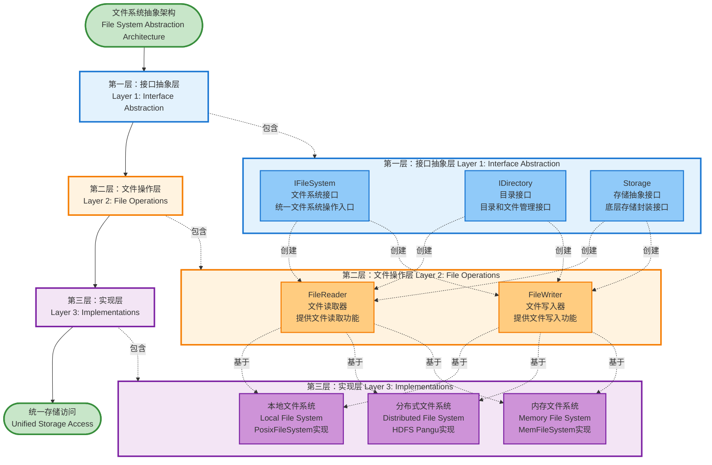
```mermaid
flowchart TB
    Start([文件系统抽象架构<br/>File System Abstraction Architecture]) --> Layer1[第一层：接口抽象层<br/>Layer 1: Interface Abstraction]
    
    subgraph L1["第一层：接口抽象层 Layer 1: Interface Abstraction"]
        direction TB
        L1_1[IFileSystem<br/>文件系统接口<br/>统一文件系统操作入口]
        L1_2[IDirectory<br/>目录接口<br/>目录和文件管理接口]
        L1_3[Storage<br/>存储抽象接口<br/>底层存储封装接口]
    end
    
    Layer1 --> Layer2[第二层：文件操作层<br/>Layer 2: File Operations]
    
    subgraph L2["第二层：文件操作层 Layer 2: File Operations"]
        direction TB
        L2_1[FileReader<br/>文件读取器<br/>提供文件读取功能]
        L2_2[FileWriter<br/>文件写入器<br/>提供文件写入功能]
    end
    
    Layer2 --> Layer3[第三层：实现层<br/>Layer 3: Implementations]
    
    subgraph L3["第三层：实现层 Layer 3: Implementations"]
        direction TB
        L3_1[本地文件系统<br/>Local File System<br/>PosixFileSystem实现]
        L3_2[分布式文件系统<br/>Distributed File System<br/>HDFS Pangu实现]
        L3_3[内存文件系统<br/>Memory File System<br/>MemFileSystem实现]
    end
    
    Layer3 --> End([统一存储访问<br/>Unified Storage Access])
    
    Layer1 -.->|包含| L1
    Layer2 -.->|包含| L2
    Layer3 -.->|包含| L3
    
    L1_1 -.->|创建| L2_1
    L1_2 -.->|创建| L2_1
    L1_3 -.->|创建| L2_1
    L1_1 -.->|创建| L2_2
    L1_2 -.->|创建| L2_2
    L1_3 -.->|创建| L2_2
    
    L2_1 -.->|基于| L3_1
    L2_1 -.->|基于| L3_2
    L2_1 -.->|基于| L3_3
    L2_2 -.->|基于| L3_1
    L2_2 -.->|基于| L3_2
    L2_2 -.->|基于| L3_3
    
    style Start fill:#c8e6c9,stroke:#388e3c,stroke-width:3px
    style End fill:#c8e6c9,stroke:#388e3c,stroke-width:3px
    style Layer1 fill:#e3f2fd,stroke:#1976d2,stroke-width:3px
    style Layer2 fill:#fff3e0,stroke:#f57c00,stroke-width:3px
    style Layer3 fill:#f3e5f5,stroke:#7b1fa2,stroke-width:3px
    style L1 fill:#e3f2fd,stroke:#1976d2,stroke-width:3px
    style L1_1 fill:#90caf9,stroke:#1976d2,stroke-width:2px
    style L1_2 fill:#90caf9,stroke:#1976d2,stroke-width:2px
    style L1_3 fill:#90caf9,stroke:#1976d2,stroke-width:2px
    style L2 fill:#fff3e0,stroke:#f57c00,stroke-width:3px
    style L2_1 fill:#ffcc80,stroke:#f57c00,stroke-width:2px
    style L2_2 fill:#ffcc80,stroke:#f57c00,stroke-width:2px
    style L3 fill:#f3e5f5,stroke:#7b1fa2,stroke-width:3px
    style L3_1 fill:#ce93d8,stroke:#7b1fa2,stroke-width:2px
    style L3_2 fill:#ce93d8,stroke:#7b1fa2,stroke-width:2px
    style L3_3 fill:#ce93d8,stroke:#7b1fa2,stroke-width:2px
```

## 1. 文件系统抽象概览

### 1.1 文件系统抽象的核心概念

IndexLib 的文件系统抽象包括以下核心概念，通过统一的接口屏蔽底层存储差异，支持多种存储后端。让我们先通过类图来理解文件系统抽象的整体架构：

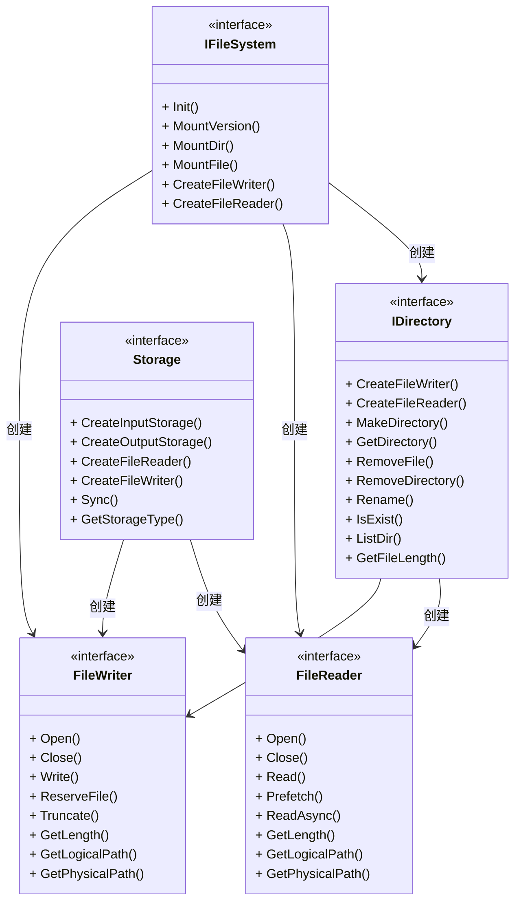
```mermaid
classDiagram
    class IFileSystem {
        <<interface>>
        + Init()
        + MountVersion()
        + MountDir()
        + MountFile()
        + CreateFileWriter()
        + CreateFileReader()
    }
    
    class IDirectory {
        <<interface>>
        + CreateFileWriter()
        + CreateFileReader()
        + MakeDirectory()
        + GetDirectory()
        + RemoveFile()
        + RemoveDirectory()
        + Rename()
        + IsExist()
        + ListDir()
        + GetFileLength()
    }
    
    class FileReader {
        <<interface>>
        + Open()
        + Close()
        + Read()
        + Prefetch()
        + ReadAsync()
        + GetLength()
        + GetLogicalPath()
        + GetPhysicalPath()
    }
    
    class FileWriter {
        <<interface>>
        + Open()
        + Close()
        + Write()
        + ReserveFile()
        + Truncate()
        + GetLength()
        + GetLogicalPath()
        + GetPhysicalPath()
    }
    
    class Storage {
        <<interface>>
        + CreateInputStorage()
        + CreateOutputStorage()
        + CreateFileReader()
        + CreateFileWriter()
        + Sync()
        + GetStorageType()
    }
    
    IFileSystem --> IDirectory : 创建
    IFileSystem --> FileReader : 创建
    IFileSystem --> FileWriter : 创建
    IDirectory --> FileReader : 创建
    IDirectory --> FileWriter : 创建
    Storage --> FileReader : 创建
    Storage --> FileWriter : 创建
```

**文件系统抽象的核心组件**：

1. **IFileSystem**：文件系统接口，提供文件系统的基本操作
   - 初始化文件系统，设置文件系统选项
   - 挂载版本、目录、文件，实现路径映射
   - 创建文件读取器和写入器
   
2. **IDirectory**：目录接口，提供目录和文件的操作
   - 创建、删除、重命名文件和目录
   - 列出目录内容，检查文件是否存在
   - 获取文件长度等元数据信息
   
3. **FileReader**：文件读取器，提供文件读取功能
   - 同步和异步读取文件数据
   - 预取文件数据，提高读取性能
   - 支持指定偏移量读取
   
4. **FileWriter**：文件写入器，提供文件写入功能
   - 写入文件数据
   - 预留文件空间，支持地址访问模式
   - 截断文件，调整文件大小
   
5. **Storage**：存储抽象，提供底层存储操作
   - 创建输入和输出存储
   - 创建文件读取器和写入器
   - 同步存储，刷新数据到磁盘

### 1.1.1 组件关系图

文件系统抽象的核心组件包括 IFileSystem、IDirectory、FileReader、FileWriter，它们之间的关系如下：

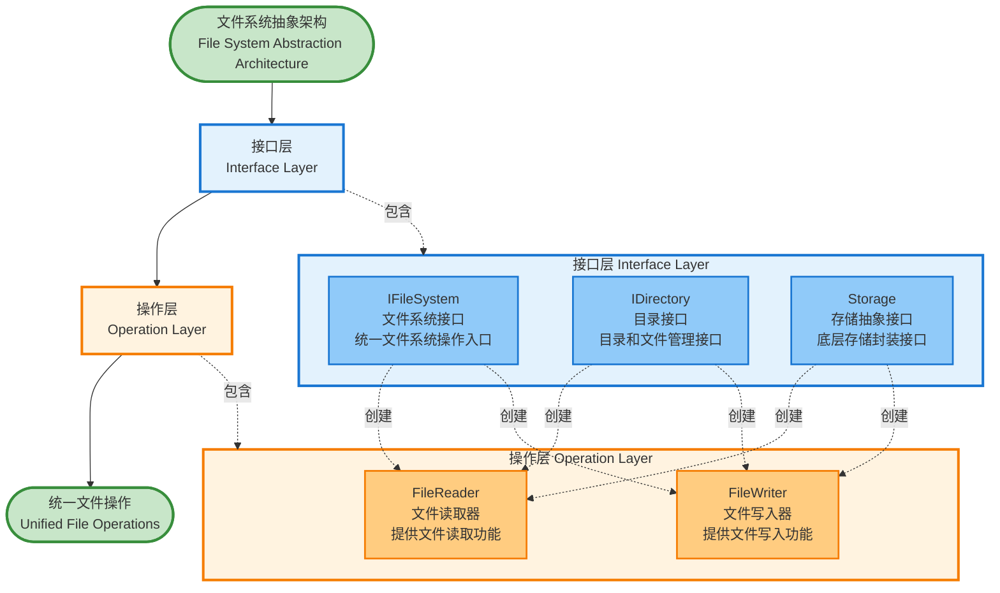
```mermaid
flowchart TB
    Start([文件系统抽象架构<br/>File System Abstraction Architecture]) --> InterfaceLayer[接口层<br/>Interface Layer]
    
    subgraph InterfaceGroup["接口层 Interface Layer"]
        direction TB
        I1[IFileSystem<br/>文件系统接口<br/>统一文件系统操作入口]
        I2[IDirectory<br/>目录接口<br/>目录和文件管理接口]
        I3[Storage<br/>存储抽象接口<br/>底层存储封装接口]
    end
    
    InterfaceLayer --> OperationLayer[操作层<br/>Operation Layer]
    
    subgraph OperationGroup["操作层 Operation Layer"]
        direction TB
        O1[FileReader<br/>文件读取器<br/>提供文件读取功能]
        O2[FileWriter<br/>文件写入器<br/>提供文件写入功能]
    end
    
    OperationLayer --> End([统一文件操作<br/>Unified File Operations])
    
    InterfaceLayer -.->|包含| InterfaceGroup
    OperationLayer -.->|包含| OperationGroup
    
    I1 -.->|创建| O1
    I1 -.->|创建| O2
    I2 -.->|创建| O1
    I2 -.->|创建| O2
    I3 -.->|创建| O1
    I3 -.->|创建| O2
    
    style Start fill:#c8e6c9,stroke:#388e3c,stroke-width:3px
    style End fill:#c8e6c9,stroke:#388e3c,stroke-width:3px
    style InterfaceLayer fill:#e3f2fd,stroke:#1976d2,stroke-width:3px
    style OperationLayer fill:#fff3e0,stroke:#f57c00,stroke-width:3px
    style InterfaceGroup fill:#e3f2fd,stroke:#1976d2,stroke-width:3px
    style I1 fill:#90caf9,stroke:#1976d2,stroke-width:2px
    style I2 fill:#90caf9,stroke:#1976d2,stroke-width:2px
    style I3 fill:#90caf9,stroke:#1976d2,stroke-width:2px
    style OperationGroup fill:#fff3e0,stroke:#f57c00,stroke-width:3px
    style O1 fill:#ffcc80,stroke:#f57c00,stroke-width:2px
    style O2 fill:#ffcc80,stroke:#f57c00,stroke-width:2px
```

### 1.2 文件系统抽象的作用

文件系统抽象在 IndexLib 中起到关键作用，是存储管理的基础。下面通过流程图展示文件系统抽象的整体工作流程：


```mermaid
flowchart TB
    Start([开始<br/>Start]) --> InitLayer[初始化层<br/>Initialization Layer]
    
    subgraph InitGroup["初始化 Initialization"]
        direction TB
        I1[Init 文件系统<br/>Initialize File System<br/>设置文件系统选项]
        I2[挂载版本<br/>Mount Version<br/>挂载指定版本]
        I3[挂载目录<br/>Mount Directory<br/>挂载目录路径]
    end
    
    InitLayer --> WriteLayer[写入操作层<br/>Write Operation Layer]
    
    subgraph WriteGroup["写入操作 Write Operation"]
        direction TB
        W1{需要创建写入器?<br/>Need Writer?}
        W2[获取目录<br/>Get Directory<br/>获取目录对象]
        W3[创建文件写入器<br/>Create File Writer<br/>创建写入器对象]
        W4[写入文件<br/>Write File<br/>写入文件数据]
        W5[关闭写入器<br/>Close Writer<br/>释放资源]
    end
    
    WriteLayer --> ReadLayer[读取操作层<br/>Read Operation Layer]
    
    subgraph ReadGroup["读取操作 Read Operation"]
        direction TB
        R1{需要创建读取器?<br/>Need Reader?}
        R2[获取目录<br/>Get Directory<br/>获取目录对象]
        R3[创建文件读取器<br/>Create File Reader<br/>创建读取器对象]
        R4[读取文件<br/>Read File<br/>读取文件数据]
        R5[关闭读取器<br/>Close Reader<br/>释放资源]
    end
    
    ReadLayer --> End([结束<br/>End])
    
    InitLayer -.->|包含| InitGroup
    WriteLayer -.->|包含| WriteGroup
    ReadLayer -.->|包含| ReadGroup
    
    I1 --> I2
    I2 --> I3
    I3 --> W1
    W1 -->|是| W2
    W1 -->|否| R1
    W2 --> W3
    W3 --> W4
    W4 --> W5
    W5 --> R1
    R1 -->|是| R2
    R1 -->|否| End
    R2 --> R3
    R3 --> R4
    R4 --> R5
    R5 --> End
    
    style Start fill:#c8e6c9,stroke:#388e3c,stroke-width:3px
    style End fill:#c8e6c9,stroke:#388e3c,stroke-width:3px
    style InitLayer fill:#e3f2fd,stroke:#1976d2,stroke-width:3px
    style WriteLayer fill:#fff3e0,stroke:#f57c00,stroke-width:3px
    style ReadLayer fill:#f3e5f5,stroke:#7b1fa2,stroke-width:3px
    style InitGroup fill:#e3f2fd,stroke:#1976d2,stroke-width:3px
    style I1 fill:#90caf9,stroke:#1976d2,stroke-width:2px
    style I2 fill:#90caf9,stroke:#1976d2,stroke-width:2px
    style I3 fill:#90caf9,stroke:#1976d2,stroke-width:2px
    style WriteGroup fill:#fff3e0,stroke:#f57c00,stroke-width:3px
    style W1 fill:#ffcc80,stroke:#f57c00,stroke-width:2px
    style W2 fill:#ffcc80,stroke:#f57c00,stroke-width:2px
    style W3 fill:#ffcc80,stroke:#f57c00,stroke-width:2px
    style W4 fill:#ffcc80,stroke:#f57c00,stroke-width:2px
    style W5 fill:#ffcc80,stroke:#f57c00,stroke-width:2px
    style ReadGroup fill:#f3e5f5,stroke:#7b1fa2,stroke-width:3px
    style R1 fill:#ce93d8,stroke:#7b1fa2,stroke-width:2px
    style R2 fill:#ce93d8,stroke:#7b1fa2,stroke-width:2px
    style R3 fill:#ce93d8,stroke:#7b1fa2,stroke-width:2px
    style R4 fill:#ce93d8,stroke:#7b1fa2,stroke-width:2px
    style R5 fill:#ce93d8,stroke:#7b1fa2,stroke-width:2px
```

**文件系统抽象的核心作用**：

1. **统一接口**：通过统一的接口屏蔽底层存储差异，支持多种存储后端
   - 本地文件系统、分布式文件系统（HDFS）、内存文件系统等
   - 上层代码无需关心底层存储实现
   - 支持存储后端的动态切换
   
2. **逻辑路径**：通过逻辑路径管理文件，支持版本管理和 Segment 管理
   - 物理路径映射到逻辑路径，实现路径抽象
   - 支持版本挂载，不同版本的文件可以共存
   - 支持 Segment 管理，每个 Segment 有独立的路径空间
   
3. **缓存机制**：通过缓存机制提高文件访问性能
   - 文件内容缓存，减少磁盘读取
   - 元数据缓存，减少元数据查询
   - 预取缓存，提前加载可能访问的文件
   
4. **存储格式**：支持多种存储格式（Package、Archive 等），优化存储效率
   - Package 格式：打包多个小文件，减少文件数量
   - Archive 格式：归档存储，支持压缩和索引
   - 压缩格式：支持多种压缩算法，减少存储空间

## 2. IFileSystem：文件系统接口

### 2.1 IFileSystem 的结构

`IFileSystem` 是文件系统接口，定义在 `file_system/IFileSystem.h` 中。它提供了文件系统的基本操作，包括初始化、挂载、文件读写等。IFileSystem 的完整接口定义如下：

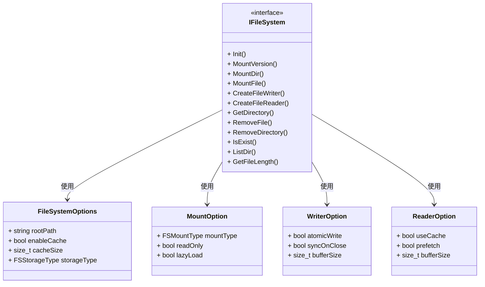
```mermaid
classDiagram
    class IFileSystem {
        <<interface>>
        + Init()
        + MountVersion()
        + MountDir()
        + MountFile()
        + CreateFileWriter()
        + CreateFileReader()
        + GetDirectory()
        + RemoveFile()
        + RemoveDirectory()
        + IsExist()
        + ListDir()
        + GetFileLength()
    }
    
    class FileSystemOptions {
        + string rootPath
        + bool enableCache
        + size_t cacheSize
        + FSStorageType storageType
    }
    
    class MountOption {
        + FSMountType mountType
        + bool readOnly
        + bool lazyLoad
    }
    
    class WriterOption {
        + bool atomicWrite
        + bool syncOnClose
        + size_t bufferSize
    }
    
    class ReaderOption {
        + bool useCache
        + bool prefetch
        + size_t bufferSize
    }
    
    IFileSystem --> FileSystemOptions : 使用
    IFileSystem --> MountOption : 使用
    IFileSystem --> WriterOption : 使用
    IFileSystem --> ReaderOption : 使用
```

**IFileSystem 的完整定义**：

```cpp
// file_system/IFileSystem.h
class IFileSystem : autil::NoMoveable
{
public:
    // 初始化文件系统
    virtual FSResult<void> Init(const FileSystemOptions& fileSystemOptions) = 0;
    
    // 挂载版本：将物理路径映射到逻辑路径
    virtual FSResult<void> MountVersion(
        const std::string& physicalRoot,      // 物理根路径
        versionid_t versionId,                 // 版本ID
        const std::string& logicalPath,       // 逻辑路径
        MountOption mountOption) = 0;
    
    // 挂载目录：支持目录级别的挂载
    virtual FSResult<void> MountDir(
        const std::string& physicalRoot,      // 物理根路径
        const std::string& physicalPath,      // 物理路径
        const std::string& logicalPath,      // 逻辑路径
        MountOption mountOption) = 0;
    
    // 挂载文件：支持文件级别的挂载
    virtual FSResult<void> MountFile(
        const std::string& physicalRoot,      // 物理根路径
        const std::string& physicalPath,      // 物理路径
        const std::string& logicalPath,      // 逻辑路径
        FSMountType mountType) = 0;
    
    // 创建文件写入器
    virtual FSResult<std::shared_ptr<FileWriter>> CreateFileWriter(
        const std::string& rawPath,          // 原始路径（逻辑路径或物理路径）
        const WriterOption& writerOption) = 0;
    
    // 创建文件读取器
    virtual FSResult<std::shared_ptr<FileReader>> CreateFileReader(
        const std::string& rawPath,          // 原始路径（逻辑路径或物理路径）
        const ReaderOption& readerOption) = 0;
    
    // 获取目录
    virtual FSResult<std::shared_ptr<IDirectory>> GetDirectory(
        const std::string& logicalPath) = 0;
    
    // 删除文件
    virtual FSResult<void> RemoveFile(
        const std::string& logicalPath,
        const RemoveOption& removeOption) = 0;
    
    // 删除目录
    virtual FSResult<void> RemoveDirectory(
        const std::string& logicalPath,
        const RemoveOption& removeOption) = 0;
    
    // 检查文件是否存在
    virtual FSResult<bool> IsExist(const std::string& logicalPath) const = 0;
    
    // 列出目录
    virtual FSResult<void> ListDir(
        const std::string& logicalPath,
        const ListOption& listOption,
        std::vector<std::string>& fileList) const = 0;
    
    // 获取文件长度
    virtual FSResult<size_t> GetFileLength(const std::string& logicalPath) const = 0;
    
    // 同步文件系统
    virtual FSResult<void> Sync(bool waitFinish = true) = 0;
    
    // 获取文件系统类型
    virtual FSStorageType GetStorageType() const = 0;
};
```

**IFileSystem 的关键方法详解**：

1. **Init()**：初始化文件系统，设置文件系统选项
   - 设置根路径、缓存选项、存储类型等
   - 初始化底层存储系统
   - 创建必要的目录结构
   
2. **MountVersion()**：挂载版本，将物理路径映射到逻辑路径
   - 将版本目录挂载到逻辑路径
   - 支持只读和读写挂载
   - 支持延迟加载，按需加载文件
   
3. **MountDir()**：挂载目录，支持目录级别的挂载
   - 将物理目录挂载到逻辑路径
   - 支持递归挂载子目录
   - 支持挂载选项（只读、延迟加载等）
   
4. **MountFile()**：挂载文件，支持文件级别的挂载
   - 将物理文件挂载到逻辑路径
   - 支持不同的挂载类型（只读、读写等）
   
5. **CreateFileWriter()**：创建文件写入器
   - 根据路径类型（逻辑路径或物理路径）创建写入器
   - 支持写入选项（原子写入、同步关闭等）
   
6. **CreateFileReader()**：创建文件读取器
   - 根据路径类型（逻辑路径或物理路径）创建读取器
   - 支持读取选项（使用缓存、预取等）

IFileSystem 接口：提供文件系统的基本操作：

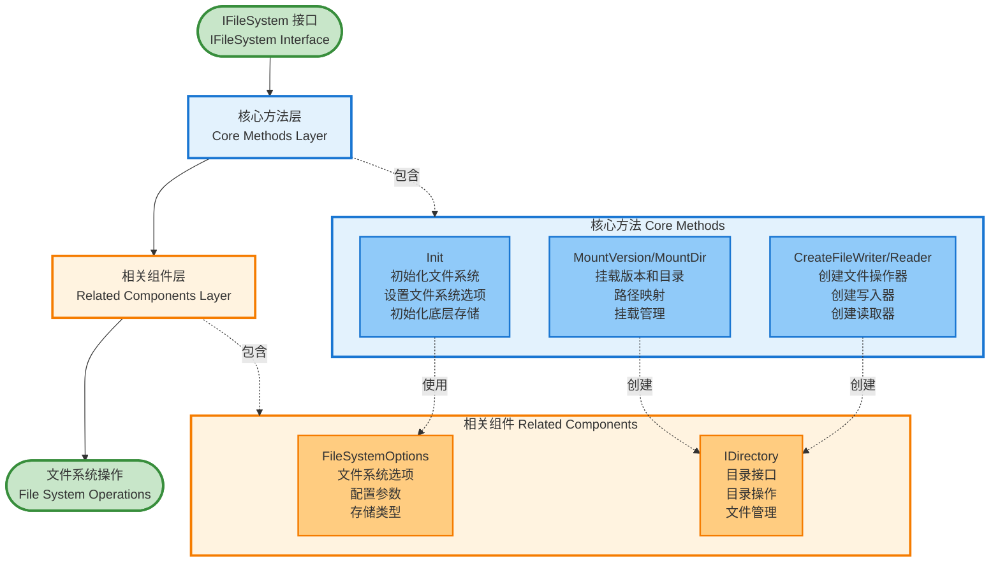
```mermaid
flowchart TB
    Start([IFileSystem 接口<br/>IFileSystem Interface]) --> MethodLayer[核心方法层<br/>Core Methods Layer]
    
    subgraph MethodGroup["核心方法 Core Methods"]
        direction TB
        M1[Init<br/>初始化文件系统<br/>设置文件系统选项<br/>初始化底层存储]
        M2[MountVersion/MountDir<br/>挂载版本和目录<br/>路径映射<br/>挂载管理]
        M3[CreateFileWriter/Reader<br/>创建文件操作器<br/>创建写入器<br/>创建读取器]
    end
    
    MethodLayer --> ComponentLayer[相关组件层<br/>Related Components Layer]
    
    subgraph ComponentGroup["相关组件 Related Components"]
        direction TB
        C1[FileSystemOptions<br/>文件系统选项<br/>配置参数<br/>存储类型]
        C2[IDirectory<br/>目录接口<br/>目录操作<br/>文件管理]
    end
    
    ComponentLayer --> End([文件系统操作<br/>File System Operations])
    
    MethodLayer -.->|包含| MethodGroup
    ComponentLayer -.->|包含| ComponentGroup
    
    M1 -.->|使用| C1
    M2 -.->|创建| C2
    M3 -.->|创建| C2
    
    style Start fill:#c8e6c9,stroke:#388e3c,stroke-width:3px
    style End fill:#c8e6c9,stroke:#388e3c,stroke-width:3px
    style MethodLayer fill:#e3f2fd,stroke:#1976d2,stroke-width:3px
    style ComponentLayer fill:#fff3e0,stroke:#f57c00,stroke-width:3px
    style MethodGroup fill:#e3f2fd,stroke:#1976d2,stroke-width:3px
    style M1 fill:#90caf9,stroke:#1976d2,stroke-width:2px
    style M2 fill:#90caf9,stroke:#1976d2,stroke-width:2px
    style M3 fill:#90caf9,stroke:#1976d2,stroke-width:2px
    style ComponentGroup fill:#fff3e0,stroke:#f57c00,stroke-width:3px
    style C1 fill:#ffcc80,stroke:#f57c00,stroke-width:2px
    style C2 fill:#ffcc80,stroke:#f57c00,stroke-width:2px
```

### 2.2 逻辑路径与物理路径

文件系统抽象通过逻辑路径和物理路径管理文件，实现路径抽象和版本管理。路径映射的机制如下：

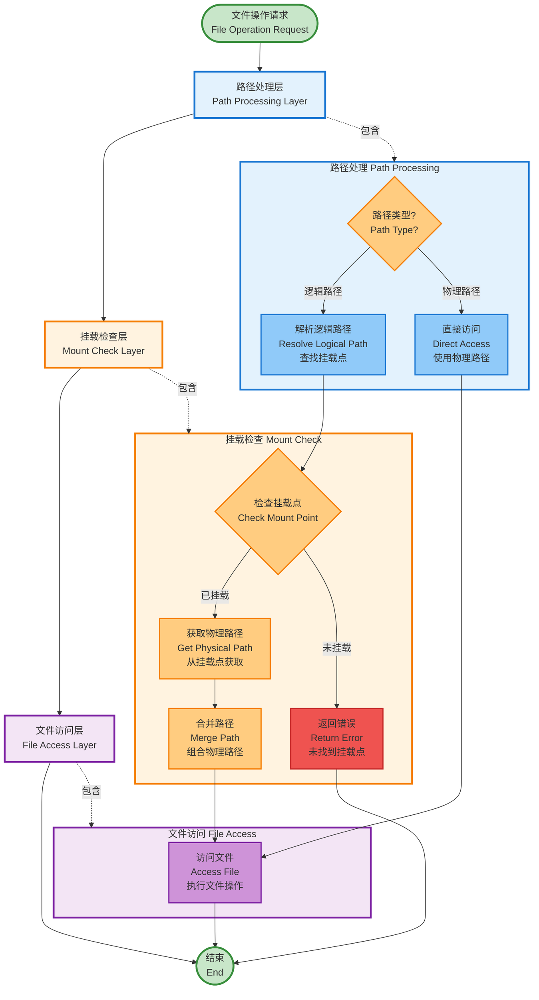
```mermaid
flowchart TB
    Start([文件操作请求<br/>File Operation Request]) --> PathLayer[路径处理层<br/>Path Processing Layer]
    
    subgraph PathGroup["路径处理 Path Processing"]
        direction TB
        P1{路径类型?<br/>Path Type?}
        P2[解析逻辑路径<br/>Resolve Logical Path<br/>查找挂载点]
        P3[直接访问<br/>Direct Access<br/>使用物理路径]
    end
    
    PathLayer --> MountLayer[挂载检查层<br/>Mount Check Layer]
    
    subgraph MountGroup["挂载检查 Mount Check"]
        direction TB
        M1{检查挂载点<br/>Check Mount Point}
        M2[获取物理路径<br/>Get Physical Path<br/>从挂载点获取]
        M3[合并路径<br/>Merge Path<br/>组合物理路径]
        M4[返回错误<br/>Return Error<br/>未找到挂载点]
    end
    
    MountLayer --> AccessLayer[文件访问层<br/>File Access Layer]
    
    subgraph AccessGroup["文件访问 File Access"]
        direction TB
        A1[访问文件<br/>Access File<br/>执行文件操作]
    end
    
    AccessLayer --> End([结束<br/>End])
    
    PathLayer -.->|包含| PathGroup
    MountLayer -.->|包含| MountGroup
    AccessLayer -.->|包含| AccessGroup
    
    P1 -->|逻辑路径| P2
    P1 -->|物理路径| P3
    P2 --> M1
    M1 -->|已挂载| M2
    M1 -->|未挂载| M4
    M2 --> M3
    M3 --> A1
    P3 --> A1
    M4 --> End
    A1 --> End
    
    style Start fill:#c8e6c9,stroke:#388e3c,stroke-width:3px
    style End fill:#c8e6c9,stroke:#388e3c,stroke-width:3px
    style PathLayer fill:#e3f2fd,stroke:#1976d2,stroke-width:3px
    style MountLayer fill:#fff3e0,stroke:#f57c00,stroke-width:3px
    style AccessLayer fill:#f3e5f5,stroke:#7b1fa2,stroke-width:3px
    style PathGroup fill:#e3f2fd,stroke:#1976d2,stroke-width:3px
    style P1 fill:#ffcc80,stroke:#f57c00,stroke-width:2px
    style P2 fill:#90caf9,stroke:#1976d2,stroke-width:2px
    style P3 fill:#90caf9,stroke:#1976d2,stroke-width:2px
    style MountGroup fill:#fff3e0,stroke:#f57c00,stroke-width:3px
    style M1 fill:#ffcc80,stroke:#f57c00,stroke-width:2px
    style M2 fill:#ffcc80,stroke:#f57c00,stroke-width:2px
    style M3 fill:#ffcc80,stroke:#f57c00,stroke-width:2px
    style M4 fill:#ef5350,stroke:#c62828,stroke-width:2px
    style AccessGroup fill:#f3e5f5,stroke:#7b1fa2,stroke-width:3px
    style A1 fill:#ce93d8,stroke:#7b1fa2,stroke-width:2px
```

**路径映射的实现**：

```cpp
// file_system/FileSystem.cpp
class FileSystem : public IFileSystem
{
private:
    struct MountPoint {
        std::string physicalPath;    // 物理路径
        std::string logicalPath;    // 逻辑路径
        FSMountType mountType;      // 挂载类型
        bool readOnly;              // 是否只读
    };
    
    std::map<std::string, MountPoint> _mountPoints;  // 挂载点映射
    
public:
    FSResult<std::string> ResolvePath(const std::string& logicalPath) const {
        // 1. 查找最长的匹配挂载点
        std::string bestMatch;
        size_t bestMatchLen = 0;
        
        for (const auto& [logical, mount] : _mountPoints) {
            if (logicalPath.find(logical) == 0) {
                if (logical.length() > bestMatchLen) {
                    bestMatch = logical;
                    bestMatchLen = logical.length();
                }
            }
        }
        
        if (bestMatch.empty()) {
            return FSResult<std::string>::Error("No mount point found");
        }
        
        // 2. 替换逻辑路径为物理路径
        const auto& mount = _mountPoints.at(bestMatch);
        std::string relativePath = logicalPath.substr(bestMatch.length());
        std::string physicalPath = mount.physicalPath + relativePath;
        
        return FSResult<std::string>::OK(physicalPath);
    }
};
```

**路径映射的关键概念**：

1. **物理路径**：文件在磁盘上的实际路径
   - 例如：`/data/indexlib/version_1/segment_0/index`
   - 直接对应磁盘上的文件位置
   
2. **逻辑路径**：文件在逻辑文件系统中的路径
   - 例如：`/indexlib/version_1/segment_0/index`
   - 通过挂载点映射到物理路径
   
3. **路径映射**：通过 Mount 操作将物理路径映射到逻辑路径
   - 支持版本级别的挂载：`MountVersion("/data/indexlib", 1, "/indexlib/v1")`
   - 支持目录级别的挂载：`MountDir("/data/indexlib/seg0", "/indexlib/seg0")`
   - 支持文件级别的挂载：`MountFile("/data/indexlib/file", "/indexlib/file")`
   
4. **版本管理**：通过逻辑路径支持版本管理和 Segment 管理
   - 不同版本的文件可以共存，通过逻辑路径区分
   - 每个 Segment 有独立的路径空间
   - 支持版本切换，无需修改代码

逻辑路径与物理路径：从物理路径到逻辑路径的映射：

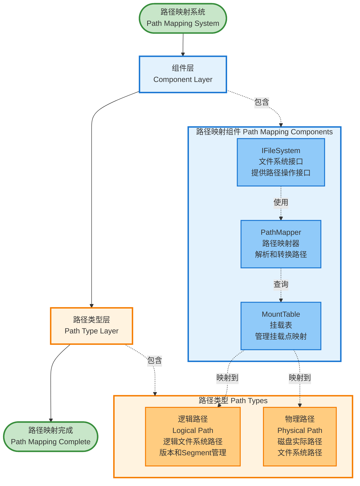
```mermaid
flowchart TB
    Start([路径映射系统<br/>Path Mapping System]) --> ComponentLayer[组件层<br/>Component Layer]
    
    subgraph ComponentGroup["路径映射组件 Path Mapping Components"]
        direction TB
        C1[IFileSystem<br/>文件系统接口<br/>提供路径操作接口]
        C2[PathMapper<br/>路径映射器<br/>解析和转换路径]
        C3[MountTable<br/>挂载表<br/>管理挂载点映射]
    end
    
    ComponentLayer --> PathLayer[路径类型层<br/>Path Type Layer]
    
    subgraph PathGroup["路径类型 Path Types"]
        direction TB
        P1[逻辑路径<br/>Logical Path<br/>逻辑文件系统路径<br/>版本和Segment管理]
        P2[物理路径<br/>Physical Path<br/>磁盘实际路径<br/>文件系统路径]
    end
    
    PathLayer --> End([路径映射完成<br/>Path Mapping Complete])
    
    ComponentLayer -.->|包含| ComponentGroup
    PathLayer -.->|包含| PathGroup
    
    C1 -.->|使用| C2
    C2 -.->|查询| C3
    C3 -.->|映射到| P1
    C3 -.->|映射到| P2
    
    style Start fill:#c8e6c9,stroke:#388e3c,stroke-width:3px
    style End fill:#c8e6c9,stroke:#388e3c,stroke-width:3px
    style ComponentLayer fill:#e3f2fd,stroke:#1976d2,stroke-width:3px
    style PathLayer fill:#fff3e0,stroke:#f57c00,stroke-width:3px
    style ComponentGroup fill:#e3f2fd,stroke:#1976d2,stroke-width:3px
    style C1 fill:#90caf9,stroke:#1976d2,stroke-width:2px
    style C2 fill:#90caf9,stroke:#1976d2,stroke-width:2px
    style C3 fill:#90caf9,stroke:#1976d2,stroke-width:2px
    style PathGroup fill:#fff3e0,stroke:#f57c00,stroke-width:3px
    style P1 fill:#ffcc80,stroke:#f57c00,stroke-width:2px
    style P2 fill:#ffcc80,stroke:#f57c00,stroke-width:2px
```

### 2.3 文件系统类型

IndexLib 支持多种文件系统类型，包括本地文件系统、分布式文件系统、内存文件系统等。各种文件系统类型及其关系如下：

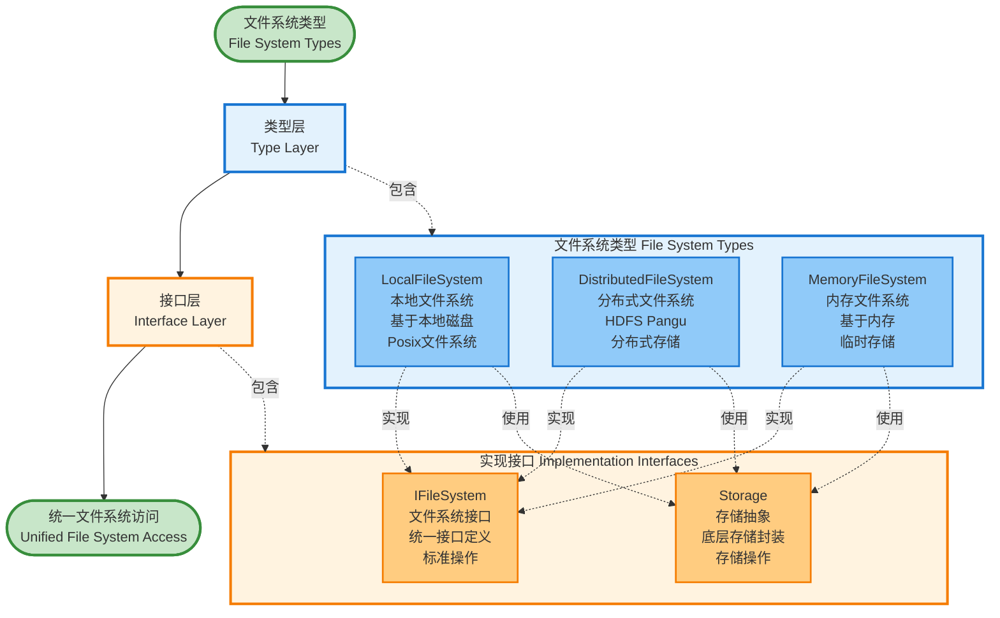
```mermaid
flowchart TB
    Start([文件系统类型<br/>File System Types]) --> TypeLayer[类型层<br/>Type Layer]
    
    subgraph TypeGroup["文件系统类型 File System Types"]
        direction TB
        T1[LocalFileSystem<br/>本地文件系统<br/>基于本地磁盘<br/>Posix文件系统]
        T2[DistributedFileSystem<br/>分布式文件系统<br/>HDFS Pangu<br/>分布式存储]
        T3[MemoryFileSystem<br/>内存文件系统<br/>基于内存<br/>临时存储]
    end
    
    TypeLayer --> InterfaceLayer[接口层<br/>Interface Layer]
    
    subgraph InterfaceGroup["实现接口 Implementation Interfaces"]
        direction TB
        I1[IFileSystem<br/>文件系统接口<br/>统一接口定义<br/>标准操作]
        I2[Storage<br/>存储抽象<br/>底层存储封装<br/>存储操作]
    end
    
    InterfaceLayer --> End([统一文件系统访问<br/>Unified File System Access])
    
    TypeLayer -.->|包含| TypeGroup
    InterfaceLayer -.->|包含| InterfaceGroup
    
    T1 -.->|实现| I1
    T2 -.->|实现| I1
    T3 -.->|实现| I1
    T1 -.->|使用| I2
    T2 -.->|使用| I2
    T3 -.->|使用| I2
    
    style Start fill:#c8e6c9,stroke:#388e3c,stroke-width:3px
    style End fill:#c8e6c9,stroke:#388e3c,stroke-width:3px
    style TypeLayer fill:#e3f2fd,stroke:#1976d2,stroke-width:3px
    style InterfaceLayer fill:#fff3e0,stroke:#f57c00,stroke-width:3px
    style TypeGroup fill:#e3f2fd,stroke:#1976d2,stroke-width:3px
    style T1 fill:#90caf9,stroke:#1976d2,stroke-width:2px
    style T2 fill:#90caf9,stroke:#1976d2,stroke-width:2px
    style T3 fill:#90caf9,stroke:#1976d2,stroke-width:2px
    style InterfaceGroup fill:#fff3e0,stroke:#f57c00,stroke-width:3px
    style I1 fill:#ffcc80,stroke:#f57c00,stroke-width:2px
    style I2 fill:#ffcc80,stroke:#f57c00,stroke-width:2px
```

**文件系统类型**：
- **本地文件系统**：基于本地文件系统的实现
- **分布式文件系统**：基于分布式文件系统的实现（如 HDFS）
- **内存文件系统**：基于内存的文件系统实现
- **混合文件系统**：支持多种存储后端的混合实现

## 3. IDirectory：目录接口

### 3.1 IDirectory 的结构

`IDirectory` 是目录接口，定义在 `file_system/IDirectory.h` 中：

```cpp
// file_system/IDirectory.h
class IDirectory
{
public:
    // 创建文件写入器
    virtual FSResult<std::shared_ptr<FileWriter>> CreateFileWriter(
        const std::string& filePath,
        const WriterOption& writerOption) = 0;
    
    // 创建文件读取器
    virtual FSResult<std::shared_ptr<FileReader>> CreateFileReader(
        const std::string& filePath,
        const ReaderOption& readerOption) = 0;
    
    // 创建目录
    virtual FSResult<std::shared_ptr<IDirectory>> MakeDirectory(
        const std::string& dirPath,
        const DirectoryOption& directoryOption) = 0;
    
    // 获取目录
    virtual FSResult<std::shared_ptr<IDirectory>> GetDirectory(
        const std::string& dirPath) = 0;
    
    // 删除文件
    virtual FSResult<void> RemoveFile(
        const std::string& filePath,
        const RemoveOption& removeOption) = 0;
    
    // 删除目录
    virtual FSResult<void> RemoveDirectory(
        const std::string& dirPath,
        const RemoveOption& removeOption) = 0;
    
    // 重命名
    virtual FSResult<void> Rename(
        const std::string& srcPath,
        const std::shared_ptr<IDirectory>& destDirectory,
        const std::string& destPath) = 0;
    
    // 检查文件是否存在
    virtual FSResult<bool> IsExist(const std::string& path) const = 0;
    
    // 列出目录
    virtual FSResult<void> ListDir(
        const std::string& path,
        const ListOption& listOption,
        std::vector<std::string>& fileList) const = 0;
    
    // 获取文件长度
    virtual FSResult<size_t> GetFileLength(const std::string& filePath) const = 0;
};
```

**IDirectory 的关键方法**：

IDirectory 接口：提供目录和文件的操作：

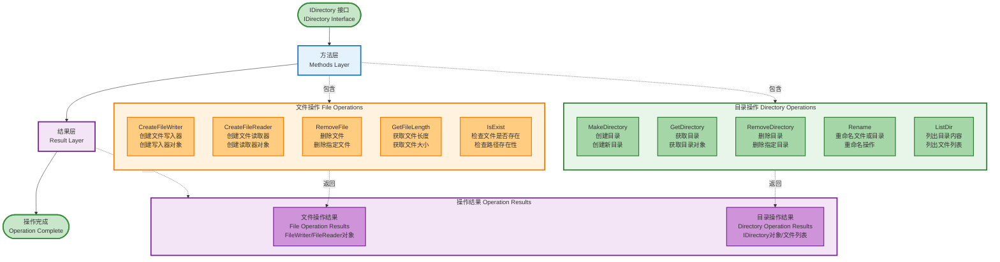
```mermaid
flowchart TB
    Start([IDirectory 接口<br/>IDirectory Interface]) --> MethodLayer[方法层<br/>Methods Layer]
    
    subgraph FileOpsGroup["文件操作 File Operations"]
        direction TB
        FO1[CreateFileWriter<br/>创建文件写入器<br/>创建写入器对象]
        FO2[CreateFileReader<br/>创建文件读取器<br/>创建读取器对象]
        FO3[RemoveFile<br/>删除文件<br/>删除指定文件]
        FO4[GetFileLength<br/>获取文件长度<br/>获取文件大小]
        FO5[IsExist<br/>检查文件是否存在<br/>检查路径存在性]
    end
    
    subgraph DirOpsGroup["目录操作 Directory Operations"]
        direction TB
        DO1[MakeDirectory<br/>创建目录<br/>创建新目录]
        DO2[GetDirectory<br/>获取目录<br/>获取目录对象]
        DO3[RemoveDirectory<br/>删除目录<br/>删除指定目录]
        DO4[Rename<br/>重命名文件或目录<br/>重命名操作]
        DO5[ListDir<br/>列出目录内容<br/>列出文件列表]
    end
    
    MethodLayer --> ResultLayer[结果层<br/>Result Layer]
    
    subgraph ResultGroup["操作结果 Operation Results"]
        direction TB
        R1[文件操作结果<br/>File Operation Results<br/>FileWriter/FileReader对象]
        R2[目录操作结果<br/>Directory Operation Results<br/>IDirectory对象/文件列表]
    end
    
    ResultLayer --> End([操作完成<br/>Operation Complete])
    
    MethodLayer -.->|包含| FileOpsGroup
    MethodLayer -.->|包含| DirOpsGroup
    ResultLayer -.->|包含| ResultGroup
    
    FileOpsGroup -.->|返回| R1
    DirOpsGroup -.->|返回| R2
    
    style Start fill:#c8e6c9,stroke:#388e3c,stroke-width:3px
    style End fill:#c8e6c9,stroke:#388e3c,stroke-width:3px
    style MethodLayer fill:#e3f2fd,stroke:#1976d2,stroke-width:3px
    style ResultLayer fill:#f3e5f5,stroke:#7b1fa2,stroke-width:3px
    style FileOpsGroup fill:#fff3e0,stroke:#f57c00,stroke-width:3px
    style FO1 fill:#ffcc80,stroke:#f57c00,stroke-width:2px
    style FO2 fill:#ffcc80,stroke:#f57c00,stroke-width:2px
    style FO3 fill:#ffcc80,stroke:#f57c00,stroke-width:2px
    style FO4 fill:#ffcc80,stroke:#f57c00,stroke-width:2px
    style FO5 fill:#ffcc80,stroke:#f57c00,stroke-width:2px
    style DirOpsGroup fill:#e8f5e9,stroke:#2e7d32,stroke-width:3px
    style DO1 fill:#a5d6a7,stroke:#2e7d32,stroke-width:2px
    style DO2 fill:#a5d6a7,stroke:#2e7d32,stroke-width:2px
    style DO3 fill:#a5d6a7,stroke:#2e7d32,stroke-width:2px
    style DO4 fill:#a5d6a7,stroke:#2e7d32,stroke-width:2px
    style DO5 fill:#a5d6a7,stroke:#2e7d32,stroke-width:2px
    style ResultGroup fill:#f3e5f5,stroke:#7b1fa2,stroke-width:3px
    style R1 fill:#ce93d8,stroke:#7b1fa2,stroke-width:2px
    style R2 fill:#ce93d8,stroke:#7b1fa2,stroke-width:2px
```

- **CreateFileWriter()**：创建文件写入器
- **CreateFileReader()**：创建文件读取器
- **MakeDirectory()**：创建目录
- **GetDirectory()**：获取目录
- **RemoveFile()**：删除文件
- **RemoveDirectory()**：删除目录
- **Rename()**：重命名文件或目录
- **IsExist()**：检查文件是否存在
- **ListDir()**：列出目录内容
- **GetFileLength()**：获取文件长度

### 3.2 目录操作流程

目录操作的流程：

目录操作流程：从创建目录到文件操作的完整流程：


```mermaid
flowchart TB
    Start([IDirectory 操作<br/>IDirectory Operations]) --> DirectoryLayer[目录操作层<br/>Directory Operations Layer]
    
    subgraph DirectoryGroup["IDirectory 核心操作 Core Operations"]
        direction TB
        D1[GetDirectory<br/>获取子目录<br/>获取目录对象]
        D2[CreateFileWriter<br/>创建文件写入器<br/>创建写入器对象]
        D3[CreateFileReader<br/>创建文件读取器<br/>创建读取器对象]
        D4[MakeDirectory<br/>创建目录<br/>创建新目录]
        D5[RemoveFile<br/>删除文件<br/>删除指定文件]
        D6[RemoveDirectory<br/>删除目录<br/>删除指定目录]
        D7[Rename<br/>重命名文件或目录<br/>重命名操作]
        D8[IsExist<br/>检查文件是否存在<br/>检查路径存在性]
        D9[ListDir<br/>列出目录内容<br/>列出文件列表]
        D10[GetFileLength<br/>获取文件长度<br/>获取文件大小]
    end
    
    DirectoryLayer --> FileOpsLayer[文件操作层<br/>File Operations Layer]
    
    subgraph FileWriterGroup["FileWriter 操作 FileWriter Operations"]
        direction TB
        FW1[Write<br/>写入文件数据<br/>写入数据到文件]
        FW2[ReserveFile<br/>预留文件空间<br/>预留文件大小]
        FW3[Truncate<br/>截断文件<br/>调整文件大小]
    end
    
    subgraph FileReaderGroup["FileReader 操作 FileReader Operations"]
        direction TB
        FR1[Read<br/>读取文件数据<br/>同步读取数据]
        FR2[Prefetch<br/>预取文件数据<br/>提前加载数据]
        FR3[ReadAsync<br/>异步读取<br/>异步读取数据]
    end
    
    FileOpsLayer --> End([操作完成<br/>Operation Complete])
    
    DirectoryLayer -.->|包含| DirectoryGroup
    FileOpsLayer -.->|包含| FileWriterGroup
    FileOpsLayer -.->|包含| FileReaderGroup
    
    D2 -.->|创建| FileWriterGroup
    D3 -.->|创建| FileReaderGroup
    
    style Start fill:#c8e6c9,stroke:#388e3c,stroke-width:3px
    style End fill:#c8e6c9,stroke:#388e3c,stroke-width:3px
    style DirectoryLayer fill:#e3f2fd,stroke:#1976d2,stroke-width:3px
    style FileOpsLayer fill:#fff3e0,stroke:#f57c00,stroke-width:3px
    style DirectoryGroup fill:#e3f2fd,stroke:#1976d2,stroke-width:3px
    style D1 fill:#90caf9,stroke:#1976d2,stroke-width:2px
    style D2 fill:#90caf9,stroke:#1976d2,stroke-width:2px
    style D3 fill:#90caf9,stroke:#1976d2,stroke-width:2px
    style D4 fill:#90caf9,stroke:#1976d2,stroke-width:2px
    style D5 fill:#90caf9,stroke:#1976d2,stroke-width:2px
    style D6 fill:#90caf9,stroke:#1976d2,stroke-width:2px
    style D7 fill:#90caf9,stroke:#1976d2,stroke-width:2px
    style D8 fill:#90caf9,stroke:#1976d2,stroke-width:2px
    style D9 fill:#90caf9,stroke:#1976d2,stroke-width:2px
    style D10 fill:#90caf9,stroke:#1976d2,stroke-width:2px
    style FileWriterGroup fill:#fff3e0,stroke:#f57c00,stroke-width:3px
    style FW1 fill:#ffcc80,stroke:#f57c00,stroke-width:2px
    style FW2 fill:#ffcc80,stroke:#f57c00,stroke-width:2px
    style FW3 fill:#ffcc80,stroke:#f57c00,stroke-width:2px
    style FileReaderGroup fill:#e8f5e9,stroke:#2e7d32,stroke-width:3px
    style FR1 fill:#a5d6a7,stroke:#2e7d32,stroke-width:2px
    style FR2 fill:#a5d6a7,stroke:#2e7d32,stroke-width:2px
    style FR3 fill:#a5d6a7,stroke:#2e7d32,stroke-width:2px
```

**操作流程**：
1. **获取目录**：通过 `GetDirectory()` 获取目录
2. **创建文件**：通过 `CreateFileWriter()` 创建文件写入器
3. **写入文件**：通过 `FileWriter::Write()` 写入文件
4. **读取文件**：通过 `CreateFileReader()` 创建文件读取器
5. **读取数据**：通过 `FileReader::Read()` 读取文件数据

## 4. FileReader 与 FileWriter

### 4.1 FileReader：文件读取器

`FileReader` 是文件读取器，提供文件读取功能，支持同步和异步读取。让我们先通过序列图来理解 FileReader 的完整工作流程：

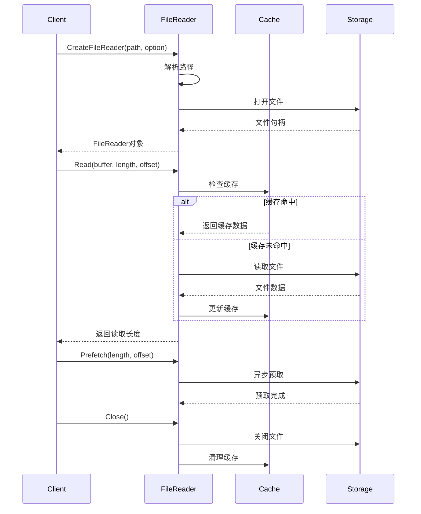
```mermaid
sequenceDiagram
    participant Client
    participant FileReader
    participant Cache
    participant Storage
    
    Client->>FileReader: CreateFileReader(path, option)
    FileReader->>FileReader: 解析路径
    FileReader->>Storage: 打开文件
    Storage-->>FileReader: 文件句柄
    FileReader-->>Client: FileReader对象
    
    Client->>FileReader: Read(buffer, length, offset)
    FileReader->>Cache: 检查缓存
    alt 缓存命中
        Cache-->>FileReader: 返回缓存数据
    else 缓存未命中
        FileReader->>Storage: 读取文件
        Storage-->>FileReader: 文件数据
        FileReader->>Cache: 更新缓存
    end
    FileReader-->>Client: 返回读取长度
    
    Client->>FileReader: Prefetch(length, offset)
    FileReader->>Storage: 异步预取
    Storage-->>FileReader: 预取完成
    
    Client->>FileReader: Close()
    FileReader->>Storage: 关闭文件
    FileReader->>Cache: 清理缓存
```

**FileReader 的完整定义**：

```cpp
// file_system/file/FileReader.h
class FileReader
{
public:
    // 打开文件
    virtual FSResult<void> Open() = 0;
    
    // 关闭文件
    virtual FSResult<void> Close() = 0;
    
    // 读取文件：同步读取
    virtual FSResult<size_t> Read(
        void* buffer,                    // 缓冲区
        size_t length,                   // 读取长度
        size_t offset,                   // 偏移量
        ReadOption option = ReadOption()) = 0;
    
    // 预取文件：异步预取，不阻塞
    virtual FSResult<size_t> Prefetch(
        size_t length,                  // 预取长度
        size_t offset,                  // 偏移量
        ReadOption option) = 0;
    
    // 异步读取：返回 Future
    virtual future_lite::Future<FSResult<size_t>> ReadAsync(
        void* buffer,                   // 缓冲区
        size_t length,                  // 读取长度
        size_t offset,                  // 偏移量
        ReadOption option) = 0;
    
    // 批量读取：读取多个不连续的区域
    virtual FSResult<void> BatchRead(
        const std::vector<ReadRequest>& requests,
        ReadOption option) = 0;
    
    // 获取文件长度
    virtual size_t GetLength() const = 0;
    
    // 获取逻辑路径
    virtual const std::string& GetLogicalPath() const = 0;
    
    // 获取物理路径
    virtual const std::string& GetPhysicalPath() const = 0;
    
    // 获取文件元数据
    virtual FSResult<FileMeta> GetFileMeta() const = 0;
};
```

**FileReader 的实现示例**：

```cpp
// file_system/file/LocalFileReader.cpp
class LocalFileReader : public FileReader
{
private:
    std::string _logicalPath;
    std::string _physicalPath;
    int _fd;
    size_t _fileLength;
    std::shared_ptr<FileCache> _cache;
    
public:
    FSResult<void> Open() override {
        _fd = ::open(_physicalPath.c_str(), O_RDONLY);
        if (_fd < 0) {
            return FSResult<void>::Error("Failed to open file: " + _physicalPath);
        }
        
        // 获取文件长度
        struct stat st;
        if (fstat(_fd, &st) < 0) {
            ::close(_fd);
            return FSResult<void>::Error("Failed to get file length");
        }
        _fileLength = st.st_size;
        
        return FSResult<void>::OK();
    }
    
    FSResult<size_t> Read(void* buffer, size_t length, size_t offset, 
                          ReadOption option) override {
        // 1. 检查缓存
        if (option.useCache && _cache) {
            auto cached = _cache->Get(_physicalPath, offset, length);
            if (cached) {
                memcpy(buffer, cached->data(), length);
                return FSResult<size_t>::OK(length);
            }
        }
        
        // 2. 读取文件
        ssize_t nread = pread(_fd, buffer, length, offset);
        if (nread < 0) {
            return FSResult<size_t>::Error("Failed to read file");
        }
        
        // 3. 更新缓存
        if (option.useCache && _cache) {
            _cache->Put(_physicalPath, offset, buffer, nread);
        }
        
        return FSResult<size_t>::OK(nread);
    }
    
    FSResult<size_t> Prefetch(size_t length, size_t offset, ReadOption option) override {
        // 使用 posix_fadvise 预取
        int ret = posix_fadvise(_fd, offset, length, POSIX_FADV_WILLNEED);
        if (ret != 0) {
            return FSResult<size_t>::Error("Failed to prefetch");
        }
        return FSResult<size_t>::OK(length);
    }
    
    future_lite::Future<FSResult<size_t>> ReadAsync(void* buffer, size_t length, 
                                                    size_t offset, ReadOption option) override {
        // 使用异步 IO（如 io_uring）实现
        return future_lite::async([=]() {
            return Read(buffer, length, offset, option);
        });
    }
    
    FSResult<void> Close() override {
        if (_fd >= 0) {
            ::close(_fd);
            _fd = -1;
        }
        return FSResult<void>::OK();
    }
};
```

**FileReader 的关键特性**：

1. **同步读取**：`Read()` 方法提供同步读取，阻塞直到读取完成
   - 支持指定偏移量，实现随机访问
   - 支持缓存，减少磁盘读取
   - 支持读取选项（使用缓存、预取等）
   
2. **异步读取**：`ReadAsync()` 方法提供异步读取，不阻塞
   - 返回 Future，支持异步编程
   - 支持并发读取，提高吞吐量
   - 使用底层异步 IO（如 io_uring、epoll 等）
   
3. **预取**：`Prefetch()` 方法提供预取功能，提前加载数据
   - 使用 `posix_fadvise` 或类似机制
   - 不阻塞，后台预取
   - 提高后续读取的性能

FileReader 接口：提供文件读取功能：

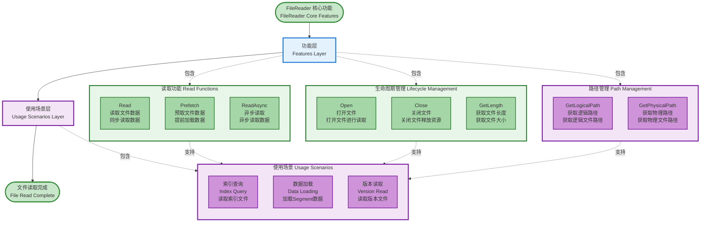
```mermaid
flowchart TB
    Start([FileReader 核心功能<br/>FileReader Core Features]) --> FeatureLayer[功能层<br/>Features Layer]
    
    subgraph ReadGroup["读取功能 Read Functions"]
        direction TB
        R1[Read<br/>读取文件数据<br/>同步读取数据]
        R2[Prefetch<br/>预取文件数据<br/>提前加载数据]
        R3[ReadAsync<br/>异步读取<br/>异步读取数据]
    end
    
    subgraph LifecycleGroup["生命周期管理 Lifecycle Management"]
        direction TB
        L1[Open<br/>打开文件<br/>打开文件进行读取]
        L2[Close<br/>关闭文件<br/>关闭文件释放资源]
        L3[GetLength<br/>获取文件长度<br/>获取文件大小]
    end
    
    subgraph PathGroup["路径管理 Path Management"]
        direction TB
        P1[GetLogicalPath<br/>获取逻辑路径<br/>获取逻辑文件路径]
        P2[GetPhysicalPath<br/>获取物理路径<br/>获取物理文件路径]
    end
    
    FeatureLayer --> UsageLayer[使用场景层<br/>Usage Scenarios Layer]
    
    subgraph UsageGroup["使用场景 Usage Scenarios"]
        direction TB
        U1[索引查询<br/>Index Query<br/>读取索引文件]
        U2[数据加载<br/>Data Loading<br/>加载Segment数据]
        U3[版本读取<br/>Version Read<br/>读取版本文件]
    end
    
    UsageLayer --> End([文件读取完成<br/>File Read Complete])
    
    FeatureLayer -.->|包含| ReadGroup
    FeatureLayer -.->|包含| LifecycleGroup
    FeatureLayer -.->|包含| PathGroup
    UsageLayer -.->|包含| UsageGroup
    
    ReadGroup -.->|支持| UsageGroup
    LifecycleGroup -.->|支持| UsageGroup
    PathGroup -.->|支持| UsageGroup
    
    style Start fill:#c8e6c9,stroke:#388e3c,stroke-width:3px
    style End fill:#c8e6c9,stroke:#388e3c,stroke-width:3px
    style FeatureLayer fill:#e3f2fd,stroke:#1976d2,stroke-width:3px
    style UsageLayer fill:#f3e5f5,stroke:#7b1fa2,stroke-width:3px
    style ReadGroup fill:#e8f5e9,stroke:#2e7d32,stroke-width:3px
    style R1 fill:#a5d6a7,stroke:#2e7d32,stroke-width:2px
    style R2 fill:#a5d6a7,stroke:#2e7d32,stroke-width:2px
    style R3 fill:#a5d6a7,stroke:#2e7d32,stroke-width:2px
    style LifecycleGroup fill:#e8f5e9,stroke:#2e7d32,stroke-width:3px
    style L1 fill:#a5d6a7,stroke:#2e7d32,stroke-width:2px
    style L2 fill:#a5d6a7,stroke:#2e7d32,stroke-width:2px
    style L3 fill:#a5d6a7,stroke:#2e7d32,stroke-width:2px
    style PathGroup fill:#f3e5f5,stroke:#7b1fa2,stroke-width:3px
    style P1 fill:#ce93d8,stroke:#7b1fa2,stroke-width:2px
    style P2 fill:#ce93d8,stroke:#7b1fa2,stroke-width:2px
    style UsageGroup fill:#f3e5f5,stroke:#7b1fa2,stroke-width:3px
    style U1 fill:#ce93d8,stroke:#7b1fa2,stroke-width:2px
    style U2 fill:#ce93d8,stroke:#7b1fa2,stroke-width:2px
    style U3 fill:#ce93d8,stroke:#7b1fa2,stroke-width:2px
```

### 4.2 FileWriter：文件写入器

`FileWriter` 是文件写入器，提供文件写入功能，支持同步和异步写入。让我们先通过序列图来理解 FileWriter 的完整工作流程：

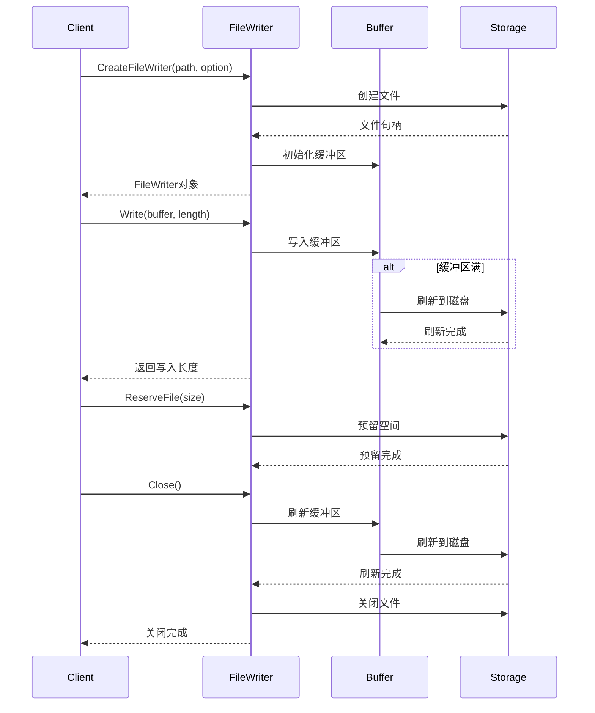
```mermaid
sequenceDiagram
    participant Client
    participant FileWriter
    participant Buffer
    participant Storage
    
    Client->>FileWriter: CreateFileWriter(path, option)
    FileWriter->>Storage: 创建文件
    Storage-->>FileWriter: 文件句柄
    FileWriter->>Buffer: 初始化缓冲区
    FileWriter-->>Client: FileWriter对象
    
    Client->>FileWriter: Write(buffer, length)
    FileWriter->>Buffer: 写入缓冲区
    alt 缓冲区满
        Buffer->>Storage: 刷新到磁盘
        Storage-->>Buffer: 刷新完成
    end
    FileWriter-->>Client: 返回写入长度
    
    Client->>FileWriter: ReserveFile(size)
    FileWriter->>Storage: 预留空间
    Storage-->>FileWriter: 预留完成
    
    Client->>FileWriter: Close()
    FileWriter->>Buffer: 刷新缓冲区
    Buffer->>Storage: 刷新到磁盘
    Storage-->>FileWriter: 刷新完成
    FileWriter->>Storage: 关闭文件
    FileWriter-->>Client: 关闭完成
```

**FileWriter 的完整定义**：

```cpp
// file_system/file/FileWriter.h
class FileWriter : public autil::NoCopyable
{
public:
    // 打开文件
    virtual FSResult<void> Open(
        const std::string& logicalPath,   // 逻辑路径
        const std::string& physicalPath) = 0;  // 物理路径
    
    // 关闭文件
    virtual FSResult<void> Close() = 0;
    
    // 写入文件：同步写入
    virtual FSResult<size_t> Write(
        const void* buffer,                // 缓冲区
        size_t length) = 0;               // 写入长度
    
    // 异步写入：返回 Future
    virtual future_lite::Future<FSResult<size_t>> WriteAsync(
        const void* buffer,
        size_t length) = 0;
    
    // 预留文件空间：用于地址访问模式
    virtual FSResult<void> ReserveFile(size_t reserveSize) = 0;
    
    // 截断文件：调整文件大小
    virtual FSResult<void> Truncate(size_t truncateSize) = 0;
    
    // 刷新缓冲区：将缓冲区数据刷新到磁盘
    virtual FSResult<void> Flush() = 0;
    
    // 同步文件：确保数据写入磁盘
    virtual FSResult<void> Sync() = 0;
    
    // 获取文件长度
    virtual size_t GetLength() const = 0;
    
    // 获取逻辑路径
    virtual const std::string& GetLogicalPath() const = 0;
    
    // 获取物理路径
    virtual const std::string& GetPhysicalPath() const = 0;
};
```

**FileWriter 的实现示例**：

```cpp
// file_system/file/LocalFileWriter.cpp
class LocalFileWriter : public FileWriter
{
private:
    std::string _logicalPath;
    std::string _physicalPath;
    int _fd;
    size_t _fileLength;
    std::vector<char> _buffer;
    size_t _bufferSize;
    bool _atomicWrite;
    
public:
    FSResult<void> Open(const std::string& logicalPath, 
                        const std::string& physicalPath) override {
        _logicalPath = logicalPath;
        _physicalPath = physicalPath;
        
        // 原子写入：先写入临时文件
        if (_atomicWrite) {
            _physicalPath = physicalPath + ".tmp";
        }
        
        _fd = ::open(_physicalPath.c_str(), O_WRONLY | O_CREAT | O_TRUNC, 0644);
        if (_fd < 0) {
            return FSResult<void>::Error("Failed to open file: " + _physicalPath);
        }
        
        _fileLength = 0;
        _buffer.clear();
        _buffer.reserve(_bufferSize);
        
        return FSResult<void>::OK();
    }
    
    FSResult<size_t> Write(const void* buffer, size_t length) override {
        // 1. 写入缓冲区
        const char* data = static_cast<const char*>(buffer);
        _buffer.insert(_buffer.end(), data, data + length);
        
        // 2. 如果缓冲区满，刷新到磁盘
        if (_buffer.size() >= _bufferSize) {
            auto status = Flush();
            if (!status.IsOK()) {
                return FSResult<size_t>::Error(status.GetError());
            }
        }
        
        _fileLength += length;
        return FSResult<size_t>::OK(length);
    }
    
    FSResult<void> Flush() override {
        if (_buffer.empty()) {
            return FSResult<void>::OK();
        }
        
        ssize_t nwrite = ::write(_fd, _buffer.data(), _buffer.size());
        if (nwrite < 0) {
            return FSResult<void>::Error("Failed to write file");
        }
        
        _buffer.clear();
        return FSResult<void>::OK();
    }
    
    FSResult<void> Sync() override {
        // 先刷新缓冲区
        auto status = Flush();
        if (!status.IsOK()) {
            return status;
        }
        
        // 同步到磁盘
        if (fsync(_fd) < 0) {
            return FSResult<void>::Error("Failed to sync file");
        }
        
        return FSResult<void>::OK();
    }
    
    FSResult<void> Close() override {
        // 1. 刷新缓冲区
        auto status = Flush();
        if (!status.IsOK()) {
            return status;
        }
        
        // 2. 同步到磁盘
        status = Sync();
        if (!status.IsOK()) {
            return status;
        }
        
        // 3. 关闭文件
        if (_fd >= 0) {
            ::close(_fd);
            _fd = -1;
        }
        
        // 4. 原子写入：重命名临时文件
        if (_atomicWrite) {
            std::string finalPath = _physicalPath.substr(0, _physicalPath.length() - 4);
            if (rename(_physicalPath.c_str(), finalPath.c_str()) < 0) {
                return FSResult<void>::Error("Failed to rename file");
            }
        }
        
        return FSResult<void>::OK();
    }
    
    FSResult<void> ReserveFile(size_t reserveSize) override {
        // 使用 fallocate 预留空间
        if (fallocate(_fd, 0, 0, reserveSize) < 0) {
            return FSResult<void>::Error("Failed to reserve file space");
        }
        return FSResult<void>::OK();
    }
};
```

**FileWriter 的关键特性**：

1. **缓冲写入**：使用缓冲区减少系统调用，提高写入性能
   - 缓冲区满时自动刷新
   - 支持手动刷新和同步
   
2. **原子写入**：支持原子写入，保证数据一致性
   - 先写入临时文件
   - 写入完成后重命名为最终文件
   - 失败时不会破坏原文件
   
3. **预留空间**：支持预留文件空间，用于地址访问模式
   - 使用 `fallocate` 预留空间
   - 支持随机写入，提高性能

FileWriter 接口：提供文件写入功能：

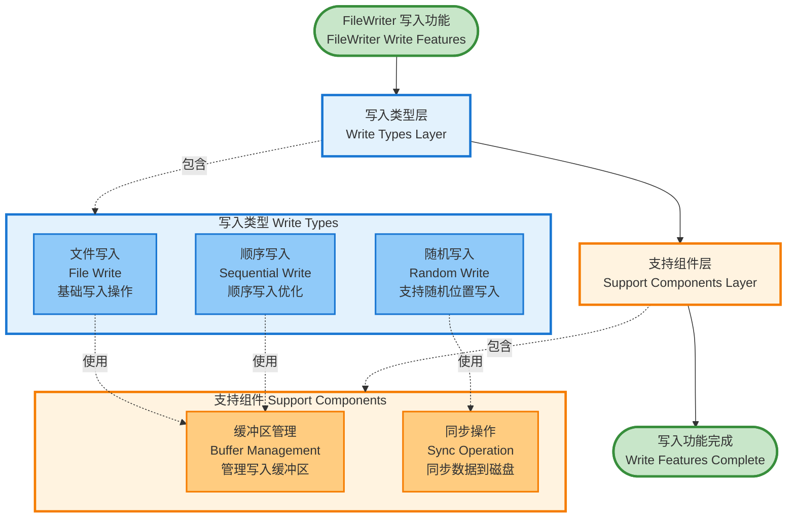
```mermaid
flowchart TB
    Start([FileWriter 写入功能<br/>FileWriter Write Features]) --> WriteLayer[写入类型层<br/>Write Types Layer]
    
    subgraph WriteGroup["写入类型 Write Types"]
        direction TB
        W1[文件写入<br/>File Write<br/>基础写入操作]
        W2[随机写入<br/>Random Write<br/>支持随机位置写入]
        W3[顺序写入<br/>Sequential Write<br/>顺序写入优化]
    end
    
    WriteLayer --> SupportLayer[支持组件层<br/>Support Components Layer]
    
    subgraph SupportGroup["支持组件 Support Components"]
        direction TB
        S1[缓冲区管理<br/>Buffer Management<br/>管理写入缓冲区]
        S2[同步操作<br/>Sync Operation<br/>同步数据到磁盘]
    end
    
    SupportLayer --> End([写入功能完成<br/>Write Features Complete])
    
    WriteLayer -.->|包含| WriteGroup
    SupportLayer -.->|包含| SupportGroup
    
    W1 -.->|使用| S1
    W2 -.->|使用| S2
    W3 -.->|使用| S1
    
    style Start fill:#c8e6c9,stroke:#388e3c,stroke-width:3px
    style End fill:#c8e6c9,stroke:#388e3c,stroke-width:3px
    style WriteLayer fill:#e3f2fd,stroke:#1976d2,stroke-width:3px
    style SupportLayer fill:#fff3e0,stroke:#f57c00,stroke-width:3px
    style WriteGroup fill:#e3f2fd,stroke:#1976d2,stroke-width:3px
    style W1 fill:#90caf9,stroke:#1976d2,stroke-width:2px
    style W2 fill:#90caf9,stroke:#1976d2,stroke-width:2px
    style W3 fill:#90caf9,stroke:#1976d2,stroke-width:2px
    style SupportGroup fill:#fff3e0,stroke:#f57c00,stroke-width:3px
    style S1 fill:#ffcc80,stroke:#f57c00,stroke-width:2px
    style S2 fill:#ffcc80,stroke:#f57c00,stroke-width:2px
```

## 5. Storage：存储抽象

### 5.1 Storage 的结构

`Storage` 是存储抽象，定义在 `file_system/Storage.h` 中：

```cpp
// file_system/Storage.h
class Storage
{
public:
    // 创建输入存储
    static std::shared_ptr<Storage> CreateInputStorage(
        const std::shared_ptr<FileSystemOptions>& options,
        const std::shared_ptr<util::BlockMemoryQuotaController>& memController,
        const std::shared_ptr<EntryTable>& entryTable) = 0;
    
    // 创建输出存储
    static std::shared_ptr<Storage> CreateOutputStorage(
        const std::string& outputRoot,
        const std::shared_ptr<FileSystemOptions>& options,
        const std::shared_ptr<util::BlockMemoryQuotaController>& memController) = 0;
    
    // 创建文件读取器
    virtual FSResult<std::shared_ptr<FileReader>> CreateFileReader(
        const std::string& logicalFilePath,
        const std::string& physicalFilePath,
        const ReaderOption& readerOption) = 0;
    
    // 创建文件写入器
    virtual FSResult<std::shared_ptr<FileWriter>> CreateFileWriter(
        const std::string& logicalFilePath,
        const std::string& physicalFilePath,
        const WriterOption& writerOption) = 0;
    
    // 同步存储
    virtual FSResult<std::future<bool>> Sync() = 0;
    
    // 获取存储类型
    virtual FSStorageType GetStorageType() const = 0;
};
```

**Storage 的关键方法**：

Storage 抽象：提供底层存储操作：

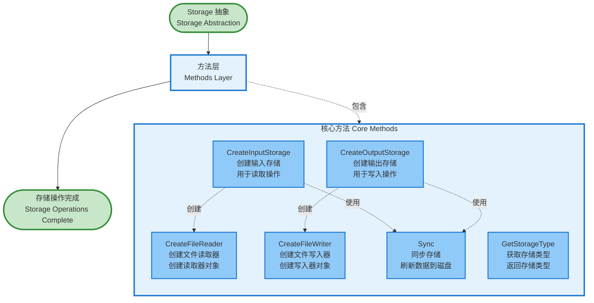
```mermaid
flowchart TB
    Start([Storage 抽象<br/>Storage Abstraction]) --> MethodLayer[方法层<br/>Methods Layer]
    
    subgraph MethodGroup["核心方法 Core Methods"]
        direction TB
        M1[CreateInputStorage<br/>创建输入存储<br/>用于读取操作]
        M2[CreateOutputStorage<br/>创建输出存储<br/>用于写入操作]
        M3[CreateFileReader<br/>创建文件读取器<br/>创建读取器对象]
        M4[CreateFileWriter<br/>创建文件写入器<br/>创建写入器对象]
        M5[Sync<br/>同步存储<br/>刷新数据到磁盘]
        M6[GetStorageType<br/>获取存储类型<br/>返回存储类型]
    end
    
    MethodLayer --> End([存储操作完成<br/>Storage Operations Complete])
    
    MethodLayer -.->|包含| MethodGroup
    
    M1 -.->|创建| M3
    M2 -.->|创建| M4
    M1 -.->|使用| M5
    M2 -.->|使用| M5
    
    style Start fill:#c8e6c9,stroke:#388e3c,stroke-width:3px
    style End fill:#c8e6c9,stroke:#388e3c,stroke-width:3px
    style MethodLayer fill:#e3f2fd,stroke:#1976d2,stroke-width:3px
    style MethodGroup fill:#e3f2fd,stroke:#1976d2,stroke-width:3px
    style M1 fill:#90caf9,stroke:#1976d2,stroke-width:2px
    style M2 fill:#90caf9,stroke:#1976d2,stroke-width:2px
    style M3 fill:#90caf9,stroke:#1976d2,stroke-width:2px
    style M4 fill:#90caf9,stroke:#1976d2,stroke-width:2px
    style M5 fill:#90caf9,stroke:#1976d2,stroke-width:2px
    style M6 fill:#90caf9,stroke:#1976d2,stroke-width:2px
```

- **CreateInputStorage()**：创建输入存储，用于读取
- **CreateOutputStorage()**：创建输出存储，用于写入
- **CreateFileReader()**：创建文件读取器
- **CreateFileWriter()**：创建文件写入器
- **Sync()**：同步存储，刷新数据到磁盘
- **GetStorageType()**：获取存储类型

### 5.2 存储类型

IndexLib 支持多种存储类型：

存储类型：本地存储、分布式存储等：

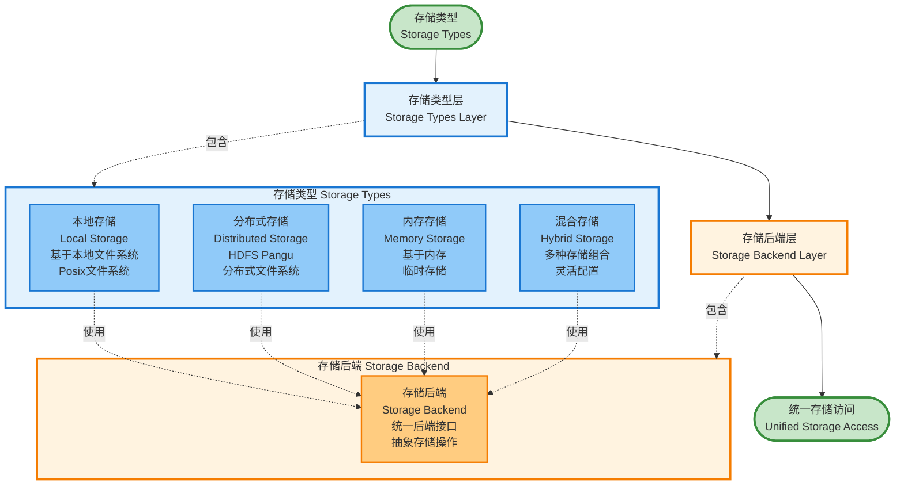
```mermaid
flowchart TB
    Start([存储类型<br/>Storage Types]) --> TypeLayer[存储类型层<br/>Storage Types Layer]
    
    subgraph TypeGroup["存储类型 Storage Types"]
        direction TB
        T1[本地存储<br/>Local Storage<br/>基于本地文件系统<br/>Posix文件系统]
        T2[分布式存储<br/>Distributed Storage<br/>HDFS Pangu<br/>分布式文件系统]
        T3[内存存储<br/>Memory Storage<br/>基于内存<br/>临时存储]
        T4[混合存储<br/>Hybrid Storage<br/>多种存储组合<br/>灵活配置]
    end
    
    TypeLayer --> BackendLayer[存储后端层<br/>Storage Backend Layer]
    
    subgraph BackendGroup["存储后端 Storage Backend"]
        direction TB
        B1[存储后端<br/>Storage Backend<br/>统一后端接口<br/>抽象存储操作]
    end
    
    BackendLayer --> End([统一存储访问<br/>Unified Storage Access])
    
    TypeLayer -.->|包含| TypeGroup
    BackendLayer -.->|包含| BackendGroup
    
    T1 -.->|使用| B1
    T2 -.->|使用| B1
    T3 -.->|使用| B1
    T4 -.->|使用| B1
    
    style Start fill:#c8e6c9,stroke:#388e3c,stroke-width:3px
    style End fill:#c8e6c9,stroke:#388e3c,stroke-width:3px
    style TypeLayer fill:#e3f2fd,stroke:#1976d2,stroke-width:3px
    style BackendLayer fill:#fff3e0,stroke:#f57c00,stroke-width:3px
    style TypeGroup fill:#e3f2fd,stroke:#1976d2,stroke-width:3px
    style T1 fill:#90caf9,stroke:#1976d2,stroke-width:2px
    style T2 fill:#90caf9,stroke:#1976d2,stroke-width:2px
    style T3 fill:#90caf9,stroke:#1976d2,stroke-width:2px
    style T4 fill:#90caf9,stroke:#1976d2,stroke-width:2px
    style BackendGroup fill:#fff3e0,stroke:#f57c00,stroke-width:3px
    style B1 fill:#ffcc80,stroke:#f57c00,stroke-width:2px
```

**存储类型**：
- **本地存储**：基于本地文件系统的存储
- **分布式存储**：基于分布式文件系统的存储
- **内存存储**：基于内存的存储
- **混合存储**：支持多种存储后端的混合存储

## 6. 存储格式

IndexLib 支持多种存储格式，包括 Package、Archive 和压缩格式，用于优化存储效率和访问性能。让我们先通过类图来理解存储格式的整体架构：

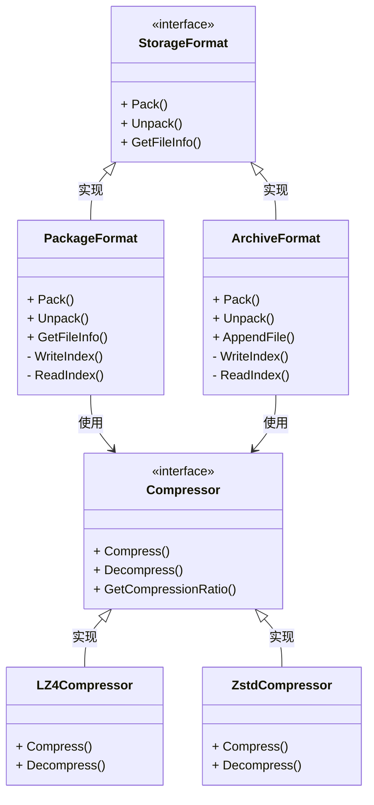
```mermaid
classDiagram
    class StorageFormat {
        <<interface>>
        + Pack()
        + Unpack()
        + GetFileInfo()
    }
    
    class PackageFormat {
        + Pack()
        + Unpack()
        + GetFileInfo()
        - WriteIndex()
        - ReadIndex()
    }
    
    class ArchiveFormat {
        + Pack()
        + Unpack()
        + AppendFile()
        - WriteIndex()
        - ReadIndex()
    }
    
    class Compressor {
        <<interface>>
        + Compress()
        + Decompress()
        + GetCompressionRatio()
    }
    
    class LZ4Compressor {
        + Compress()
        + Decompress()
    }
    
    class ZstdCompressor {
        + Compress()
        + Decompress()
    }
    
    StorageFormat <|-- PackageFormat : 实现
    StorageFormat <|-- ArchiveFormat : 实现
    PackageFormat --> Compressor : 使用
    ArchiveFormat --> Compressor : 使用
    Compressor <|-- LZ4Compressor : 实现
    Compressor <|-- ZstdCompressor : 实现
```

### 6.1 Package 格式

Package 格式是一种打包存储格式，将多个小文件打包成一个大文件，减少文件系统的小文件数量，提高 IO 效率。Package 格式的打包流程如下：

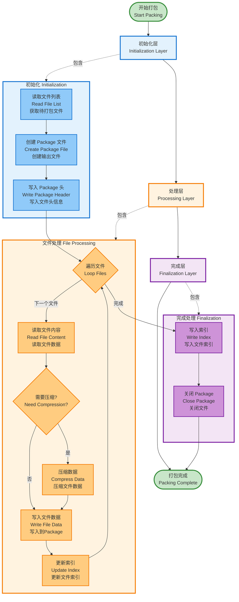
```mermaid
flowchart TB
    Start([开始打包<br/>Start Packing]) --> InitLayer[初始化层<br/>Initialization Layer]
    
    subgraph InitGroup["初始化 Initialization"]
        direction TB
        I1[读取文件列表<br/>Read File List<br/>获取待打包文件]
        I2[创建 Package 文件<br/>Create Package File<br/>创建输出文件]
        I3[写入 Package 头<br/>Write Package Header<br/>写入文件头信息]
    end
    
    InitLayer --> ProcessLayer[处理层<br/>Processing Layer]
    
    subgraph ProcessGroup["文件处理 File Processing"]
        direction TB
        P1{遍历文件<br/>Loop Files}
        P2[读取文件内容<br/>Read File Content<br/>读取文件数据]
        P3{需要压缩?<br/>Need Compression?}
        P4[压缩数据<br/>Compress Data<br/>压缩文件数据]
        P5[写入文件数据<br/>Write File Data<br/>写入到Package]
        P6[更新索引<br/>Update Index<br/>更新文件索引]
    end
    
    ProcessLayer --> FinalizeLayer[完成层<br/>Finalization Layer]
    
    subgraph FinalizeGroup["完成处理 Finalization"]
        direction TB
        F1[写入索引<br/>Write Index<br/>写入文件索引]
        F2[关闭 Package<br/>Close Package<br/>关闭文件]
    end
    
    FinalizeLayer --> End([打包完成<br/>Packing Complete])
    
    InitLayer -.->|包含| InitGroup
    ProcessLayer -.->|包含| ProcessGroup
    FinalizeLayer -.->|包含| FinalizeGroup
    
    I1 --> I2
    I2 --> I3
    I3 --> P1
    P1 -->|下一个文件| P2
    P1 -->|完成| F1
    P2 --> P3
    P3 -->|是| P4
    P3 -->|否| P5
    P4 --> P5
    P5 --> P6
    P6 --> P1
    F1 --> F2
    F2 --> End
    
    style Start fill:#c8e6c9,stroke:#388e3c,stroke-width:3px
    style End fill:#c8e6c9,stroke:#388e3c,stroke-width:3px
    style InitLayer fill:#e3f2fd,stroke:#1976d2,stroke-width:3px
    style ProcessLayer fill:#fff3e0,stroke:#f57c00,stroke-width:3px
    style FinalizeLayer fill:#f3e5f5,stroke:#7b1fa2,stroke-width:3px
    style InitGroup fill:#e3f2fd,stroke:#1976d2,stroke-width:3px
    style I1 fill:#90caf9,stroke:#1976d2,stroke-width:2px
    style I2 fill:#90caf9,stroke:#1976d2,stroke-width:2px
    style I3 fill:#90caf9,stroke:#1976d2,stroke-width:2px
    style ProcessGroup fill:#fff3e0,stroke:#f57c00,stroke-width:3px
    style P1 fill:#ffcc80,stroke:#f57c00,stroke-width:2px
    style P2 fill:#ffcc80,stroke:#f57c00,stroke-width:2px
    style P3 fill:#ffcc80,stroke:#f57c00,stroke-width:2px
    style P4 fill:#ffcc80,stroke:#f57c00,stroke-width:2px
    style P5 fill:#ffcc80,stroke:#f57c00,stroke-width:2px
    style P6 fill:#ffcc80,stroke:#f57c00,stroke-width:2px
    style FinalizeGroup fill:#f3e5f5,stroke:#7b1fa2,stroke-width:3px
    style F1 fill:#ce93d8,stroke:#7b1fa2,stroke-width:2px
    style F2 fill:#ce93d8,stroke:#7b1fa2,stroke-width:2px
```

**Package 格式的结构**：

```cpp
// file_system/package/PackageFormat.h
struct PackageHeader {
    uint32_t magic;           // 魔数：0x504B4741 ("PKGA")
    uint32_t version;         // 版本号
    uint32_t fileCount;       // 文件数量
    uint64_t indexOffset;     // 索引偏移量
    uint64_t indexSize;       // 索引大小
    uint32_t flags;           // 标志位（压缩、加密等）
};

struct FileEntry {
    std::string fileName;     // 文件名
    uint64_t offset;          // 文件在 Package 中的偏移量
    uint64_t size;            // 文件大小（压缩前）
    uint64_t compressedSize;  // 压缩后大小
    uint32_t compressionType; // 压缩类型
    uint32_t crc32;           // CRC32 校验
};

struct PackageIndex {
    std::vector<FileEntry> entries;  // 文件条目列表
    std::map<std::string, size_t> nameToIndex;  // 文件名到索引的映射
};
```

**Package 格式的打包实现**：

```cpp
// file_system/package/PackageFormat.cpp
FSResult<void> PackageFormat::Pack(const std::vector<std::string>& files,
                                     const std::string& outputPath) {
    // 1. 创建 Package 文件
    auto writer = CreateFileWriter(outputPath);
    if (!writer.IsOK()) {
        return FSResult<void>::Error("Failed to create package file");
    }
    
    // 2. 写入 Package 头（占位，稍后更新）
    PackageHeader header = {};
    header.magic = 0x504B4741;  // "PKGA"
    header.version = 1;
    header.fileCount = files.size();
    
    size_t headerSize = sizeof(PackageHeader);
    size_t dataOffset = headerSize;
    
    // 3. 写入文件数据
    PackageIndex index;
    for (const auto& filePath : files) {
        // 读取文件
        auto reader = CreateFileReader(filePath);
        if (!reader.IsOK()) {
            return FSResult<void>::Error("Failed to read file: " + filePath);
        }
        
        std::vector<char> data(reader->GetLength());
        auto readResult = reader->Read(data.data(), data.size(), 0);
        if (!readResult.IsOK()) {
            return FSResult<void>::Error("Failed to read file data");
        }
        
        // 压缩文件（可选）
        std::vector<char> compressed;
        uint32_t compressionType = 0;
        if (_options.compress) {
            auto compressResult = _compressor->Compress(data, compressed);
            if (compressResult.IsOK() && compressed.size() < data.size()) {
                data = compressed;
                compressionType = _compressor->GetType();
            }
        }
        
        // 写入文件数据
        FileEntry entry;
        entry.fileName = GetFileName(filePath);
        entry.offset = dataOffset;
        entry.size = reader->GetLength();
        entry.compressedSize = data.size();
        entry.compressionType = compressionType;
        entry.crc32 = CalculateCRC32(data);
        
        auto writeResult = writer->Write(data.data(), data.size());
        if (!writeResult.IsOK()) {
            return FSResult<void>::Error("Failed to write file data");
        }
        
        dataOffset += data.size();
        index.entries.push_back(entry);
        index.nameToIndex[entry.fileName] = index.entries.size() - 1;
    }
    
    // 4. 写入索引
    header.indexOffset = dataOffset;
    std::string indexData = SerializeIndex(index);
    header.indexSize = indexData.size();
    
    auto writeResult = writer->Write(indexData.data(), indexData.size());
    if (!writeResult.IsOK()) {
        return FSResult<void>::Error("Failed to write index");
    }
    
    // 5. 更新 Package 头
    writer->Seek(0);
    writer->Write(&header, sizeof(header));
    
    // 6. 关闭文件
    writer->Close();
    
    return FSResult<void>::OK();
}
```

**Package 格式的特点**：

1. **文件打包**：将多个小文件打包成一个大文件
   - 减少文件系统的小文件数量
   - 提高文件系统的性能
   
2. **减少文件数**：减少文件系统的小文件数量
   - 文件系统对小文件的支持较差
   - 打包后可以减少文件数量，提高性能
   
3. **提高 IO 效率**：提高批量 IO 的效率
   - 打包后可以批量读取多个文件
   - 减少文件打开和关闭的开销
   
4. **支持压缩**：支持文件压缩，减少存储空间
   - 每个文件可以独立压缩
   - 支持多种压缩算法（LZ4、Zstd 等）

Package 格式：将多个文件打包成一个文件：

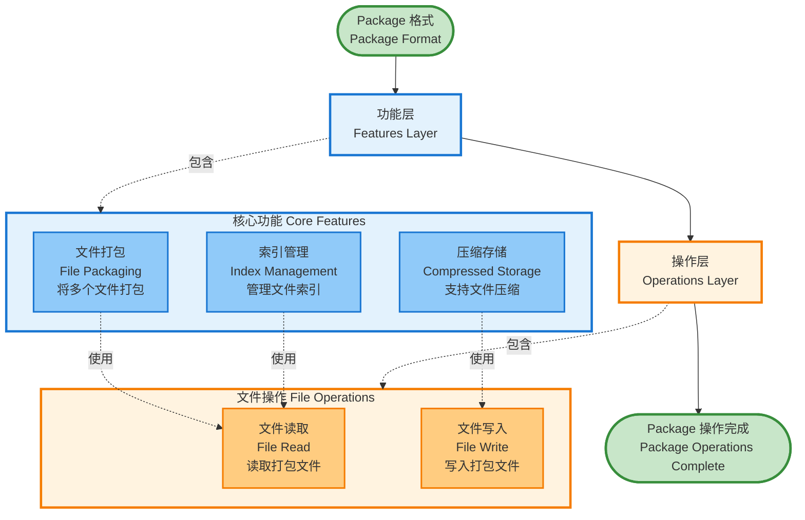
```mermaid
flowchart TB
    Start([Package 格式<br/>Package Format]) --> FeatureLayer[功能层<br/>Features Layer]
    
    subgraph FeatureGroup["核心功能 Core Features"]
        direction TB
        F1[文件打包<br/>File Packaging<br/>将多个文件打包]
        F2[压缩存储<br/>Compressed Storage<br/>支持文件压缩]
        F3[索引管理<br/>Index Management<br/>管理文件索引]
    end
    
    FeatureLayer --> OperationLayer[操作层<br/>Operations Layer]
    
    subgraph OperationGroup["文件操作 File Operations"]
        direction TB
        O1[文件读取<br/>File Read<br/>读取打包文件]
        O2[文件写入<br/>File Write<br/>写入打包文件]
    end
    
    OperationLayer --> End([Package 操作完成<br/>Package Operations Complete])
    
    FeatureLayer -.->|包含| FeatureGroup
    OperationLayer -.->|包含| OperationGroup
    
    F1 -.->|使用| O1
    F2 -.->|使用| O2
    F3 -.->|使用| O1
    
    style Start fill:#c8e6c9,stroke:#388e3c,stroke-width:3px
    style End fill:#c8e6c9,stroke:#388e3c,stroke-width:3px
    style FeatureLayer fill:#e3f2fd,stroke:#1976d2,stroke-width:3px
    style OperationLayer fill:#fff3e0,stroke:#f57c00,stroke-width:3px
    style FeatureGroup fill:#e3f2fd,stroke:#1976d2,stroke-width:3px
    style F1 fill:#90caf9,stroke:#1976d2,stroke-width:2px
    style F2 fill:#90caf9,stroke:#1976d2,stroke-width:2px
    style F3 fill:#90caf9,stroke:#1976d2,stroke-width:2px
    style OperationGroup fill:#fff3e0,stroke:#f57c00,stroke-width:3px
    style O1 fill:#ffcc80,stroke:#f57c00,stroke-width:2px
    style O2 fill:#ffcc80,stroke:#f57c00,stroke-width:2px
```

### 6.2 Archive 格式

Archive 格式是一种归档存储格式，支持文件归档、压缩、索引和追加。Archive 格式的归档流程（包括创建归档和追加文件）如下：

```mermaid
flowchart TB
    Start([Archive 操作<br/>Archive Operations]) --> OperationType{操作类型<br/>Operation Type}
    
    OperationType -->|创建归档| CreateFlow[创建归档流程<br/>Create Archive Flow]
    OperationType -->|追加文件| AppendFlow[追加文件流程<br/>Append File Flow]
    
    subgraph CreateGroup["创建归档流程 Create Archive Flow"]
        direction TB
        C1[创建 Archive 文件<br/>Create Archive File<br/>创建归档文件]
        C2[写入 Archive 头<br/>Write Archive Header<br/>写入文件头信息]
        C3{遍历文件<br/>Loop Files}
        C4[读取文件<br/>Read File<br/>读取文件内容]
        C5[压缩文件<br/>Compress File<br/>压缩文件数据]
        C6[写入文件数据<br/>Write File Data<br/>写入到Archive]
        C7[更新索引<br/>Update Index<br/>更新文件索引]
        C8[写入索引<br/>Write Index<br/>写入文件索引]
        C9[关闭 Archive<br/>Close Archive<br/>关闭文件]
    end
    
    subgraph AppendGroup["追加文件流程 Append File Flow"]
        direction TB
        A1[打开 Archive<br/>Open Archive<br/>打开归档文件]
        A2[读取索引<br/>Read Index<br/>读取文件索引]
        A3[追加文件数据<br/>Append File Data<br/>追加新文件]
        A4[更新索引<br/>Update Index<br/>更新文件索引]
        A5[写入索引<br/>Write Index<br/>写入更新后的索引]
        A6[关闭 Archive<br/>Close Archive<br/>关闭文件]
    end
    
    CreateFlow --> End1([创建完成<br/>Create Complete])
    AppendFlow --> End2([追加完成<br/>Append Complete])
    
    CreateFlow -.->|包含| CreateGroup
    AppendFlow -.->|包含| AppendGroup
    
    C1 --> C2
    C2 --> C3
    C3 -->|下一个文件| C4
    C3 -->|完成| C8
    C4 --> C5
    C5 --> C6
    C6 --> C7
    C7 --> C3
    C8 --> C9
    C9 --> End1
    
    A1 --> A2
    A2 --> A3
    A3 --> A4
    A4 --> A5
    A5 --> A6
    A6 --> End2
    
    style Start fill:#c8e6c9,stroke:#388e3c,stroke-width:3px
    style End1 fill:#c8e6c9,stroke:#388e3c,stroke-width:3px
    style End2 fill:#c8e6c9,stroke:#388e3c,stroke-width:3px
    style OperationType fill:#ffcc80,stroke:#f57c00,stroke-width:2px
    style CreateFlow fill:#e3f2fd,stroke:#1976d2,stroke-width:3px
    style AppendFlow fill:#f3e5f5,stroke:#7b1fa2,stroke-width:3px
    style CreateGroup fill:#e3f2fd,stroke:#1976d2,stroke-width:3px
    style C1 fill:#90caf9,stroke:#1976d2,stroke-width:2px
    style C2 fill:#90caf9,stroke:#1976d2,stroke-width:2px
    style C3 fill:#ffcc80,stroke:#f57c00,stroke-width:2px
    style C4 fill:#90caf9,stroke:#1976d2,stroke-width:2px
    style C5 fill:#90caf9,stroke:#1976d2,stroke-width:2px
    style C6 fill:#90caf9,stroke:#1976d2,stroke-width:2px
    style C7 fill:#90caf9,stroke:#1976d2,stroke-width:2px
    style C8 fill:#90caf9,stroke:#1976d2,stroke-width:2px
    style C9 fill:#90caf9,stroke:#1976d2,stroke-width:2px
    style AppendGroup fill:#f3e5f5,stroke:#7b1fa2,stroke-width:3px
    style A1 fill:#ce93d8,stroke:#7b1fa2,stroke-width:2px
    style A2 fill:#ce93d8,stroke:#7b1fa2,stroke-width:2px
    style A3 fill:#ce93d8,stroke:#7b1fa2,stroke-width:2px
    style A4 fill:#ce93d8,stroke:#7b1fa2,stroke-width:2px
    style A5 fill:#ce93d8,stroke:#7b1fa2,stroke-width:2px
    style A6 fill:#ce93d8,stroke:#7b1fa2,stroke-width:2px
```

**Archive 格式的结构**：

```cpp
// file_system/archive/ArchiveFormat.h
struct ArchiveHeader {
    uint32_t magic;           // 魔数：0x41524348 ("ARCH")
    uint32_t version;         // 版本号
    uint64_t fileCount;       // 文件数量
    uint64_t indexOffset;     // 索引偏移量
    uint64_t indexSize;       // 索引大小
    uint32_t flags;           // 标志位
};

struct ArchiveEntry {
    std::string fileName;     // 文件名
    uint64_t offset;          // 文件在 Archive 中的偏移量
    uint64_t size;            // 文件大小
    uint64_t compressedSize;  // 压缩后大小
    uint32_t compressionType; // 压缩类型
    uint64_t timestamp;       // 时间戳
    uint32_t crc32;           // CRC32 校验
};

struct ArchiveIndex {
    std::vector<ArchiveEntry> entries;  // 文件条目列表
    std::map<std::string, size_t> nameToIndex;  // 文件名到索引的映射
    std::map<uint64_t, std::vector<size_t>> timestampToIndex;  // 时间戳到索引的映射
};
```

**Archive 格式的特点**：

1. **文件归档**：将文件归档存储
   - 支持追加文件到归档
   - 支持按时间戳查询文件
   
2. **支持压缩**：支持文件压缩
   - 每个文件可以独立压缩
   - 支持多种压缩算法
   
3. **支持索引**：支持文件索引，快速定位文件
   - 文件名索引：快速查找文件
   - 时间戳索引：按时间查询文件
   
4. **支持追加**：支持追加文件到归档
   - 不需要重新打包整个归档
   - 更新索引即可

Archive 格式：归档存储格式的特点和应用：

```mermaid
flowchart TB
    Start([Archive 格式<br/>Archive Format]) --> FeatureLayer[功能层<br/>Features Layer]
    
    subgraph FeatureGroup["核心功能 Core Features"]
        direction TB
        F1[文件归档<br/>File Archive<br/>归档文件存储]
        F2[压缩存储<br/>Compressed Storage<br/>支持文件压缩]
        F3[索引追加<br/>Index Append<br/>支持索引追加]
    end
    
    FeatureLayer --> OperationLayer[操作层<br/>Operations Layer]
    
    subgraph OperationGroup["文件操作 File Operations"]
        direction TB
        O1[归档读取<br/>Archive Read<br/>读取归档文件]
        O2[归档写入<br/>Archive Write<br/>写入归档文件]
    end
    
    OperationLayer --> End([Archive 操作完成<br/>Archive Operations Complete])
    
    FeatureLayer -.->|包含| FeatureGroup
    OperationLayer -.->|包含| OperationGroup
    
    F1 -.->|使用| O1
    F2 -.->|使用| O2
    F3 -.->|使用| O1
    
    style Start fill:#c8e6c9,stroke:#388e3c,stroke-width:3px
    style End fill:#c8e6c9,stroke:#388e3c,stroke-width:3px
    style FeatureLayer fill:#e3f2fd,stroke:#1976d2,stroke-width:3px
    style OperationLayer fill:#fff3e0,stroke:#f57c00,stroke-width:3px
    style FeatureGroup fill:#e3f2fd,stroke:#1976d2,stroke-width:3px
    style F1 fill:#90caf9,stroke:#1976d2,stroke-width:2px
    style F2 fill:#90caf9,stroke:#1976d2,stroke-width:2px
    style F3 fill:#90caf9,stroke:#1976d2,stroke-width:2px
    style OperationGroup fill:#fff3e0,stroke:#f57c00,stroke-width:3px
    style O1 fill:#ffcc80,stroke:#f57c00,stroke-width:2px
    style O2 fill:#ffcc80,stroke:#f57c00,stroke-width:2px
```

### 6.3 压缩格式

IndexLib 支持多种压缩格式，包括 LZ4、Zstd、Snappy 和 Gzip。压缩格式的架构如下：

```mermaid
classDiagram
    class Compressor {
        <<interface>>
        + Compress()
        + Decompress()
        + GetType()
        + GetCompressionRatio()
        + GetCompressionSpeed()
        + GetDecompressionSpeed()
    }
    
    class LZ4Compressor {
        + Compress()
        + Decompress()
        - lz4_compress_level int
    }
    
    class ZstdCompressor {
        + Compress()
        + Decompress()
        - zstd_compression_level int
    }
    
    class SnappyCompressor {
        + Compress()
        + Decompress()
    }
    
    class GzipCompressor {
        + Compress()
        + Decompress()
        - gzip_compression_level int
    }
    
    Compressor <|-- LZ4Compressor : 实现
    Compressor <|-- ZstdCompressor : 实现
    Compressor <|-- SnappyCompressor : 实现
    Compressor <|-- GzipCompressor : 实现
```

**压缩格式的对比**：

| 压缩算法 | 压缩速度 | 压缩率 | 解压速度 | 适用场景 |
|---------|---------|--------|---------|---------|
| LZ4 | 极快 | 中等 | 极快 | 实时写入、高频访问 |
| Zstd | 快 | 高 | 快 | 存储优化、离线处理 |
| Snappy | 极快 | 低 | 极快 | 实时写入、低延迟 |
| Gzip | 慢 | 高 | 中等 | 兼容性要求高 |

**压缩格式的选择**：

1. **LZ4**：快速压缩算法，压缩速度快
   - 适用于实时写入场景
   - 压缩速度极快，解压速度也极快
   - 压缩率中等，适合对速度要求高的场景
   
2. **Zstd**：高效压缩算法，压缩率高
   - 适用于存储优化场景
   - 压缩率高，适合对存储空间要求高的场景
   - 压缩和解压速度都较快
   
3. **Snappy**：快速压缩算法，压缩速度快
   - 适用于实时写入场景
   - 压缩速度极快，解压速度也极快
   - 压缩率较低，适合对速度要求极高的场景
   
4. **Gzip**：通用压缩算法，兼容性好
   - 适用于兼容性要求高的场景
   - 压缩率高，但压缩速度较慢
   - 兼容性好，支持广泛

压缩格式：支持多种压缩算法：

```mermaid
flowchart TB
    Start([压缩格式<br/>Compression Formats]) --> AlgorithmLayer[压缩算法层<br/>Compression Algorithms Layer]
    
    subgraph AlgorithmGroup["压缩算法 Compression Algorithms"]
        direction TB
        A1[LZ4压缩<br/>LZ4 Compression<br/>快速压缩算法]
        A2[Zstd压缩<br/>Zstd Compression<br/>高效压缩算法]
        A3[Snappy压缩<br/>Snappy Compression<br/>快速压缩算法]
        A4[Gzip压缩<br/>Gzip Compression<br/>通用压缩算法]
    end
    
    AlgorithmLayer --> ManagementLayer[管理层<br/>Management Layer]
    
    subgraph ManagementGroup["压缩管理 Compression Management"]
        direction TB
        M1[压缩管理<br/>Compression Management<br/>统一管理接口]
    end
    
    ManagementLayer --> End([压缩功能完成<br/>Compression Features Complete])
    
    AlgorithmLayer -.->|包含| AlgorithmGroup
    ManagementLayer -.->|包含| ManagementGroup
    
    A1 -.->|使用| M1
    A2 -.->|使用| M1
    A3 -.->|使用| M1
    A4 -.->|使用| M1
    
    style Start fill:#c8e6c9,stroke:#388e3c,stroke-width:3px
    style End fill:#c8e6c9,stroke:#388e3c,stroke-width:3px
    style AlgorithmLayer fill:#e3f2fd,stroke:#1976d2,stroke-width:3px
    style ManagementLayer fill:#fff3e0,stroke:#f57c00,stroke-width:3px
    style AlgorithmGroup fill:#e3f2fd,stroke:#1976d2,stroke-width:3px
    style A1 fill:#90caf9,stroke:#1976d2,stroke-width:2px
    style A2 fill:#90caf9,stroke:#1976d2,stroke-width:2px
    style A3 fill:#90caf9,stroke:#1976d2,stroke-width:2px
    style A4 fill:#90caf9,stroke:#1976d2,stroke-width:2px
    style ManagementGroup fill:#fff3e0,stroke:#f57c00,stroke-width:3px
    style M1 fill:#ffcc80,stroke:#f57c00,stroke-width:2px
```

## 7. 文件系统缓存

### 7.1 缓存机制

文件系统缓存通过缓存文件内容、元数据和预取数据来提高文件访问性能。缓存机制的整体架构如下：

```mermaid
flowchart TB
    Start([文件系统缓存<br/>File System Cache]) --> CacheLayer[缓存类型层<br/>Cache Types Layer]
    
    subgraph CacheGroup["缓存类型 Cache Types"]
        direction TB
        C1[文件缓存<br/>File Cache<br/>缓存文件内容]
        C2[元数据缓存<br/>Metadata Cache<br/>缓存文件元数据]
        C3[预取缓存<br/>Prefetch Cache<br/>预取文件数据]
    end
    
    CacheLayer --> StrategyLayer[策略层<br/>Strategy Layer]
    
    subgraph StrategyGroup["缓存策略 Cache Strategies"]
        direction TB
        S1[LRU缓存<br/>LRU Cache<br/>最近最少使用]
        S2[缓存管理<br/>Cache Management<br/>统一管理接口]
    end
    
    StrategyLayer --> End([缓存功能完成<br/>Cache Features Complete])
    
    CacheLayer -.->|包含| CacheGroup
    StrategyLayer -.->|包含| StrategyGroup
    
    C1 -.->|使用| S1
    C2 -.->|使用| S2
    C3 -.->|使用| S1
    
    style Start fill:#c8e6c9,stroke:#388e3c,stroke-width:3px
    style End fill:#c8e6c9,stroke:#388e3c,stroke-width:3px
    style CacheLayer fill:#e3f2fd,stroke:#1976d2,stroke-width:3px
    style StrategyLayer fill:#fff3e0,stroke:#f57c00,stroke-width:3px
    style CacheGroup fill:#e3f2fd,stroke:#1976d2,stroke-width:3px
    style C1 fill:#90caf9,stroke:#1976d2,stroke-width:2px
    style C2 fill:#90caf9,stroke:#1976d2,stroke-width:2px
    style C3 fill:#90caf9,stroke:#1976d2,stroke-width:2px
    style StrategyGroup fill:#fff3e0,stroke:#f57c00,stroke-width:3px
    style S1 fill:#ffcc80,stroke:#f57c00,stroke-width:2px
    style S2 fill:#ffcc80,stroke:#f57c00,stroke-width:2px
```

**缓存机制**：
- **文件缓存**：缓存文件内容，减少磁盘读取
- **元数据缓存**：缓存文件元数据，减少元数据查询
- **预取缓存**：预取文件数据，提高读取性能
- **LRU 缓存**：使用 LRU 策略管理缓存

### 7.2 缓存策略

文件系统支持多种缓存策略，包括 LRU（最近最少使用）、LFU（最不经常使用）和按需缓存等。各种缓存策略及其支持功能如下：

```mermaid
flowchart TB
    Start([缓存策略<br/>Cache Strategies]) --> StrategyLayer[策略层<br/>Strategies Layer]
    
    subgraph StrategyGroup["缓存策略 Cache Strategies"]
        direction TB
        S1[LRU策略<br/>LRU Strategy<br/>最近最少使用]
        S2[LFU策略<br/>LFU Strategy<br/>最少使用频率]
        S3[按需缓存<br/>On-Demand Cache<br/>按需加载缓存]
    end
    
    StrategyLayer --> SupportLayer[支持功能层<br/>Support Features Layer]
    
    subgraph SupportGroup["支持功能 Support Features"]
        direction TB
        SF1[预取缓存<br/>Prefetch Cache<br/>提前加载数据]
        SF2[缓存淘汰<br/>Cache Eviction<br/>淘汰过期缓存]
    end
    
    SupportLayer --> End([缓存策略完成<br/>Cache Strategies Complete])
    
    StrategyLayer -.->|包含| StrategyGroup
    SupportLayer -.->|包含| SupportGroup
    
    S1 -.->|使用| SF1
    S2 -.->|使用| SF2
    S3 -.->|使用| SF1
    
    style Start fill:#c8e6c9,stroke:#388e3c,stroke-width:3px
    style End fill:#c8e6c9,stroke:#388e3c,stroke-width:3px
    style StrategyLayer fill:#e3f2fd,stroke:#1976d2,stroke-width:3px
    style SupportLayer fill:#fff3e0,stroke:#f57c00,stroke-width:3px
    style StrategyGroup fill:#e3f2fd,stroke:#1976d2,stroke-width:3px
    style S1 fill:#90caf9,stroke:#1976d2,stroke-width:2px
    style S2 fill:#90caf9,stroke:#1976d2,stroke-width:2px
    style S3 fill:#90caf9,stroke:#1976d2,stroke-width:2px
    style SupportGroup fill:#fff3e0,stroke:#f57c00,stroke-width:3px
    style SF1 fill:#ffcc80,stroke:#f57c00,stroke-width:2px
    style SF2 fill:#ffcc80,stroke:#f57c00,stroke-width:2px
```

**缓存策略**：
- **LRU**：最近最少使用策略，淘汰最久未使用的缓存
- **LFU**：最不经常使用策略，淘汰使用频率最低的缓存
- **按需缓存**：根据访问模式按需缓存
- **预取缓存**：预取可能访问的文件

## 8. 文件系统性能优化

### 8.1 IO 优化

文件系统通过多种 IO 优化策略来提高性能，包括批量 IO、异步 IO、预取等。IO 优化的整体架构如下：

```mermaid
flowchart TB
    Start([IO 优化<br/>IO Optimization]) --> OptimizationLayer[优化策略层<br/>Optimization Strategies Layer]
    
    subgraph OptimizationGroup["优化策略 Optimization Strategies"]
        direction TB
        O1[批量IO<br/>Batch IO<br/>批量读取和写入]
        O2[异步IO<br/>Async IO<br/>异步读取和写入]
        O3[预取<br/>Prefetch<br/>预取文件数据]
    end
    
    OptimizationLayer --> SupportLayer[支持功能层<br/>Support Features Layer]
    
    subgraph SupportGroup["支持功能 Support Features"]
        direction TB
        S1[IO合并<br/>IO Merge<br/>合并多个IO操作]
        S2[IO优化<br/>IO Optimization<br/>统一优化接口]
    end
    
    SupportLayer --> End([IO 优化完成<br/>IO Optimization Complete])
    
    OptimizationLayer -.->|包含| OptimizationGroup
    SupportLayer -.->|包含| SupportGroup
    
    O1 -.->|使用| S1
    O2 -.->|使用| S2
    O3 -.->|使用| S1
    
    style Start fill:#c8e6c9,stroke:#388e3c,stroke-width:3px
    style End fill:#c8e6c9,stroke:#388e3c,stroke-width:3px
    style OptimizationLayer fill:#e3f2fd,stroke:#1976d2,stroke-width:3px
    style SupportLayer fill:#fff3e0,stroke:#f57c00,stroke-width:3px
    style OptimizationGroup fill:#e3f2fd,stroke:#1976d2,stroke-width:3px
    style O1 fill:#90caf9,stroke:#1976d2,stroke-width:2px
    style O2 fill:#90caf9,stroke:#1976d2,stroke-width:2px
    style O3 fill:#90caf9,stroke:#1976d2,stroke-width:2px
    style SupportGroup fill:#fff3e0,stroke:#f57c00,stroke-width:3px
    style S1 fill:#ffcc80,stroke:#f57c00,stroke-width:2px
    style S2 fill:#ffcc80,stroke:#f57c00,stroke-width:2px
```

**IO 优化策略**：
- **批量 IO**：批量读取和写入文件，减少 IO 次数
- **异步 IO**：异步读取和写入文件，提高并发度
- **预取**：预取文件数据，减少读取延迟
- **IO 合并**：合并多个 IO 操作，减少 IO 开销

### 8.2 存储优化

文件系统通过压缩、打包、存储分层等策略来优化存储效率。存储优化的整体架构如下：

```mermaid
flowchart TB
    Start([存储优化<br/>Storage Optimization]) --> StrategyLayer[优化策略层<br/>Optimization Strategies Layer]
    
    subgraph StrategyGroup["优化策略 Optimization Strategies"]
        direction TB
        S1[文件压缩<br/>File Compression<br/>压缩文件数据]
        S2[文件打包<br/>File Packaging<br/>打包多个文件]
        S3[存储分层<br/>Storage Tiering<br/>分层存储管理]
    end
    
    StrategyLayer --> ManagementLayer[管理层<br/>Management Layer]
    
    subgraph ManagementGroup["管理功能 Management Features"]
        direction TB
        M1[生命周期管理<br/>Lifecycle Management<br/>管理文件生命周期]
        M2[存储优化<br/>Storage Optimization<br/>统一优化接口]
    end
    
    ManagementLayer --> End([存储优化完成<br/>Storage Optimization Complete])
    
    StrategyLayer -.->|包含| StrategyGroup
    ManagementLayer -.->|包含| ManagementGroup
    
    S1 -.->|使用| M1
    S2 -.->|使用| M2
    S3 -.->|使用| M1
    
    style Start fill:#c8e6c9,stroke:#388e3c,stroke-width:3px
    style End fill:#c8e6c9,stroke:#388e3c,stroke-width:3px
    style StrategyLayer fill:#e3f2fd,stroke:#1976d2,stroke-width:3px
    style ManagementLayer fill:#fff3e0,stroke:#f57c00,stroke-width:3px
    style StrategyGroup fill:#e3f2fd,stroke:#1976d2,stroke-width:3px
    style S1 fill:#90caf9,stroke:#1976d2,stroke-width:2px
    style S2 fill:#90caf9,stroke:#1976d2,stroke-width:2px
    style S3 fill:#90caf9,stroke:#1976d2,stroke-width:2px
    style ManagementGroup fill:#fff3e0,stroke:#f57c00,stroke-width:3px
    style M1 fill:#ffcc80,stroke:#f57c00,stroke-width:2px
    style M2 fill:#ffcc80,stroke:#f57c00,stroke-width:2px
```

**存储优化策略**：
- **文件压缩**：压缩文件数据，减少存储空间
- **文件打包**：打包多个小文件，减少文件数量
- **存储分层**：根据访问频率分层存储
- **生命周期管理**：根据生命周期管理文件

## 9. 文件系统的关键设计

### 9.1 统一接口设计

文件系统通过统一接口设计来屏蔽底层存储差异，支持多种存储后端。统一接口设计的核心要点如下：

```mermaid
flowchart TB
    Start([统一接口设计<br/>Unified Interface Design]) --> DesignLayer[设计层<br/>Design Layer]
    
    subgraph DesignGroup["核心设计 Core Design"]
        direction TB
        D1[接口抽象<br/>Interface Abstraction<br/>统一接口定义]
        D2[多后端支持<br/>Multi-Backend Support<br/>支持多种存储后端]
        D3[透明访问<br/>Transparent Access<br/>透明访问机制]
    end
    
    DesignLayer --> SupportLayer[支持功能层<br/>Support Features Layer]
    
    subgraph SupportGroup["支持功能 Support Features"]
        direction TB
        S1[灵活扩展<br/>Flexible Extension<br/>支持自定义扩展]
        S2[存储适配<br/>Storage Adapter<br/>存储后端适配]
    end
    
    SupportLayer --> End([统一接口完成<br/>Unified Interface Complete])
    
    DesignLayer -.->|包含| DesignGroup
    SupportLayer -.->|包含| SupportGroup
    
    D1 -.->|支持| S1
    D2 -.->|使用| S2
    D3 -.->|支持| S1
    
    style Start fill:#c8e6c9,stroke:#388e3c,stroke-width:3px
    style End fill:#c8e6c9,stroke:#388e3c,stroke-width:3px
    style DesignLayer fill:#e3f2fd,stroke:#1976d2,stroke-width:3px
    style SupportLayer fill:#fff3e0,stroke:#f57c00,stroke-width:3px
    style DesignGroup fill:#e3f2fd,stroke:#1976d2,stroke-width:3px
    style D1 fill:#90caf9,stroke:#1976d2,stroke-width:2px
    style D2 fill:#90caf9,stroke:#1976d2,stroke-width:2px
    style D3 fill:#90caf9,stroke:#1976d2,stroke-width:2px
    style SupportGroup fill:#fff3e0,stroke:#f57c00,stroke-width:3px
    style S1 fill:#ffcc80,stroke:#f57c00,stroke-width:2px
    style S2 fill:#ffcc80,stroke:#f57c00,stroke-width:2px
```

**设计要点**：
- **接口抽象**：通过接口抽象屏蔽底层存储差异
- **多后端支持**：支持多种存储后端（本地、分布式等）
- **透明访问**：通过逻辑路径实现透明访问
- **灵活扩展**：支持自定义存储后端

### 9.2 逻辑路径设计

逻辑路径的设计：

逻辑路径设计：通过逻辑路径管理文件和版本：

```mermaid
flowchart TB
    Start([逻辑路径设计<br/>Logical Path Design]) --> ManagementLayer[管理层<br/>Management Layer]
    
    subgraph ManagementGroup["管理功能 Management Features"]
        direction TB
        M1[路径映射<br/>Path Mapping<br/>物理路径到逻辑路径]
        M2[版本管理<br/>Version Management<br/>版本路径管理]
        M3[Segment管理<br/>Segment Management<br/>Segment路径管理]
    end
    
    ManagementLayer --> SupportLayer[支持功能层<br/>Support Features Layer]
    
    subgraph SupportGroup["支持功能 Support Features"]
        direction TB
        S1[路径隔离<br/>Path Isolation<br/>路径相互隔离]
        S2[路径解析<br/>Path Resolution<br/>解析逻辑路径]
    end
    
    SupportLayer --> End([逻辑路径设计完成<br/>Logical Path Design Complete])
    
    ManagementLayer -.->|包含| ManagementGroup
    SupportLayer -.->|包含| SupportGroup
    
    M1 -.->|使用| S1
    M2 -.->|使用| S2
    M3 -.->|使用| S1
    
    style Start fill:#c8e6c9,stroke:#388e3c,stroke-width:3px
    style End fill:#c8e6c9,stroke:#388e3c,stroke-width:3px
    style ManagementLayer fill:#e3f2fd,stroke:#1976d2,stroke-width:3px
    style SupportLayer fill:#fff3e0,stroke:#f57c00,stroke-width:3px
    style ManagementGroup fill:#e3f2fd,stroke:#1976d2,stroke-width:3px
    style M1 fill:#90caf9,stroke:#1976d2,stroke-width:2px
    style M2 fill:#90caf9,stroke:#1976d2,stroke-width:2px
    style M3 fill:#90caf9,stroke:#1976d2,stroke-width:2px
    style SupportGroup fill:#fff3e0,stroke:#f57c00,stroke-width:3px
    style S1 fill:#ffcc80,stroke:#f57c00,stroke-width:2px
    style S2 fill:#ffcc80,stroke:#f57c00,stroke-width:2px
```

**设计要点**：
- **路径映射**：通过 Mount 操作映射物理路径到逻辑路径
- **版本管理**：通过逻辑路径支持版本管理
- **Segment 管理**：通过逻辑路径支持 Segment 管理
- **路径隔离**：不同版本和 Segment 的路径相互隔离

### 9.3 性能优化设计

文件系统通过缓存、预取、批量 IO 等优化策略来提高性能。性能优化设计的核心机制如下：

```mermaid
flowchart TB
    Start([性能优化设计<br/>Performance Optimization Design]) --> MechanismLayer[机制层<br/>Mechanisms Layer]
    
    subgraph MechanismGroup["优化机制 Optimization Mechanisms"]
        direction TB
        M1[缓存机制<br/>Cache Mechanism<br/>文件内容缓存]
        M2[预取机制<br/>Prefetch Mechanism<br/>预取文件数据]
        M3[批量操作<br/>Batch Operation<br/>批量IO操作]
    end
    
    MechanismLayer --> SupportLayer[支持功能层<br/>Support Features Layer]
    
    subgraph SupportGroup["支持功能 Support Features"]
        direction TB
        S1[异步操作<br/>Async Operation<br/>异步IO操作]
        S2[性能调优<br/>Performance Tuning<br/>统一调优接口]
    end
    
    SupportLayer --> End([性能优化完成<br/>Performance Optimization Complete])
    
    MechanismLayer -.->|包含| MechanismGroup
    SupportLayer -.->|包含| SupportGroup
    
    M1 -.->|使用| S1
    M2 -.->|使用| S2
    M3 -.->|使用| S1
    
    style Start fill:#c8e6c9,stroke:#388e3c,stroke-width:3px
    style End fill:#c8e6c9,stroke:#388e3c,stroke-width:3px
    style MechanismLayer fill:#e3f2fd,stroke:#1976d2,stroke-width:3px
    style SupportLayer fill:#fff3e0,stroke:#f57c00,stroke-width:3px
    style MechanismGroup fill:#e3f2fd,stroke:#1976d2,stroke-width:3px
    style M1 fill:#90caf9,stroke:#1976d2,stroke-width:2px
    style M2 fill:#90caf9,stroke:#1976d2,stroke-width:2px
    style M3 fill:#90caf9,stroke:#1976d2,stroke-width:2px
    style SupportGroup fill:#fff3e0,stroke:#f57c00,stroke-width:3px
    style S1 fill:#ffcc80,stroke:#f57c00,stroke-width:2px
    style S2 fill:#ffcc80,stroke:#f57c00,stroke-width:2px
```

**设计要点**：
- **缓存机制**：通过缓存提高文件访问性能
- **预取机制**：通过预取减少读取延迟
- **批量操作**：通过批量操作减少 IO 次数
- **异步操作**：通过异步操作提高并发度

## 10. 小结

文件系统抽象与存储格式是 IndexLib 的核心功能，通过 IFileSystem、IDirectory、FileReader、FileWriter 等组件实现统一的文件系统访问接口。通过本文的深入解析，我们了解到：

### 10.1 核心组件

**关键组件**：
- **IFileSystem**：文件系统接口，提供文件系统的基本操作，支持版本挂载和路径映射，是文件系统抽象的核心入口
- **IDirectory**：目录接口，提供目录和文件的操作，支持逻辑路径管理，实现目录级别的文件管理
- **FileReader**：文件读取器，提供文件读取功能，支持同步和异步读取，以及预取机制
- **FileWriter**：文件写入器，提供文件写入功能，支持文件写入、截断和预留空间
- **Storage**：存储抽象，提供底层存储操作，支持多种存储后端（本地、分布式、内存等）

### 10.2 核心特性

**关键特性**：
- **逻辑路径与物理路径**：通过路径映射实现逻辑路径到物理路径的转换，支持版本管理和 Segment 管理
- **存储格式**：支持 Package、Archive 等多种存储格式，通过打包和压缩优化存储效率
- **压缩格式**：支持 LZ4、Zstd、Snappy、Gzip 等多种压缩算法，根据场景选择合适的压缩策略
- **缓存机制**：通过文件缓存、元数据缓存和预取缓存提高文件访问性能
- **性能优化**：通过 IO 优化（批量 IO、异步 IO）、存储优化（压缩、打包）等策略提高文件系统性能

### 10.3 设计原则

**关键设计**：
- **统一接口**：通过统一接口屏蔽底层存储差异，支持多种存储后端，实现透明的文件系统访问
- **逻辑路径设计**：通过逻辑路径管理文件和版本，实现路径隔离和路径解析
- **性能优化设计**：通过缓存、预取、批量操作等机制优化文件系统性能

### 10.4 总结

理解文件系统抽象与存储格式，是掌握 IndexLib 存储管理机制的关键。文件系统抽象不仅提供了统一的文件访问接口，还通过逻辑路径、存储格式、缓存机制等特性，实现了高效、灵活、可扩展的存储管理方案。

通过本系列文章的深入解析，我们已经全面了解了 IndexLib 的架构、核心组件、构建流程、查询流程、版本管理、Segment 合并、内存管理、索引类型、Locator 与数据一致性、文件系统抽象等各个方面。希望这些文章能够帮助读者深入理解 IndexLib 的设计和实现，为实际应用和二次开发提供参考。
