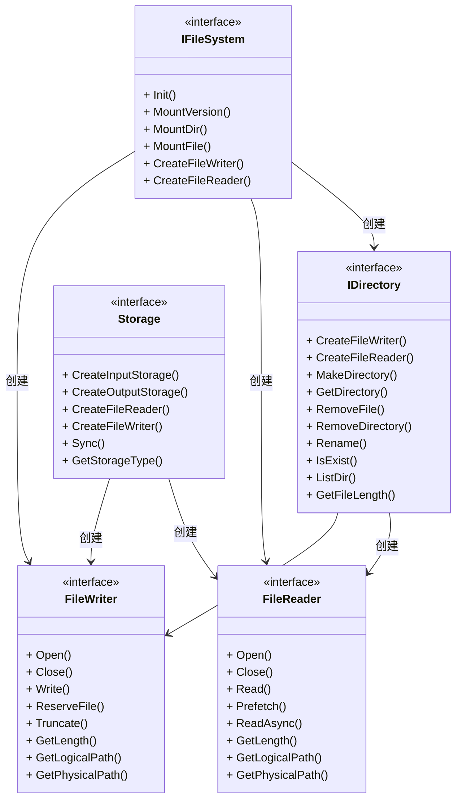
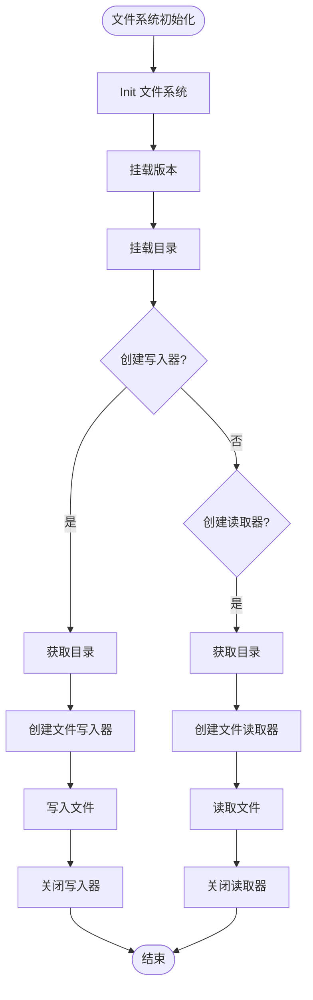
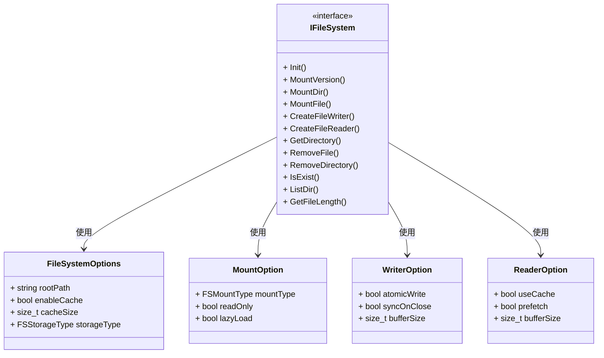
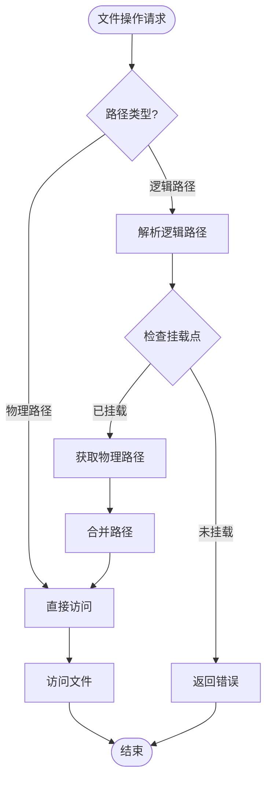
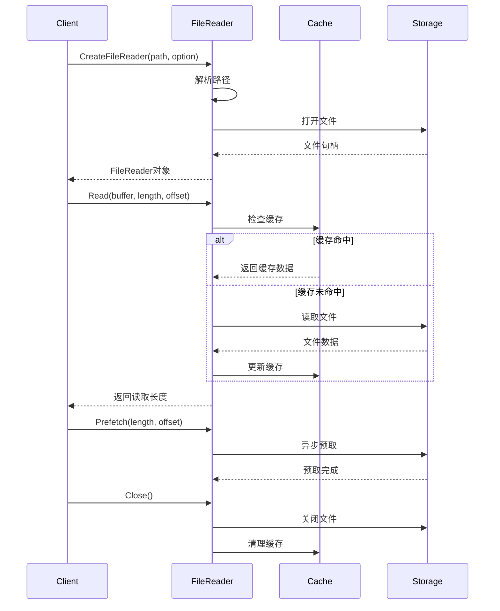
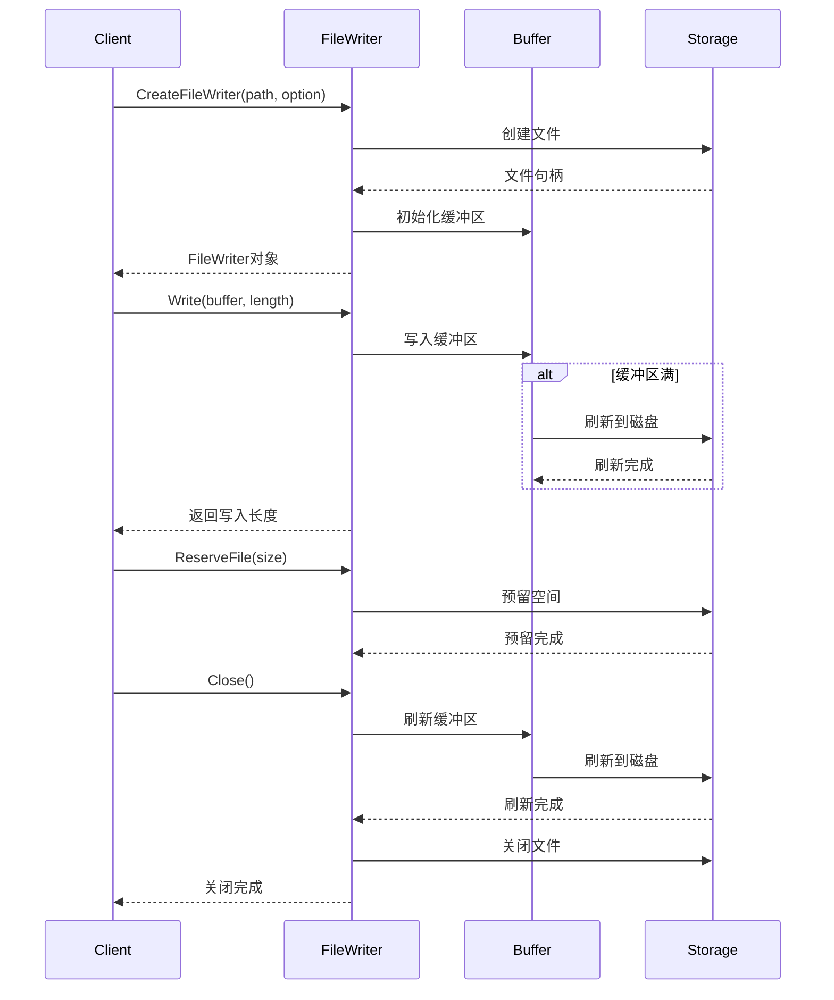
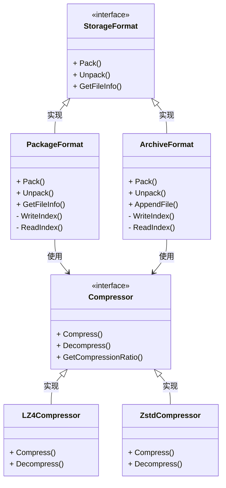
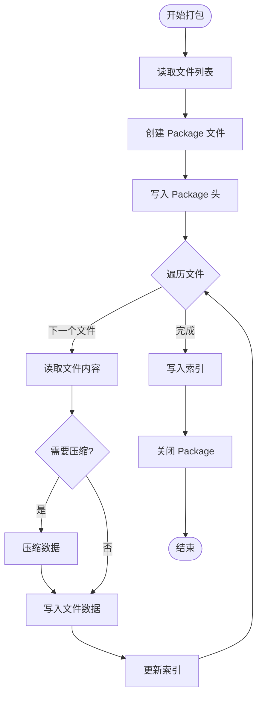
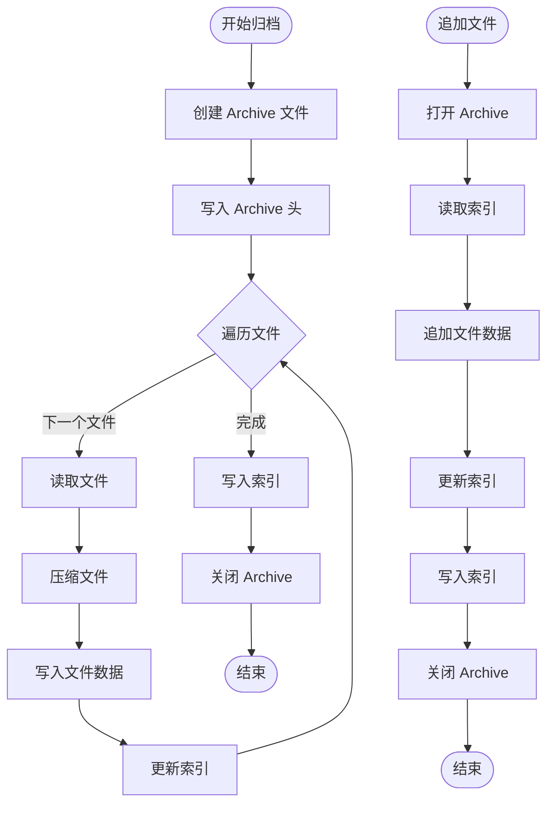
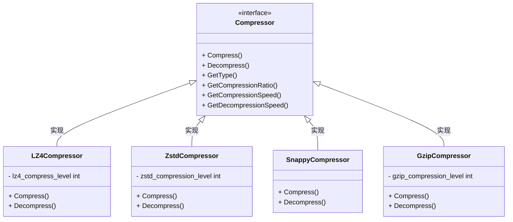

在上一篇文章中，我们深入了解了 Locator 与数据一致性的实现。本文将继续深入，详细解析文件系统抽象与存储格式的实现，这是理解 IndexLib 如何管理文件存储和访问的关键。


## 1. 文件系统抽象概览

### 1.1 文件系统抽象的核心概念

IndexLib 的文件系统抽象包括以下核心概念，通过统一的接口屏蔽底层存储差异，支持多种存储后端。让我们先通过类图来理解文件系统抽象的整体架构：



**文件系统抽象的核心组件**：

1. **IFileSystem**：文件系统接口，提供文件系统的基本操作
   - 初始化文件系统，设置文件系统选项
   - 挂载版本、目录、文件，实现路径映射
   - 创建文件读取器和写入器
   
2. **IDirectory**：目录接口，提供目录和文件的操作
   - 创建、删除、重命名文件和目录
   - 列出目录内容，检查文件是否存在
   - 获取文件长度等元数据信息
   
3. **FileReader**：文件读取器，提供文件读取功能
   - 同步和异步读取文件数据
   - 预取文件数据，提高读取性能
   - 支持指定偏移量读取
   
4. **FileWriter**：文件写入器，提供文件写入功能
   - 写入文件数据
   - 预留文件空间，支持地址访问模式
   - 截断文件，调整文件大小
   
5. **Storage**：存储抽象，提供底层存储操作
   - 创建输入和输出存储
   - 创建文件读取器和写入器
   - 同步存储，刷新数据到磁盘


### 1.2 文件系统抽象的作用

文件系统抽象在 IndexLib 中起到关键作用，是存储管理的基础。让我们通过流程图来理解文件系统抽象的整体工作流程：



**文件系统抽象的核心作用**：

1. **统一接口**：通过统一的接口屏蔽底层存储差异，支持多种存储后端
   - 本地文件系统、分布式文件系统（HDFS）、内存文件系统等
   - 上层代码无需关心底层存储实现
   - 支持存储后端的动态切换
   
2. **逻辑路径**：通过逻辑路径管理文件，支持版本管理和 Segment 管理
   - 物理路径映射到逻辑路径，实现路径抽象
   - 支持版本挂载，不同版本的文件可以共存
   - 支持 Segment 管理，每个 Segment 有独立的路径空间
   
3. **缓存机制**：通过缓存机制提高文件访问性能
   - 文件内容缓存，减少磁盘读取
   - 元数据缓存，减少元数据查询
   - 预取缓存，提前加载可能访问的文件
   
4. **存储格式**：支持多种存储格式（Package、Archive 等），优化存储效率
   - Package 格式：打包多个小文件，减少文件数量
   - Archive 格式：归档存储，支持压缩和索引
   - 压缩格式：支持多种压缩算法，减少存储空间

## 2. IFileSystem：文件系统接口

### 2.1 IFileSystem 的结构

`IFileSystem` 是文件系统接口，定义在 `file_system/IFileSystem.h` 中。它提供了文件系统的基本操作，包括初始化、挂载、文件读写等。让我们先通过类图来理解 IFileSystem 的完整接口：



**IFileSystem 的完整定义**：

```cpp
// file_system/IFileSystem.h
class IFileSystem : autil::NoMoveable
{
public:
    // 初始化文件系统
    virtual FSResult<void> Init(const FileSystemOptions& fileSystemOptions) = 0;
    
    // 挂载版本：将物理路径映射到逻辑路径
    virtual FSResult<void> MountVersion(
        const std::string& physicalRoot,      // 物理根路径
        versionid_t versionId,                 // 版本ID
        const std::string& logicalPath,       // 逻辑路径
        MountOption mountOption) = 0;
    
    // 挂载目录：支持目录级别的挂载
    virtual FSResult<void> MountDir(
        const std::string& physicalRoot,      // 物理根路径
        const std::string& physicalPath,      // 物理路径
        const std::string& logicalPath,      // 逻辑路径
        MountOption mountOption) = 0;
    
    // 挂载文件：支持文件级别的挂载
    virtual FSResult<void> MountFile(
        const std::string& physicalRoot,      // 物理根路径
        const std::string& physicalPath,      // 物理路径
        const std::string& logicalPath,      // 逻辑路径
        FSMountType mountType) = 0;
    
    // 创建文件写入器
    virtual FSResult<std::shared_ptr<FileWriter>> CreateFileWriter(
        const std::string& rawPath,          // 原始路径（逻辑路径或物理路径）
        const WriterOption& writerOption) = 0;
    
    // 创建文件读取器
    virtual FSResult<std::shared_ptr<FileReader>> CreateFileReader(
        const std::string& rawPath,          // 原始路径（逻辑路径或物理路径）
        const ReaderOption& readerOption) = 0;
    
    // 获取目录
    virtual FSResult<std::shared_ptr<IDirectory>> GetDirectory(
        const std::string& logicalPath) = 0;
    
    // 删除文件
    virtual FSResult<void> RemoveFile(
        const std::string& logicalPath,
        const RemoveOption& removeOption) = 0;
    
    // 删除目录
    virtual FSResult<void> RemoveDirectory(
        const std::string& logicalPath,
        const RemoveOption& removeOption) = 0;
    
    // 检查文件是否存在
    virtual FSResult<bool> IsExist(const std::string& logicalPath) const = 0;
    
    // 列出目录
    virtual FSResult<void> ListDir(
        const std::string& logicalPath,
        const ListOption& listOption,
        std::vector<std::string>& fileList) const = 0;
    
    // 获取文件长度
    virtual FSResult<size_t> GetFileLength(const std::string& logicalPath) const = 0;
    
    // 同步文件系统
    virtual FSResult<void> Sync(bool waitFinish = true) = 0;
    
    // 获取文件系统类型
    virtual FSStorageType GetStorageType() const = 0;
};
```

**IFileSystem 的关键方法详解**：

1. **Init()**：初始化文件系统，设置文件系统选项
   - 设置根路径、缓存选项、存储类型等
   - 初始化底层存储系统
   - 创建必要的目录结构
   
2. **MountVersion()**：挂载版本，将物理路径映射到逻辑路径
   - 将版本目录挂载到逻辑路径
   - 支持只读和读写挂载
   - 支持延迟加载，按需加载文件
   
3. **MountDir()**：挂载目录，支持目录级别的挂载
   - 将物理目录挂载到逻辑路径
   - 支持递归挂载子目录
   - 支持挂载选项（只读、延迟加载等）
   
4. **MountFile()**：挂载文件，支持文件级别的挂载
   - 将物理文件挂载到逻辑路径
   - 支持不同的挂载类型（只读、读写等）
   
5. **CreateFileWriter()**：创建文件写入器
   - 根据路径类型（逻辑路径或物理路径）创建写入器
   - 支持写入选项（原子写入、同步关闭等）
   
6. **CreateFileReader()**：创建文件读取器
   - 根据路径类型（逻辑路径或物理路径）创建读取器
   - 支持读取选项（使用缓存、预取等）


### 2.2 逻辑路径与物理路径

文件系统抽象通过逻辑路径和物理路径管理文件，实现路径抽象和版本管理。让我们通过流程图来理解路径映射的机制：



**路径映射的实现**：

```cpp
// file_system/FileSystem.cpp
class FileSystem : public IFileSystem
{
private:
    struct MountPoint {
        std::string physicalPath;    // 物理路径
        std::string logicalPath;    // 逻辑路径
        FSMountType mountType;      // 挂载类型
        bool readOnly;              // 是否只读
    };
    
    std::map<std::string, MountPoint> _mountPoints;  // 挂载点映射
    
public:
    FSResult<std::string> ResolvePath(const std::string& logicalPath) const {
        // 1. 查找最长的匹配挂载点
        std::string bestMatch;
        size_t bestMatchLen = 0;
        
        for (const auto& [logical, mount] : _mountPoints) {
            if (logicalPath.find(logical) == 0) {
                if (logical.length() > bestMatchLen) {
                    bestMatch = logical;
                    bestMatchLen = logical.length();
                }
            }
        }
        
        if (bestMatch.empty()) {
            return FSResult<std::string>::Error("No mount point found");
        }
        
        // 2. 替换逻辑路径为物理路径
        const auto& mount = _mountPoints.at(bestMatch);
        std::string relativePath = logicalPath.substr(bestMatch.length());
        std::string physicalPath = mount.physicalPath + relativePath;
        
        return FSResult<std::string>::OK(physicalPath);
    }
};
```

**路径映射的关键概念**：

1. **物理路径**：文件在磁盘上的实际路径
   - 例如：`/data/indexlib/version_1/segment_0/index`
   - 直接对应磁盘上的文件位置
   
2. **逻辑路径**：文件在逻辑文件系统中的路径
   - 例如：`/indexlib/version_1/segment_0/index`
   - 通过挂载点映射到物理路径
   
3. **路径映射**：通过 Mount 操作将物理路径映射到逻辑路径
   - 支持版本级别的挂载：`MountVersion("/data/indexlib", 1, "/indexlib/v1")`
   - 支持目录级别的挂载：`MountDir("/data/indexlib/seg0", "/indexlib/seg0")`
   - 支持文件级别的挂载：`MountFile("/data/indexlib/file", "/indexlib/file")`
   
4. **版本管理**：通过逻辑路径支持版本管理和 Segment 管理
   - 不同版本的文件可以共存，通过逻辑路径区分
   - 每个 Segment 有独立的路径空间
   - 支持版本切换，无需修改代码


### 2.3 文件系统类型

IndexLib 支持多种文件系统类型：


**文件系统类型**：
- **本地文件系统**：基于本地文件系统的实现
- **分布式文件系统**：基于分布式文件系统的实现（如 HDFS）
- **内存文件系统**：基于内存的文件系统实现
- **混合文件系统**：支持多种存储后端的混合实现

## 3. IDirectory：目录接口

### 3.1 IDirectory 的结构

`IDirectory` 是目录接口，定义在 `file_system/IDirectory.h` 中：

```cpp
// file_system/IDirectory.h
class IDirectory
{
public:
    // 创建文件写入器
    virtual FSResult<std::shared_ptr<FileWriter>> CreateFileWriter(
        const std::string& filePath,
        const WriterOption& writerOption) = 0;
    
    // 创建文件读取器
    virtual FSResult<std::shared_ptr<FileReader>> CreateFileReader(
        const std::string& filePath,
        const ReaderOption& readerOption) = 0;
    
    // 创建目录
    virtual FSResult<std::shared_ptr<IDirectory>> MakeDirectory(
        const std::string& dirPath,
        const DirectoryOption& directoryOption) = 0;
    
    // 获取目录
    virtual FSResult<std::shared_ptr<IDirectory>> GetDirectory(
        const std::string& dirPath) = 0;
    
    // 删除文件
    virtual FSResult<void> RemoveFile(
        const std::string& filePath,
        const RemoveOption& removeOption) = 0;
    
    // 删除目录
    virtual FSResult<void> RemoveDirectory(
        const std::string& dirPath,
        const RemoveOption& removeOption) = 0;
    
    // 重命名
    virtual FSResult<void> Rename(
        const std::string& srcPath,
        const std::shared_ptr<IDirectory>& destDirectory,
        const std::string& destPath) = 0;
    
    // 检查文件是否存在
    virtual FSResult<bool> IsExist(const std::string& path) const = 0;
    
    // 列出目录
    virtual FSResult<void> ListDir(
        const std::string& path,
        const ListOption& listOption,
        std::vector<std::string>& fileList) const = 0;
    
    // 获取文件长度
    virtual FSResult<size_t> GetFileLength(const std::string& filePath) const = 0;
};
```

**IDirectory 的关键方法**：


- **CreateFileWriter()**：创建文件写入器
- **CreateFileReader()**：创建文件读取器
- **MakeDirectory()**：创建目录
- **GetDirectory()**：获取目录
- **RemoveFile()**：删除文件
- **RemoveDirectory()**：删除目录
- **Rename()**：重命名文件或目录
- **IsExist()**：检查文件是否存在
- **ListDir()**：列出目录内容
- **GetFileLength()**：获取文件长度

### 3.2 目录操作流程

目录操作的流程：


**操作流程**：
1. **获取目录**：通过 `GetDirectory()` 获取目录
2. **创建文件**：通过 `CreateFileWriter()` 创建文件写入器
3. **写入文件**：通过 `FileWriter::Write()` 写入文件
4. **读取文件**：通过 `CreateFileReader()` 创建文件读取器
5. **读取数据**：通过 `FileReader::Read()` 读取文件数据

## 4. FileReader 与 FileWriter

### 4.1 FileReader：文件读取器

`FileReader` 是文件读取器，提供文件读取功能，支持同步和异步读取。让我们先通过序列图来理解 FileReader 的完整工作流程：



**FileReader 的完整定义**：

```cpp
// file_system/file/FileReader.h
class FileReader
{
public:
    // 打开文件
    virtual FSResult<void> Open() = 0;
    
    // 关闭文件
    virtual FSResult<void> Close() = 0;
    
    // 读取文件：同步读取
    virtual FSResult<size_t> Read(
        void* buffer,                    // 缓冲区
        size_t length,                   // 读取长度
        size_t offset,                   // 偏移量
        ReadOption option = ReadOption()) = 0;
    
    // 预取文件：异步预取，不阻塞
    virtual FSResult<size_t> Prefetch(
        size_t length,                  // 预取长度
        size_t offset,                  // 偏移量
        ReadOption option) = 0;
    
    // 异步读取：返回 Future
    virtual future_lite::Future<FSResult<size_t>> ReadAsync(
        void* buffer,                   // 缓冲区
        size_t length,                  // 读取长度
        size_t offset,                  // 偏移量
        ReadOption option) = 0;
    
    // 批量读取：读取多个不连续的区域
    virtual FSResult<void> BatchRead(
        const std::vector<ReadRequest>& requests,
        ReadOption option) = 0;
    
    // 获取文件长度
    virtual size_t GetLength() const = 0;
    
    // 获取逻辑路径
    virtual const std::string& GetLogicalPath() const = 0;
    
    // 获取物理路径
    virtual const std::string& GetPhysicalPath() const = 0;
    
    // 获取文件元数据
    virtual FSResult<FileMeta> GetFileMeta() const = 0;
};
```

**FileReader 的实现示例**：

```cpp
// file_system/file/LocalFileReader.cpp
class LocalFileReader : public FileReader
{
private:
    std::string _logicalPath;
    std::string _physicalPath;
    int _fd;
    size_t _fileLength;
    std::shared_ptr<FileCache> _cache;
    
public:
    FSResult<void> Open() override {
        _fd = ::open(_physicalPath.c_str(), O_RDONLY);
        if (_fd < 0) {
            return FSResult<void>::Error("Failed to open file: " + _physicalPath);
        }
        
        // 获取文件长度
        struct stat st;
        if (fstat(_fd, &st) < 0) {
            ::close(_fd);
            return FSResult<void>::Error("Failed to get file length");
        }
        _fileLength = st.st_size;
        
        return FSResult<void>::OK();
    }
    
    FSResult<size_t> Read(void* buffer, size_t length, size_t offset, 
                          ReadOption option) override {
        // 1. 检查缓存
        if (option.useCache && _cache) {
            auto cached = _cache->Get(_physicalPath, offset, length);
            if (cached) {
                memcpy(buffer, cached->data(), length);
                return FSResult<size_t>::OK(length);
            }
        }
        
        // 2. 读取文件
        ssize_t nread = pread(_fd, buffer, length, offset);
        if (nread < 0) {
            return FSResult<size_t>::Error("Failed to read file");
        }
        
        // 3. 更新缓存
        if (option.useCache && _cache) {
            _cache->Put(_physicalPath, offset, buffer, nread);
        }
        
        return FSResult<size_t>::OK(nread);
    }
    
    FSResult<size_t> Prefetch(size_t length, size_t offset, ReadOption option) override {
        // 使用 posix_fadvise 预取
        int ret = posix_fadvise(_fd, offset, length, POSIX_FADV_WILLNEED);
        if (ret != 0) {
            return FSResult<size_t>::Error("Failed to prefetch");
        }
        return FSResult<size_t>::OK(length);
    }
    
    future_lite::Future<FSResult<size_t>> ReadAsync(void* buffer, size_t length, 
                                                    size_t offset, ReadOption option) override {
        // 使用异步 IO（如 io_uring）实现
        return future_lite::async([=]() {
            return Read(buffer, length, offset, option);
        });
    }
    
    FSResult<void> Close() override {
        if (_fd >= 0) {
            ::close(_fd);
            _fd = -1;
        }
        return FSResult<void>::OK();
    }
};
```

**FileReader 的关键特性**：

1. **同步读取**：`Read()` 方法提供同步读取，阻塞直到读取完成
   - 支持指定偏移量，实现随机访问
   - 支持缓存，减少磁盘读取
   - 支持读取选项（使用缓存、预取等）
   
2. **异步读取**：`ReadAsync()` 方法提供异步读取，不阻塞
   - 返回 Future，支持异步编程
   - 支持并发读取，提高吞吐量
   - 使用底层异步 IO（如 io_uring、epoll 等）
   
3. **预取**：`Prefetch()` 方法提供预取功能，提前加载数据
   - 使用 `posix_fadvise` 或类似机制
   - 不阻塞，后台预取
   - 提高后续读取的性能


### 4.2 FileWriter：文件写入器

`FileWriter` 是文件写入器，提供文件写入功能，支持同步和异步写入。让我们先通过序列图来理解 FileWriter 的完整工作流程：



**FileWriter 的完整定义**：

```cpp
// file_system/file/FileWriter.h
class FileWriter : public autil::NoCopyable
{
public:
    // 打开文件
    virtual FSResult<void> Open(
        const std::string& logicalPath,   // 逻辑路径
        const std::string& physicalPath) = 0;  // 物理路径
    
    // 关闭文件
    virtual FSResult<void> Close() = 0;
    
    // 写入文件：同步写入
    virtual FSResult<size_t> Write(
        const void* buffer,                // 缓冲区
        size_t length) = 0;               // 写入长度
    
    // 异步写入：返回 Future
    virtual future_lite::Future<FSResult<size_t>> WriteAsync(
        const void* buffer,
        size_t length) = 0;
    
    // 预留文件空间：用于地址访问模式
    virtual FSResult<void> ReserveFile(size_t reserveSize) = 0;
    
    // 截断文件：调整文件大小
    virtual FSResult<void> Truncate(size_t truncateSize) = 0;
    
    // 刷新缓冲区：将缓冲区数据刷新到磁盘
    virtual FSResult<void> Flush() = 0;
    
    // 同步文件：确保数据写入磁盘
    virtual FSResult<void> Sync() = 0;
    
    // 获取文件长度
    virtual size_t GetLength() const = 0;
    
    // 获取逻辑路径
    virtual const std::string& GetLogicalPath() const = 0;
    
    // 获取物理路径
    virtual const std::string& GetPhysicalPath() const = 0;
};
```

**FileWriter 的实现示例**：

```cpp
// file_system/file/LocalFileWriter.cpp
class LocalFileWriter : public FileWriter
{
private:
    std::string _logicalPath;
    std::string _physicalPath;
    int _fd;
    size_t _fileLength;
    std::vector<char> _buffer;
    size_t _bufferSize;
    bool _atomicWrite;
    
public:
    FSResult<void> Open(const std::string& logicalPath, 
                        const std::string& physicalPath) override {
        _logicalPath = logicalPath;
        _physicalPath = physicalPath;
        
        // 原子写入：先写入临时文件
        if (_atomicWrite) {
            _physicalPath = physicalPath + ".tmp";
        }
        
        _fd = ::open(_physicalPath.c_str(), O_WRONLY | O_CREAT | O_TRUNC, 0644);
        if (_fd < 0) {
            return FSResult<void>::Error("Failed to open file: " + _physicalPath);
        }
        
        _fileLength = 0;
        _buffer.clear();
        _buffer.reserve(_bufferSize);
        
        return FSResult<void>::OK();
    }
    
    FSResult<size_t> Write(const void* buffer, size_t length) override {
        // 1. 写入缓冲区
        const char* data = static_cast<const char*>(buffer);
        _buffer.insert(_buffer.end(), data, data + length);
        
        // 2. 如果缓冲区满，刷新到磁盘
        if (_buffer.size() >= _bufferSize) {
            auto status = Flush();
            if (!status.IsOK()) {
                return FSResult<size_t>::Error(status.GetError());
            }
        }
        
        _fileLength += length;
        return FSResult<size_t>::OK(length);
    }
    
    FSResult<void> Flush() override {
        if (_buffer.empty()) {
            return FSResult<void>::OK();
        }
        
        ssize_t nwrite = ::write(_fd, _buffer.data(), _buffer.size());
        if (nwrite < 0) {
            return FSResult<void>::Error("Failed to write file");
        }
        
        _buffer.clear();
        return FSResult<void>::OK();
    }
    
    FSResult<void> Sync() override {
        // 先刷新缓冲区
        auto status = Flush();
        if (!status.IsOK()) {
            return status;
        }
        
        // 同步到磁盘
        if (fsync(_fd) < 0) {
            return FSResult<void>::Error("Failed to sync file");
        }
        
        return FSResult<void>::OK();
    }
    
    FSResult<void> Close() override {
        // 1. 刷新缓冲区
        auto status = Flush();
        if (!status.IsOK()) {
            return status;
        }
        
        // 2. 同步到磁盘
        status = Sync();
        if (!status.IsOK()) {
            return status;
        }
        
        // 3. 关闭文件
        if (_fd >= 0) {
            ::close(_fd);
            _fd = -1;
        }
        
        // 4. 原子写入：重命名临时文件
        if (_atomicWrite) {
            std::string finalPath = _physicalPath.substr(0, _physicalPath.length() - 4);
            if (rename(_physicalPath.c_str(), finalPath.c_str()) < 0) {
                return FSResult<void>::Error("Failed to rename file");
            }
        }
        
        return FSResult<void>::OK();
    }
    
    FSResult<void> ReserveFile(size_t reserveSize) override {
        // 使用 fallocate 预留空间
        if (fallocate(_fd, 0, 0, reserveSize) < 0) {
            return FSResult<void>::Error("Failed to reserve file space");
        }
        return FSResult<void>::OK();
    }
};
```

**FileWriter 的关键特性**：

1. **缓冲写入**：使用缓冲区减少系统调用，提高写入性能
   - 缓冲区满时自动刷新
   - 支持手动刷新和同步
   
2. **原子写入**：支持原子写入，保证数据一致性
   - 先写入临时文件
   - 写入完成后重命名为最终文件
   - 失败时不会破坏原文件
   
3. **预留空间**：支持预留文件空间，用于地址访问模式
   - 使用 `fallocate` 预留空间
   - 支持随机写入，提高性能


## 5. Storage：存储抽象

### 5.1 Storage 的结构

`Storage` 是存储抽象，定义在 `file_system/Storage.h` 中：

```cpp
// file_system/Storage.h
class Storage
{
public:
    // 创建输入存储
    static std::shared_ptr<Storage> CreateInputStorage(
        const std::shared_ptr<FileSystemOptions>& options,
        const std::shared_ptr<util::BlockMemoryQuotaController>& memController,
        const std::shared_ptr<EntryTable>& entryTable) = 0;
    
    // 创建输出存储
    static std::shared_ptr<Storage> CreateOutputStorage(
        const std::string& outputRoot,
        const std::shared_ptr<FileSystemOptions>& options,
        const std::shared_ptr<util::BlockMemoryQuotaController>& memController) = 0;
    
    // 创建文件读取器
    virtual FSResult<std::shared_ptr<FileReader>> CreateFileReader(
        const std::string& logicalFilePath,
        const std::string& physicalFilePath,
        const ReaderOption& readerOption) = 0;
    
    // 创建文件写入器
    virtual FSResult<std::shared_ptr<FileWriter>> CreateFileWriter(
        const std::string& logicalFilePath,
        const std::string& physicalFilePath,
        const WriterOption& writerOption) = 0;
    
    // 同步存储
    virtual FSResult<std::future<bool>> Sync() = 0;
    
    // 获取存储类型
    virtual FSStorageType GetStorageType() const = 0;
};
```

**Storage 的关键方法**：


- **CreateInputStorage()**：创建输入存储，用于读取
- **CreateOutputStorage()**：创建输出存储，用于写入
- **CreateFileReader()**：创建文件读取器
- **CreateFileWriter()**：创建文件写入器
- **Sync()**：同步存储，刷新数据到磁盘
- **GetStorageType()**：获取存储类型

### 5.2 存储类型

IndexLib 支持多种存储类型：


**存储类型**：
- **本地存储**：基于本地文件系统的存储
- **分布式存储**：基于分布式文件系统的存储
- **内存存储**：基于内存的存储
- **混合存储**：支持多种存储后端的混合存储

## 6. 存储格式

IndexLib 支持多种存储格式，包括 Package、Archive 和压缩格式，用于优化存储效率和访问性能。让我们先通过类图来理解存储格式的整体架构：



### 6.1 Package 格式

Package 格式是一种打包存储格式，将多个小文件打包成一个大文件，减少文件系统的小文件数量，提高 IO 效率。让我们通过流程图来理解 Package 格式的打包和解包流程：



**Package 格式的结构**：

```cpp
// file_system/package/PackageFormat.h
struct PackageHeader {
    uint32_t magic;           // 魔数：0x504B4741 ("PKGA")
    uint32_t version;         // 版本号
    uint32_t fileCount;       // 文件数量
    uint64_t indexOffset;     // 索引偏移量
    uint64_t indexSize;       // 索引大小
    uint32_t flags;           // 标志位（压缩、加密等）
};

struct FileEntry {
    std::string fileName;     // 文件名
    uint64_t offset;          // 文件在 Package 中的偏移量
    uint64_t size;            // 文件大小（压缩前）
    uint64_t compressedSize;  // 压缩后大小
    uint32_t compressionType; // 压缩类型
    uint32_t crc32;           // CRC32 校验
};

struct PackageIndex {
    std::vector<FileEntry> entries;  // 文件条目列表
    std::map<std::string, size_t> nameToIndex;  // 文件名到索引的映射
};
```

**Package 格式的打包实现**：

```cpp
// file_system/package/PackageFormat.cpp
FSResult<void> PackageFormat::Pack(const std::vector<std::string>& files,
                                     const std::string& outputPath) {
    // 1. 创建 Package 文件
    auto writer = CreateFileWriter(outputPath);
    if (!writer.IsOK()) {
        return FSResult<void>::Error("Failed to create package file");
    }
    
    // 2. 写入 Package 头（占位，稍后更新）
    PackageHeader header = {};
    header.magic = 0x504B4741;  // "PKGA"
    header.version = 1;
    header.fileCount = files.size();
    
    size_t headerSize = sizeof(PackageHeader);
    size_t dataOffset = headerSize;
    
    // 3. 写入文件数据
    PackageIndex index;
    for (const auto& filePath : files) {
        // 读取文件
        auto reader = CreateFileReader(filePath);
        if (!reader.IsOK()) {
            return FSResult<void>::Error("Failed to read file: " + filePath);
        }
        
        std::vector<char> data(reader->GetLength());
        auto readResult = reader->Read(data.data(), data.size(), 0);
        if (!readResult.IsOK()) {
            return FSResult<void>::Error("Failed to read file data");
        }
        
        // 压缩文件（可选）
        std::vector<char> compressed;
        uint32_t compressionType = 0;
        if (_options.compress) {
            auto compressResult = _compressor->Compress(data, compressed);
            if (compressResult.IsOK() && compressed.size() < data.size()) {
                data = compressed;
                compressionType = _compressor->GetType();
            }
        }
        
        // 写入文件数据
        FileEntry entry;
        entry.fileName = GetFileName(filePath);
        entry.offset = dataOffset;
        entry.size = reader->GetLength();
        entry.compressedSize = data.size();
        entry.compressionType = compressionType;
        entry.crc32 = CalculateCRC32(data);
        
        auto writeResult = writer->Write(data.data(), data.size());
        if (!writeResult.IsOK()) {
            return FSResult<void>::Error("Failed to write file data");
        }
        
        dataOffset += data.size();
        index.entries.push_back(entry);
        index.nameToIndex[entry.fileName] = index.entries.size() - 1;
    }
    
    // 4. 写入索引
    header.indexOffset = dataOffset;
    std::string indexData = SerializeIndex(index);
    header.indexSize = indexData.size();
    
    auto writeResult = writer->Write(indexData.data(), indexData.size());
    if (!writeResult.IsOK()) {
        return FSResult<void>::Error("Failed to write index");
    }
    
    // 5. 更新 Package 头
    writer->Seek(0);
    writer->Write(&header, sizeof(header));
    
    // 6. 关闭文件
    writer->Close();
    
    return FSResult<void>::OK();
}
```

**Package 格式的特点**：

1. **文件打包**：将多个小文件打包成一个大文件
   - 减少文件系统的小文件数量
   - 提高文件系统的性能
   
2. **减少文件数**：减少文件系统的小文件数量
   - 文件系统对小文件的支持较差
   - 打包后可以减少文件数量，提高性能
   
3. **提高 IO 效率**：提高批量 IO 的效率
   - 打包后可以批量读取多个文件
   - 减少文件打开和关闭的开销
   
4. **支持压缩**：支持文件压缩，减少存储空间
   - 每个文件可以独立压缩
   - 支持多种压缩算法（LZ4、Zstd 等）


### 6.2 Archive 格式

Archive 格式是一种归档存储格式，支持文件归档、压缩、索引和追加。让我们通过流程图来理解 Archive 格式的归档流程：



**Archive 格式的结构**：

```cpp
// file_system/archive/ArchiveFormat.h
struct ArchiveHeader {
    uint32_t magic;           // 魔数：0x41524348 ("ARCH")
    uint32_t version;         // 版本号
    uint64_t fileCount;       // 文件数量
    uint64_t indexOffset;     // 索引偏移量
    uint64_t indexSize;       // 索引大小
    uint32_t flags;           // 标志位
};

struct ArchiveEntry {
    std::string fileName;     // 文件名
    uint64_t offset;          // 文件在 Archive 中的偏移量
    uint64_t size;            // 文件大小
    uint64_t compressedSize;  // 压缩后大小
    uint32_t compressionType; // 压缩类型
    uint64_t timestamp;       // 时间戳
    uint32_t crc32;           // CRC32 校验
};

struct ArchiveIndex {
    std::vector<ArchiveEntry> entries;  // 文件条目列表
    std::map<std::string, size_t> nameToIndex;  // 文件名到索引的映射
    std::map<uint64_t, std::vector<size_t>> timestampToIndex;  // 时间戳到索引的映射
};
```

**Archive 格式的特点**：

1. **文件归档**：将文件归档存储
   - 支持追加文件到归档
   - 支持按时间戳查询文件
   
2. **支持压缩**：支持文件压缩
   - 每个文件可以独立压缩
   - 支持多种压缩算法
   
3. **支持索引**：支持文件索引，快速定位文件
   - 文件名索引：快速查找文件
   - 时间戳索引：按时间查询文件
   
4. **支持追加**：支持追加文件到归档
   - 不需要重新打包整个归档
   - 更新索引即可


### 6.3 压缩格式

IndexLib 支持多种压缩格式，包括 LZ4、Zstd、Snappy 和 Gzip。让我们通过类图来理解压缩格式的架构：



**压缩格式的对比**：

| 压缩算法 | 压缩速度 | 压缩率 | 解压速度 | 适用场景 |
|---------|---------|--------|---------|---------|
| LZ4 | 极快 | 中等 | 极快 | 实时写入、高频访问 |
| Zstd | 快 | 高 | 快 | 存储优化、离线处理 |
| Snappy | 极快 | 低 | 极快 | 实时写入、低延迟 |
| Gzip | 慢 | 高 | 中等 | 兼容性要求高 |

**压缩格式的选择**：

1. **LZ4**：快速压缩算法，压缩速度快
   - 适用于实时写入场景
   - 压缩速度极快，解压速度也极快
   - 压缩率中等，适合对速度要求高的场景
   
2. **Zstd**：高效压缩算法，压缩率高
   - 适用于存储优化场景
   - 压缩率高，适合对存储空间要求高的场景
   - 压缩和解压速度都较快
   
3. **Snappy**：快速压缩算法，压缩速度快
   - 适用于实时写入场景
   - 压缩速度极快，解压速度也极快
   - 压缩率较低，适合对速度要求极高的场景
   
4. **Gzip**：通用压缩算法，兼容性好
   - 适用于兼容性要求高的场景
   - 压缩率高，但压缩速度较慢
   - 兼容性好，支持广泛


## 7. 文件系统缓存

### 7.1 缓存机制

文件系统缓存的机制：


**缓存机制**：
- **文件缓存**：缓存文件内容，减少磁盘读取
- **元数据缓存**：缓存文件元数据，减少元数据查询
- **预取缓存**：预取文件数据，提高读取性能
- **LRU 缓存**：使用 LRU 策略管理缓存

### 7.2 缓存策略

文件系统缓存的策略：


**缓存策略**：
- **LRU**：最近最少使用策略，淘汰最久未使用的缓存
- **LFU**：最不经常使用策略，淘汰使用频率最低的缓存
- **按需缓存**：根据访问模式按需缓存
- **预取缓存**：预取可能访问的文件

## 8. 文件系统性能优化

### 8.1 IO 优化

文件系统 IO 的优化：


**IO 优化策略**：
- **批量 IO**：批量读取和写入文件，减少 IO 次数
- **异步 IO**：异步读取和写入文件，提高并发度
- **预取**：预取文件数据，减少读取延迟
- **IO 合并**：合并多个 IO 操作，减少 IO 开销

### 8.2 存储优化

文件系统存储的优化：


**存储优化策略**：
- **文件压缩**：压缩文件数据，减少存储空间
- **文件打包**：打包多个小文件，减少文件数量
- **存储分层**：根据访问频率分层存储
- **生命周期管理**：根据生命周期管理文件

## 9. 文件系统的关键设计

### 9.1 统一接口设计

文件系统的统一接口设计：


**设计要点**：
- **接口抽象**：通过接口抽象屏蔽底层存储差异
- **多后端支持**：支持多种存储后端（本地、分布式等）
- **透明访问**：通过逻辑路径实现透明访问
- **灵活扩展**：支持自定义存储后端

### 9.2 逻辑路径设计

逻辑路径的设计：


**设计要点**：
- **路径映射**：通过 Mount 操作映射物理路径到逻辑路径
- **版本管理**：通过逻辑路径支持版本管理
- **Segment 管理**：通过逻辑路径支持 Segment 管理
- **路径隔离**：不同版本和 Segment 的路径相互隔离

### 9.3 性能优化设计

文件系统性能优化的设计：


**设计要点**：
- **缓存机制**：通过缓存提高文件访问性能
- **预取机制**：通过预取减少读取延迟
- **批量操作**：通过批量操作减少 IO 次数
- **异步操作**：通过异步操作提高并发度

## 10. 小结

文件系统抽象与存储格式是 IndexLib 的核心功能，通过 IFileSystem、IDirectory、FileReader、FileWriter 等组件实现。通过本文的深入解析，我们了解到：

**关键要点**：
- **IFileSystem**：文件系统接口，提供文件系统的基本操作，支持版本挂载和路径映射
- **IDirectory**：目录接口，提供目录和文件的操作，支持逻辑路径管理
- **FileReader**：文件读取器，提供文件读取功能，支持同步和异步读取
- **FileWriter**：文件写入器，提供文件写入功能，支持文件写入和截断
- **Storage**：存储抽象，提供底层存储操作，支持多种存储后端
- **存储格式**：支持 Package、Archive 等多种存储格式，优化存储效率
- **缓存机制**：通过缓存机制提高文件访问性能
- **性能优化**：通过 IO 优化、存储优化等策略提高文件系统性能
- **统一接口**：通过统一接口屏蔽底层存储差异，支持多种存储后端

理解文件系统抽象与存储格式，是掌握 IndexLib 存储管理机制的关键。通过本系列文章的深入解析，我们已经全面了解了 IndexLib 的架构、核心组件、构建流程、查询流程、版本管理、Segment 合并、内存管理、索引类型、Locator 与数据一致性、文件系统抽象等各个方面。希望这些文章能够帮助读者深入理解 IndexLib 的设计和实现。
