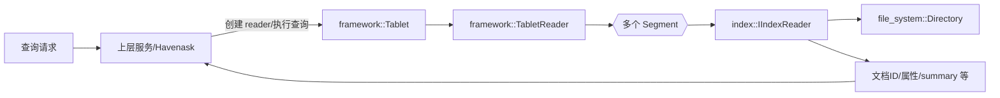
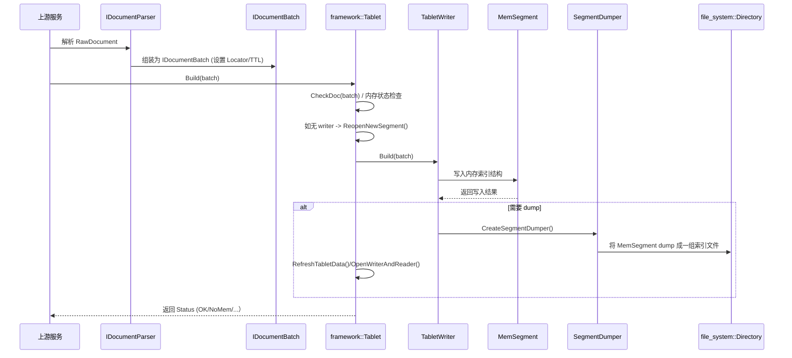

## Indexlib 源码解析（一）：背景、整体架构与关键流程概览

> 本文是 indexlib 系列解析的第 1 篇，聚焦 **背景、整体架构**，并结合 havenask 中 `aios/storage/indexlib` 的实际代码，对若干 **关键概念与关键类** 做初步解读，为后续更深入的篇章打基础。

---
## 一、背景：从搜索引擎到「通用索引存储引擎」

### 1.1 indexlib 的定位

搜索类系统（商品搜索、内容搜索、广告检索等）依赖一套统一的索引引擎：**indexlib**。在更上层，会有像 Ha3 / Havenask 这样的 **搜索服务引擎**，负责：

- **查询解析**：将用户 Query 解析为布尔表达式、短语、打分函数等；
- **召回与排序**：基于倒排索引做召回，结合实时业务特征做排序；
- **分布式路由**：多分片（shard）部署、路由、聚合。

而 indexlib 专注于下层的 **索引与存储**，它的职责可以概括为：

- **索引构建**：离线/实时地将原始文档构建为倒排、属性（attribute）、摘要（summary）、PK 索引、KV/KKV 等；
- **索引组织**：将索引拆分为多个 Segment、Version，并管理生命周期（合并、清理、多版本共存）；
- **读写接口**：提供统一的写入（Build）、提交（Commit）、查询（Reader）接口，供上层搜索服务调用；
- **文件系统抽象**：屏蔽本地/远程存储（如 HDFS、对象存储等）的差异，通过统一的 `file_system` 层访问。

在 havenask 代码树中，`aios/storage/indexlib` 可以看作是 **indexlib v2 + legacy indexlib 的统一实现与适配层**，其中：

- `indexlib/`（根目录下）是 **新的 v2 架构**，命名空间主要是 `indexlibv2::`；
- `indexlib/indexlib/` 以及 `legacy/` 目录保留了较多 **历史接口与实现**；
- 顶层 `indexlib/indexlib.h` 把 legacy 的类型、枚举往外导出，给旧代码/外部组件一个平滑迁移路径。

### 1.2 为什么会有 indexlibv2 / Tablet 这一套新架构？

从代码目录可以看到：

- 有老的 `indexlib/indexlib/partition`, `indexlib/indexlib/index`, `indexlib/indexlib/index_base` 等；
- 也有新的 `framework/Tablet.h`, `table/`, `index/`, `document/`, `config/` 等。

**indexlibv2 的核心目标**大致是：

- 用 **更清晰的抽象**（如 `Tablet`、`ITabletSchema`、`TabletOptions`、`Version` 等）重新梳理索引存储；
- 把原来「以索引分区（IndexPartition）」为中心的接口演进为「以 Table / Tablet 为中心」；
- **更好地支持多表类型**（倒排表、KV、KKV、summary-only 等），对应 `table/` 下丰富的 Table 实现；
- 提供更现代化的 **内存控制、实时写入（LSM 架构）、索引任务（Index Task）** 框架。

本系列第一篇就从这套新架构入手：**理解 Tablet / Segment / Version / Schema / FileSystem 等基础模块的关系**。

---

## 二、源码入口与目录总览

以 `aios/storage/indexlib` 为根，看一下主要目录：

- **`analyzer/`**：分词和文本分析模块，提供 `Analyzer`, `ITokenizer`, `StopWordFilter` 等；
- **`base/`**：基础类型与工具，例如：
  - `Types.h` 中的 `docid_t`, `segmentid_t`, `schemaid_t` 等；
  - `Status` 错误码体系，`MemoryQuotaController` 等；
- **`config/`**：配置与 Schema：
  - `TabletSchema.h`：表 schema 抽象；
  - `TabletOptions.h`：表/Tablet 的运行时配置（online/offline/merge 等）；
- **`document/`**：文档抽象及解析：
  - `IDocument`, `IDocumentBatch`, `IDocumentParser`；
  - `normal/`, `kv/`, `kkv/` 等文档细分实现；
- **`file_system/`**：统一文件系统抽象：
  - `Directory`、`FileReader`、`FileWriter`、`IFileSystem` 等；
- **`framework/`**：indexlibv2 的「中枢大脑」：
  - `Tablet`, `ITablet`, `TabletReader`, `TabletWriter`, `Version`, `Segment` 等；
- **`index/`**：真正做「索引」的模块，比文件多很多（倒排、属性、summary、PK、KV/KKV 等各种索引器、reader/writer）；
- **`table/`**：Table 级别的实现（如 InvertedTable、KVTable、KKVTable 等），把 config + document + index glue 在一起；
- **`legacy/`、`indexlib/indexlib/`**：旧版 indexlib 的实现和适配层；
- **`util/`**：公共工具类，比如内存管理、计数、metrics、缓存等。

可以把整个目录理解成三层：

- **上层：Table & Framework**
  - `framework/`, `table/`, `config/`, `document/`
- **中层：Index & FileSystem**
  - `index/`, `file_system/`
- **底层：基础设施 & Legacy**
  - `base/`, `util/`, `legacy/`, `indexlib/indexlib/`

后面的架构图会反复围绕这三层展开。

---

## 三、核心抽象：Tablet / Segment / Version / Schema

这一节重点回答：**「一个索引库在 indexlib 眼中到底是什么？」**

### 3.1 Tablet：统一的索引库抽象

从 `framework/ITablet.h` 可以看到，一个 Tablet（表/索引库）的核心操作大致分为 **生命周期 + 写入 + 读取** 三大类。

- **生命周期接口**（打开、重打开、关闭）：
  - `Open(const IndexRoot&, const shared_ptr<ITabletSchema>&, const shared_ptr<TabletOptions>&, const VersionCoord&)`
  - `Reopen(const ReopenOptions&, const VersionCoord&)`
  - `Close()`
- **写入侧**：
  - `Build(const shared_ptr<IDocumentBatch>& batch)`：写入一批文档；
  - `Flush()`：将内存数据刷到磁盘；
  - `Seal()`：封印当前 building segment，不再接受新文档；
  - `NeedCommit()` & `Commit(const CommitOptions&)`：判断/执行版本提交；
  - `AlterTable(const shared_ptr<ITabletSchema>& newSchema)`：在线 schema 变更；
  - `Import/ImportExternalFiles/ExecuteTask`：索引任务（重建、迁移、bulkload 等）；
- **读取侧**：
  - `GetTabletReader()`：获取一个只读视图 Reader，用于 Query；
  - `GetTabletInfos()`：获取 Tablet 状态信息（doc 数量、内存状态、locator 等）；
  - `GetTabletSchema()`/`GetTabletOptions()`：获取当前运行 schema / options。

在 `framework/Tablet.h` 中，类 `indexlibv2::framework::Tablet` 继承了 `ITablet`，是真正的实现：

- 内部维护了：
  - `_tabletData`（封装 version + segments + resource map）；
  - `_tabletWriter` / `_tabletReader`；
  - `_tabletSchemaMgr` / `_memSegmentCreator`；
  - `_tabletMemoryQuotaController`、`_memReclaimer` 等内存控制组件；
  - `_metricsManager`, `_tabletMetrics` 用于监控；
- 并通过各种私有方法把上层接口拆解成一系列细粒度操作：
  - `PrepareIndexRoot`, `InitIndexDirectory`, `RecoverIndexInfo` 等负责打开时的目录和版本初始化；
  - `RefreshTabletData`, `ReopenNewSegment`, `FinalizeTabletData` 负责构造新的 TabletData 视图；
  - `OpenWriterAndReader` 将 `TabletData` 绑定到 Reader/Writer 上。

可以直观地把 Tablet 理解为：**「一个完整表的索引生命周期管理器」**，它知道：

- 索引根目录在哪里；
- 当前活跃的是哪个 `Version`；
- 有哪些 `Segment` 在磁盘上、有哪个在内存中；
- 上层写入了哪些文档、是否需要触发 Dump、Merge；
- 查询时应该用哪个 Reader / 哪些 Segment。

### 3.2 Segment：索引的物理分片

在 `framework/Segment.h` 及相关文件中，一个 `Segment` 表示索引中的一个 **物理分片**。典型地：

- 每个 Segment 包含：
  - **倒排索引**（posting files）；
  - **属性索引**（attribute files）；
  - **summary / pack summary**；
  - **内部元信息**（如 `SegmentInfo`、`SegmentMetrics`）；
- 按生命周期大致分为：
  - **MemSegment**：内存中的 building segment；
  - **DiskSegment**：已经 dump 到磁盘的封闭分片；
- Segment 的组织由 `SegmentDescriptions`、`SegmentTopologyInfo` 等辅助类描述。

Segment 是 indexlib 中实现 **LSM / 多段合并** 架构的核心单位：写入只会往新的 building segment 追加，之后通过 Merge Task 把多个 Segment 合并成更大的段，以控制查询成本和存储碎片。

### 3.3 Version：Segment 的「快照视图」

`framework/Version.h` 定义的 `indexlibv2::framework::Version` 是一个非常关键的抽象：

- 一个 Version 本质上是「某个时间点索引库的 **完整视图**」：
  - 包含一个 `_segments` 向量，里面是若干 `SegmentInVersion`（`segmentId + schemaId`）；
  - 记录 `versionId`、`timestamp`、`commitTime`、`locator`、`schemaId` 等；
  - 关联 `VersionLine`、`IndexTaskHistory` 等辅助信息。
- 它提供一系列操作：
  - `AddSegment/RemoveSegment/UpdateSegmentSchemaId`：修改版本包含的 segments；
  - `GetSegmentCount/HasSegment/GetSegmentDirName`：查询版本基本信息；
  - `SetSchemaVersionRoadMap`：记录不同 segment 对应的 schema 版本；
  - `Clone()`：克隆一个版本（可更改 fence 名称等），常用于 import/merge 生成新版本。

在运行时，`TabletData` 持有一个当前的 `Version`，Reader/Writer 都围绕这个版本工作。当调用 `Commit()` 时，会生成一个新的 Version 文件（`version.N`），并在目录中落盘。

### 3.4 Schema / Options：配置驱动的一切

在 `config/TabletSchema.h` 与 `config/TabletOptions.h` 两个文件中，indexlib 把配置与 runtime 行为分得很清晰：

- **`ITabletSchema` & `TabletSchema`**：
  - 负责「**索引结构**」层面的描述：
    - 表名、表类型（如 inverted table / kv / kkv / aggregation table 等）；
    - 字段（`FieldConfig`）列表：字段名、类型、是否多值、是否可 null、编码和压缩策略；
    - 各类索引配置（`IIndexConfig`）：
      - 倒排索引（posting）；
      - 属性索引（attribute）；
      - PK 索引 / KV / KKV 索引；
      - summary / pack summary / index summary；
    - 运行时 Setting（`MutableJson`），用于在运行期间控制一些行为；
  - `TabletSchema` 内部会保留一份 `legacy` 的 `IndexPartitionSchema`，并提供 `LoadLegacySchema`、`IsLegacySchema` 等工具方法，以兼容旧格式。
- **`TabletOptions`**：
  - 负责「**运行策略**」层面的描述：
    - Online / Offline 配置（`OnlineConfig` / `OfflineConfig`）；
    - Build 相关配置（`BuildConfig`, `BuildOptionConfig`）；
    - Merge 策略（`MergeConfig`）；
    - 后台任务配置（`BackgroundTaskConfig`）；
    - 读写根路径、是否读 remote index、是否需要 deploy index 等；
  - 还提供一套 `GetFromRawJson` 能力，可以从整个 Options 的原始 JSON 中按路径取任意配置信息。

可以简单地说：**Schema 决定「建什么索引」，Options 决定「怎么建、怎么跑」**。

---

## 四、整体架构与数据流（含示意图）

下面用几个简化的架构图，串一下 indexlibv2 的整体模块关系和请求流。

### 4.1 模块关系图

```mermaid
graph TD
  App[上层服务<br/>Havenask / Ha3 / 业务应用] -->|调用接口| Tablet[framework::Tablet]

  subgraph Config & Schema
    Schema[config::TabletSchema]
    Options[config::TabletOptions]
  end

  subgraph Framework
    Tablet
    Version[framework::Version]
    Segment[framework::Segment/MemSegment/DiskSegment]
    TabletData[framework::TabletData]
    TabletReader[framework::TabletReader]
    TabletWriter[framework::TabletWriter]
  end

  subgraph Document
    DocBatch[document::IDocumentBatch]
    Doc[document::IDocument]
    Parser[document::IDocumentParser]
  end

  subgraph Index
    Indexer[index::IIndexer<br/>(inverted/attribute/summary/KV...)]
    IndexReader[index::IIndexReader]
  end

  subgraph FileSystem
    Dir[file_system::Directory]
    FS[file_system::IFileSystem]
  end

  App -->|文档写入/查询| Tablet
  Tablet --> Schema
  Tablet --> Options
  Tablet --> TabletData
  TabletData --> Version
  TabletData --> Segment
  Tablet --> TabletReader
  Tablet --> TabletWriter
  TabletWriter --> Indexer
  TabletReader --> IndexReader
  DocBatch --> TabletWriter
  Parser --> DocBatch
  Indexer --> Dir
  IndexReader --> Dir
  Dir --> FS
```

从这个图可以看到，**Tablet 是上层与下层所有模块之间的「唯一门面」**：

- 上层服务不用关心 Segment、Version、FileSystem 等细节，只和 `ITablet`、`ITabletReader`、`IDocumentBatch` 打交道；
- Tablet 内部负责组织 Schema / Options / Version / Segment / Reader / Writer。

### 4.2 写入数据流（Build 流程）

```mermaid
flowchart LR
  Source[上游数据源<br/>日志/Kafka/HTTP 等] --> RawDoc[RawDocument]
  RawDoc --> Parser[document::IDocumentParser]
  Parser --> DocBatch[document::IDocumentBatch]
  DocBatch -->|Build| Tablet[framework::Tablet]
  Tablet -->|Build| Writer[framework::TabletWriter]
  Writer --> Indexer[index::IIndexer...]
  Indexer --> MemSeg[framework::MemSegment]
  MemSeg -->|Dump| DiskSeg[framework::DiskSegment]
  DiskSeg --> FSDir[file_system::Directory<br/>version.N/segment_X]
```



关键点：

- **上游对 indexlib 的入口就是 `Build(const shared_ptr<IDocumentBatch>&)`**；
- 文档经过 `IDocumentParser` 解析，形成 `IDocumentBatch`（支持批量、TTL、Locator 等）；
- `TabletWriter` 把文档路由给具体的 `Indexer`，写入到当前的 `MemSegment`；
- 当达到触发条件（数量、内存、时间等），会通过 `SegmentDumper` 把 `MemSegment` Dump 成 `DiskSegment`，写进文件系统；
- Commit 时，会生成新的 `Version` 文件，记录哪些 Segment 属于该 Version。

### 4.3 查询数据流（Reader 流程）



- 上层一般会持有一个长期存在的 `TabletReader`（或通过 `GetTabletReader()` 拿 session reader）；
- 在一个 Reader 内部，会遍历当前 `Version` 下的多个 `Segment` 来做查询；
- 对上层来说，只看到一个统一的 Query/Result 接口。

---

## 五、关键模块拆解与代码级理解（概览版）

这一节不贴原始代码，而是按模块抽象出核心职责，配上简化的伪代码逻辑，帮助你建立「脑内模型」，后续你再读具体实现会容易很多。

### 5.1 framework::Tablet：一个表的控制中心

结合 `framework/Tablet.h` 和 `framework/Tablet.cpp`，可以把 `Tablet` 的核心职责概括为：

- **生命周期管理**：
  - `Open`：解析 `IndexRoot`，初始化 FileSystem & Directory，恢复/加载 Version，构造初始 `TabletData`；
  - `Reopen`：基于 ReopenOptions & VersionCoord 刷新 `TabletData` 与读写器；
  - `Close`：清理 Reader/Writer，释放资源；
- **Build / Dump / Commit 流程控制**：
  - `Build`：写入文档批次，并触发必要的 Dump；
  - `Flush`：强制刷盘，确保内存数据落磁盘；
  - `Seal`：当前 building segment 不再接受新写入；
  - `NeedCommit` / `Commit`：判断是否需要生成新版本，并产出 `VersionMeta`；
- **Schema & Option 管理**：
  - `AlterTable`：在线 schema 变更，涉及对 `TabletData`、`Version`、`Segments` 的兼容性检查；
  - 内部 `TabletSchemaManager`、`TabletSchemaLoader` 负责版本化 schema 的加载和管理；
- **内存控制与资源清理**：
  - `MemoryQuotaController` + `MemoryQuotaSynchronizer` 控制整体与 build 内存；
  - `IIndexMemoryReclaimer`（`EpochBasedMemReclaimer`）回收不再使用的内存资源；
  - `ResourceCleaner` 定期清理过期的索引文件、资源文件等。

用一个高度简化的伪代码描述 `Build` 流程（与实际实现不完全一致，仅用于理解）：

```cpp
Status Tablet::Build(const std::shared_ptr<IDocumentBatch>& batch) {
    // 1. 基本检查：只读/空 batch/内存状态
    if (options.IsReadOnly()) return Status::Unimplement("readonly");
    if (!batch) return Status::InvalidArgs("nullptr");
    if (TabletInfos->MemoryStatusTooHigh()) return Status::NoMem(...);

    // 2. 加锁，保护 _tabletData 等共享状态
    LockGuard dataGuard(_dataMutex);

    // 3. 校验 Locator，防止回退或重复消费
    auto st = CheckDoc(batch.get());
    if (!st.IsOK()) return st;
    if (_needSeek) return Status::Uninitialize("need reseek");

    // 4. 如当前没有 writer，则打开新 building segment
    if (!_tabletWriter) {
        auto st = ReopenNewSegment(GetTabletSchema());
        if (!st.IsOK()) return st;
    }

    // 5. 把文档交给 TabletWriter
    auto status = _tabletWriter->Build(batch);
    if (status.IsNeedDump()) {
        auto dumper = _tabletWriter->CreateSegmentDumper();
        // 把当前 MemSegment dump 成 DiskSegment，并刷新 TabletData/Reader
        // ...
    }
    // 6. 更新 doc 计数、metrics 等
    UpdateDocCount();
    ReportMetrics(_tabletWriter);
    return status;
}
```

`OpenWriterAndReader` 则大致是：

- 根据当前 `TabletData` 中的 `Version` 与 Segment 列表，创建新的 `TabletReader`；
- 根据 `WriteSchema` 创建新的 `TabletWriter`，并把当前 building segments 切成一个 slice；
- 把新的 Reader / Writer 填回 `Tablet`，同时更新 `_tabletReaderContainer`、`_tabletInfos` 中的各种状态。

从这些逻辑可以看到：**Tablet 的核心是不断刷新 `TabletData`，并围绕它创建/更新 Reader & Writer**。

### 5.2 document 模块：从原始数据到标准化文档

`document/` 目录下，最关键的抽象是：

- **`IDocument`**：一条标准化后的文档，在不同表类型下有不同子类实现（normal doc, KV doc, KKV doc 等）；
- **`IDocumentBatch`**：一批文档的容器，重要接口包括：
  - `AddDocument`, `DropDoc`, `ReleaseDoc`；
  - `GetBatchSize()`, `GetValidDocCount()`, `EstimateMemory()`；
  - `GetLastLocator()`, `GetMaxTTL()`, `GetMaxTimestamp()` 等；
  - `SetBatchLocator`, `GetBatchLocator` 用于批次级 locator；
- **`IDocumentParser`**：
  - 负责将上游的 RawDocument（通常是 KV map 或 JSON）解析为对应的 `IDocument`/`IDocumentBatch`；
  - 不同 table 类型有不同 parser。

document 模块的设计要点：

- 把「**上游原始数据格式**」与「**indexlib 内部数据格式**」隔离开；
- 提供完备的 TTL、Locator、批量处理能力，以支持实时流式写入场景；
- 与 `config::TabletSchema` 强关联：字段类型、是否多值、是否需要分析（分词）等都是从 schema 读取。

### 5.3 config 模块：Schema 与 Options 的强类型封装

前面已经简单介绍了 `TabletSchema` 与 `TabletOptions` 的职责，这里补充一点「代码味道」的理解：

- `TabletSchema` 实现了 `ITabletSchema` 接口：
  - 所有字段、索引查询都通过统一方法，比如：
    - `GetFieldId`, `GetFieldConfig`, `GetIndexConfig`, `GetPrimaryKeyIndexConfig` 等；
  - 底层通过 `UnresolvedSchema` 来存储 schema 细节，方便做 schema 解析/校验；
  - 提供 legacy schema 的装载、转换、序列化能力（兼容旧系统）。
- `TabletOptions` 则大量使用 PImpl（`struct Impl`）隐藏细节：
  - 对外只暴露一些高层的 `IsOnline/IsLeader/FlushLocal/AutoMerge` 等方法；
  - 内部序列化/反序列化、检查逻辑封装在 Impl 中，保证 ABI/接口稳定。

这种封装方式的好处是：上层组件只依赖相对稳定的接口，不容易被内部实现变化影响。

### 5.4 file_system 模块：统一抽象所有底层存储

`file_system/Directory.h` 定义了一个非常实用的门面类 `indexlib::file_system::Directory`：

- 支持常见的文件操作：
  - `MakeDirectory`, `GetDirectory`, `RemoveDirectory`, `RemoveFile`, `Rename`；
  - `CreateFileReader`, `CreateFileWriter`, `Load`, `Store`；
  - `ListDir`, `ListPhysicalFile`, `GetFileLength`, `GetDirectorySize` 等；
- 隐藏了实际 `IFileSystem` 实现细节：
  - 底层可以是本地文件系统、remote 文件系统、支持 package 文件等；
  - 通过 `FSOpenType`, `FSStorageType` 等枚举处理不同打开方式和存储类型；
- 与 Fence 机制结合：
  - `ConstructByFenceContext` 可以在一个已有目录上附加 Fence（隔离上下游操作），便于多版本/多 writer 并存；
- 还提供 `Sync`、`MountPackage`、`FlushPackage` 等高级能力，用于控制数据持久化和包文件挂载。

对 indexlib 来说，`Directory` 就是「**索引文件系统的 Unix 风格视图**」，Segment、Version 等所有东西最终都落成某个目录树下的一堆文件。

### 5.5 index / table 模块：索引插件与表类型实现

由于 `index/` 和 `table/` 的代码量非常大（上千个 `.h/.cpp`），本篇只做框架性介绍：

- **index 模块**：
  - 为每种索引类型定义接口：`IIndexer`、`IIndexReader` 等；
  - 对应倒排索引、属性索引、summary、PK、KV/KKV 等都有各自实现；
  - 通常会将同一类索引按「Writer/Reader/Config」三大块组织。
- **table 模块**：
  - 实现不同「表类型」对文档/索引/查询的组合逻辑：
    - 比如 Inverted Table 组合：普通文档 + 倒排索引 + 属性索引 + summary；
    - KV/KKV Table 则组合 KV/KKV 索引 + value 存储；
  - `ITabletFactory`/`TabletFactoryCreator` 会根据 TableType 创建对应的 Table 实现；
  - Table 内部进一步组织具体的 Column、Index、Summary 等。

在架构层面，可以把 `table/` 看成「**用特定方式拼装 document + index + file_system 的 glue 层**」。

---

## 六、从一次 Build 调用深入理解写入路径

为了让整个架构更具体，我们模拟一次上层调用 `Tablet::Build` 的过程，并结合前面提到的类做一个「时序图级」的梳理。

### 6.1 Build 时序图



**关键点解读：**

- **CheckDoc & Locator 逻辑**：
  - `Tablet::CheckDoc` 会根据 `batch->GetLastLocator()` 判断是否「回退」或来源被封印；
  - 如果发现 locator 比 tablet 当前记录的还旧，可能会选择丢弃这些文档或要求上游重新 seek；
- **内存状态检查**：
  - `TabletInfos->GetMemoryStatus()` 会返回是否到达总内存上限、实时索引大小上限等；
  - 如果内存压力过大，会返回 `Status::NoMem`，提示上游稍后重试或降速；
- **ReopenNewSegment**：
  - 在没有 active `TabletWriter` 的情况下，Tablet 会通过 `_memSegmentCreator` 创建新的 MemSegment，并构造新的 `TabletData`；
  - 随后调用 `OpenWriterAndReader` 重新绑定 Reader/Writer；
- **Dump 流程**：
  - 当 `_tabletWriter->Build` 返回 `IsNeedDump()` 时，Tablet 会创建 `SegmentDumper`，把当前 MemSegment 写成磁盘上的若干文件（posting/attribute/summary 等）；
  - Dump 完成后，会生成新的 `Version`（或更新现有的）、刷新 `TabletData`，Reader 看到的视图也会随之更新。

可以看到，**Build 是一条串联「Locator 校验 -> 内存控制 -> Segment 管理 -> FileSystem 写入」的主干路径**，后续我们会用单独一篇文章按代码细节逐行展开。

---

## 七、Version / Segment 管理与多版本共存

indexlib 的另一个关键能力是 **多版本索引共存**，这在在线系统中非常重要：

- 支持「蓝绿发布」：新版本索引构建好后，Reader 可以平滑切换到新 Version；
- 支持「回滚」：如果新版本有问题，可以快速退回旧 Version；
- 支持「按时间线管理索引历史」，结合 TTL 决定哪些版本需要保留。

### 7.1 Version 的主要字段与用途

根据 `framework/Version.h`，一个 Version 会包含以下关键信息：

- **版本标识**：
  - `versionid_t _versionId`：唯一版本号；
  - `int64_t _timestamp`：逻辑时间戳；
  - `int64_t _commitTime`：提交时间；
- **Segment 列表**：
  - `_segments`：若干 `{segmentId, schemaId}`；
  - `_segmentIdFilter`：加速查找；
  - `_lastSegmentId`：最后一个 segment id；
- **Schema 信息**：
  - `_schemaId`：当前版本对应的 write schema id；
  - `_readSchemaId`：读时使用的 schema id（可能与 write 不同，支持在线 schema 变更）；
  - `_schemaVersionRoadMap`：不同 segment 的 schema 版本路线；
- **Locator / Fencing 等**：
  - `_locator`：记录构建到的上游进度；
  - `_tabletName`, `_fenceName`：用于区分不同 Tablet 与不同 fence；
- **Index Task 相关**：
  - `_indexTaskHistory`：记录各种 IndexTask 执行历史；
  - `_versionLine`：Version 在多线并行构建场景下的「版本线」。

在 `Tablet` 中，`RecoverLatestVersion`、`LoadVersion`、`MountOnDiskVersion` 等函数负责在 Open/Reopen 时：

- 从文件系统中找到最新或指定的 Version 文件；
- 解析 `Version` 的 JSON 内容；
- 根据 Version 中的 Segment 列表，Mount 对应的目录和文件。

### 7.2 多版本共存与清理

- **多版本共存**：
  - 同一时刻，磁盘上可以存在多个 `version.N` 文件；
  - `TabletReaderContainer` 内部可以同时持有多个 `TabletReader`，对应不同 `Version`；
  - 用于提供「旧版本 reader 未释放，新版本 reader 已创建」的平滑过渡；
- **版本清理**：
  - `VersionCleaner`、`DropIndexCleaner` 等组件负责根据策略（保留 N 个版本或按时间 TTL）清理老版本；
  - `CleanIndexFiles` / `CleanUnreferencedDeployFiles` 暴露给上层，允许显式地指定保留哪些版本。

版本管理是索引引擎中稳定性和可运维性的关键，本系列后续会有一篇专门讲「Version & Segment 生命周期」。

---

## 八、与 legacy indexlib 的兼容与演进

在 `indexlib/indexlib.h` 里，可以看到这样的结构：

- `#include "indexlib/legacy/indexlib.h"`；
- 大量 `using indexlib::...` 把 legacy 的类型（`docid_t`, `fieldid_t`, `segmentid_t` 等）和常量导出到新的 `indexlib` 命名空间；
- 还特别保留了 `global_enum_namespace`、`enum_namespace` 等枚举命名空间。

这说明：

- **indexlibv2 并不是完全推倒重来，而是在已有 indexlib 的基础上做的结构化演进**；
- 通过 `legacy/` + `indexlib/indexlib/` 目录保留旧实现，使得：
  - 旧的业务/组件可以继续使用原来的头文件和接口；
  - 新的组件可以逐步迁移到 `indexlibv2::framework`/`config`/`document` 等新接口；
- 一些类型定义（如 docid、segmentid 等）直接在 v2 中复用，保证数据格式和行为的一致性。

在阅读源码时，你会经常看到：

- `namespace indexlib { ... }` 表示 legacy 风格；
- `namespace indexlibv2 { ... }` 表示新风格；
- `indexlibv2` 内部很多地方仍然会引用 legacy 的部分代码（尤其是 index 的底层实现），这是一个 **渐进演化的架构**。

---

## 九、本系列后续文章规划

为了让整个系列系统且循序渐进，可以按「从外到内、从控制到数据结构」的顺序展开，后续几篇结构如下：

- **第二篇：Document & Schema 详解**
  - 深入 `document/` 目录：
    - `IDocument`, `IDocumentBatch`, `IDocumentParser` 及 normal/kv/kkv 子模块；
  - 深入 `config/` 目录：
    - TabletSchema 的 JSON 格式、字段/索引配置、legacy schema 兼容；
  - 总结「从 JSON/Raw doc 到 indexlib 内部 Document 的完整路径」。
- **第三篇：Framework 深入（Tablet/TabletData/Version/Segment 全流程）**
  - 以 `framework/Tablet.cpp` 为主线，按函数顺序精读：
    - `Open`, `Reopen`, `Build`, `Commit`, `AlterTable`, `Import` 等；
  - 结合 `TabletData`, `Segment`, `SegmentDescriptions`, `VersionMeta` 等辅助类；
- **第四篇：FileSystem 与存储格式**
  - 分析 `file_system/`：
    - `IFileSystem`, `Directory`, `FileReader/Writer`, package 文件、缓存、生命周期（LifecycleTable）等；
  - 结合一个具体 Segment 的目录结构，拆解 posting/attribute/summary 的物理文件布局。
- **第五篇：Inverted Index & Attribute Index 实现细节**
  - 从 `index/` 目录中选择倒排索引/属性索引相关核心类：
    - posting 列表存储、跳表（skiplist）、TF/Payload 编码等；
  - 分析一条 term 是如何被写入/读取的。
- **第六篇：KV/KKV & 实时索引（LSM 架构）**
  - 分析 KV/KKV table 的特殊性；
  - 结合 MemSegment/DiskSegment/Version/IndexTask 看 LSM-style 设计。

---


