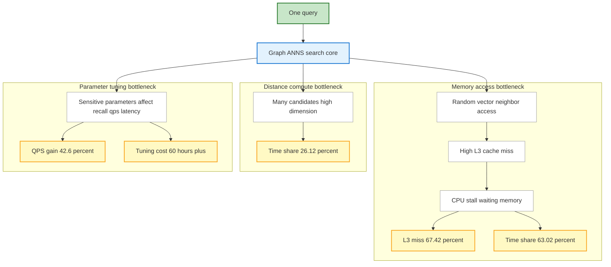
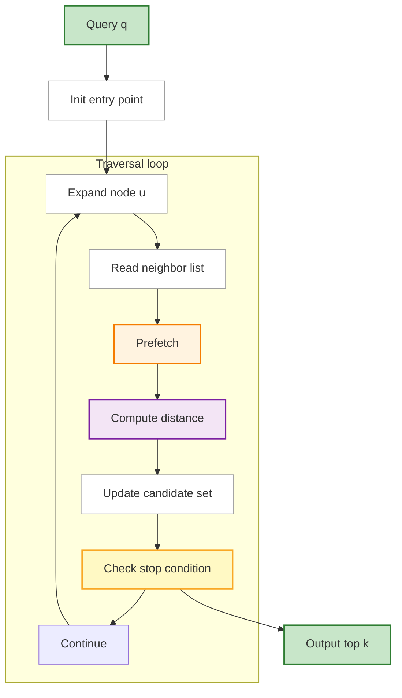
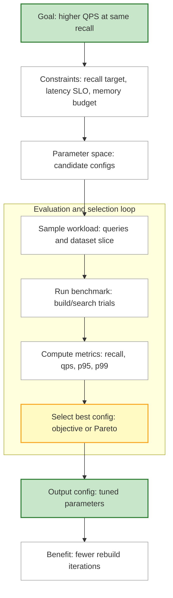
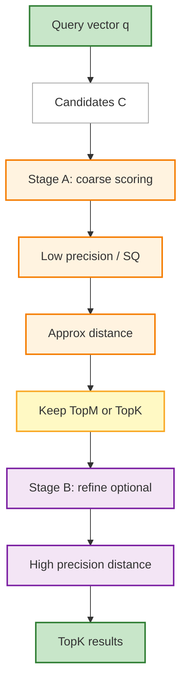

> 论文：**VSAG: An Optimized Search Framework for Graph-based Approximate Nearest Neighbor Search**（PVLDB 18(12), 5017-5030, 2025）  
> 原文：[`https://www.vldb.org/pvldb/vol18/p5017-cheng.pdf`](https://www.vldb.org/pvldb/vol18/p5017-cheng.pdf)  
> DOI：10.14778/3750601.3750624  
> Artifact / Code：论文中给出 `https://github.com/antgroup/vsag`（[GitHub: antgroup/vsag](https://github.com/antgroup/vsag)）

VSAG 是一个面向**图结构 ANNS（Approximate Nearest Neighbor Search）**的生产级优化框架。它不是提出全新的图索引结构，而是针对“线上真实瓶颈”做了三类工程优化：**内存访问**、**参数调优**、**距离计算**，并在保持精度（召回）前提下，把吞吐做到了相对现有库（如 HNSWlib）的数倍提升。

## 0. TL;DR（先看结论）

- **定位问题的方式很工程**：论文把“图 ANNS 为什么慢”拆成可量化的三类瓶颈：随机内存访问（cache miss）、距离计算、参数调优成本。
- **解决方案也很工程**：VSAG 不是新算法，而是一个“优化框架”，重点是三条主线：
  - **Efficient memory access**：prefetch + 更 cache-friendly 的向量组织方式，显著降低 cache miss。
  - **Automated parameter tuning**：自动选参数，避免“调参必须反复 rebuild”的高成本。
  - **Efficient distance computation**：利用现代硬件 + 标量量化 + 低精度切换，显著降低距离计算成本。
- **论文宣称的总体效果**：在同等精度下，VSAG **相对 HNSWlib 最高可达 4× speedup**（摘要结论）。

## 1. 背景：为什么图 ANNS 在生产中会慢

图 ANNS（如 HNSW、VAMANA 等）在查询阶段通常是“从入口点出发做图遍历 + 维护候选集 + 多次距离计算”。论文指出三类常见瓶颈：

- **随机内存访问开销大**：图遍历会产生大量“跳来跳去”的访问，导致缓存不命中（尤其 L3 miss）上升，CPU 大量时间耗在等内存。
- **距离计算开销高**：高维向量距离（如 L2 / IP）本身就重，候选多时更明显。
- **参数敏感且调参成本高**：图索引的效果/吞吐对参数非常敏感，但传统方式往往需要反复 rebuild 才能尝试不同参数，代价很高。

### 1.1 论文给的“线上味”证据：瓶颈分解与调参代价

论文在引言里用一个具体实验把问题说得很硬：

- baseline 选的是 **HNSW + SQ4（标量量化）**（因为生产系统通常会用量化降低距离计算成本）
- 在 **GIST1M** 上做 **1000 次查询**，观察到：
  - **每个查询需要 >2959 次随机向量访问（总约 1.4MB）**，带来 **67.42% 的 L3 cache miss rate**
  - **内存访问耗时占 63.02%**（说明主要在“等内存”）
  - 即便用了 SQ4，**距离计算仍占 26.12%**
  - 参数如果选到更优，QPS 可从 **1530 提升到 2182（+42.6%）**
  - 但 brute-force 调参要 **>60 小时**（几乎不可用）

这组数字非常典型：图 ANNS 的线上性能往往首先是**硬件行为**（缓存/带宽/随机访问）决定的，其次才是“算法步数”。

## 2. VSAG 的核心贡献（论文的三件事）

论文把 VSAG 的优化归纳为三部分（摘要中给出）：

### 2.1 Efficient Memory Access：更“缓存友好”的访问

目标是减少 cache miss，让“图遍历 + 向量读取”尽可能连续、可预取。

直觉上可以理解为：
- **减少随机跳转带来的冷访问**（尽量让向量存放/访问更贴近硬件缓存的工作方式）
- **用预取（prefetching）提前把后续可能访问的向量拉进缓存**

（论文原文用 “prefetching” 和 “cache-friendly vector organization” 概括。）

#### 2.1.1 把“图遍历”画成数据通路，会更容易理解

这张图对应一个很现实的工程目标：**让“下一批要访问的向量”尽可能提前进入 cache**，让 CPU 算距离时不至于完全空转等内存。

### 2.2 Automated Parameter Tuning：免重建的自动调参

论文强调：生产环境里“为了调参反复 rebuild 索引”非常贵，因此 VSAG 的目标是**自动选择性能更优的参数**，并避免把调参成本放大到不可接受。

可以把它理解成把“参数选择”做成一条可重复的离线/半离线流水线：

（这里用笔记化的抽象表示，具体策略以论文为准。）

#### 2.2.1 这点为什么值得单独写

很多 ANNS 系统在工程上真正难的不是实现 HNSW，而是：
- **你怎么选参数**（而不是“默认参数能不能跑”）
- **你怎么把参数选择变成可重复的流程**（而不是靠经验拍脑袋）

论文在 Table 1 里把“Parameter tuning cost”当成一项指标，是很强的信号：**调参成本已经是系统成本的一部分**。

### 2.3 Efficient Distance Computation：更快的距离计算

VSAG 的距离计算优化强调三点（摘要原话）：
- **leverages modern hardware**：充分利用现代 CPU/指令特性
- **scalar quantization**：用标量量化降低计算/带宽成本
- **smartly switches to low-precision representation**：在合适的阶段切换低精度表示，显著降低距离计算代价

可以把它理解成“先用更便宜的表示快速筛，再在必要时做更精确的计算”：

#### 2.3.1 低精度切换：一个常见且有效的代价模型

你可以把它理解成“分两段算距离”：
- **粗筛**：便宜的距离（量化/低精度）→ 快速砍掉大量候选
- **精排**：昂贵的距离（更高精度）→ 只算少量候选

这样距离计算的重活被限制在更小的集合里，更容易把总成本压下去。

## 3. 论文里的关键实验结论（抓核心数字）

论文在摘要与表格中强调了“同精度下吞吐提升”和“瓶颈占比下降”。在给出的对比表（GIST1M）里（论文 Table 1）：

- **VSAG 在 Recall@10 接近 90% 时的 QPS 更高**（相对 HNSW 基线更优）
- **距离计算成本显著下降**（表中示例：VSAG 0.1ms vs HNSW 1.62ms）
- **L3 cache miss rate 明显下降**（表中示例：VSAG 39.23% vs HNSW 94.46%）
- **参数调优成本显著下降**（表中示例：VSAG 2.92h vs HNSW > 60h）
- 论文摘要还给出整体结论：在相同精度下，**相对 HNSWlib 可达到最高 4× 加速**。

> 注：以上数字来自论文原文的摘要与表格（见原文 PDF）。

### 3.1 Table 1（GIST1M）对照表：一眼看出“优化打在了哪里”

下面把论文 Table 1 的核心对比摘出来（便于复用和讨论）：

| Metric (GIST1M) | IVFPQFS | HNSW | VSAG |
| --- | ---: | ---: | ---: |
| Memory Footprint | 3.8G | 4.0G | 4.5G |
| Recall@10 (QPS=2000) | 84.57% | 59.46% | 89.80% |
| QPS (Recall@10=90%) | 1195 | 511.9 | 2167.3 |
| Distance Computation Cost | 0.71ms | 1.62ms | 0.1ms |
| L3 Cache Miss Rate | 13.98% | 94.46% | 39.23% |
| Parameter Tuning Cost | >20h | >60h | 2.92h |
| Parameter Tuning | manual | manual | auto |

这张表里最“值钱”的三行是：
- **L3 Cache Miss Rate**（内存访问优化是否真有效）
- **Distance Computation Cost**（距离计算是否真变便宜）
- **Parameter Tuning Cost**（工程成本是否真能降下来）

## 4. 我觉得这篇论文最值得带走的点

### 4.1 图 ANNS 的“性能天花板”很多时候不在算法，而在硬件行为

很多系统以为“换个更强的图结构”就够了，但生产中最大的敌人往往是：
- cache miss
- 内存带宽
- 分支预测/随机访问

VSAG 的价值在于把这些问题放进一套系统化的优化框架里。

### 4.2 调参是“第一等公民”

当索引构建很贵时，调参必须尽量做到：
- 可自动化
- 可复用
- 尽可能避免 rebuild

否则工程上根本落不了地。

### 4.3 低精度/量化不只是“压缩”，还是“算得更快”

VSAG 把量化与硬件优化放进距离计算主链路中，目标是降低每一次距离计算的真实成本（而不是只减少存储占用）。

## 5. 带着这几个问题再读原文（更容易学到“可迁移的工程经验”）

- **profile 先行**：你的查询到底卡在 memory 还是 compute？
- **cache 指标要量化**：L3 miss 到底是多少？是否接近“随机访问极限”？
- **调参是系统工程**：调参要不要 rebuild？调参成本是否可控？
- **距离计算分层**：能不能“低精度粗筛 + 高精度精排”？

## 6. 进一步阅读

- **论文原文**：[`https://www.vldb.org/pvldb/vol18/p5017-cheng.pdf`](https://www.vldb.org/pvldb/vol18/p5017-cheng.pdf)
- **项目代码（论文给出）**：`https://github.com/antgroup/vsag`

