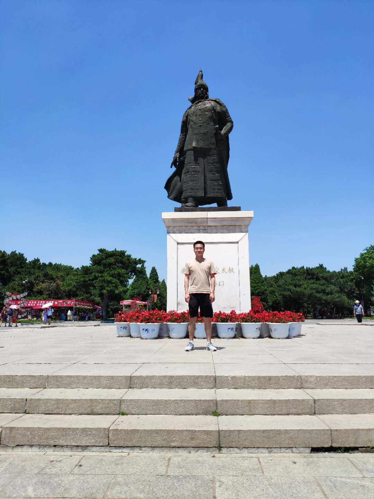

## Welcome to Zhou,Zhilong Pages

### About me
少年易学老难成,一寸光阴不可轻  

  

**Github** [zhouzhilong-commits](https://github.com/zhouzhilong-commits)   
**tel** +86 18843019483  
**email** zhouzhilong00@gmail.com  
**wechat** 18843019483


### Markdown

无言独上西楼、月如勾

```markdown
Syntax highlighted code block

# Header 1
## Header 2
### Header 3

- Bulleted
- List

1. Numbered
2. List

**Bold** and _Italic_ and `Code` text

[Link](url) and 
```

For more details see [GitHub Flavored Markdown](https://guides.github.com/features/mastering-markdown/).

### Jekyll Themes

Your Pages site will use the layout and styles from the Jekyll theme you have selected in your [repository settings](https://github.com/zhouzhilong-commits/zhouzhilong.github.io/settings). The name of this theme is saved in the Jekyll `_config.yml` configuration file.

### Support or Contact

Having trouble with Pages? Check out our [documentation](https://help.github.com/categories/github-pages-basics/) or [contact support](https://github.com/contact) and we’ll help you sort it out.
